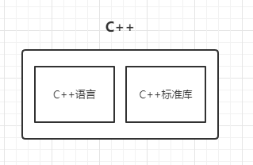
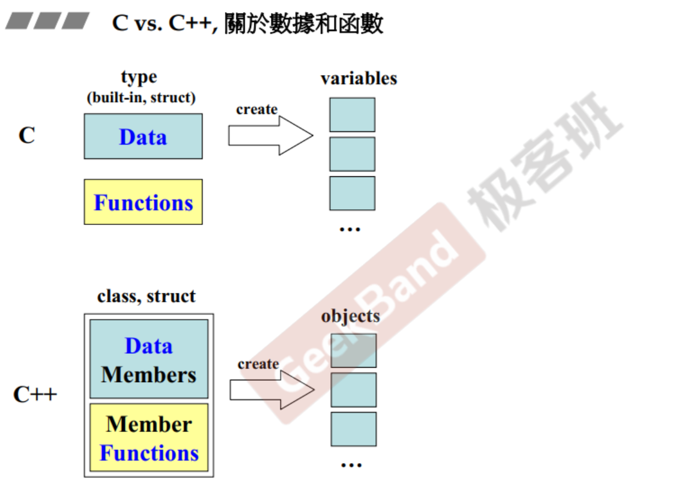
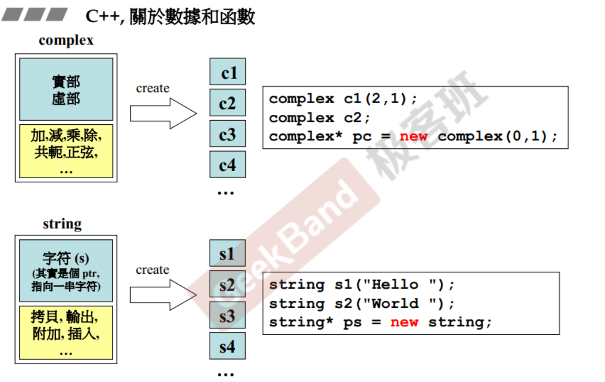
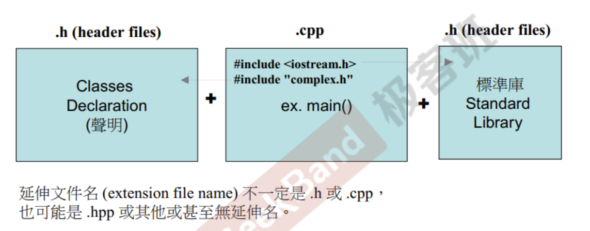
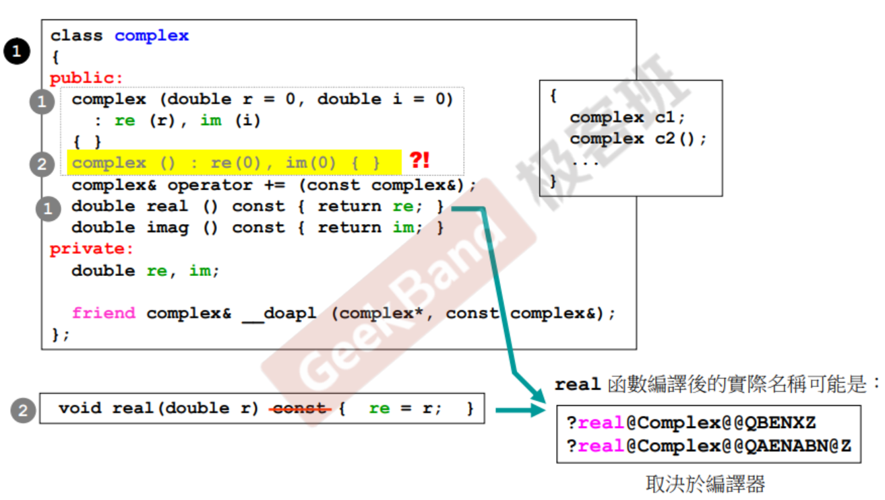

本笔记作如下约定：

| 文本       | 字体样式 | 示例        |
| ---------- | -------- | ----------- |
| C++ 关键字 | 斜体     | *struct*    |
| 类名       | 粗体     | **string**  |
| 代码       | 代码体   | `std::cout` |
|            |          |             |


# 1. C++编程简介

## 1.1 学习目标

* 培养正规的，大气的编程习惯

| Object Based （基于对象）                      | Object Oriented（面向对象） |
| ---------------------------------------------- | --------------------------- |
| 以良好的方式编写C++ class                      | * 学习Classes之间的关系     |
| * class without pointer members -- **complex** | 继承（inheritance）         |
| * class with pointer members -- **string**     | 复合（composition）         |
|                                                | 委托（delegation）          |

## 1.2 将获得的代码

``` txt
complex.h	// 后续留代码URL
complex-test.cpp

string.h
string-test.cpp

oop-demo.h
oop-test.cpp
```

## 1.3 C++历史

* B 语言（1969）
* C 语言（1972）
* C++ 语言（1983）
  * (new C -> C with Class -> C++)
* Java 语言
* C# 语言

## 1.4 C++演化

* **<font color=BLUE> C++ 98 (1.0) </font>**
* C++ 03 (TR1, Technical Report 1)
* **<font color=BLUE>C++ 11 (2.0)</font>**
* C++ 14



C++ 程序员如果不能熟练地使用C++ 标准库，则不能被称为合格的C++程序员。


## 1.5 C++ 书籍推荐

1. 《C++ Primer》	C++第一个编译器的作者的作品
2. 《The C++ Programming Language》   C++ 作者的作品
3. 《Effective C++ 3rd Edition》
4. 《The C++ Standard Library》
5. 《STL源码剖析》


# 2. 头文件与类的声明

## 2.1 C vs. C++， 关于数据和函数

* C 语言在设计程序时，会准备数据和函数，根据数据的类型，来创建变量，函数用于处理数据。由于语言没有提供足够的关键字，这些数据是全局的，各个函数都可以来处理它们。
* C++ 等面向对象语言，将数据和处理这些数据的函数组合起来，称之为 class, struct。C++ 中的struct 几乎等同于 class。




## 2.2 C++，关于数据和函数

* 带指针的**complex**类
  * 成员变量有实部，虚部；
  * 同一个函数处理多个数据。

* 不带指针的**string**类
  * **string**类中只有一个*ptr*，指向类安排的内存空间。
  * s1, s2, s3, s4的大小都只是一个*ptr*



## 2.3 Object Based vs. Object Oriented

* <font color=BLUE>Object Based：</font>面对的是单一class的设计
* <font color=BLUE>Object Oriented：</font>面对的是多重classes的设计，classes和classes之间的关系


## 2.4 第一个 C++ 程序

Classes 的两个经典分类：

* Class without pointer member(s)
  * **complex**
* Class with pointer member(s)
  * **string**

## 2.5 C++ 程序代码基本形式

自定义的头文件用`""`来引入；

标准库也是用头文件形式的保存，用`<>`来引入；



## 2.6 C++ 与 C 的输出语句

C++：将数据重定向到 `std::cout` 中输出，可以将 `cout` 理解为屏幕，将`“i=" ...`显示在屏幕上。

``` C++
#include <iostream>
// #include <iostream.h>
using namespace std;

int main()
{
    int i = 7;
    cout << "i=" << i << endl;
    
    return 0;
}
```

C：使用printf格式化输出。

``` C
#include <stdio.h>
// #include <cstdio>

int main()
{
	int i = 7;
    printf("i=%d \n", i);
    
    return 0;
}
```

## 2.7 Header（头文件）中的防卫式声明

`complex.h`：<font color = red>guard（防卫式声明）</font>，通知编译器，如果未定义`__COMPLEX__`，则定义`__COMPLEX__`。如果已经定义，则跳过定义。

``` C++
#ifndef __COMPLEX__
#define __COMPLEX__

...
...
...

#endif
```

- [ ] 添加头文件冲突例子


## 2.8 Header（头文件）的布局

``` C++
#ifndef __COMPLEX__
#define __COMPLEX__

#include <cmath>

// forward declarations
// 前置声明
class ostream;
class complex;

complex& __doapl (complex* this, const complex& r);

// class declarations
// 类 - 声明
class complex
{
    ...
};

// class defination
// 类 - 定义
complex::function ...

#endif
```

# 3. 构造函数

## 3.1 class 的声明（declaration）

``` C++
class complex		// class head
{					// class body
public:
    complex (double r = 0, double i =0)
        : re (r), im (i)
        { }
    complex& operator += (conost complex&);		// 无花括号，函数在 class body 之外定义
    double real () const { return re; }			// 有花括号，函数在 class body 内部直接定义
    double imag () const { return im; }
private:
	double  re, im;
    
    friend complex& __doapl (complex*, const complex&);
};					// class body
```

``` C++
{
    complex c1(2,1);
    complex c2;
}
```

## 3.2 class template（模板）简介

在类的声明和定义中，使用 `T` 作为 *typename* 来代替具体的类型。

``` C++
template<typename T>	// 首行，告诉编译器 T 为待定的typename
class complex		
{					
public:
    complex (T r = 0, T i =0)
        : re (r), im (i)
        { }
    complex& operator += (conost complex&);		
    T real () const { return re; }			
    T imag () const { return im; }
private:
	T  re, im;
    
    friend complex& __doapl (complex*, const complex&);
};					
```

使用者在使用 **complex** 类时指定具体的类型为 `double` 或 `int` 类型。

``` C++
{
    complex<double> c1(2.5, 1.5);	// 使用 complex 类，指定 T 为 double
    complex<int> c2(2,6);			// 使用 complex 类，指定 T 为 int
}
```

## 3.3 inline（内联）函数

函数若在 class body 内定义完成，便自动成为*inline*。

*inline* 有点类似C语言中的 *macro*，但是有所不同。如果函数时 *inline* 函数，会比较快。那能不能所有的函数都设置为 *inline* 是不是比较好呢？的确是，但是即使有些太复杂的函数显式指定为 *inline* ，编译器也不没有能力将它编译为 *inline*。*inline* 只是对编译器的建议，具体要看编译器的实现。

编译器看到 *inline* 会将该处调用的符号引用直接替换为函数的代码，使得调用过程更快，缺点是代码段膨胀。

``` C++
class complex		
{				
public:
    complex (double r = 0, double i =0)		// 1
        : re (r), im (i)
        { }			
    complex& operator += (conost complex&);		
    double real () const { return re; }		// 2	
    double imag () const { return im; }		// 3
private:
	double  re, im;
    
    friend complex& __doapl (complex*, const complex&);
};					
```

不在 class body 中定义的 *inline* 函数前要加 *inline* 关键字。

``` C++
inline double		// 1
    imag (const complex& x)
{
    return x.imag();
}
```

## 3.4 access level（访问级别）

* *public*:  函数部分建议放在public中；
* *private*: 数据部分建议放在 *private*；
* *protected*

在类中， *public*, *private* 和 *protected* 可以交替出现。

``` C++
class complex		
{				
public:			// 1
    complex (double r = 0, double i =0)		
        : re (r), im (i)
        { }			
    complex& operator += (conost complex&);		
    double real () const { return re; }			
    double imag () const { return im; }		
private:		// 2
	double  re, im;
    
    friend complex& __doapl (complex*, const complex&);
};					
```

数据一定要通过函数 *set* 和 *get*， 除非这些数据的访问级别为 *public*， 但这是我们需要避免的情形。

```C++
{
    complex c1(2,1);
    cout << c1.re;		// false
    cout << c1.im;		// false
    
    complex c2(2,1);
    cout << c2.real();	// true
    cout << c2.imag();	// true
}
```

## 3.5 constructor（ctor，构造函数）

构造函数不需要返回值类型，因为构造函数就是用于创造当前类的对象。

构造函数只用来初始化对象，让对象的成员有一个明确的状态，但并不负责创建对象。

构造函数参数列表中的 `r = 0, i = 0`  有 default argument（默认实参），如果构造对象时如果有指明则使用指明的值，如果无指明则使用默认值。

构造函数可使用专有的 Initialization list 来给成员初始化，推荐使用这种方式，它的效果和在花括号中进行赋值相同。

注意： 如果下面的变量是 *const* ，那这个变量就不能赋值，只能通过初始化列表初始化。

``` C++
complex (double r = 0, double i =0)		
    : re (r), im (i)		// initialization list 初始化列表，构造函数专有
    { }			
```

多种构造对象的方法。

``` C++
{
    complex c1(2,2);				// 构造对象
    complex c2;						// 构造对象
    complex* p = new complex(4);	// 动态的方式创建对象，得到一个对象指针
}
```

Tip: 不带指针的类，多半不需要使用析构函数。

## 3.6 ctor（构造函数）可以有很多个 - overloading（重载）

函数重载时，虽然在代码中的函数名称相同，但实际上编译器编译后的实际名称不同。

``` C++
double real() const { return re; }		// 1 编译后：?real@Complex@@QBENXZ
void real(double r) { re = r; }			// 2 编译后： real@Complex@@BAENABN@Z
```

构造函数重载

```C++
complex (double r = 0, double i =0)		// 1， 存在参数默认值
    : re (r), im (i)			
    { }		

complex () : re(0), im(0) { }			// 2， false
```

调用构造函数：

``` C++
{
    complex c1;		// false，产生歧义，不知道该调用1还是2。
    complex c2();
}
```

1. C++ 支持函数重载，在代码中允许同名函数存在，但实际上编译后的函数名称不同；
2. 构造函数时常发生重载；
3. 函数重载时，要注意不能产生歧义。



## 3.7 constructor 被放在 private 区

表示这个构造函数不允许被外界调用，即不允许外界创建这个类的对象

``` C++
class complex		
{				
public:		
    complex& operator += (const complex&);		
    double real () const { return re; }			
    double imag () const { return im; }		
private:		
	double  re, im;
    
    complex (double r = 0, double i =0)		// 1
        : re (r), im (i)
        { }			
    
    friend complex& __doapl (complex*, const complex&);
};		
```

以下构造方式会出错：

``` C++
{
    complex c1(2,1);	// false
    complex c2;			// false
}
```

设计模式中有一个模式叫做 **Singleton**，外界只允许使用类的单个实例。

``` C++
Class A {
public:
    static A& getInstance();
    setup() { ... }
private:
    A();
    A(const A& rhs);
    ...
};

A& A::getInstance()
{
    static A a;
    return a;
}
```

外界不能使用之前的构造方式，只能通过调用函数来使用类提供的单个实例。

``` C++
A::getInstance().setup();
```

## 3.8 `const` member functions（常量成员函数）

类中的函数分为会改变数据内容的和不会改数据内容的。`const`函数表示函数内部不会更改数据。不会改变数据内容后应该加上 `const`。

``` C++
double real () const { return re; }
double imag () const { return im;}
```

const object只能访问加了 `const` 修饰符的成员变量和函数。

``` C++
{
    complex c1 (2, 1);
    complex << c1.real();
    complex << c1.imag();
}

{
    const complex c1 (2, 1);		// const 表示 c1 的值不可变
    cout << c1.real();
    cout << c1.imag();
}
```

# 4. 参数传递与返回值

## 4.1 参数传递： pass by value vs. pass by reference (to const)

* 类对象作为函数的形参，标准传递方式是 pass by reference，这样可以避免拷贝类对象花费不必要的开销；
* 当函数的返回值是一个内置类型，或者函数内临时生成的对象则需要按值传递 pass by value。


函数按值传递时，实际上将获得的是实参的副本，并将它压入函数栈，也就是在函数内修改这个副本，是不影响实参的，本质上来说当形参是指针类型时，也算是按值传递，传递的是指针变量右值的副本，但这个副本是可以影响指针指向的对象。

当实参的大小过大时，会造成性能问题，因此会尽量避免按值传递。

tip：建议都使用引用传递。

``` C++
class complex		
{				
public:		
    complex (double r = 0, double i =0)			// pass by value
        : re (r), im (i)
        { }			
    complex& operator += (const complex&);		// 不希望原来的值被修改， pass by reference to const
    double real () const { return re; }			
    double imag () const { return im; }		
private:		
	double  re, im;     
    friend complex& __doapl (complex*, const complex&);		
};		
```

引用在底层实现就是指针，这样会导致被传递的变量原来的值被修改。如果不希望这样，可以使用pass-by-reference-to-const。

``` C++
ostream&
operator << (ostream& os, const complex& x) 	// pass by reference (to const)
{
    return os << '(' << real (x) << ',' << imag (x) << ')';
}
```

## 4.2 返回值传递：return by value vs. return by reference (to const)

返回值形式也尽量使用return by reference。在可以的情况下使用reference。

返回引用——指返回的对象类型是引用类型，这里有个细节，通常返回的那个引用的对象，恰好是你实参传递的那个引用类型的对象。

``` C++
class complex		
{				
public:		
    complex (double r = 0, double i =0)			
        : re (r), im (i)
        { }			
    complex& operator += (const complex&);		// return by reference
    double real () const { return re; }			// return by value
    double imag () const { return im; }		
private:		
	double  re, im;     
    friend complex& __doapl (complex*, const complex&);		
};		
```

## 4.3 friend（友元）

* 友元函数
* 友元类
* 友元类成员

将 `re`，`im`，封装为 *private*，拒绝外界访问，但是可以用 *friend* 指定允许访问的对象。

友元函数不是类成员，但友元函数可以访问类的私有数据成员。

``` C++
class complex		
{				
public:		
    complex (double r = 0, double i =0)			
        : re (r), im (i)
        { }			
    complex& operator += (const complex&);		
    double real () const { return re; }			
    double imag () const { return im; }		
private:		
	double  re, im;     
    friend complex& __doapl (complex*, const complex&);		
};		
```

`__doapl`函数的实现：

``` C++
inline complex& __dopa1 (complex* ths, const complex& r)
{
    ths->re += r.re;		// 自由取得 friend 的 private 成员
    ths->im += r.im;
    return *ths;
}
```

## 4.4 相同的 class 的各个 objects 互为 friends（友元）

因为封装是在 class 的层面，而不是对象的层面。所以相同的 class 的各个 objects 之间可以相互访问数据。

``` C++
class complex
{
public:
    complex (double r = 0, double i = 0)
        : re (r), im (i)
        { }
    // 
    int func(const complex& param)
    { return param.re + param.im; }
    
private:
    double re, im;
}
```


```C++
{
    complex c1(2, 1);
    complex c2;
    
    c2.func(c1);	// c2 访问 c1 的 private 数据
}
```


## 4.5 class body 外的各种定义（definitions)

设计类的原则：

1. 数据一定是 private；
2. 尽量使用初始化列表；
3. 参数尽量用 reference 来传递，视情况加 const；
4. 返回值也尽量以 reference 来传递，可能会遇到不能用reference传递的情况；
5. 在 class body 中的函数能加 const 的就应该加 const。

* 什么情况下可以 pass by reference：
* 什么情况下可以 return by reference：

`__doapl`: do assignment plus

``` C++
inline complex&
__doapl（complex* ths, const complex& r)		// 第一个参数将会被改动
{											// 第二个参数将会被改动
    ths->re += r.re;
    ths->im += r.im;;
    return *ths;
}

inline complex&
complex::operator += (const complex& r)
{
    return __doapl(this, r);
}
```

如果在函数内部创建一个临时的非 *static* 变量 `var` 存放计算结果，函数返回时便不能 return by reference，因为函数返回后，临时变量 `var` 的生命周期结束，内存空间被释放，返回引用会出错。


# 5. 操作符重载与临时对象

## 5.1 operator overloading（操作符重载-1，成员函数） *this*

``` C++
inline complex&
complex::operator += (const complex& r)
{
    return __doapl(this, r);
}
```

功能等同于下面的函数，但实际代码中参数列表不能写出 *this* ptr：

``` C++
inline complex&
complex::operator += (this, const complex& r)	
{
    return __doapl(this, r);
}
```


``` C++
{
    complex c1(2,1);
    complex c2(5);
    
    c2 += c1;	// c2 传递给 this， c1 传递给 r
}
```


有双下划线或者下划线加大写字母开头的标识符是保留的，用户使用这种标识符是未定义行为，很危险。


## 5.2 return by reference 语法分析

传递者无需知道接收者是以 reference 形式接受的。

 

``` C++
inline complex&			// 返回类型为 reference
__doapl（complex* ths, const complex& r)		
{											
	...
    return *ths;		// 返回 ths 指向的 object
}

inline complex&
complex::operator += (this, const complex& r)	
{
    return __doapl(this, r);
}
```

如果只需要执行`c2 += c1;`，则函数`__doapl`返回类型为 `void`  也可以通过编译。但当有类似 `c3 += c2 += c1;` 的**链式调用**语句出现，`c2 += c1;` 执行的结果作为表达式的**右值**传递时，就需要考虑将函数 `__doapl` 的返回类型设置为 `complex&`。

``` C++
{
    complex c1(2,1);
    complex c2(5);
    
    c2 += c1;			
    c3 += c2 += c1;		// 要求__doapl函数返回 complex&类型
}
```

## 5.3 class body 之外的各种定义（definitions）

定义两个全局函数 `imag()` 和 `real()` ，作用域为global。

``` C++
inline double
imag(const complex& x)
{
    return x.imag();
}

inline double
real(const complex& x)
{
    return x.real();
}
```

直接使用 `imag()` 和 `real()` 函数：

``` C++
{
    complex c1(2,1);
    
    cout << imag(c1);
    cout << real(c1);
}
```

## 5.4 operator overloading（操作符重载-2，非成员函数）(无 *this*)

为了对应 client 的三种可能写法，这儿对应开发了三个函数：

1. `c2 = c1 + c2;`对应

``` C++
inline complex
operator + (const complex& x, const complex& y)
{
    return complex (real(x) + real(y),
                    imag(x) + imag(y));
}
```

2. `c2 = c1 + 5;`对应：

``` C++
inline complex
operator + (const complex& x, double y)
{
    return complex (real(x) + y, imag(x));
}
```

3. `c2 = 7 + c1;`对应：

``` C++
inline complex
operator + (double x, const complex& y)
{
    return complex (x + real(y), imag(y));
}
```


## 5.5 temp object（临时对象） typename ();

下面这些函数绝对不可以 return by reference， 因为，他们返回的必定是个local object。

``` C++
inline complex
operator + (const complex& x, const complex& y)
{
    return complex (real(x) + real(y),
                    imag(x) + imag(y));
}

inline complex
operator + (const complex& x, double y)
{
    return complex (real(x) + y, imag(x));
}

inline complex
operator + (double x, const complex& y)
{
    return complex (x + real(y), imag(y));
}
```

`typename()`  类似于  `int(i)` 创建临时对象，比如 `complex( real(x) + y, imag(x))`，创建一个临时 **complex** 对象。

``` C++
{
    int(7);
    
    complex c1(2,1);
    complex c2;
    complex();			// 临时对象，生命周期只有一条语句
    complex(4,5);		// 临时对象，生命周期只有一条语句
    
    cout << complex(2);
}
```

## 5.6 class body 之外的各种定义（definitions）

`operator +` 函数返回的是不是临时对象，而是原本的对象，可以使用 return by reference。

传入 *const* 代表这块内存是不能被修改的，返回之后也是不会让接收者修改这块内存，但是传值的话会复制一份内存，对原内存不做修改。

```C++
inline complex
operator + (const complex& x)
{
    return x;		
}

inline complex		
operator - (const complex& x)	// negate 取反			
{
    return complex( -real(x), -imag(x));
}
```

根据 `operator +` 函数的参数个数来判断是加法操作还是取正操作。

``` C++
{
    complex c1(2, 1);
    complex c2;
    cout << -c1;
    cout << +c1;
}
```

## 5.7 operator overloading（操作符重载），非成员函数

``` C++
inline bool
operator == (const complex& x, const complex& y)
{
    return real(x) == real(y) && imag(x) == imag(y);
}

inline bool
operator == (const complex& x, double y)
{
    return real(x) == y && imag(x) == 0;
}

inline bool
operator == (double x, const complex& y)
{
    return x == real(y) && imag(y) == 0;
}
```

``` C++
{
    complex c1(2,1);
    complex c2;
    
    cout << (c1 == c2);
    cout << (c1 == 2);
    cout << (0 == c2);
}
```


任何一个操作都可以设计为成员函数或者全局函数，依据使用场景设计。

```  C++
inline complex
conj (const complex& x)			// 共轭复数
{
    return complex(real(x), -imag(x));
}

#include <iostream.h>
ostream&
operator << (ostream& os, const complex& x)		// ostream& os 前不可以加 const
{
    return os << '(' << real(x) << ',' << imag(x) << ')';
}
```

`operator <<` 操作符会作用在左边，因此对于这种特殊的操作符，只能使用全局函数。

成员函数需要对象调用，这个对象必须是你写的类才可以，cout是系统自己的对象，只能操作系统调用。

``` C++
{
    complex c1(2,1);
    cout << conj(c1);
    cout << c1 << conj(c1);
}
```

第8行使用 return by reference，以便支持链式调用。`cout << c1 << conj(c1);` 是从左到右执行的，所以返回类型不能是 `complex&` 而应该是 `ostream&`；

第9行中的 `ostream& os` 前不可以加 *const*， 因为函数中的`os`状态一直在修改。


# 6. 复习 Complex 类的实现过程

1. 防卫式的头文件

```C++
#ifndef __COMPLEX__
#define __COMPLEX__


#endif

```

