# 1. 设计模式简介

## 1.1 OOP 七大原则

* 开闭原则：对拓展开放，对修改关闭；
* 里氏替换原则：继承必须确保超类所拥有地性质在子类中仍然成立；
  * 子类不修改父类所拥有的功能；
* 依赖倒置原则：要面向接口编程，不要面向实现编程；
  * 抽象不依赖细节，细节依赖抽象；
* 单一职责原则：控制类地粒度大小，将对象解耦，提高其内聚性；
* 接口隔离原则：要为各个类建立它们需要的专用接口；
* 迪米特法则：只与你地直接朋友交谈，不跟”陌生人“说话；
* 合成复用原则：尽量先使用组合或者聚合等关联关系，其次才考虑使用继承关系来实现。


## 1.2 GOF 23

* 创建型模式：
  * 单例模式、工厂模式、抽象工厂模式、建造者模式、原型模式；
* 结构型模式：
  * 适配器模式、桥接模式、装饰模式、组合模式、外观模式、享元模式、代理模式；
* 行为型模式：
  * 模板方法模式、命令模式、迭代器模式、观察者模式、中介者模式、备忘录模式、解释器模式、状态模式、策略模式、职责链模式、访问者模式。


# 2. 单例模式

## 2.1 饿汉式

``` Java
// hungry singleton
public class Hungry {

    // might waste memory
    private byte[] data1 = new byte[1024 * 1024];
    private byte[] data2 = new byte[1024 * 1024];
    private byte[] data3 = new byte[1024 * 1024];
    private byte[] data4 = new byte[1024 * 1024];

    private Hungry() {
    }

    private final static Hungry HUNGRY = new Hungry();

    public static Hungry getInstance() {
        return HUNGRY;
    }

}

```


## 2.2 DCL 懒汉式

``` Java

/**
 * 1. allocate memory
 * 2. process constructor, initialize object
 * 3. point this object to allocated memory in step1
 * <p>
 * 123
 * 132 A
 * B
 */
public class LazyMan {

    private static boolean jay = false;

    private LazyMan() {
        synchronized (LazyMan.class) {

            if (!jay) {
                jay = true;
            } else {
                throw new RuntimeException("Don't using reflection to get Instance!");
            }
        }
    }

    private volatile static LazyMan lazyMan;

    // double lock
    public static LazyMan getInstance() {
        if (lazyMan == null) {
            synchronized (LazyMan.class) {
                if (lazyMan == null) {
                    lazyMan = new LazyMan();    // not an atomic operation
                }
            }
        }

        return lazyMan;
    }

    // reflect
    public static void main(String[] args) throws Exception {
//        LazyMan instance1 = LazyMan.getInstance();

        Field jay = LazyMan.class.getDeclaredField("jay");
        jay.setAccessible(true);

        Constructor<LazyMan> declaredConstructor = LazyMan.class.getDeclaredConstructor(null);
        declaredConstructor.setAccessible(true);
        LazyMan instance1 = declaredConstructor.newInstance();

        jay.set(instance1, false);

        LazyMan instance2 = declaredConstructor.newInstance();

        System.out.println(instance1);
        System.out.println(instance2);
    }
}

```


## 2.3 静态内部类

``` Java
public class Holder {

    private Holder() {

    }

    public static Holder getInstance() {
        return InnerClass.HOLDER;
    }

    public static class InnerClass {
        private static final Holder HOLDER = new Holder();
    }
}

```

单例模式不安全，使用反射可以破坏单例。


## 2.4 Enum 实现单例

使用 Enum

``` Java
public enum EnumSingle {

    INSTANCE;

    public EnumSingle getInstance() {
        return INSTANCE;
    }

}

class Test {
    public static void main(String[] args) throws Exception {
        EnumSingle instance1 = EnumSingle.INSTANCE;
        Constructor<EnumSingle> constructor = EnumSingle.class.getDeclaredConstructor(String.class, int.class);
        constructor.setAccessible(true);
        EnumSingle enumSingle = constructor.newInstance();

        System.out.println(instance1);
        System.out.println(enumSingle);

    }
}

```


通过反编译

``` Java
// javap -p EnumSingle.class
// Compiled from "EnumSingle.java"
public final class com.jay.singleton.EnumSingle extends java.lang.Enum<com.jay.singleton.EnumSingle> {
  public static final com.jay.singleton.EnumSingle INSTANCE;
  private static final com.jay.singleton.EnumSingle[] $VALUES;
  public static com.jay.singleton.EnumSingle[] values();
  public static com.jay.singleton.EnumSingle valueOf(java.lang.String);
  private com.jay.singleton.EnumSingle();
  public com.jay.singleton.EnumSingle getInstance();
  static {};
}

```

jad 工具反编译出的 java 源码：

``` java
// Decompiled by Jad v1.5.8e. Copyright 2001 Pavel Kouznetsov.
// Jad home page: http://www.geocities.com/kpdus/jad.html
// Decompiler options: packimports(3) 
// Source File Name:   EnumSingle.java

package com.jay.singleton;


public final class EnumSingle extends Enum
{

    public static EnumSingle[] values()
    {
        return (EnumSingle[])$VALUES.clone();
    }

    public static EnumSingle valueOf(String name)
    {
        return (EnumSingle)Enum.valueOf(com/jay/singleton/EnumSingle, name);
    }

    private EnumSingle(String s, int i)
    {
        super(s, i);
    }

    public EnumSingle getInstance()
    {
        return INSTANCE;
    }

    public static final EnumSingle INSTANCE;
    private static final EnumSingle $VALUES[];

    static 
    {
        INSTANCE = new EnumSingle("INSTANCE", 0);
        $VALUES = (new EnumSingle[] {
            INSTANCE
        });
    }
}

```

发现，Enum 类型的构造器有两个参数，反射后会报以下错误：

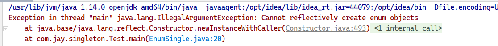

综上，使用 Enum 类型构造是安全的，反射不会破坏 Enum 类型。


# 3. 工厂模式

## 3.1 工厂模式简介

* 作用
  * 实现了创造者和调用者的分离

* OOP 七大原则
  * 开闭原则：一个软件的实体应当对扩展开放，对修改关闭；
  * 依赖倒转原则：要针对接口编程，不要针对实现编程；
  * 迪米特法则：只与你直接的朋友通信，而避免和陌生人通信；
* 核心本质：
  * 实例化对象不适用 new，用工厂方法代替；
  * 将选择实现类，创建对象统一管理和控制。从而将调用者和我们的实现类解耦。


* 详细分类：
  * 简单工厂模式：
    * 用来生产同意等级结构中的任意产品（对于增加新的产品，需要修改已有代码）；
  * 工厂方法模式
    * 用来生产同一等级结构中的固定产品（支持增加任意产品）；
  * 抽象工厂模式
    * 围绕一个超级工厂创建其他工厂。该超级工厂又称为其他工厂的工厂。


## 3.2 简单工厂模式

简单工厂模式又称为静态工厂模式：

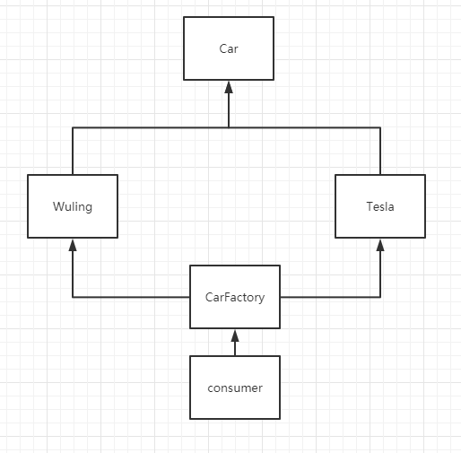

实现代码：

1. `CarFactory.java`

   ``` Java
   /**
    * static factory pattern doesn't obey Open-Closed Principle
    * You have to modify CarFactory when you add a new car product
    */
   public class CarFactory {
   
       public static Car getCar(String car) {
           if (Objects.equals(car, "wuling")) {
               return new WuLing();
           } else if (Objects.equals(car, "tesla")) {
               return new Tesla();
           } else {
               return null;
           }
       }
   
       public static Car getWuling() {
           return new WuLing();
       }
   
       public static Car getTesla() {
           return new Tesla();
       }
   
       public static Car getDazhong() {
           return new Dazhong();
       }
   }
   ```

2. `Car.java` 接口：

   ``` Java
   public interface Car {
       void name();
   }
   ```

3. `Tesla.java` 等实现了 `Car` 接口的实现类：

   ``` Java
   public class Tesla implements Car {
       @Override
       public void name() {
           System.out.println("Tesla");
       }
   }
   ```

4. 测试类：

   ``` Java
   public class Consumer {
       public static void main(String[] args) {
           // interface and implementation class
   //        Car car1 = new WuLing();
   //        Car car2 = new Tesla();
   
           // 2. get car from CarFactory
           Car car1 = CarFactory.getCar("wuling");
           Car car2 = CarFactory.getCar("tesla");
   
           car1.name();
           car2.name();
       }
   }
   ```

   

静态工厂模式违背了开闭原则，当新的产品出现时，就必须要修改 `CarFactory` 的实现代码，添加新的产品。


## 3.3 工厂方法模式

工厂方法模式原理：每种产品都对应一个工厂，如 `Wuling` 对应 `WulingFactory`，其中 `Wuling` 实现了 `Car` 接口， `WulingFactory` 实现了 `CarFactory` 接口。

工厂方法模式遵循了开闭原则。

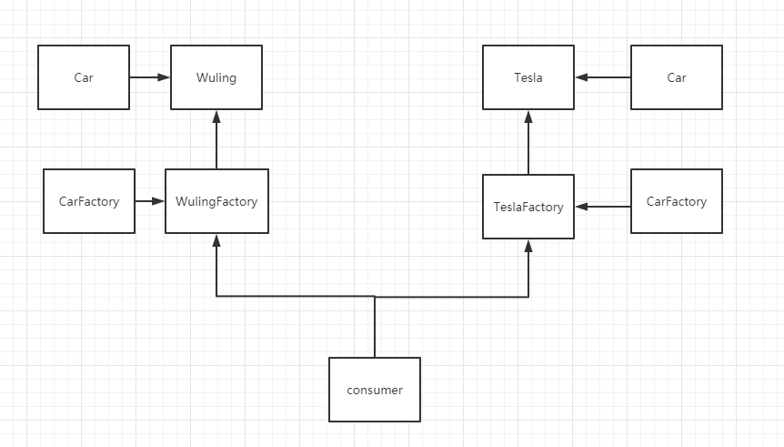

从结构复杂度，代码复杂度，编程复杂度和管理复杂度上来看，简单工厂模式都优于工厂方法模式。

实现代码：

1. `CarFactory` 接口：

   ``` Java
   /**
    * factory method pattern
    */
   public interface CarFactory {
   
       Car getCar();
   }
   ```

2. `WulingFactory` 类实现了 `CarFactory` 接口：

   ``` Java
   public class WuLingFactory implements CarFactory {
       @Override
       public Car getCar() {
           return new WuLing();
       }
   }
   ```

3. `Car` 接口：

   ``` Java
   public interface Car {
       void name();
   }
   ```

4. `Wuling` 类实现了 `Car` 接口：

   ``` Java
   public class WuLing implements Car {
       @Override
       public void name() {
           System.out.println("wu ling hong guang");
       }
   }
   ```

5. 测试类：

   ``` java
   public class Consumer {
       public static void main(String[] args) {
   
           Car car1 = new WuLingFactory().getCar();
           Car car2 = new TeslaFactory().getCar();
           Car car3 = new MobikeFactory().getCar();
   
           car1.name();
           car2.name();
           car3.name();
       }
   }
   
   ```

   

工厂方法模式遵循了开闭原则，设计降低了耦合，使得在增加产品时无需修改现有代码，而只要增加产品和对应工厂即可。


## 3.4 抽象工厂模式

* 定义：抽象工厂模式提供了一个创建一系列相关或者相互依赖对象的接口，无需指定它们具体的类；
* 适用场景：
  * 客户端（应用层）不依赖于产品类实例如何被创建、实现等细节；
  * 强调一系列相关的产品对象（属于同一产品族）一起使用创建对象需要大量的重复代码；
  * 提供一个产品类的库，所有的产品以同样的接口出现，从而使得客户端不依赖于具体的实现。

* 优点：
  * 具体产品在应用层的代码隔离，无需关心创建的细节；
  * 将一个系列的产品统一到一起创建；

* 缺点：
  * 规定了所有可能被创建的产品集合，产品族中拓展新的产品苦难；
  * 增加了系统的抽象性和理解难度。


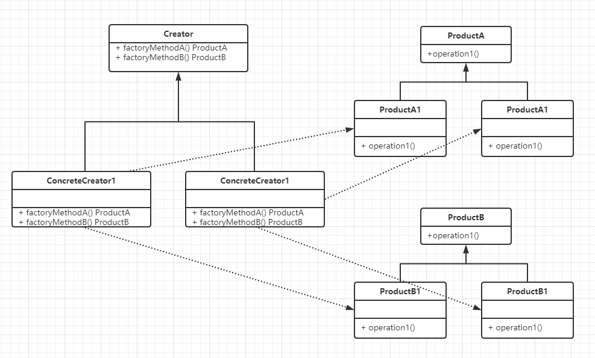


实现类图

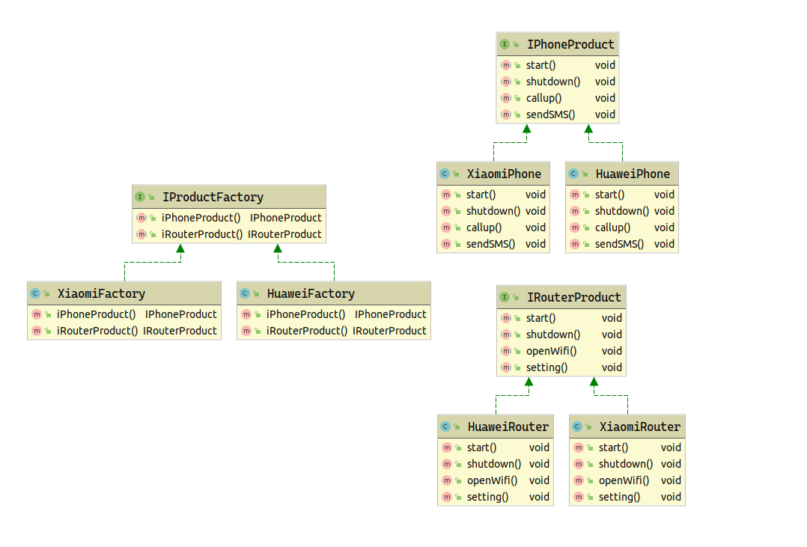

# 4. 建造者模式

* 建造者模式也属于创建型模式，它提供了一种创建对象的最佳方式。


* 定义：将一个复杂对象的构建与它的表示分离，使得同样的构建过程可以创建不同的表示；
* 主要作用：在用户不知道 **对象的建造过程和细节**的情况下就可以直接创建复杂对象。


* 用户只需要给出指定复杂对象的类型和内容，建造者模式负责按顺序创建复杂对象（把内部的建造过程和细节隐藏起来）


* 例子：
  * 工厂（建造者模式）：负责建造汽车（组装过程和细节在工厂内）
  * 汽车购买者（用户）：你只需要说出你需要的型号（对象的类型和内容），然后直接购买就可以使用了（不需要知道汽车事怎么组装的（车轮、车门、发动机、方向盘等等））


* 角色分析：

  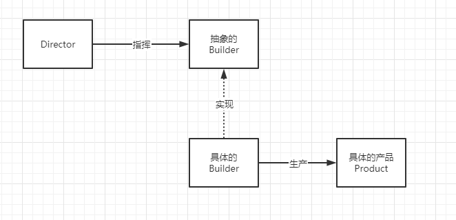


## 4.1 Builder 模式常规用法

用建造房子来距离，将造房简化为如下步骤：

1. 打地基；
2. 钢筋工程；
3. 铺电线；
4. 粉刷；

如果要盖一座房子，首先要找到一个建筑公司或工程承包商（Director）。承包商指挥工人（具体的 Builder）来造房子（Product），最后验收。


代码示例：

1. `Product.java`，产品类，定了4个产品模块：

   ``` Java
   /**
    * Product: building
    */
   public class Product {
       private String buildA;
       private String buildB;
       private String buildC;
       private String buildD;
   
       // getters, setters and toString
   }
   ```

   

2. `BaseBuilder.java`，抽象的 `Builder` 定义了建造的功能模块，并且可以返回获取最终产品：

   ``` Java
   /**
    * abstract Builder: declare method
    */
   public abstract class BaseBuilder {
   
       abstract void buildA();
   
       abstract void buildB();
   
       abstract void buildC();
   
       abstract void buildD();
   
       /**
        * accomplished
        */
       abstract Product getProduct();
   
   }
   ```

3. `Worker.java`，具体的 `Builder`，实现了建造过程，构建并且可以返回最终产品：

   ``` java
   /**
    * concrete builder: worker
    */
   public class Worker extends BaseBuilder {
   
       private Product product;
   
       public Worker() {
           product = new Product();
       }
   
       @Override
       void buildA() {
           product.setBuildA("buildA");
           System.out.println("buildA");
       }
   
       @Override
       void buildB() {
           product.setBuildB("buildB");
           System.out.println("buildB");
       }
   
       @Override
       void buildC() {
           product.setBuildC("buildC");
           System.out.println("buildC");
       }
   
       @Override
       void buildD() {
           product.setBuildD("buildD");
           System.out.println("buildD");
       }
   
       @Override
       Product getProduct() {
           return product;
       }
   }
   ```

4. `Director.java`，指挥者，在 `build` 方法中定义建造产品的顺序：

   ``` Java
   /**
    * director
    */
   public class Director {
   
       /**
        * define build process sequence
        */
       public Product build(BaseBuilder builder) {
           builder.buildA();
           builder.buildB();
           builder.buildC();
           builder.buildD();
   
           return builder.getProduct();
       }
   }
   ```


小结：

* 上述示例是 `Builder` 模式的常规用法，`Director` 在 `Builder` 模式中具有很重要的作用，它用于指导具体构建者如何构建产品，控制调用先后次序，并向调用者返回完整的产品类，但是有些情况下需要简化系统结构，可以把 `Director` 和抽象建造者进行结合。


## 4.2 Builder 静态内部类方式

通过静态内部类方式实现零件无序装配构造，这种方式使用更加灵活，更符合定义。内部有复杂对象的默认实现，使用时可以根据用户需求自由定义更改内容，并且无需改变具体的构造方式。就可以生产出不同复杂产品。


比如麦当劳的套餐，服务员（具体建造者）可以随意搭配任意几种产品（零件）组成一款套餐（产品），然后出售给客户。比第一种方式少了指挥者，主要是因为第二种方式**把指挥者交给用户来操作**，使得产品的创建更加灵活简单。


代码示例：

1. `Product.java`：

   ``` Java
   public class Product {
   
       private String buildA = "hamburger";
       private String buildB = "cola";
       private String buildC = "french fries";
       private String buildD = "dessert";
   
   	// getters, setter and toString
   }
   ```

2. `BaseBuilder.java`，返回 `BaseBuilder` 自身，支持链式编程：

   ``` Java
   public abstract class BaseBuilder {
   
       abstract BaseBuilder buildA(String message);
   
       abstract BaseBuilder buildB(String message);
   
       abstract BaseBuilder buildC(String message);
   
       abstract BaseBuilder buildD(String message);
   
       abstract Product getProduct();
   
   }
   ```

3. `Worker.java`：

   ``` Java
   public class Worker extends BaseBuilder {
       private Product product;
   
       public Worker() {
           this.product = new Product();
       }
   
       @Override
       BaseBuilder buildA(String message) {
           product.setBuildA(message);
           return this;
       }
   
       @Override
       BaseBuilder buildB(String message) {
           product.setBuildB(message);
           return this;
       }
   
       @Override
       BaseBuilder buildC(String message) {
           product.setBuildC(message);
           return this;
       }
   
       @Override
       BaseBuilder buildD(String message) {
           product.setBuildD(message);
           return this;
       }
   
       @Override
       Product getProduct( ) {
           return product;
       }
   }
   
   ```

4. 测试类：

   ``` java
   public class ProductTest {
   
       @Test
       public void test1() {
           Worker worker = new Worker();
           Product product = worker.buildA("chips").getProduct();
           System.out.println(product);
       }
   }
   ```


* 优点：
  * 产品的建造和表示分离，实现了解耦。使用建造者模式可以使客户端不必指导产品内部组成的细节；
  * 将复杂产品的创建步骤分解在不同的方法中，使得创建过程更加清晰；
  * 具体的建造者类之间是相互独立的，这有利于系统的拓展。增加新的具体建造者无需修改原有类库的代码，符合“开闭原则”。
* 缺点：
  * 建造者模式所创建的产品一般具有较多的共同点，其组成部分相似；如果产品之间的差异性很大，则不适合使用建造者模式，因此其适用范围受到一定的限制；
  * 如果产品的内部变化复杂，可能会导致需要定义很多具体建造者类来实现这种变化，导致系统变得很庞大。


* 应用场景：

  * 需要生成的产品对象有复杂的内部结构，这些产品对象具备共性；
  * 隔离复杂对象的创建和使用，并使得相同的创建过程可以创建不同的产品（同一个指挥者指挥不同的工人）；
  * 适合于一个具有较多的零件（属性）的产品（对象）的创建过程。

  

* 建造者与抽象工厂模式的比较：

  * 与抽象工厂模式相比，建造者模式返回一个组装好的**完整产品**，而抽象工厂模式返回**一系列相关的产品**，这些产品位于不同的产品等级结构，构成了一个产品族；
  * 在抽象工厂模式中，客户端实例化工厂类，然后调用工厂方法获取所需产品对象；
  * 在建造者模式中，客户端可以不直接调用建造者的相关方法，而是通过指挥者类来指导如何生成对象，包括对象的组装过程和建造步骤，它侧重于一步步构造一个复杂对象，返回一个完整的对象；
  * 如果将抽象工厂模式看成汽车配件生产工厂，生产一个产品族的产品，那么建造者模式就是一个汽车组装工厂，通过对部件的组装可以返回一辆完整的汽车。


# 5. 原型模式

以某个对象为原型，拷贝一个新的对象。


* 克隆

*  Prototype
* `Cloneable` 接口
* `clone()` 方法


## 5.1 浅克隆

克隆对象 `v2` 和原对象 `v1` 指向同一个对象 `date` 的引用，修改 `date` 的值，会导致 `v1` 和 `v2` 同时改变。因此最新的 `JDK` 推荐使用 `LocalDateTime.now()` 生成不可变对象，这样可以避免浅克隆的隐患。

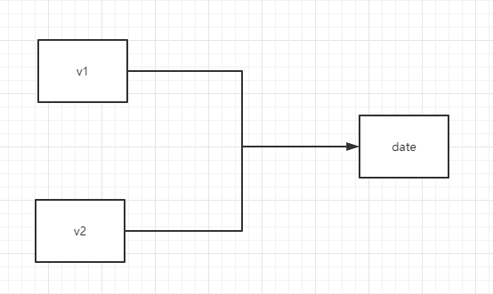

``` Java
/**
 * client: clone
 */
public class BiliBili {
    public static void main(String[] args) throws CloneNotSupportedException {
//        LocalDateTime dateTime = LocalDateTime.now();
        Date date = new Date();
        Video v1 = new Video("jayVedio", date);
        // v2 is v1's clone
        Video v2 = (Video) v1.clone();
        System.out.println("v1 => " + v1);
        System.out.println("v2 => " + v2);

        System.out.println("===============================");
        date.setTime(1234567);

        System.out.println("v1 => " + v1);
        System.out.println("v2 => " + v2);
    }
}
```

``` log
v1 => Video{name='jayVedio', createTime=Mon Jun 29 09:18:41 CST 2020}
v2 => Video{name='jayVedio', createTime=Mon Jun 29 09:18:41 CST 2020}
===============================
v1 => Video{name='jayVedio', createTime=Thu Jan 01 08:20:34 CST 1970}
v2 => Video{name='jayVedio', createTime=Thu Jan 01 08:20:34 CST 1970}
```


## 5.2 深克隆

虽然使用 final 对象可以避免浅克隆的隐患，但实际使用时对象的属性不一定能为 final。为了彻底解决浅克隆的隐患，可以使用深克隆：克隆对象引用的属性是一个新的对象。

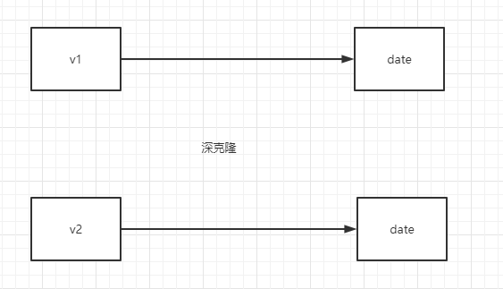


重写 `clone` 方法：

``` Java
@Override
public Object clone() throws CloneNotSupportedException {
    Object obj = super.clone();

    // deep clone       (serialize deserialize)
    Video video = (Video) obj;
    // clone object fields
    video.createTime = (Date) this.createTime.clone();

    return obj;
}
```

测试结果：

``` log
v1 => Video{name='jayVideo', createTime=Mon Jun 29 09:29:55 CST 2020}
v2 => Video{name='jayVideo', createTime=Mon Jun 29 09:29:55 CST 2020}
===============================
v1 => Video{name='jayVideo', createTime=Thu Jan 01 08:20:34 CST 1970}
v2 => Video{name='jayVideo', createTime=Mon Jun 29 09:29:55 CST 2020}
```


原型模式 + 工厂模式 == > new  < == > 原型模式


# 6. 适配器模式 


将一个类的接口转换成客户希望的另一个接口。`Adapter` 模式使得原本由于接口不兼容而不能一起工作的类可以在一起工作。


现在许多笔记本电脑为了机身更加轻薄，取消了 RJ45 网口，而仅仅保留了 Type-C 口。如果用户使用有线网络上网，需要使用一个 Type-C 转 RJ45 网口适配器。

设计模式中的适配器模式也是如此，使用适配器对象连接两个没有直接连接关系的对象。


## 6.1 类适配器，继承模式

1. `Computer.java`：

   ``` Java
   /**
    * client: can't fix the Cable
    */
   public class Computer {
   
       // computer should connect a adapter
       public void net(NetToUsb adapter) {
           adapter.handleRequest();
       }
   }
   ```

2. `Cabel.java`：

   ``` Java
   /**
    * Server: connect network, 
    */
   public class Cable {
   
       public void request() {
           System.out.println("Link cable to connect network.");
       }
   }
   ```

3. `NetToUsb.java` 接口：定义适配转接请求

   ```Java
   /**
    * adapter abstract interface
    */
   public interface NetToUsb {
   
       /**
        * handle request  cable ==> usb
        */
       public void handleRequest();
   }
   ```

4. `Adapter.java`类实现 `NetToUsb` 接口，继承了 `Cabel` 类：

   ```Java
   /**
    * real adapter: connect usb and cable
    * 1. extend (class adapter)
    */
   public class Adapter extends Cable implements NetToUsb {
       @Override
       public void handleRequest() {
           super.request();
       }
   }
   ```

5. 测试类：

   ```Java
   public class ComputerTest {
   
       @Test
       public void test1() {
           Computer computer = new Computer();
           Cable cable = new Cable();
           Adapter adapter = new Adapter();
   
           computer.net(adapter);
       }
   }
   ```

*  `Adapter` 类实现了适配转接功能；

*  `Adapter` 类继承 `Cable` （server）类；
* 对于`Computer` （client）来说 `Adapter` 类也具备了 server 的功能。


## 6.2 对象适配器，组合模式

由于 Java 只支持单继承，所以使用继承模式的适配器只能实现父类的功能。而且对于 client 而言，只能见到 adapter ，而屏蔽了 server。

如果要实现多个转换功能，则需要使用组合模式。

1. `Adatper2.java`类，包含 `Cable` 属性：

   ```Java
   /**
    * real adapter: connect usb and cable
    * 2. composition (object adapter, most used)
    */
   public class Adapter2 implements NetToUsb {
   
       private Cable cable;
   
       public Adapter2(Cable cable) {
           this.cable = cable;
       }
   
       public Adapter2() {
       }
   
       @Override
       public void handleRequest() {
           cable.request();
       }
   }
   ```

2. 测试类：

   ```Java
   @Test
   public void test2() {
       Computer computer = new Computer();
       Cable cable = new Cable();
       Adapter2 adapter2 = new Adapter2(cable);
   
       computer.net(adapter2);
   }
   ```


组合模式的对象适配器，完整的复现了将网线通过适配器连接到电脑上，实现上网功能。


# 7. 桥接模式

* 桥接模式是将抽象部分与它的实现部分分离，使他们都可以独立地变化。它是一种对象结构性模式，又称为柄体（Handle and Body）模式或接口（Interface）模式。


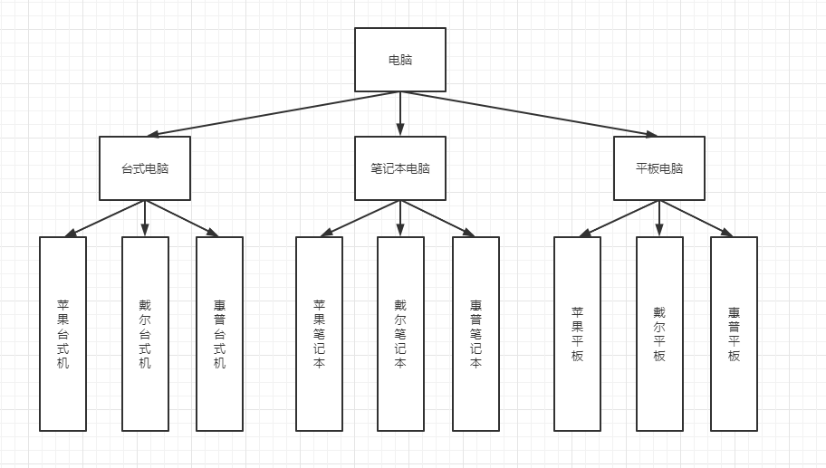

以上的多继承结构耦合性太强，不符合单一职责原则。增加一种类型如（手表）需要在类型下再增加多个品牌。

我们可以使用桥接模式将它解耦。

分析：这个场景中有两个变化的维度：品牌，类型。两个维度相交的地方就是一个产品。


示例代码：

1. `Brand.java` 品牌接口：

   ``` Java
   /**
    * brand interface
    */
   public interface Brand {
       void brandInfo();
   }
   
   ```

2. `Apple.java`，`Dell.java` 实现 `Brand` 品牌接口 ：

   ```Java
   /**
    * Apple brand
    */
   public class Apple implements Brand {
       @Override
       public void brandInfo() {
           System.out.print("Apple ");
       }
   }
   ```

   ```Java
   /**
    * Dell brand
    */
   public class Dell implements Brand {
       @Override
       public void brandInfo() {
           System.out.print("Dell ");
       }
   }
   ```

3. `Computer.java` 抽象类，使用组合方式添加 `Brand` 接口：

   ``` Java
   /**
    * abstract Computer class
    */
   public abstract class Computer {
   
       // composition, Brand
       protected Brand brand;
   
       public Computer(Brand brand) {
           this.brand = brand;
       }
   
       public void info() {
           brand.brandInfo();
       }
   }
   ```

4. `Desktop.java`，`Laptop.java` 继承了 `Computer.java`：

   ```Java
   /**
    * concrete computer: Desktop
    */
   public class Desktop extends Computer {
       public Desktop(Brand brand) {
           super(brand);
       }
   
       @Override
       public void info() {
           super.info();
           System.out.println("Desktop");
       }
   }
   ```

   ```Java
   /**
    * concrete computer: Laptop
    */
   public class Laptop extends Computer {
       public Laptop(Brand brand) {
           super(brand);
       }
   
       @Override
       public void info() {
           super.info();
           System.out.println("Laptop");
       }
   }
   ```

5. 测试类：

   ```Java
   @Test
   public void test1() {
       // Apple laptop
       Computer computer = new Laptop(new Apple());
       computer.info();
   
       // Dell DeskTop
       Computer computer2 = new Desktop(new Dell());
       computer2.info();
   }
   ```

6. 输出结果：

   ```log
   Apple Laptop
   Dell Desktop
   ```


桥接模式分析：

优点

* 桥接模式类似于多继承方案，但是多继承方案违背了类的单一职责原则，复用性较差，类的个数也非常多，桥接模式是比多继承方案更好的解决方法。极大的减少了子类的个数，从而降低管理和维护的成本；
* 桥接模式提高了系统的可扩容性，在两个变化维度中任意展开一个维度，都不需要修改原有系统。符合开闭原则，就像一座桥，可以把两个变化的维度连接起来。


缺点：

* 桥接模式的引入会增加系统的理解与设计难度，由于聚合关联关系建立在抽象层，要求开发者针对抽象进行设计与编程；
* 桥接模式要求正确识别出系统中两个独立变化的维度，因此其使用范围具有一定的局限性。


经典案例：

* Java 语言通过 Java 虚拟机实现了平台的无关性；
* AWT 中的 Peer 架构；
* JDBC 驱动程序。


# 8. 代理模式

为什么要学习代理模式？

* 这是 Spring AOP 的底层模式，面试必问：Spring AOP 和 Spring MVC。


代理模式的分类：

* 静态代理；
* 动态代理；

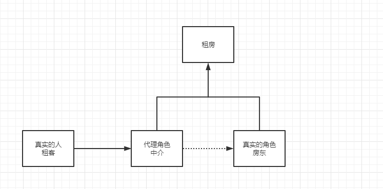


## 8.1 静态代理

角色分析：

* 抽象角色：一般会使用接口或者抽象类来解决；
* 真实角色：被代理的角色；
* 代理角色：代理真实角色，代理真实角色后，我们一般会做一些附属操作；
* 客户：访问代理对象的人。


示例代码：

1. 抽象角色 `Rent.java` 接口，定义租房行为：

   ``` Java
   public interface Rent {
       public void rent();
   }
   ```

2. 真实角色 `Landlord.java` 类，房东实现租房行为：

   ``` Java
   public class Landlord implements Rent{
   
       @Override
       public void rent() {
           System.out.println("Landlord rents a house.");
       }
   }
   ```

3. 代理角色 `Agent.java`类，房屋中介，实现租房行为，增加其它附属业务；

   ``` Java
   public class Agent implements Rent {
       private Landlord landlord;
   
       public Agent() {
       }
   
       public Agent(Landlord landlord) {
           this.landlord = landlord;
       }
   
       public void showHouse() {
           System.out.println("Agent shows you the house.");
       }
   
       public void agencyFee() {
           System.out.println("Agent charges agency fee.");
       }
   
       public void signContrast() {
           System.out.println("Agent signs a contrast with you.");
       }
   
       @Override
       public void rent() {
           showHouse();
           agencyFee();
           signContrast();
           landlord.rent();
       }
   }
   ```

4. 客户：`Tenant.java` 类，租客与房屋中介租房：

   ``` Java
   public class Tenant {
       public static void main(String[] args) {
           Landlord landlord = new Landlord();
   
           Agent agent = new Agent(landlord);
           agent.rent();
       }
   }
   ```

5. 测试结果：

   ``` log
   Agent shows you the house.
   Agent charges agency fee.
   Agent signs a contrast with you.
   Landlord rents a house.
   ```

   

代理模式

优点：

* 可以使真实角色的操作更加纯粹，不用去关注一些公共的业务；
* 公共业务交付给代理角色，实现了业务的分工；
* 公共业务发生扩展时，方便集中管理。

缺点：

* 一个真实角色就会产生一个代理角色，代码量会翻倍，开发效率会变低。


## 8.2 加深理解

1. 改动原有的业务代码，是企业开发的大忌；
2. 在不修改原有代码的情况下，横向加入功能。

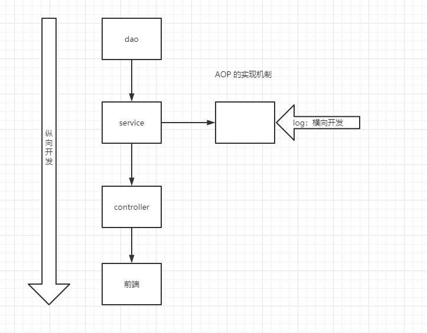

示例代码：

1. `UserService.java` 接口：

   ```Java
   public interface UserService {
       void add();
   
       void delete();
   
       void update();
   
       void query();
   }
   ```

2. `UserServiceImpl.java` 实现类：

   ```Java
   public class UserServiceImpl implements UserService {
       @Override
       public void add() {
           System.out.println("Add a user.");
       }
   
       @Override
       public void delete() {
           System.out.println("Delete a user.");
       }
   
       @Override
       public void update() {
           System.out.println("Update a user.");
       }
   
       @Override
       public void query() {
           System.out.println("Query a user.");
       }
   }
   ```

3. `UserServiceProxy.java` 代理实现类：

   ```Java
   public class UserServiceProxy implements UserService {
   
       UserServiceImpl userService;
   
       public void setUserService(UserServiceImpl userService) {
           this.userService = userService;
       }
   
       @Override
       public void add() {
           log("add");
           userService.add();
       }
   
       @Override
       public void delete() {
           log("delete");
           userService.delete();
       }
   
       @Override
       public void update() {
           log("update");
           userService.update();
       }
   
       @Override
       public void query() {
           log("query");
           userService.query();
       }
       
       // log method
       public void log(String message) {
           System.out.println("[debug] using " + message + " method.");
   
       }
   }
   ```

4. `Client.java` 类：

   ```
   public class Client {
       public static void main(String[] args) {
           UserServiceImpl userService = new UserServiceImpl();
           UserServiceProxy proxy = new UserServiceProxy();
   
           proxy.setUserService(userService);
   
           proxy.add();
           proxy.delete();
           proxy.update();
           proxy.query();
   
       }
   }
   ```

5. 测试结果：

   ```log
   [debug] using add method.
   Add a user.
   [debug] using delete method.
   Delete a user.
   [debug] using update method.
   Update a user.
   [debug] using query method.
   Query a user.
   ```

   

## 8.3 动态代理

* 动态代理和静态代理角色一样；
* 动态代理的代理类是动态生成的，不是我们直接写好的；
* 动态代理分为两大类：基于接口的动态代理，基于类的动态代理
  * 基于接口：`JDK` 的动态代理；【我们在这里使用】
  * 基于类： `cglib`
  * Java 字节码实现：`JAVAsist`


需要了解两个类：

* `Proxy`：代理，
* `InvocationHandler`：调用处理程序

| 类型                |                                                              |
| ------------------- | ------------------------------------------------------------ |
| `Proxy`             | `Proxy` provides static methods for creating objects that act like instances of interfaces but allow for customized method invocation |
| `InvocationHandler` | `InvocationHandler` is the interface implemented by the *invocation handler* of a proxy instance. |


示例代码：

1. `rent.java` 接口，`Landlord.java` 实现类：

   ``` Java
   public interface Rent {
       void rent();
   }
   
   public class Landlord implements Rent {
       @Override
       public void rent() {
           System.out.println("Landlord rents a house.");
       }
   }
   ```

2. `ProxyInvocationHandler.java` 代理处理类，动态地生成 `rent` 接口的代理：

   ``` Java
   /**
    * automatically generate proxy instance
    *
    * @author jay
    */
   public class ProxyInvocationHandler implements InvocationHandler {
   
       /**
        * proxy interface
        */
       private Rent rent;
   
       public void setRent(Rent rent) {
           this.rent = rent;
       }
   
       /**
        * generate proxy instance
        */
       public Object getProxy() {
           return Proxy.newProxyInstance(this.getClass().getClassLoader(),
                   rent.getClass().getInterfaces(),
                   this
           );
       }
   
       /**
        * Processes a method invocation on a proxy instance and returns the result.
        */
       @Override
       public Object invoke(Object proxy, Method method, Object[] args) throws Throwable {
   
           showHouse();
           // dynamic proxy's essence: reflection
           Object result = method.invoke(rent, args);
           return result;
       }
   
       public void showHouse() {
           System.out.println("Agency shows house.");
       }
   }
   ```

3. `Client.java`类：

   ```Java
   public class Client {
   
       public static void main(String[] args) {
           // real character
           Landlord landlord = new Landlord();
   
           // proxy character
           ProxyInvocationHandler invocationHandler = new ProxyInvocationHandler();
   
           invocationHandler.setRent(landlord);
           // get dynamic proxy
           Rent proxy = (Rent) invocationHandler.getProxy();
   
           proxy.rent();
       }
   }
   ```


动态代理：

* 优点：
  * 可以使真实角色的操作更加纯粹，不用去关注一些公共的业务；
  * 公共业务交付给代理角色，实现了业务的分工；
  * 公共业务发生扩展时，方便集中管理；
  * 一个动态代理类代理的是一个接口，一般就是对应的一类业务；
  * 一个动态代理类可以代理多个类，只要实现了同一个接口即可。