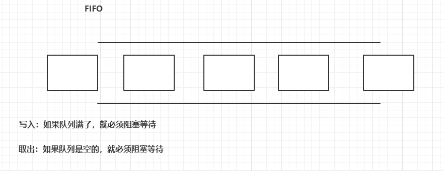
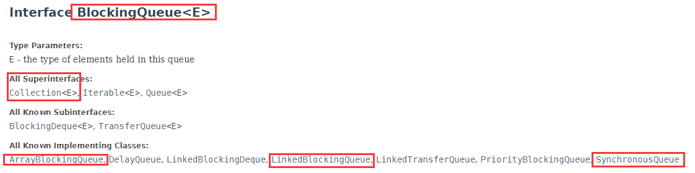
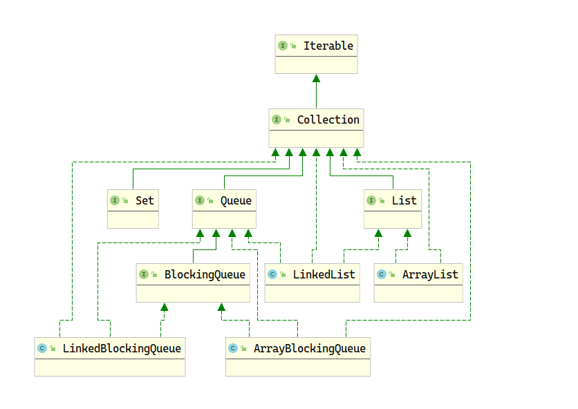

# JUC 并发编程

# 1. JUC


# 2. 多线程状态


线程有如下几种状态：

| 状态          | 说明 |
| ------------- | ---- |
| NEW           |      |
| RUNNABLE      |      |
| BLOCKED       |      |
| WAITING       |      |
| TIMED_WAITING |      |
| THERMINATED   |      |
|               |      |


在 Thread 的内部枚举类 State 中：


```
/**
     * A thread state.  A thread can be in one of the following states:
     * <ul>
     * <li>{@link #NEW}<br>
     *     A thread that has not yet started is in this state.
     *     </li>
     * <li>{@link #RUNNABLE}<br>
     *     A thread executing in the Java virtual machine is in this state.
     *     </li>
     * <li>{@link #BLOCKED}<br>
     *     A thread that is blocked waiting for a monitor lock
     *     is in this state.
     *     </li>
     * <li>{@link #WAITING}<br>
     *     A thread that is waiting indefinitely for another thread to
     *     perform a particular action is in this state.
     *     </li>
     * <li>{@link #TIMED_WAITING}<br>
     *     A thread that is waiting for another thread to perform an action
     *     for up to a specified waiting time is in this state.
     *     </li>
     * <li>{@link #TERMINATED}<br>
     *     A thread that has exited is in this state.
     *     </li>
     * </ul>
     *
     * <p>
     * A thread can be in only one state at a given point in time.
     * These states are virtual machine states which do not reflect
     * any operating system thread states.
     *
     * @since   1.5
     * @see #getState
     */
```


```Java


public enum State {
    /**
         * Thread state for a thread which has not yet started.
         */
    NEW,

    /**
         * Thread state for a runnable thread.  A thread in the runnable
         * state is executing in the Java virtual machine but it may
         * be waiting for other resources from the operating system
         * such as processor.
         */
    RUNNABLE,

    /**
         * Thread state for a thread blocked waiting for a monitor lock.
         * A thread in the blocked state is waiting for a monitor lock
         * to enter a synchronized block/method or
         * reenter a synchronized block/method after calling
         * {@link Object#wait() Object.wait}.
         */
    BLOCKED,

    /**
         * Thread state for a waiting thread.
         * A thread is in the waiting state due to calling one of the
         * following methods:
         * <ul>
         *   <li>{@link Object#wait() Object.wait} with no timeout</li>
         *   <li>{@link #join() Thread.join} with no timeout</li>
         *   <li>{@link LockSupport#park() LockSupport.park}</li>
         * </ul>
         *
         * <p>A thread in the waiting state is waiting for another thread to
         * perform a particular action.
         *
         * For example, a thread that has called {@code Object.wait()}
         * on an object is waiting for another thread to call
         * {@code Object.notify()} or {@code Object.notifyAll()} on
         * that object. A thread that has called {@code Thread.join()}
         * is waiting for a specified thread to terminate.
         */
    WAITING,

    /**
         * Thread state for a waiting thread with a specified waiting time.
         * A thread is in the timed waiting state due to calling one of
         * the following methods with a specified positive waiting time:
         * <ul>
         *   <li>{@link #sleep Thread.sleep}</li>
         *   <li>{@link Object#wait(long) Object.wait} with timeout</li>
         *   <li>{@link #join(long) Thread.join} with timeout</li>
         *   <li>{@link LockSupport#parkNanos LockSupport.parkNanos}</li>
         *   <li>{@link LockSupport#parkUntil LockSupport.parkUntil}</li>
         * </ul>
         */
    TIMED_WAITING,

    /**
         * Thread state for a terminated thread.
         * The thread has completed execution.
         */
    TERMINATED;
}
```


# 10. 阻塞队列

阻塞

队列



阻塞队列：





**BlockingQueue** 不是新的东西：

什么情况下我们会使用阻塞队列：多线程并发处理，线程池

学会使用队列：

添加，移除。

四组API

| 方式       | 抛出异常    | 有返回值   | 阻塞等待 | 超时等待    |
| ---------- | ----------- | ---------- | -------- | ----------- |
| 添加       | `add(E)`    | `offer(E)` | `put()`  | `offer(,,)` |
| 移除       | `remove()`  | `poll()`   | `take()` | `poll(,)`   |
| 判断队列首 | `element()` | `peek()`   | -        | -           |


1. 抛出异常

```Java
/**
     * Throws exception
     */
@Test
public void testAddRemove(){
    // queue size
    ArrayBlockingQueue<String> blockingQueue = new ArrayBlockingQueue<>(3);

    System.out.println(blockingQueue.add("a"));
    System.out.println(blockingQueue.add("b"));
    System.out.println(blockingQueue.add("c"));
    // IllegalStateException: Queue full
    // System.out.println(blockingQueue.add("c"));

    System.out.println("=====================================");
    System.out.println(blockingQueue.remove());
    System.out.println(blockingQueue.remove());
    System.out.println(blockingQueue.remove());
    // NoSuchElementException
    System.out.println(blockingQueue.remove());
}
```


2. 不会抛出异常

```Java
/**
    * Return false
    */
@Test
public void testOfferPoll() {
    ArrayBlockingQueue<String> blockingQueue = new ArrayBlockingQueue<>(3);
    System.out.println(blockingQueue.offer("a"));
    System.out.println(blockingQueue.offer("b"));
    System.out.println(blockingQueue.offer("c"));
    // returns false, does not throw a exception
    System.out.println(blockingQueue.offer("d"));

    System.out.println("=====================================");
    System.out.println(blockingQueue.peek());
    System.out.println(blockingQueue.poll());
    System.out.println(blockingQueue.poll());
    System.out.println(blockingQueue.poll());
    // returns null, does not throw a exception
    System.out.println(blockingQueue.poll());
}
```


3. 阻塞等待

```Java
/**
* wait, block
*/
@Test
public void testPutTake() throws InterruptedException {
    ArrayBlockingQueue<String> blockingQueue = new ArrayBlockingQueue<>(3);
    // blocking
    blockingQueue.put("a");
    blockingQueue.put("b");
    blockingQueue.put("c");

    //        blockingQueue.put("d");   // have no place to put a new element, blocking
    System.out.println(blockingQueue.take());
    System.out.println(blockingQueue.take());
    System.out.println(blockingQueue.take());
    //        System.out.println(blockingQueue.take()); // blocking until take element
}
}

```


4. 超时等待

```Java
/**
*  wait, block (timeout)
*/
@Test
public void testOfferPeek2() throws InterruptedException {
    ArrayBlockingQueue blockingQueue = new ArrayBlockingQueue(3);
    blockingQueue.offer("a");
    blockingQueue.offer("b");
    blockingQueue.offer("c");
    blockingQueue.offer("d", 2, TimeUnit.SECONDS);      // wait 2 seconds and exit
    System.out.println("============================");
    System.out.println(blockingQueue.poll());
    System.out.println(blockingQueue.poll());
    System.out.println(blockingQueue.poll());
    System.out.println(blockingQueue.poll(2, TimeUnit.SECONDS));    // wait 2 seconds and exit
}
```


# 3 线程池

多线程实现的方式：

JDK 1.5 之前，继承 Thread 类或者实现


JDK 1.5 之后可通过实现 Callable 接口在实现多线程：

* FutureTask 实现了 Runnable 和 Future 接口。FutureTask 构造器接收 Callable 接口的实现类。当 FutureTask 类的对象执行 start 方法时，会执行对应的 run 方法，其中会调用 Callable 实现类重写的 call 方法，返回线程执行结果。并使用 set 方法将这个结果保存到 outcome 字段中。使用者可以调用 get 方法获取这个 outcome 的值，从而获取线程执行结果。


线程总结：

1. Thread、Runnable、Callable 三种实现多线程；
2. start 方法开启多线程执行 run 方法；
3. 线程生命周期。


JDK 1.5 线程池的概念。

ThreadPoolExecutor 线程池具体实现类。

7大参数：

| 参数                              | 描述       |
| --------------------------------- | ---------- |
| int corePoolSize                  | 核心池大小 |
| int maximumPoolSize               | 最大池大小 |
| long keepAliveTime                | 存活时间   |
| TimeUnit unit                     | 时间单位   |
| BlockingQueue<Runnable> workQueue | 工作队列   |
| ThreadFactory threadFactory       | 线程工厂   |
| RejectedExecutionHandler handler  | 拒绝策略   |


```Java
/**
     * Creates a new {@code ThreadPoolExecutor} with the given initial
     * parameters.
     *
     * @param corePoolSize the number of threads to keep in the pool, even
     *        if they are idle, unless {@code allowCoreThreadTimeOut} is set
     * @param maximumPoolSize the maximum number of threads to allow in the
     *        pool
     * @param keepAliveTime when the number of threads is greater than
     *        the core, this is the maximum time that excess idle threads
     *        will wait for new tasks before terminating.
     * @param unit the time unit for the {@code keepAliveTime} argument
     * @param workQueue the queue to use for holding tasks before they are
     *        executed.  This queue will hold only the {@code Runnable}
     *        tasks submitted by the {@code execute} method.
     * @param threadFactory the factory to use when the executor
     *        creates a new thread
     * @param handler the handler to use when execution is blocked
     *        because the thread bounds and queue capacities are reached
     * @throws IllegalArgumentException if one of the following holds:<br>
     *         {@code corePoolSize < 0}<br>
     *         {@code keepAliveTime < 0}<br>
     *         {@code maximumPoolSize <= 0}<br>
     *         {@code maximumPoolSize < corePoolSize}
     * @throws NullPointerException if {@code workQueue}
     *         or {@code threadFactory} or {@code handler} is null
     */
public ThreadPoolExecutor(int corePoolSize,
                          int maximumPoolSize,
                          long keepAliveTime,
                          TimeUnit unit,
                          BlockingQueue<Runnable> workQueue,
                          ThreadFactory threadFactory,
                          RejectedExecutionHandler handler) 
```


## 线程池复用机制


**newSingleThreadExecutor**

| 参数            | 值                  |
| --------------- | ------------------- |
| CorePoolSize    | 1                   |
| MaximumPoolSize | 1                   |
| keepAliveTime   | 0                   |
| BlockingQueue   | LinkedBlockingQueue |

**newCachedPoolSize**

| 参数            | 值                |
| --------------- | ----------------- |
| CorePoolSize    | 0                 |
| MaximumPoolSize | Integer.MAX_VALUE |
| keepAliveTime   | 60 s              |
| BlockingQueue   | SynchronousQueue  |


| 参数            | 值                  |
| --------------- | ------------------- |
| CorePoolSize    | n                   |
| MaximumPoolSize | n                   |
| keepAliveTime   | 0                   |
| BlockingQueue   | LinkedBlockingQueue |


为什么阿里开发手册禁止使用 Executors？

 newSingleThreadExecutor 方法只能创建包含一个核心线程的线程池，其余的线程都会在无界的 workQueue 中排队等待，当线程数过多时可能会造成 OOM；

newCachedThreadExecutor 方法创建线程池时，核心线程数为 0，而 workQueue 的实现方式为同步队列。设置的生存时间为 60 秒，排队的空闲线程超出 60 秒后便会销毁，可能会不符合业务要求；

newFixThreadPool 设置固定大小的线程池，超出核心线程池大小的其余的线程都会在无界的 workQueue 中排队等待，当线程数过多时可能会造成 OOM；


RejectedExecutionException 拒绝策略

| 拒绝策略                               | 描述                                                |
| -------------------------------------- | --------------------------------------------------- |
| ThreadPoolExecutor.AbortPolicy         | 默认策略，丢弃任务并抛出 RejectedExecutionException |
| ThreadPoolExecutor.DiscardPolicy       | 丢弃任务，但是不抛出异常                            |
| ThreadPoolExecutor.DiscardOldestPolicy | 丢弃队列最前端的任务，然后重新尝试执行任务          |
| ThreadPoolExecutor.CallerRunsPolicy    | 由调用线程处理该任务                                |
| 自定义拒绝策略                         | 实现 RejectedExecutionHandler 即可自定义            |


线程池 4 级