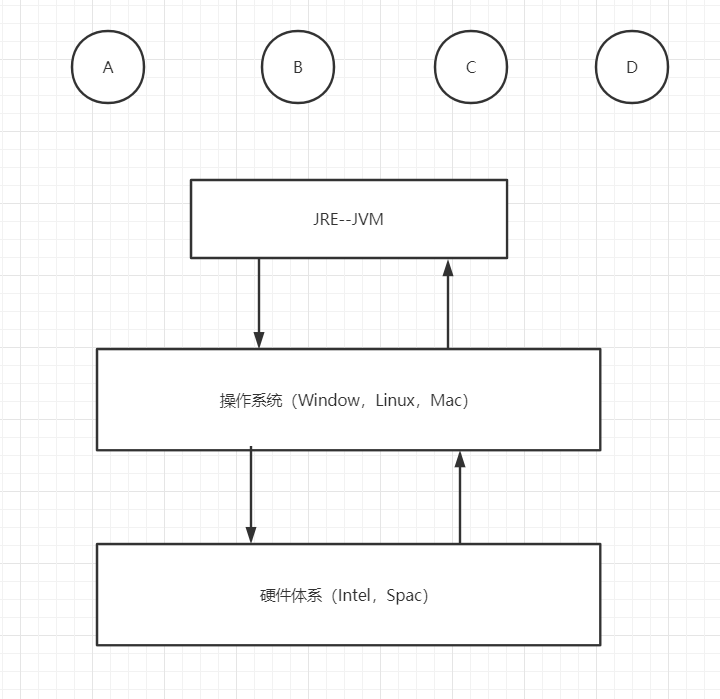
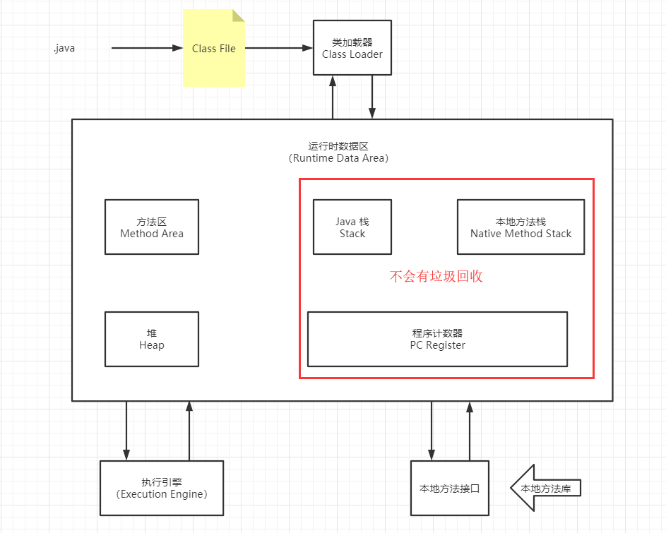
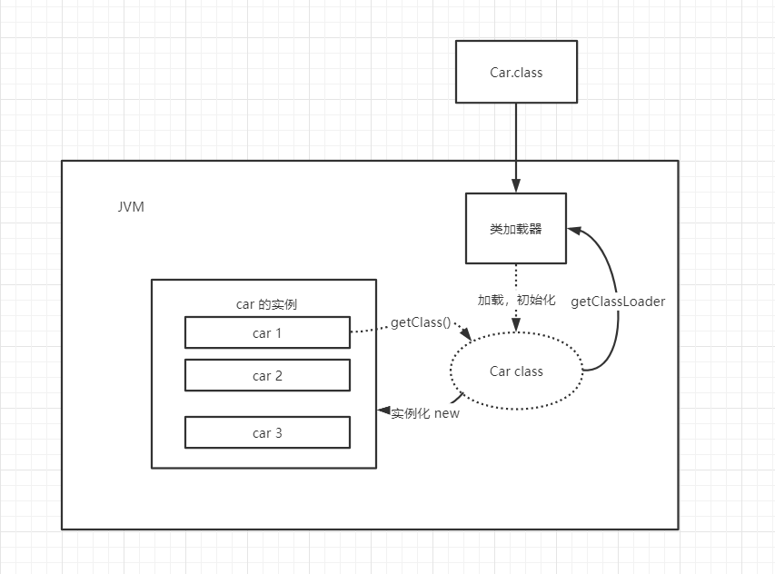
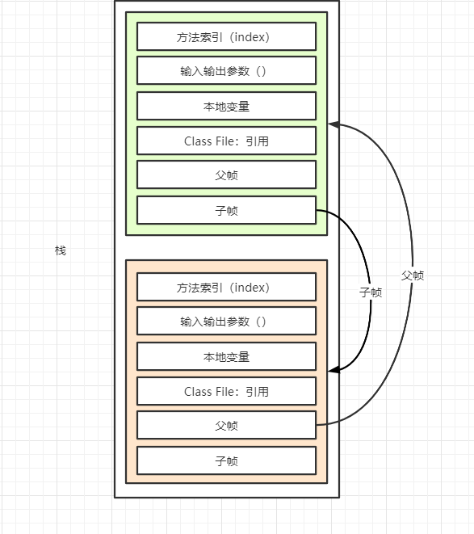
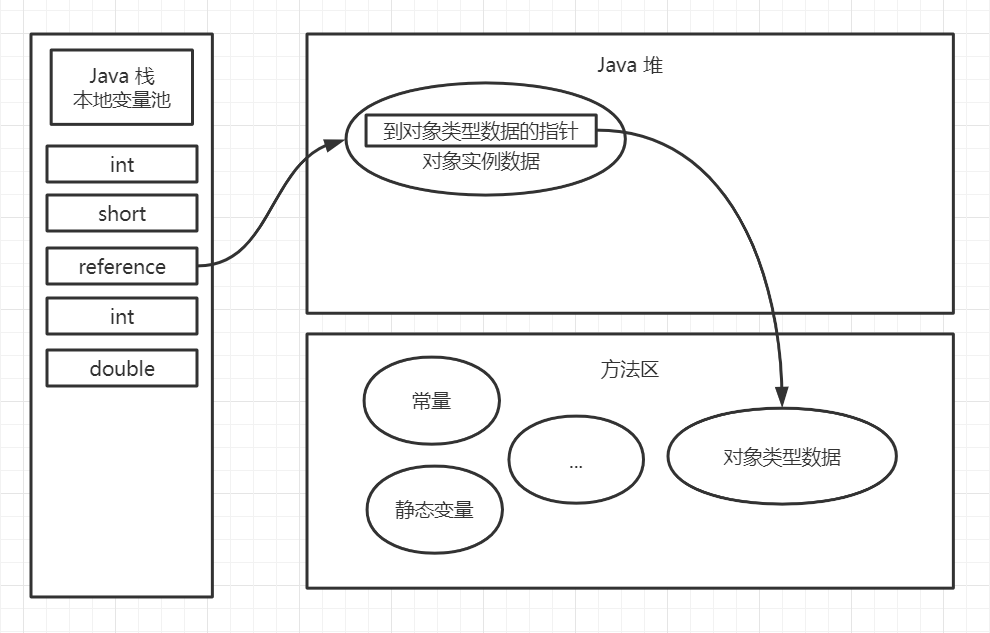

# JVM 探究

* 谈谈你对 JVM 的理解？
  * Java --> class --> jvm
* Java 8 虚拟机和之前的虚拟机的变化？
  * 去除了永久代（不再分代），只剩下元空间。
* 什么是 OOM，什么是栈溢出 StackOverFlowError？
* JVM 常用调优参数有哪些？
* 内存快照如何抓取，怎么分析 Dump 文件？
* 谈谈 JVM 中类加载器的认识？rt.jar ext application


# 1. JVM 的位置





# 2. JVM 的体系结构





# 3. 类加载器

类加载器的作用：加载 `class` 文件 `new Student()；`，再栈中生成一个 `Student` 类的引用，再堆中生成 `Student` 实例。



1. 虚拟机自带的加载器
2. 启动类（根）加载器
3. 平台类加载器（Java 11 之前叫拓展类加载器）
4. 应用类加载器


# 4. 双亲委派机制

1. 类加载器收到类加载的请求；
2. 将这个请求向上委托给父类加载器去完成，一直向上委托，直到启动类加载器；
3. 启动类加载器检查是否能够加载当前类，能加载就使用当前的加载器，否则，抛出异常，通知子加载器进行加载；
4. 重复步骤3，如果道应用类加载器还不能加载，抛出 ClassNotFound 异常。

# 5. 沙箱安全机制

[沙箱安全机制](https://blog.csdn.net/qq_30336433/article/details/83268945)


# 6. Native

native：底层的本地方法接口，Java 中无法实现。

JVM 会在 内存中开辟一块称为本地方法栈的内存区域，用于登记 native 方法，在最终执行时使用 JNI 加载本地方法。

JNI的作用：扩展 Java 的使用，融合不同的编程语言进 Java 中，最初是为了调用 C/C++ 的库。

Java 程序驱动打印机，管理系统，直接读取内存，会通过 JNI 加载本地方法库中的方法。

现在 Java 会选择调用其他的接口，Socket，WebService，HTTP。

```Java
public class Test {
    public static void main(String[] args) {
        new Thread(
                () -> {

                }
                , "my thread name").start();
    }
    
    // native：底层的本地方法接口，Java 中无法实现
   	// 会进入本地方法栈
    public native void hello();
}

```


# 7. PC 寄存器

JVM 种的程序计数器（Program Counter Register）中，Register 的命名源于 CPU 的寄存器，寄存器存储指令相关的现场信息。CPU 只有把数据装载到寄存器才能够运行。

JVM 中 PC 寄存器是堆物理 PC 寄存器的一种抽象模拟。

作用：

* PC 寄存器用来存储指向下一条指令的地址，即将要执行的指令代码。由执行引擎读取下一条指令。

特点：

* 是一块很小的内存空间，几乎可以忽略不计。也是运行速度最快的存储区域。
* 在 JVM 规范中，每个线程都有它自己的程序计数器，是线程私有的，生命周期与线程的生命周期保持一致。
* 任何时间一个线程都只有一个方法在执行，就是所谓的当前方法。程序计数器会存储当前线程正在执行的Java方法的 JVM 指令地址。或者，如果执行的是 native 方法，则是未指定值（undefined）。
* 是程序控制流的指示器，分支、循环、跳转、异常处理、线程恢复等基础功能都需要依赖这个计数器来完成。
* 字节码指示器工作时就是通过改变这个计数器的值来选取下一条需要执行的字节码指令。
* 是唯一一个在 Java 虚拟机规范中没有规定任何 OutOfMemoryError 情况的区域。

# 8. 方法区

1. 方法区（Method Area），也称非堆（Non-Heap），又是一个被线程共享的内存区域。其中主要存储加载的类字节码、class/method/field等元数据对象、static-final常量、static变量、jit编译器编译后的代码等数据。另外，方法区包含了一个特殊的区域“运行时常量池”。
2. 运行时常量池（Runtime Constant Pool）是方法区的一部分。

==静态变量、常量、类信息（构造方法、接口定义）、运行时常量池存放在方法区中，但是实例变量存放在堆内存中，和方法区无关。==


# 9. 栈

栈是一种先进后出的数据结构。

Java 栈：栈内存，主管程序的运行，生命周期和线程同步；

线程结束，栈内存也会释放，对于栈来说，不存在垃圾回收问题。

栈：8 大基本数据类型 + 对象引用 + 实例的方法

| Primitive Type | Memory Required(bytes) |
| -------------- | ---------------------- |
| boolean        | 1                      |
| byte           | 1                      |
| short          | 2                      |
| char           | 2                      |
| int            | 4                      |
| float          | 4                      |
| long           | 8                      |
| double         | 8                      |


栈运行原理，在栈中有栈帧，存放方法索引，输入输出参数，本地变量和类文件引用。Java 中正在执行的方法永远在栈顶。




栈 + 堆 + 方法区，HotSpot 虚拟机通过直接指针访问对象。（其他虚拟机还有通过句柄访问的方式）




# 10. 三种 JVM

1. Sun 公司的 `HotSpot`；
2. Oracle 公司的 `JRockit`；
3.  IBM 公司的 `J9`；

我们学习都是：`HotSpot`。

# 11. 堆

堆（Heap）：一个 JVM 只有一个堆内存，堆内存的大小是可以调节的。

类加载器读取了类文件后，一般会把什么东西放在堆中？类，方法，常量，变量，保存我们所有引用类型的真实对象；

Java 堆是被所有线程共享的一块内存区域，在虚拟机启动时创建。此内存区域的唯一目的就是存放对象实例。


堆内存中还细分为三个区域（JDK 8 之前）：

* 新生区（伊甸园区）	Young / New
* 养老区 Old
* 永久区


JDK 8 之后永久区改名为元空间。


# 12. 新生区、老年区、永久区

~~新生区、老年区、永久区在 JDK 8 之后已弃用。~~

# 13. 堆内存调优

JVM 参数：

| 参数                               |            作用             |
| :--------------------------------- | :-------------------------: |
| `-Xms`                             | 设置初始化内存分配大小 1/64 |
| `-Xmx`                             |    设置最大分配大小 1/4     |
| `-xlog:gc*`                        |        垃圾回收日志         |
| `-XX：+HeapDumpOnOutOfMemoryError` |          oom DUMP           |

默认情况下：分配的总内存大小为当前系统的内存大小的 1/4，而初始化的内存为 1/64.

使用 VM 参数 `-Xms1024m -Xmx1024m -Xlog:gc*` 可调节

```Java
public class Test {

    public static void main(String[] args) {
        // 获取 JVM 最大内存大小和初始化内存大小
        long max = Runtime.getRuntime().maxMemory();
        long total = Runtime.getRuntime().totalMemory();
        
        // max = 2080374784 bytes	1984.0MiB
        System.out.println("max = " + max + " bytes\t" + (max / (double) 1024 / 1024) + "MiB");
        // total = 132120576 bytes	126.0MiB
        System.out.println("total = " + total + " bytes\t" + (total / (double) 1024 / 1024) + "MiB");
			
    }
}
```

输出结果：

```
[0.005s][info][gc,heap] Heap region size: 1M
[0.006s][info][gc,heap,coops] Heap address: 0x00000000c0000000, size: 1024 MB, Compressed Oops mode: 32-bit
[0.034s][info][gc           ] Using G1
[0.034s][info][gc,cds       ] Mark closed archive regions in map: [0x00000000fff00000, 0x00000000fff7eff8]
[0.034s][info][gc,cds       ] Mark open archive regions in map: [0x00000000ffe00000, 0x00000000ffe51ff8]
[0.051s][info][gc           ] Periodic GC disabled
max = 1073741824 bytes	1024.0MiB
total = 1073741824 bytes	1024.0MiB
[0.242s][info][gc,heap,exit ] Heap
[0.243s][info][gc,heap,exit ]  garbage-first heap   total 1048576K, used 2884K [0x00000000c0000000, 0x0000000100000000)
[0.243s][info][gc,heap,exit ]   region size 1024K, 3 young (3072K), 0 survivors (0K)
[0.243s][info][gc,heap,exit ]  Metaspace       used 1020K, capacity 4570K, committed 4864K, reserved 1056768K
[0.243s][info][gc,heap,exit ]   class space    used 102K, capacity 418K, committed 512K, reserved 1048576K

Process finished with exit code 0

```

遇到 OOM：

* 扩大堆内存空间看结果；
* 分析内存，看哪些地方那些地方出现了问题。

元空间（方法区）是堆的一个逻辑部分，逻辑上存在，物理上并不存在独立的空间。

MAT，Jprofiler 分析 Java DUMP 文件。

# 15. GC

1. 常用算法

# 16. JMM（Java Memory Model = Java 内存模型）

# 17. 总结


1. 搜索
2. 思维导图

