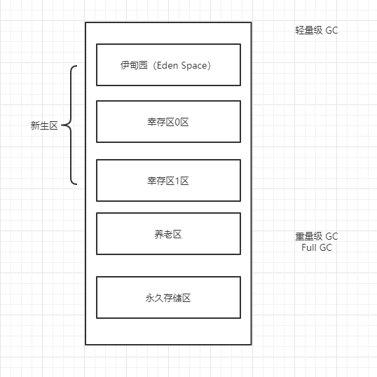
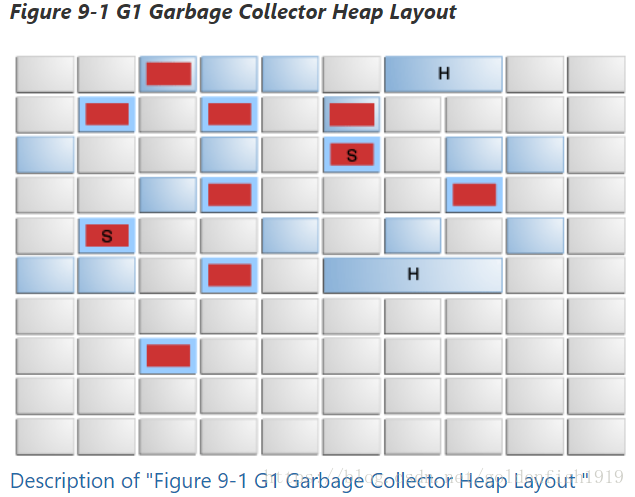
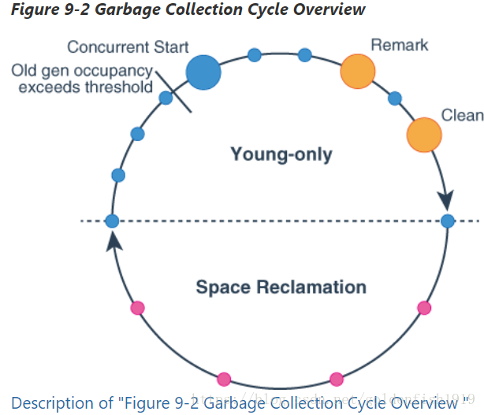

# JVM 探究

* 谈谈你对 JVM 的理解？
  * Java --> class --> jvm
* Java 8 虚拟机和之前的虚拟机的变化？
  * 去除了永久代（不再分代），只剩下元空间。
* 什么是 OOM，什么是栈溢出 StackOverFlowError？
* JVM 常用调优参数有哪些？
* 内存快照如何抓取，怎么分析 Dump 文件？
* 谈谈 JVM 中类加载器的认识？rt.jar ext application


# 1. JVM 的位置


# 2. JVM 的体系结构


# 3. 类加载器

类加载器的作用：加载 `class` 文件 `new Student()；`，再栈中生成一个 `Student` 类的引用，再堆中生成 `Student` 实例。


1. 虚拟机自带的加载器
2. 启动类（根）加载器
3. 平台类加载器（Java 11 之前叫拓展类加载器）
4. 应用类加载器


# 4. 双亲委派机制

1. 类加载器收到类加载的请求；
2. 将这个请求向上委托给父类加载器去完成，一直向上委托，直到启动类加载器；
3. 启动类加载器检查是否能够加载当前类，能加载就使用当前的加载器，否则，抛出异常，通知子加载器进行加载；
4. 重复步骤3，如果道应用类加载器还不能加载，抛出 ClassNotFound 异常。

# 5. 沙箱安全机制

[沙箱安全机制](https://blog.csdn.net/qq_30336433/article/details/83268945)


# 6. Native

native：底层的本地方法接口，Java 中无法实现。

JVM 会在 内存中开辟一块称为本地方法栈的内存区域，用于登记 native 方法，在最终执行时使用 JNI 加载本地方法。

JNI的作用：扩展 Java 的使用，融合不同的编程语言进 Java 中，最初是为了调用 C/C++ 的库。

Java 程序驱动打印机，管理系统，直接读取内存，会通过 JNI 加载本地方法库中的方法。

现在 Java 会选择调用其他的接口，Socket，WebService，HTTP。

```Java
public class Test {
    public static void main(String[] args) {
        new Thread(
                () -> {

                }
                , "my thread name").start();
    }
    
    // native：底层的本地方法接口，Java 中无法实现
   	// 会进入本地方法栈
    public native void hello();
}

```


# 7. PC 寄存器

JVM 种的程序计数器（Program Counter Register）中，Register 的命名源于 CPU 的寄存器，寄存器存储指令相关的现场信息。CPU 只有把数据装载到寄存器才能够运行。

JVM 中 PC 寄存器是堆物理 PC 寄存器的一种抽象模拟。

作用：

* PC 寄存器用来存储指向下一条指令的地址，即将要执行的指令代码。由执行引擎读取下一条指令。

特点：

* 是一块很小的内存空间，几乎可以忽略不计。也是运行速度最快的存储区域。
* 在 JVM 规范中，每个线程都有它自己的程序计数器，是线程私有的，生命周期与线程的生命周期保持一致。
* 任何时间一个线程都只有一个方法在执行，就是所谓的当前方法。程序计数器会存储当前线程正在执行的Java方法的 JVM 指令地址。或者，如果执行的是 native 方法，则是未指定值（undefined）。
* 是程序控制流的指示器，分支、循环、跳转、异常处理、线程恢复等基础功能都需要依赖这个计数器来完成。
* 字节码指示器工作时就是通过改变这个计数器的值来选取下一条需要执行的字节码指令。
* 是唯一一个在 Java 虚拟机规范中没有规定任何 OutOfMemoryError 情况的区域。

# 8. 方法区

1. 方法区（Method Area），也称非堆（Non-Heap），又是一个被线程共享的内存区域。其中主要存储加载的类字节码、class/method/field等元数据对象、static-final常量、static变量、jit编译器编译后的代码等数据。另外，方法区包含了一个特殊的区域“运行时常量池”。
2. 运行时常量池（Runtime Constant Pool）是方法区的一部分。

==静态变量、常量、类信息（构造方法、接口定义）、运行时常量池存放在方法区中，但是实例变量存放在堆内存中，和方法区无关。==


# 9. 栈

栈是一种先进后出的数据结构。

Java 栈：栈内存，主管程序的运行，生命周期和线程同步；

线程结束，栈内存也会释放，对于栈来说，不存在垃圾回收问题。

栈：8 大基本数据类型 + 对象引用 + 实例的方法

| Primitive Type | Memory Required(bytes) |
| -------------- | ---------------------- |
| boolean        | 1                      |
| byte           | 1                      |
| short          | 2                      |
| char           | 2                      |
| int            | 4                      |
| float          | 4                      |
| long           | 8                      |
| double         | 8                      |


栈运行原理，在栈中有栈帧，存放方法索引，输入输出参数，本地变量和类文件引用。Java 中正在执行的方法永远在栈顶。


栈 + 堆 + 方法区，HotSpot 虚拟机通过直接指针访问对象。（其他虚拟机还有通过句柄访问的方式）


# 10. 三种 JVM

1. Sun 公司的 `HotSpot`；
2. Oracle 公司的 `JRockit`；
3.  IBM 公司的 `J9`；

我们学习都是：`HotSpot`。

# 11. 堆

堆（Heap）：一个 JVM 只有一个堆内存，堆内存的大小是可以调节的。

类加载器读取了类文件后，一般会把什么东西放在堆中？类，方法，常量，变量，保存我们所有引用类型的真实对象；

Java 堆是被所有线程共享的一块内存区域，在虚拟机启动时创建。

JDK 8 中**字符串常量池**已经移动到 Java 堆中。


堆内存中还细分为三个区域（JDK 8 之前）：

* 新生区（伊甸园区）	Young / New
* 养老区 Old
* 永久区


# 12. 新生区、老年区、永久区

~~新生区、老年区、永久区在 JDK 8 之后已弃用。~~

JDK 之前的方法区：



GC 垃圾回收，主要是在伊甸园区和养老区。

内存满了，OOM，堆内存不够！

在 JDK 8 之后，永久存储区更名为元空间。


新生区

* 对象：诞生，成长和死亡的地方；
* 伊甸园，大部分的对象都是在伊甸园区 new 出来的（横跨 region 的大对象除外，它会在养老区生成）。
* 养老区。


永久区，这个区域是常驻内存的，用来存放 JDK 自身携带的 Class 对象，Interface 元数据，存储的是 Java 运行时的一些环境或类信息。这个区域很难进行垃圾回收，关闭 JVM 时就会释放这个区域的内存。

一个启动类，加载了大量的第三方 jar 包，比如 Tomcat 部署了太多的应用，或者大量动态生成的反射类，不断地加载反射类直到内存满，就会出现 OOM。

* JDK 6 及之前：永久代，常量池在方法区中；
* JDK 7 中，常量池在堆中；
* JDK 8 及之后：无永久代，常量池在元空间中。

# 13. Java 中的常量池

引用自：[Java中的常量池(字符串常量池、class常量池和运行时常量池)](https://blog.csdn.net/zm13007310400/article/details/77534349)

简介：
这几天在看Java虚拟机方面的知识时，看到了有几种不同常量池的说法，然后我就去CSDN、博客园等上找资料，里面说的内容真是百花齐放，各自争艳，因此，我好好整理了一下，将我自认为对的理解写下来与大家共同探讨：

在Java的内存分配中，总共3种常量池：

## 1. 字符串常量池(String Constant Pool):

### 1.1 字符串常量池在Java内存区域的哪个位置？

在JDK6.0及之前版本，字符串常量池是放在Perm Gen区(也就是方法区)中；
在JDK7.0版本，字符串常量池被移到了堆中了。至于为什么移到堆内，大概是由于方法区的内存空间太小了。

### 1.2 字符串常量池是什么？

* 在HotSpot VM里实现的string pool功能的是一个StringTable类，它是一个Hash表，默认值大小长度是1009；这个StringTable在每个HotSpot VM的实例只有一份，被所有的类共享。字符串常量由一个一个字符组成，放在了StringTable上。
* 在JDK6.0中，StringTable的长度是固定的，长度就是1009，因此如果放入String Pool中的String非常多，就会造成hash冲突，导致链表过长，当调用String#intern()时会需要到链表上一个一个找，从而导致性能大幅度下降；
* 在JDK7.0中，StringTable的长度可以通过参数指定：

```Java
-XX:StringTableSize=66666
```


#### 1.3 字符串常量池里放的是什么？

* 在JDK6.0及之前版本中，String Pool里放的都是字符串常量；
* 在JDK7.0中，由于String#intern()发生了改变，因此String Pool中也可以存放放于堆内的字符串对象的引用。关于String在内存中的存储和String#intern()方法的说明，可以参考我的另外一篇博客：
  需要说明的是：字符串常量池中的字符串只存在一份！
  如：

```Java
String s1 = "hello,world!";
String s2 = "hello,world!";
```


即执行完第一行代码后，常量池中已存在 “hello,world!”，那么 s2不会在常量池中申请新的空间，而是直接把已存在的字符串内存地址返回给s2。(这里具体的字符串如何分配就不细说了，可以看我的另一篇博客)

## 2.class常量池(Class Constant Pool)：

### 2.1 class常量池简介：

* 我们写的每一个Java类被编译后，就会形成一份class文件；class文件中除了包含类的版本、字段、方法、接口等描述信息外，还有一项信息就是常量池(constant pool table)，用于存放编译器生成的各种字面量(Literal)和符号引用(Symbolic References)；
* 每个class文件都有一个class常量池。

### 2.2 什么是字面量和符号引用：

* 字面量包括：1.文本字符串 2.八种基本类型的值 3.被声明为final的常量等;
* 符号引用包括：1.类和方法的全限定名 2.字段的名称和描述符 3.方法的名称和描述符。

## 3. 运行时常量池(Runtime Constant Pool)：

* 运行时常量池存在于内存中，也就是class常量池被加载到内存之后的版本，不同之处是：它的字面量可以动态的添加(String#intern()),符号引用可以被解析为直接引用
* JVM在执行某个类的时候，必须经过加载、连接、初始化，而连接又包括验证、准备、解析三个阶段。而当类加载到内存中后，jvm就会将class常量池中的内容存放到运行时常量池中，由此可知，运行时常量池也是每个类都有一个。在解析阶段，会把符号引用替换为直接引用，解析的过程会去查询字符串常量池，也就是我们上面所说的StringTable，以保证运行时常量池所引用的字符串与字符串常量池中是一致的。

# 14. 堆内存调优

JVM 参数：

| 参数                               |            作用             |
| :--------------------------------- | :-------------------------: |
| `-Xms`                             | 设置初始化内存分配大小 1/64 |
| `-Xmx`                             |    设置最大分配大小 1/4     |
| `-xlog:gc*`                        |        垃圾回收日志         |
| `-XX：+HeapDumpOnOutOfMemoryError` |          oom DUMP           |

默认情况下：分配的总内存大小为当前系统的内存大小的 1/4，而初始化的内存为 1/64.

使用 VM 参数 `-Xms1024m -Xmx1024m -Xlog:gc*` 可调节

```Java
public class Test {

    public static void main(String[] args) {
        // 获取 JVM 最大内存大小和初始化内存大小
        long max = Runtime.getRuntime().maxMemory();
        long total = Runtime.getRuntime().totalMemory();
        
        // max = 2080374784 bytes	1984.0MiB
        System.out.println("max = " + max + " bytes\t" + (max / (double) 1024 / 1024) + "MiB");
        // total = 132120576 bytes	126.0MiB
        System.out.println("total = " + total + " bytes\t" + (total / (double) 1024 / 1024) + "MiB");
			
    }
}
```

输出结果：

```
[0.005s][info][gc,heap] Heap region size: 1M
[0.006s][info][gc,heap,coops] Heap address: 0x00000000c0000000, size: 1024 MB, Compressed Oops mode: 32-bit
[0.034s][info][gc           ] Using G1
[0.034s][info][gc,cds       ] Mark closed archive regions in map: [0x00000000fff00000, 0x00000000fff7eff8]
[0.034s][info][gc,cds       ] Mark open archive regions in map: [0x00000000ffe00000, 0x00000000ffe51ff8]
[0.051s][info][gc           ] Periodic GC disabled
max = 1073741824 bytes	1024.0MiB
total = 1073741824 bytes	1024.0MiB
[0.242s][info][gc,heap,exit ] Heap
[0.243s][info][gc,heap,exit ]  garbage-first heap   total 1048576K, used 2884K [0x00000000c0000000, 0x0000000100000000)
[0.243s][info][gc,heap,exit ]   region size 1024K, 3 young (3072K), 0 survivors (0K)
[0.243s][info][gc,heap,exit ]  Metaspace       used 1020K, capacity 4570K, committed 4864K, reserved 1056768K
[0.243s][info][gc,heap,exit ]   class space    used 102K, capacity 418K, committed 512K, reserved 1048576K

Process finished with exit code 0

```

遇到 OOM：

* 扩大堆内存空间看结果；
* 分析内存，看哪些地方那些地方出现了问题。

元空间（方法区）是堆的一个逻辑部分，逻辑上存在，物理上并不存在独立的空间。

MAT，Jprofiler 分析 Java DUMP 文件。

# 15. GC

在 JDK 11 中，G1 已经取代了 CMS，是默认的垃圾收集器。

出处：[JDK 11 - G1 垃圾收集器](https://blog.csdn.net/goldenfish1919/article/details/82911948)

[JDK 11 -G1 垃圾收集器 原文](https://docs.oracle.com/en/java/javase/11/gctuning/garbage-first-garbage-collector.html#GUID-ED3AB6D3-FD9B-4447-9EDF-983ED2F7A573)


## G1垃圾收集器简介

G1垃圾收集器主要是为那些拥有大内存的多核处理器而设计的。它在以很高的概率满足垃圾收集的停顿时间的要求同时还可以达到很高的吞吐量，同时几乎不需要做什么配置。G1的目标是为应用提供停顿时间和吞吐量的最佳平衡，它的主要特性包含：

堆内存达到数十个G甚至更大，超过50%的堆内存都是存活的对象
对象分配和晋升的速度随时间变化非常大
堆中存在大量的内存碎片
可预测的停顿时间的目标在几百毫秒以内，不会存在长时间的停顿
在jdk11中，G1已经取代了CMS，是默认的垃圾收集器

在随后的章节会介绍G1收集器达到如此高性能和满足停顿时间目标的多种方式。


## 启用G1

因为G1是默认的收集器，因此一般不需要做任何额外的操作就开启。你也可以用 -XX:+UseG1GC来明确开启（译者注：因为是JDK11）。

## 基础的一些概念

G1是一款分带、增量、并行、大部分时候并发、STW并且标记整理的收集器，在每一个STW停顿的时候，它都会监控停顿时间的目标。跟其他的收集器类似，G1把堆分成逻辑上的young区和old区。内存回收主要集中在young区，在这个区域的内存回收也是非常高效的，偶尔也会发生在old区。

为了提高吞吐量，有些操作总是STW的，还有一些操作在应用停止的情况下会花费更多的时间，比如一些对整个堆的操作，像全局的标记就是并行和并发来执行的。在空间回收的时候，为了让STW时间更短，G1是增量的分步和并行来回收的。G1是通过记录上一次应用的行为和GC的停顿信息来实现可预计的停顿时间的，可以利用这些信息来计算在停顿时间之内要做的工作的多少。比如：G1会首先回收那些可以高效回收的内存区域（也就是大部分都被填满垃圾的区域，这也是为啥叫G1的原因）。

G1大部分使用标记整理算法来回收内存：收集选中的内存区域中的存活对象，然后把他们拷贝到新的内存区域中，同时会对这些对象占用的空间进行压缩。回收完成以后，之前被存活对象占用的空间可以被应用用来重新分配对象。

G1并不是一个实时的垃圾收集器。长时间来看，它可以以很高的概率满足停顿时间的要求，但并不能绝对满足。

## 堆的结构

G1把整个堆分成很多相等大小的块（Region），每一个region都是一些连续的虚拟内存就如同图9-1所示。region是内存分配和回收的基本单元，在某个特定的时间点，一个region可能是空的（浅灰色表示），或者是分配到了某个区（generation）中，可能是young区或者old区。当收到需要分配内存的请求的时候，内存管理器就会提供空闲的region出去。内存管理器会把他们赋值给某个generation然后返回给应用程序，应用就可以在这里面分配对象。




young区包含了eden区（红色表示）和survivor区（标有S的红色）。这些region和其他收集器里面的连续的内存空间的作用是一样的，不一样的地方在于：G1里面，这些region在内存里面可以是物理上不连续的。old region（浅蓝色表示）组成了old区。old区的region有可能是大对象区（humongous ）（标有H的浅蓝色表示），这些对象可以横跨多个region。

应用总是在young区分配对象，更确切地说是在eden区，大对象除外，因为大对象是直接分配在old区。

G1在停顿的时候可以回收整个young区的内存，在任何停顿都可以回收一些可选的old区的内存。停顿的时候，G1会把对象从一个地方复制到堆里面的一个或者多个region，对象要拷贝到的目的地region取决于来源region：来自young区的对象要么被拷贝到survior区要么到old区，来自old区的对象会从一个old region拷贝到另一个old region，不同的old region是有不同的年龄的。

垃圾收集的生命周期
宏观上看，G1的垃圾回收在两个阶段中来回交替执行的。young-only阶段会逐步把old区填满存活对象，space-reclamation阶段除了会回收young区的内存以外，还会增量回收old区的内存。然后就会重新开始young-only阶段。

图9-2用一个可能会发生的回收停顿的例子描述了这个周期：




下面的章节详细的讲述了G1回收周期中的这些阶段、停顿、还有阶段之间的变迁：

## Young-only阶段

这个阶段从young区的一些普通的young GC开始，这些GC会把young区的对象晋升到old区。当old区的占有率达到一个阈值的时候就开始young-only阶段到space-reclamation阶段的转换，这个时候，就开始Concurrent Start的young GC而不是普通的young GC。

* Concurrent Start : 这种类型的GC除了做普通的young GC以外，还会开始标记（marking）过程。并发标记会找出当前old区中所有的存活的对象以备随后的 space-reclamation阶段来使用。当并发标记还没结束的过程中，还是可能会发生普通young GC的。标记经过两个特殊的STW停顿之后才会结束：重新标记（remark）和清理（cleanup）。
* 重新标记（Remark）: 这个停顿中会结束掉mark阶段、做全局的引用处理和类卸载，回收全空的region和清理掉内部的数据结构。在重新标记（remark）和清理（cleanup）之间，G1会并发的在选中的old区的region中计算随后可以回收的空间，这个计算会在Cleanup的时候结束。
* 清理（Cleanup）。这个停顿中会决定是否要开始space-reclamation阶段。如果要开始space-reclamation， young-only阶段就结束了，紧接着就开始一个Mixed young GC。

## Space-reclamation阶段

这个阶段由多个Mixed GC组成，不光是回收young区的region，同时也会回收old区的region。当G1发现，无法回收更多old区的region的时候，space-reclamatio阶段就结束了。

space-reclamation阶段以后，会以young-only阶段开始一个新的回收周期。为了以防万一，在收集存活对象的时候，如果应用的内存耗尽了，G1也会像其他的收集器一样做整个堆的STW的堆压缩（也就是FullGC）。

## G1的内部实现

本节描述了G1收集器的一些重要的细节。

## 如何确定初始标记的阈值

Initiating Heap Occupancy Percent (IHOP) 是触发开始初始标记的阈值，它的值是old区大小的一个百分比。通过观察标记过程使用的时间和标记过程中old区分配的内存大小，G1默认会自动的调整一个最优的IHOP，这个特性就叫做自适应的IHOP。如果激活了这个特性， `-XX:InitiatingHeapOccupancyPercent` 这个选项决定了IHOP的初始值，因为初始的时候还没有足够的数据来对这个值做预测。`-XX:-G1UseAdaptiveIHOP` 这个选项可以关闭自适应，此时，由 `-XX:InitiatingHeapOccupancyPercent`设置的阈值就始终不会改变。

自适应IHOP会这样来设置这个阈值： 当开始space-reclamation阶段的第一个Mixed GC的时候，old区的占有率=old区的最大值减去 `-XX:G1HeapReservePercent` 。

## 标记（Marking）

G1使用SATB算法来做标记。在初始标记开始的时候，G1会保存堆的一份虚拟镜像，初始标记开始时候存活的对象在后续的标记过程中仍然被认为是存活的。这意味着就算是标记过程中这部分对象死亡了，对于space-reclamation阶段来说它们仍然是存活的（有少部分例外）。跟其他的收集器相比，这会导致一些额外的内存被错误的占用。但是，SATB给Remark提供了更低的延迟。那些mark中死亡的对象在下一次mark中会被回收掉。关于mark的一些问题可以参考G1调优

## 内存非常紧张时候的表现

当应用的存活对象占用了大量的内存，无法容纳回收剩余的对象的时候，就会发生evacuation failure。 Evacuation failure发生的时候，G1为了完成当前的GC，它会保持已经位于新的位置上的存活对象，仅仅是调整对象之间的引用，而不会复制或者移动这些对象。Evacuation failure会导致一些额外的开销，但是一般会跟别的young GC一样快。evacuation failure完成以后，G1会跟往常一样继续恢复应用的执行。G1会假设 evacuation failure是发生在GC的后期，也就是说，大部分对象已经移动过了，已经有足够的剩余内存来继续执行应用程序一直到mark结束 space-reclamation开始。

如果这个假设不成立，G1最终会发起Full GC。这种类型的GC会对整个堆做压缩，可能会非常非常的慢！

关于allocation failure或者是Full GC的而更多信息可以参考G1调优

## 大对象（Humongous Objects）

大对象是说那些对象大小超过了region一半的对象。如果没有设置 `-XX:G1HeapRegionSize`这个选项，当前region的大小自适应计算的，在G1自适应默认值这一节有详细讲述。

G1对这些大对象会做特殊处理：

大象是分配在old区的一系列连续的region中，对象的开始总是位于这一系列region的第一个region的开始，在整个对象被回收掉之前，最后一个region中剩余的空间都不会被分配出去。

一般来说，只有在Cleanup停顿阶段mark结束以后或者FullGC的时候，死亡的大对象才会被回收掉。但是，基本类型的数组的大对象是例外的，比如bool数组、所有的整形数组、浮点型数组等。G1会在任何GC停顿的适当时候回收这些大对象，如果他们不再有引用。这个默认是开启的，但是可以使用 -XX:G1EagerReclaimHumongousObjects这个选项禁用掉。

分配大对象会导致过早的发生GC停顿。G1在分配每一个大对象的时候都会去检查IHOP，如果当前的堆占用率超过了IHOP阈值，就会强制立即发起一个初始标记的young GC。

即使是在FullGC的时候，这些大对象也是永远不会被移动的。这会导致过早的发生FullGC或者是意外的OOM，尽管此时还有大量的空闲内存，但是这些内存都是region中的内存碎片。

## Young-Only阶段Generation的大小变化

在young-only阶段，要回收的那些region集合（回收集）只由young区的
region组成。在每一个普通的youngGC结束的时候，G1总是会调整young区的大小。基于长期的对实际停顿时间的观察，G1就可以满足 -XX:MaxGCPauseTimeMillis和 -XX:PauseTimeIntervalMillis 设置的停顿时间的目标。它会计算出来回收相同大小的young区的内存需要花费多少时间，其中包括在GC的时候要拷贝多少个对象，对象之间是如何相互关联的。

如果没有其他的限定条件，G1会把young区的大小调整为 -XX:G1NewSizePercent和 -XX:G1MaxNewSizePercent 之间的值来满足停顿时间的要求。关于如何解决长时间停顿问题可以参考G1调优

## Space-Reclamation阶段Generation的大小变化

在space-reclamation阶段，G1会尽量在一个GC停顿之内回收尽可能多的old区的内存。young区的大小被调整为 -XX:G1NewSizePercent设置的允许的最小值，只要是存在可回收内存的old区的region都会被添加到回收集合中，一直到再增加就会超出停顿时间的目标为止。在特定的某个GC停顿之内，G1会按照这些region回收的效率来添加要回收的region，效率高的排在前面，得到最终要回收的region集合。

每一个GC停顿要回收的old区的region数量受限于候选region集合数量除以 -XX:G1MixedGCCountTarget这个选项设置的长度，候选region集合是old区的所有的占用率低于 -XX:G1MixedGCLiveThresholdPercent 的那些region。

当候选region集合中可回收的空间低于 -XX:G1HeapWastePercent 的时候，这一阶段就结束了。

关于G1会使用old区的多少个region和如何避免长时间的mixed停顿可以参考G1调优

## G1自适应的一些默认值

本节讲述了G1的一些重要的默认行为和默认值，讲述了如果不做额外的处理，G1的预期的行为和资源的占用情况。

| 选项和默认值                                                | 描述                                                         |
| ----------------------------------------------------------- | ------------------------------------------------------------ |
| -XX:MaxGCPauseMillis=200                                    | 最大停顿时间的目标                                           |
| -XX:GCPauseTimeInterval=< ergo>                             | 最大停顿时间间隔目标。G1默认不会设置任何目标                 |
| -XX:ParallelGCThreads=< ergo>                               | 设置GC停顿时候的并行的GC收集线程数。它是根据虚拟机所在的主机的可用CPU线程数来计算的：如果CPU少于8个这个值就是cpu的数量，否则，就等于cpu数量*5/8。每个停顿开始的时候，最大的GC线程数还受限于最大的堆内存，G1的内个线程能使用的最大堆内存是由-XX:HeapSizePerGCThread来设置的 |
| -XX:ConcGCThreads=< ergo>                                   | 设置与应用并发执行的GC线程数，默认是-XX:ParallelGCThreads/4  |
| -XX:+G1UseAdaptiveIHOP-XX:InitiatingHeapOccupancyPercent=45 | 默认自适应IHOP是开启的，前几个GC周期G1会使用 old区占用45%作为开始mark的阈值 |
| -XX:G1HeapRegionSize=< ergo>                                | region的大小，整个堆大概有2048个region，region的大小可以在1-32M之间，必须是2的次方 |
| -XX:G1NewSizePercent=5 -XX:G1MaxNewSizePercent=60           | young区的大小就在这两个值之间变化                            |
| -XX:G1HeapWastePercent=5                                    | 候选region集合中可以不被回收的空间数量，如果候选region集合的空闲空间数量低于这个值G1就会终止space-reclamation阶段 |
| -XX:G1MixedGCCountTarget=8                                  | space-reclamation阶段需要做多少次GC                          |
| XX:G1MixedGCLiveThresholdPercent                            | 如果存活的对象占有率超过了这个值，space-reclamation阶段不会回收这个region |


> 注意:< ergo>的意思是实际的值是根据环境自适应确定的。

## 跟其他收集器的比较

G1和其他收集器的主要区别：

并行收集器（Parallel GC）可以压缩和回收old区的内存，但是只能对old区整体来操作。G1可以把整个工作增量的分散到多个时间更短的停顿中。这在减少停顿时间的同时会牺牲一部分吞吐量。
跟CMS类似，G1是并发的回收old区的内存，但是，CMS不会处理old区的碎片，最终就会导致长时间的FullGC。
由于并发的原因，G1可能会表现出比其他收集器更高的开销，这会影响吞吐量。
基于它的工作原理，G1有多种提高GC效率的机制：

G1在任何的停顿都可以回收一些全空或者大量的old区的内存。这会避免不必要的GC，因为可以不费吹灰之力就可以释放大量的内存空间。
G1可以选择对整个堆里面的String进行并行去重。
回收old区的空的、大对象是默认开启的，可以使用 `-XX:-G1EagerReclaimHumongousObjects` 这个选项禁用掉。String去重默认是不开启的，可以使用 `-XX:+G1EnableStringDeduplication` 开启。


JDK 14

```
[0.006s][info][gc,heap] Heap region size: 1M
[0.006s][info][gc,heap,coops] Heap address: 0x00000000ff800000, size: 8 MB, Compressed Oops mode: 32-bit
[0.011s][info][gc           ] Using G1
[0.011s][info][gc,cds       ] Mark closed archive regions in map: [0x00000000fff00000, 0x00000000fff7eff8]
[0.011s][info][gc,cds       ] Mark open archive regions in map: [0x00000000ffe00000, 0x00000000ffe51ff8]
[0.027s][info][gc           ] Periodic GC disabled
before gc
[0.160s][info][gc,task      ] GC(0) Using 1 workers of 4 for full compaction
[0.160s][info][gc,start     ] GC(0) Pause Full (System.gc())
[0.160s][info][gc,phases,start] GC(0) Phase 1: Mark live objects
[0.162s][info][gc,phases      ] GC(0) Phase 1: Mark live objects 2.050ms
[0.162s][info][gc,phases,start] GC(0) Phase 2: Prepare for compaction
[0.163s][info][gc,phases      ] GC(0) Phase 2: Prepare for compaction 0.442ms
[0.163s][info][gc,phases,start] GC(0) Phase 3: Adjust pointers
[0.164s][info][gc,phases      ] GC(0) Phase 3: Adjust pointers 1.013ms
[0.164s][info][gc,phases,start] GC(0) Phase 4: Compact heap
[0.165s][info][gc,phases      ] GC(0) Phase 4: Compact heap 0.719ms
[0.165s][info][gc,heap        ] GC(0) Eden regions: 2->0(1)
[0.165s][info][gc,heap        ] GC(0) Survivor regions: 0->0(0)
[0.165s][info][gc,heap        ] GC(0) Old regions: 0->1
[0.165s][info][gc,heap        ] GC(0) Archive regions: 2->2
[0.165s][info][gc,heap        ] GC(0) Humongous regions: 0->0
[0.165s][info][gc,metaspace   ] GC(0) Metaspace: 559K(4864K)->559K(4864K) NonClass: 507K(4352K)->507K(4352K) Class: 51K(512K)->51K(512K)
[0.165s][info][gc             ] GC(0) Pause Full (System.gc()) 1M->1M(8M) 4.683ms
[0.165s][info][gc,cpu         ] GC(0) User=0.00s Sys=0.00s Real=0.01s
after gc
[0.169s][info][gc,heap,exit   ] Heap
[0.169s][info][gc,heap,exit   ]  garbage-first heap   total 8192K, used 1264K [0x00000000ff800000, 0x0000000100000000)
[0.169s][info][gc,heap,exit   ]   region size 1024K, 1 young (1024K), 0 survivors (0K)
[0.169s][info][gc,heap,exit   ]  Metaspace       used 562K, capacity 4531K, committed 4864K, reserved 1056768K
[0.169s][info][gc,heap,exit   ]   class space    used 51K, capacity 402K, committed 512K, reserved 1048576K
```


1. 常用算法

# 16. JMM（Java Memory Model = Java 内存模型）

# 17. 总结


1. 搜索
2. 思维导图

