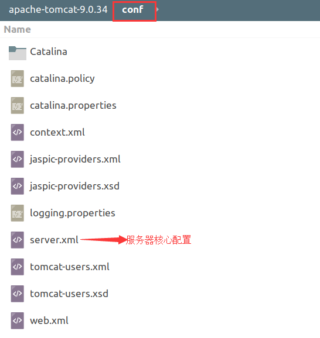
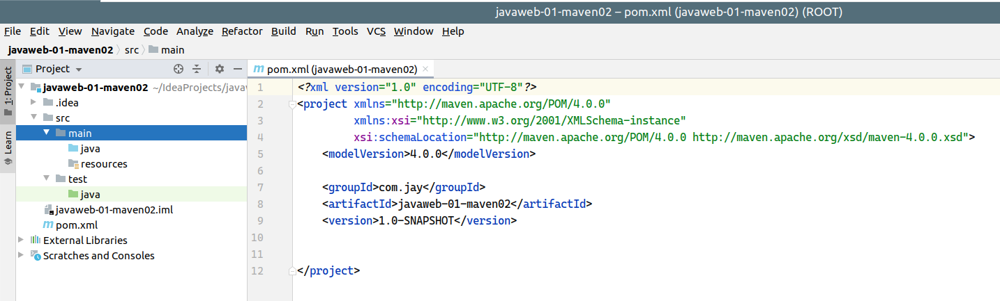
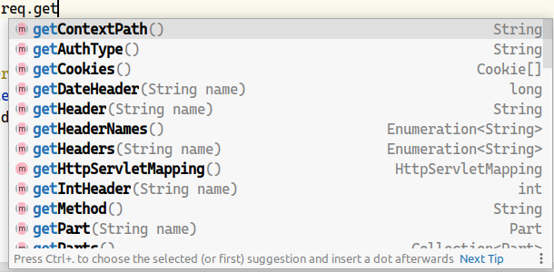

# JavaWeb

## 1. 基本概念

### 1.1 前言

web开发：

* web：网页， www.qq.com
* 静态web
  * HTML， CSS；
  * 提供给所有人看的数据始终不会发生变化！
* 动态web
  * 淘宝，几乎所有的网站都是动态web；
  * 提供给所有人看的数据会发生变化，每个人在不同的时间，不同的地点看到的信息可能会不同！
  * 技术栈：Servlet/JSP, ASP, PHP。

在Java中，动态web资源开发的技术统称为JavaWeb；

### 1.2 Web应用程序

Web应用程序：可以提供浏览器访问的程序；

* a.html，b.html...多个web资源，这些web资源可以被外界访问，对外界提供服务；
* 你们能访问到的任何一个界面或者资源，都存在于这个世界的某一个角落的计算机上；
* URL
* 这个统一的web资源会被放在同一个文件夹下，web应用程序-->  Tomcat：服务器
* 一个web应用由多部分组成（静态web，动态web）
  * HTML， CSS， js
  * JSP，Servlet
  * Java程序
  * jar包
  * 配置文件（Properties）

web应用程序编写完毕后，若想提供给外界访问：需要一个统一服务器来统一管理。

### 1.3 静态web

* \*.html，\*.htm，这些都是网页的后缀，如果服务器上一直存在这些东西，我们就可以直接进行读取。


* 静态web存在的缺点
  * web页面无法动态更新，所有用户看到的都是同一个页面
    * 轮播图，点击特效：伪动态；
    * JavaScript【实际开发中，它用的最多】
    * VBScript
  * 它无法和数据库交互（数据无法持久化，用户无法交互）

### 1.4 动态web

页面会动态展示：“Web的页面显示效果因人而异”；


缺点

* 加入服务器的动态web资源出现了错误，我们需要重新编写**后台程序**，重新发布；
  * 停机维护

优点：

* web页面可以动态更新，所有用户看到页面不同；
* 它可以与数据库交互（数据持久化：注册，商品信息，用户信息......）


## 2. web服务器

### 2.1 技术讲解

**ASP：**

* 微软：国内最早流行的就是ASP；

* 在HTML中嵌入VB的脚本，ASP + COM；

* 在ASP开发中，基本上一个页面都有几千行的业务代码，页面极其混乱

* 维护成本高！

* C#

* IIS

  ```HTML
  <h1>
      	<h1>
              <h1>
                  <%
                     System.out.println("/hello");
                     %>
                      </%%>
              </h1>
      </h1>
  </h1>
  ```


 **PHP：**

* PHP开发速度很快，功能很强大，跨平台，代码很简单（70%，WP）；
* 无法承载大访问量的情况下（局限性）；


**JSP/Servlet：**

B/S：浏览器和服务器

C/S：客户端和服务器

* sun
* sun公司主推的B/S架构
* 基于Java语言的（所有的大公司，或者一些开源的组件，都是用Java写的）；
* 可以承载三高问题带来的影响；
* 语法很像ASP， ASP-->JSP，加强市场强度；


### 2.2 web服务器

服务器是一种被动的操作，用来处理用户的请求和给用户响应；


**IIS**

微软的，ASP等Windows中

**Tomcat**

> The Apache Tomcat® software is an open source implementation of the Java Servlet, JavaServer Pages, Java Expression Language and Java WebSocket technologies. The Java Servlet, JavaServer Pages, Java Expression Language and Java WebSocket specifications are developed under the [Java Community Process](http://jcp.org/en/introduction/overview).
>
> The Apache Tomcat software is developed in an open and participatory environment and released under the [Apache License version 2](http://www.apache.org/licenses/). The Apache Tomcat project is intended to be a collaboration of the best-of-breed developers from around the world. We invite you to participate in this open development project. To learn more about getting involved, [click here](https://tomcat.apache.org/getinvolved.html).
>
> Apache Tomcat software powers numerous large-scale, mission-critical web applications across a diverse range of industries and organizations. Some of these users and their stories are listed on the [PoweredBy](https://cwiki.apache.org/confluence/display/TOMCAT/PoweredBy) wiki page.
>
> Apache Tomcat, Tomcat, Apache, the Apache feather, and the Apache Tomcat project logo are trademarks of the Apache Software Foundation.

下载Tomcat：

1. 安装或解压；
2. 了解配置文件及目录结构；
3. 功能作用。

## 3. Tomcat

### 3.1 Tomcat安装

VRKY6R@9.png)

### 3.2 Tomcat启动


访问测试：http://localhost.com:8080/

可能遇到的问题：

* Java环境变量没有配置
* 闪退问题：需要配置兼容性
* 乱码问题：配置文件设置

### 3.3配置



可以配置启动的端口号

* tomcat的默认端口号为：8080
* MySQL：3036
* HTTP：80
* HTTPS：443

可以配置主机的名称

* 默认的主机名为：localhost->127.0.0.1
* 默认网站应用存放的位置为：webapps

**高难度面试题：**

请你谈谈网站是如何进行访问的？

1. 在浏览器地址栏输入一个域名；

2. 检查本机的hosts文件，查看配置文件中有没有这个域名的映射；

   * 有：直接返回对应的ip地址，这个地址中，有所需要访问的web程序，可以直接访问

     ```
     127.0.0.1		localhost.com
     ```

   * 没有：去DNS服务器找，找到的话就返回，找不到就返回错误；

   


### 3.4 发布一个web网站

* 将自己写的网站，放到服务器（Tomcat）中指定的web应用的文件夹（webapps）下，就可以访问了；

网站应有的结构

``` Java
--webapps : Tomcat服务的web目录
    -ROOT
    -JAYSTUDY : 网站的目录名
        - WEB-INF
        	-classes : Java程序
            -lib : web应用所依赖的jar包
            -web.xml : 网站配置文件
        - index.html : 默认的首页
        - static
            -css
            	-style.css
            -js
            -img
        -
```

HTTP协议：面试

Maven：构建工具

* Maven安装包

Servlet入门

* HelloWorld
* Servlet配置
* 原理

## 4. HTTP

### 4.1 什么是HTTP

HTTP（超文本传输协议）是一个简单的请求-响应协议，它通常运行在TCP之上。

* 文本：HTML，字符串等；
* 超文本：图片，音乐，视频，定位，地图等；
* 80端口

HTTPS：安全的

* 443

### 4.2 两个时代

* HTTP1.0
  * HTTP/1.0：客户端可以与web服务器连接后，只能获得一个web资源，断开连接
* HTTP2.0
  * HTTP/1.1：客户端可以与web服务器连接后，可以获得多个web资源。

### 4.3 HTTP请求

* 客户端-->发请求-->服务器

  QQ：

  ``` Java
  请求 URL: https://www.qq.com/
  请求方法: GET
  状态代码: 200 
  远程地址: 61.151.166.146:443
  引用站点策略: no-referrer-when-downgrade
  ```

  ``` Java
  
  accept: text/html,application/xhtml+xml,application/xml;q=0.9,image/webp,image/apng,*/*;q=0.8,application/signed-exchange;v=b3;q=0.9
  accept-encoding: gzip, deflate, br
  accept-language: zh-CN,zh;q=0.9,en;q=0.8,en-GB;q=0.7,en-US;q=0.6
  cache-control: no-cache
  ```

  #### 1. 请求行

  * 请求行中的请求方式：GET
  * 请求方式：**GET**，**POST**，HEAD，DELETE，PUT等
    * GET：请求能够携带的参数比较少，大小有限制，会在浏览器的URL地址栏显示数据内容，不安全，但高效；
    * POST：请求能够携带的参数无限制，大小无限制，不会在浏览器的URL地址栏显示数据内容，安全，但不高效。

  #### 2. 消息头

  ``` Java
  Accept：告诉浏览器，它所支持的数据类型
  Accept-Encoding：支持哪种编码格式	GBK,UTF-8,GB2312 ISO8859-1
  Accept-Language：告诉浏览器，它的语言环境
  Cache-Control：缓存控制
  Connection：告诉浏览器，请求完成是断开还是保持连接
  HOST：主机
  ```
```
  
  

### 4.4 HTTP响应

* 服务器-->响应-->客户端

  QQ：

  ``` Java
  cache-control: max-age=60
  content-encoding: gzip
  content-type: text/html; charset=GB2312
  server: nginx
  status:200
```

  #### 1. 响应体

  ``` Java
  Accept：告诉浏览器，它所支持的数据类型
  Accept-Encoding：支持哪种编码格式	GBK,UTF-8,GB2312 ISO8859-1
  Accept-Language：告诉浏览器，它的语言环境
  Cache-Control：缓存控制
  Connection：告诉浏览器，请求完成是断开还是保持连接
  HOST：主机
  Refresh：告诉客户端，多久刷新一次
  Location：让网页重新定位
  ```

  #### 2. 状态响应码

| 200  | 请求响应成功       |
| ---- | ------------------ |
| 3xx  | 请求重定向         |
| 4xx  | 找不到资源404      |
|      | 资源不存在         |
| 5xx  | 服务器代码错误 500 |
|      | 502：网关错误      |


**常见面试题：**

当你的浏览器中地址栏输入地址并回车的一瞬间到页面能够展示回来，经历了什么？

## 5. Maven

我为什么要学习Maven

1. 在JavaWeb开发中，需要使用大量的jar包，我们需要手动去导入；

2. 如何能够让一个东西自动帮我导入和配置这个jar包。

   由此，Maven诞生了！


### 5.1 Maven项目架构管理哦工具

我们目前用来就是方便导入jar包的！

Maven的核心思想：**约定大于配置**

* 有约束，不要去违反

Maven会规定好你该如何去编写Java代码，必须按照


### 5.2 下载安装Maven

http://maven.apache.org/

Ubuntu可以使用apt下载

``` bash
apt install maven 
```

### 5.3 配置环境变量


### 5.4 阿里云镜像

* 镜像：mirrors
  * 作用，加速下载
* 国内建议使用阿里云的镜像

在`~/.m2/settings.xml`处添加，如果不存在，新建此文件。

``` xml
<settings>
    <mirrors>
        <mirror>
            <id>aliyun</id>
            <name>aliyun</name>
            <mirrorOf>central</mirrorOf>
            <!-- 国内推荐阿里云的Maven镜像 --> <url>http://maven.aliyun.com/nexus/content/groups/public/</url>
        </mirror>
    </mirrors>
</settings>
```

### 5.5 本地仓库

在本地建立一个仓库，缺省的本地仓库地址为`*${user.home}/.m2/repository`。

``` xml
<localRepository>D:/java/repository</localRepository>
```

### 5.6 在IDEA中使用Maven

1. 启动IDEA

2. 创建一个MavenWeb项目

   

   

   

3. 等待项目初始化完毕

   

4. 观察Maven仓库中多了什么东西。

5. IDEA中的Maven设置。

   

6. 到这里，Maven在IDEA中的配置和使用就没有问题了。

### 5.7 创建一个普通的Maven项目

​	

直接生成



JavaWeb项目生成没有java, resource, test等目录，需要手动建立并标记为相关目录类型

 


### 5.8 标记文件夹类型


### 5.9 在IDEA中配置Tomcat


解决警告问题

为什么会有这个问题：我们访问一个网站，需要指定一个文件夹名字；


### 5.10 pom文件


Maven由于它的约定大于配置，我们之后可能遇到我们写的配置文件，无法被到处或者生效的问题，解决方案：

标准的Maven项目都会有一个resources目录来存放我们所有的资源配置文件，但是我们往往在项目中不仅仅会把所有的资源配置文件都放在resources中，同时我们也有可能放在项目中的其他位置，那么默认的maven项目构建编译时就不会把我们其他目录下的资源配置文件导出到target目录中，就会导致我们的资源配置文件读取失败，从而导致我们的项目报错出现异常，比如说尤其我们在使用MyBatis框架时，往往Mapper.xml配置文件都会放在dao包中和dao接口类放在一起的,那么执行程序的时候，其中的xml配置文件就一定会读取失败，不会生成到maven的target目录中，所以我们要在项目的pom.xml文件中进行设置，并且我建议大家，每新建一个maven项目，就把该设置导入pom.xml文件中，以防不测！！！

``` xml
    <build>
        <resources>
            <resource>
                <directory>src/main/resources</directory>
                <includes>
                    <include>**/*.properties</include>
                    <include>**/*.xml</include>
                </includes>
                <filtering>true</filtering>
            </resource>
            <resource>
                <directory>src/main/java</directory>
                <includes>
                    <include>**/*.properties</include>
                    <include>**/*.xml</include>
                </includes>
                <filtering>true</filtering>
            </resource>
        </resources>
    </build>
```

手动设置Maven项目编译的source和Target字节码版本；

``` xml
    <properties>
        <project.build.sourceEncoding>UTF-8</project.build.sourceEncoding>
        <maven.compiler.source>14</maven.compiler.source>
        <maven.compiler.target>14</maven.compiler.target>
    </properties>
```


### 5.11 IDEA操作


### 5.13 解决遇到的问题


## 6 Servlet

### 6.1 Servlet简介

* Servlet就是sun公司开发动态web的一门技术
* Sun公司在这些API中提供了一个接口叫做：Servlet，如果你想开发一个Servlet程序，只需要完成两个小步骤
  * 编写一个类，实现Servlet接口；
  * 把开发好的Java类部署到web服务器中。

把实现了Servlet接口的Java程序叫做：Servlet。


### 6.2 HelloServlet

Servlet接口Sun公司有两个默认的实现类：HttpServlet，

1. 构建一个普通Maven项目，删掉里面的src目录，后续学习就在这个项目中建立Module，这个空的工程就是Maven主工程；

2. 关于Maven父子工程的理解；

   父项目中会有

   ``` xml
       <modules>
           <module>servlet-01</module>
       </modules>
   ```

   子项目中会集成夫项目中的依赖

3. Maven环境优化

   1. 修改web.xml为最新的
   2. 将maven的结构搭建完善

4. 编写一个Servlet程序

   1. 编写一个普通类；
   2. 实现Servlet接口，这里我们直接继承HttpServlet；

   ``` Java
   public class HelloServlet extends HttpServlet {
   
       //  The difference between get and post is just the way their implementation
       //  They can call each other.
   
       @Override
       protected void doGet(HttpServletRequest req, HttpServletResponse resp) throws ServletException, IOException {
   //        ServletInputStream inputStream = req.getInputStream();
   //        ServletOutputStream outputStream = resp.getOutputStream();
           PrintWriter writer = resp.getWriter();      // response stream
   
           writer.print("Hello, Servlet");
       }
   
       @Override
       protected void doPost(HttpServletRequest req, HttpServletResponse resp) throws ServletException, IOException {
           super.doPost(req, resp);
       }
   }
   ```

5. 编写Servlet的映射

   为什么需要映射：我们写的是Java程序，但是要通过浏览器访问，而浏览器需要连接web服务器，所以我们需要在web服务中注册我们写的Servlet，还需要给他一个浏览器能够访问的路径。

   ```xml
     <!--Servlet registration-->
     <servlet>
       <servlet-name>hello</servlet-name>
       <servlet-class>com.jay.servlet.HelloServlet</servlet-class>
     </servlet>
     <!--Servlet request path-->
     <servlet-mapping>
       <servlet-name>hello</servlet-name>
       <url-pattern>hello</url-pattern>
     </servlet-mapping>
   ```

6. 配置Tomcat

   注意：配置项目发布的路径即可

7. 启动测试，OK！

### 6.3 Servlet原理

Servlet是由web服务器调用，web服务器在收到浏览器请求之后，会：


### 6.4 Mapping问题

1. 一个Servlet可以指定一个映射路径；

   ```xml
   <!--Servlet request path-->
   <servlet-mapping>
       <servlet-name>hello</servlet-name>
       <url-pattern>/hello</url-pattern>
   </servlet-mapping>
   ```

2. 一个Servlet可以指定多个映射路径；

   ```xml
   <!--Servlet request path-->
   <servlet-mapping>
       <servlet-name>hello</servlet-name>
       <url-pattern>/hello</url-pattern>
   </servlet-mapping>
   <!--localhost.com:8080/s1/hello/hello-->
   <servlet-mapping>
       <servlet-name>hello</servlet-name>
       <url-pattern>/hello/world</url-pattern>
   </servlet-mapping>
   ```

3. 一个Servlet可以指定通用映射路径；

   ``` xml
   <servlet-mapping>
       <servlet-name>hello</servlet-name>
       <url-pattern>/hello/*</url-pattern>
   </servlet-mapping>
   ```

4. 默认请求路径；

   ```xml
   <!--default request path-->
   <servlet-mapping>
       <servlet-name>hello</servlet-name>
       <url-pattern>/*</url-pattern>
   </servlet-mapping>
   ```

5. 指定一些后缀或者前缀等等；

   ```xml
   <!-- * should not appear before "/"-->
   <servlet-mapping>
       <servlet-name>hello</servlet-name>
       <url-pattern>*.do</url-pattern>
   </servlet-mapping>
   ```

6. 优先级问题

   指定了固定的映射路径优先级最高，如果找不到就会走默认的处理请求；

   ```xml
       <!--404-->
       <servlet>
           <servlet-name>error</servlet-name>
           <servlet-class>com.jay.servlet.ErrorServlet</servlet-class>
       </servlet>
       <servlet-mapping>
           <servlet-name>error</servlet-name>
           <url-pattern>/*</url-pattern>
       </servlet-mapping>
   ```

   

### 6.5 ServletContext

web容器在启动时，它会为每个web程序都创建一个对应的ServletContext对象（全局可见且唯一），它代表了当前的web应用；

``` html
 <p>There is one context per "web application" per Java Virtual Machine.  (A
 "web application" is a collection of servlets and content installed under a
 specific subset of the server's URL namespace such as <code>/catalog</code>
 and possibly installed via a <code>.war</code> file.)
```


#### 1. 共享数据

* 我在这个Servlet中保存的数据，可以在另一个Servlet中拿到；

  ``` Java
  /*
  * 在HelloServlet类中获取ServletContext并设置属性username的对象引用，其值为"建宇"
  */
  public class HelloServlet extends HttpServlet {
      @Override
      protected void doGet(HttpServletRequest req, HttpServletResponse resp) throws ServletException, IOException {
          ServletContext context = this.getServletContext();
          String username = "建宇";
  
          context.setAttribute("username", username);
  
      }
  }
  ```

  ``` Java
  /*
  * 在GetServlet中获取ServletContext，获取属性username
  * 响应对象resp的内容类型和字符编码
  */
  
  public class GetServlet extends HttpServlet {
      @Override
      protected void doGet(HttpServletRequest req, HttpServletResponse resp) throws ServletException, IOException {
          ServletContext context = this.getServletContext();
          String username = (String) context.getAttribute("username");
  
          resp.setContentType("text/html");
          resp.setCharacterEncoding("UTF-8");
          resp.getWriter().print("name: " + username);
      }
  }
  ```

  ``` xml
    
  <!--注册HelloServlet-->
  	<servlet>
      <servlet-name>hello</servlet-name>
      <servlet-class>com.jay.servlet.HelloServlet</servlet-class>
    </servlet>
    <servlet-mapping>
      <servlet-name>hello</servlet-name>
      <url-pattern>/hello</url-pattern>
    </servlet-mapping>
  
  <!--注册GetServlet-->
    <servlet>
      <servlet-name>getc</servlet-name>
      <servlet-class>com.jay.servlet.GetServlet</servlet-class>
    </servlet>
    <servlet-mapping>
      <servlet-name>getc</servlet-name>
      <url-pattern>/getc</url-pattern>
    </servlet-mapping>
  ```

#### 2. 获取初始化参数

很少使用

``` xml
    <!--configure some web application initial parameter-->
    <context-param>
        <param-name>url</param-name>
        <param-value>jdbc:mysql://localhost:3306/mybatis</param-value>
    </context-param>
```

``` Java
protected void doGet(HttpServletRequest req, HttpServletResponse resp) throws ServletException, IOException {
        ServletContext context = this.getServletContext();
        String url = context.getInitParameter("url");
        resp.getWriter().print(url);
    }
```

#### 3. 请求转发

通过ServletDemo4将请求转发到“/GP”，浏览器URL栏依旧输入ServletDemo4注册的"/sd4"。

``` Java
public class ServletDemo04 extends HttpServlet {
    @Override
    protected void doGet(HttpServletRequest req, HttpServletResponse resp) throws ServletException, IOException {
        ServletContext context = this.getServletContext();
        System.out.println("get into ServletDemo04");
//        RequestDispatcher requestDispatcher = context.getRequestDispatcher("/gp"); // dispatch request path
//        requestDispatcher.forward(req,resp);    // call forward to dispatch
        context.getRequestDispatcher("/GP").forward(req, resp);
    }
}
```

``` xml
    <servlet>
        <servlet-name>sd4</servlet-name>
        <servlet-class>com.jay.servlet.ServletDemo04</servlet-class>
    </servlet>
    <servlet-mapping>
        <servlet-name>sd4</servlet-name>
        <url-pattern>/sd4</url-pattern>
    </servlet-mapping>
```


#### 4. 读取资源文件

Properties

* 在Java目录中新建properties；	（需要修改pom文件，见5.10）
* 在resources目录下新建properties；（推荐）

发现：都被打包到了同一路径下：classes，我们俗称这个路径为classpath；

思路：需要一个文件流；

``` properties
username=root
password=123456
```


``` Java
public class ServletDemo05 extends HttpServlet {
    @Override
    protected void doGet(HttpServletRequest req, HttpServletResponse resp) throws ServletException, IOException {
        InputStream is = this.getServletContext().getResourceAsStream("/WEB-INF/classes/db.properties");
        Properties prop = new Properties();
        prop.load(is);
        String user = prop.getProperty("username");
        String pwd = prop.getProperty("password");

        resp.getWriter().print(user + ":" + pwd);
    }

    @Override
    protected void doPost(HttpServletRequest req, HttpServletResponse resp) throws ServletException, IOException {
        super.doPost(req, resp);
    }
}
```

访问测试即可。

### 6.6 HttpServletResponse 

web服务器接收到客户端的http请求，针对这个请求，分别创建一个代表请求的HttpServletRequest对象，代表响应的一个HttpServletResponse对象。

* 如果要获取客户端请求过来的参数：找HttpServletRequest；
* 如果要给客户端响应一些信息：找HttpServletResponse。

#### 1. 简单分类

**负责给浏览器发送数据的方法**

``` Java
getOutputStream() throws IOException;
PrintWriter getWriter() throws IOException;
```

负责向浏览器发送响应头的方法

``` Java
    public void setDateHeader(String name, long date);

	public void addDateHeader(String name, long date);

	public void setIntHeader(String name, int value);

    public void addIntHeader(String name, int value);
```

#### 2. 下载文件 

1. 要获取下载文件的路径
2. 下载的文件名是什么？
3. 设置想办法让浏览器能够支持下载我们需要的东西
4. 获取下载文件的输入流
5. 创建缓冲区
6. 获取OutputStream对象
7. 将FileOutputStream流写入到buffer缓冲区
8. 使用OutputStream将缓冲区的数据输出到客户端

``` Java
public class FileServlet extends HttpServlet {
    @Override
    protected void doGet(HttpServletRequest req, HttpServletResponse resp) throws ServletException, IOException {
//        1. 要获取下载文件的路径
        String realPath = this.getServletContext().getRealPath("/WEB-INF/classes/吴.png");
        System.out.println("File path: " + realPath);
//        2. 下载的文件名是什么？
        String fileName = realPath.substring(realPath.lastIndexOf("//") + 1);
//        3. 设置想办法让浏览器能够支持下载我们需要的东西
        resp.setHeader("Content-Disposition", "attachment; filename=" + URLEncoder.encode(fileName, "UTF-8"));
//        4. 获取下载文件的输入流
        FileInputStream in = new FileInputStream(realPath);
//        5. 创建缓冲区
        int len = 0;
        byte[] buffer = new byte[1024];
//        6. 获取OutputStream对象
        ServletOutputStream out = resp.getOutputStream();
//        7. 将FileOutputStream流写入到buffer缓冲区, 使用OutputStream将缓冲区的数据输出到客户端
        while ((len = in.read(buffer)) > 0) {
            out.write(buffer, 0, len);
        }
        in.close();
        out.close();
    }

    @Override
    protected void doPost(HttpServletRequest req, HttpServletResponse resp) throws ServletException, IOException {
        super.doPost(req, resp);
    }
}
```

#### 3. 验证码功能

验证码怎么来的？

* 前端实现
* 后端实现，需要用到Java的图片类，生成一个图片

``` Java
public class ImageServlet extends HttpServlet {
    @Override
    protected void doGet(HttpServletRequest req, HttpServletResponse resp) throws ServletException, IOException {
        // how to refresh browser per 5s automaticlly
        resp.setHeader("refresh", "5");

        // create a image in memory
        BufferedImage image = new BufferedImage(80, 20, BufferedImage.TYPE_INT_RGB);
        // get image
        Graphics2D g = (Graphics2D) image.getGraphics();     // get pen
        // set image backgroud color
        g.setColor(Color.WHITE);
        g.fillRect(0, 0, 80, 20);
        // draw on image
        g.setColor(Color.BLUE);
        g.setFont(new Font(null, Font.BOLD, 20));
        g.drawString(makeNum(), 0, 20);

        // inform browser, this request should be opened in image type
        resp.setContentType("image/png");
        // website has cache, forbid cache
        resp.setDateHeader("expires", -1);
        resp.setHeader("Cache-Control", "no-cache");
        resp.setHeader("Pragma", "no-cache");

        // send image to browser
        ImageIO.write(image, "png", resp.getOutputStream());
    }

    // get random integer
    private String makeNum() {
        Random random = new Random();
        String num = random.nextInt(9999999) + "";
        StringBuffer sb = new StringBuffer();
        for (int i = 0; i < 7 - num.length(); i++) {
            sb.append("0");
        }
        String s = sb.toString() + num;
        return num;
    }

    @Override
    protected void doPost(HttpServletRequest req, HttpServletResponse resp) throws ServletException, IOException {
        doGet(req, resp);
    }
}

```

#### 4. 实现重定向


B一个web资源收到客户端A请求后，B会通知A客户端去访问另一个web资源C，这个过程叫做重定向。

常用场景：

* 用户登录

``` Java
void sendRedirect(String location) throws IOException;
```

测试：

``` Java
@Override
protected void doGet(HttpServletRequest request, HttpServletResponse response) throws ServletException, IOException {
    /*
     * response.setHeader("Location", "/r/image");
     * response.setStatus(HttpServletResponse.SC_FOUND);
    */

    response.sendRedirect("/r/image");
}    
```

面试题：请你聊聊重定向和转发的区别？

相同点：

* 页面都会跳转

不同点

* 请求转发时，URL不会发生变化；
* 重定向时，URL会发生变化；


```Java
public class RequestTest extends HttpServlet {
    @Override
    protected void doGet(HttpServletRequest req, HttpServletResponse resp) throws ServletException, IOException {
        System.out.println("Enter this request.");
        //  process request
        String username = req.getParameter("username");
        String password = req.getParameter("password");
        System.out.println(username + ":" + password);

        // redirect should ensure the path, otherwise 404
        resp.sendRedirect("/r/success.jsp");
    }

    @Override
    protected void doPost(HttpServletRequest req, HttpServletResponse resp) throws ServletException, IOException {
        doGet(req, resp);
    }
}
```

``` Jsp
<%@ page contentType="text/html;charset=UTF-8" language="java" %>
<html>
<head>
    <title>Title</title>
</head>
<body>
<h1>success</h1>
</body>
</html>
```

### 6.7 HttpServletRequest

HttpServletRequest代表客户端的请求，用户通过Http协议访问服务器，HTTP请求中的所有信息会被封装到HttpServletRequest，通过这个HttpServletRequest的方法，获得客户端的所有信息；



#### 获取参数，请求转发

``` java
String getParameter(String name);
String[] getParameterValues(String name);
```


``` Java
public class LoginServlet extends HttpServlet {
    @Override
    protected void doGet(HttpServletRequest req, HttpServletResponse resp) throws ServletException, IOException {

        req.setCharacterEncoding("UTF-8");

        String username = req.getParameter("username");
        String password = req.getParameter("password");
        String[] hobbies = req.getParameterValues("hobbies");
        System.out.println("===========================================");
        System.out.println(username);
        System.out.println(password);
        System.out.println(Arrays.toString(hobbies));
        System.out.println("===========================================");

        // redirect by request
        req.getRequestDispatcher("/success.jsp").forward(req, resp);

    }
    @Override
    protected void doPost(HttpServletRequest req, HttpServletResponse resp) throws ServletException, IOException {
        doGet(req, resp);
    }
}
```

**面试题：请你聊聊重定向和转发的区别？**

相同点：

* 页面都会跳转

不同点

* 请求转发时，URL不会发生变化；	307
* 重定向时，URL会发生变化；            302


## 7. Cookie， Session

### 7.1 会话

**会话**：用户打开了一个浏览器，点击了很多超链接，访问多个web资源，关闭浏览器，这个过程可以称之为会话。

**有状态会话**：一个同学来过教室，下次再来教室，我们会知道这个同学曾经来过，称之为有状态会话。

* **你怎么证明你是本校学生？**

  * 你					学校

  1. 录取通知书					学校给你录取通知书
  2. 学校登记                        学校标记你来过了

* **一个网站，怎么证明你来过了？**

  * 客户端            服务端

  1. 服务端给服务端一个信件，客户端下次访问服务端时带上信件就可以了；cookie
  2. 服务器登记你来过了，下次你来的时候我来匹配你；session


### 7.2 保存会话的两种技术

**cookie**

* 客户端技术	（响应，请求）

**session**

* 服务器技术，利用这个技术，可以保存用户的会话信息？我们可以把信息或者数据放在session中！


常见场景：网站登录后，你下次不用再登录，第二次访问直接就上去了！


### 7.3 Cookie


1. 从请求中拿到cookie信息
2. 服务器相应给客户端cookie

``` Java
Cookie[] cookies = req.getCookies();  //get cookie
cookie.getName()	// get cookie key
cookie.getValue()	// get cookie value
Cookie cookie = new Cookie("lastLoginTime", LocalDateTime.now().toString());	// new a cookie
cookie.setMaxAge(24 * 60 * 60);	// set cookie expiry
resp.addCookie(cookie);	// respond a cookie
```

cookie: 一般会保存在本地的用户目录中。


一个网站cookie是否存在上限！**聊聊细节问题：**

* 一个Cookie只能保存一个信息；
* 一个web站点可以给浏览器发送多个cookie，每个浏览器的限制不同；
* cookie大小有限制，4KB；
* 300个cookie浏览器上限。


删除cookie：

* 不设置有效期，关闭浏览器，自动失效；
* 设置有效期时间为0；
* 设置同名cookie，更新。

2020-04-25T21:56:26.672516


**编码解码：**

``` Java
URLEncoder.encode("吴建宇", "UTF-8")
URLDecoder.decode(name, "UTF-8");
```


### 7.4 Session （重点）


什么是Session：

* 服务器会给每个用户（浏览器）创建一个Session对象；
* 一个Session独占一个浏览器，只要浏览器没有关闭，这个Session就存在；
* 用户登录后，整个网站都可以访问。--> 保存用户的信息；保存购物车信息。


Session和Cookie的区别：

* Cookie是把用户的数据写给用户浏览器，浏览器保存；（可以保存多个）
* Session把用户的数据写到用户独占Session中，服务器端保存；（保存重要信息，减少服务器资源的浪费）

* Session对象由服务器创建；


使用场景：

* 保存一个登录用户的信息；
* 购物车信息；
* 在整个网站中经常会使用的数据，我们将它保存在Session中；


使用Session：

``` Java
public class SessionDemo01 extends HttpServlet {
    @Override
    protected void doGet(HttpServletRequest req, HttpServletResponse resp) throws ServletException, IOException {
        // resolve encoding
        resp.setCharacterEncoding("UTF-8");
        req.setCharacterEncoding("UTF-8");
        resp.setContentType("text/html");

        // get Session
        HttpSession session = req.getSession();
        // store value in Session
        session.setAttribute("name", new Person("Jay", 25));

        // get session id
        String sessionId = session.getId();

        // determine whether session is a new session
        if (session.isNew()) {
            resp.getWriter().write("session create successful!, ID: " + sessionId);
        } else {
            resp.getWriter().write("session is already stored in server, ID: " + sessionId);
        }

        // what have been done when session is created
//        Cookie cookie = new Cookie("JSESSIONID", sessionId);
//        resp.addCookie(cookie);
    }

    @Override
    protected void doPost(HttpServletRequest req, HttpServletResponse resp) throws ServletException, IOException {
        doGet(req, resp);
    }
}


        // get Session
        HttpSession session = req.getSession();
        // get value in Session
        Person person = (Person) session.getAttribute("name");
        resp.getWriter().write("name = " + person.toString());

        HttpSession session = req.getSession();
        session.removeAttribute("name");
        // manually logout session
        session.invalidate();
```

会话自动过期：web.xml配置

``` xml
    <!--set session default expire time-->
    <session-config>
        <!--session expires automatically in 15 minutes-->
        <session-timeout>15</session-timeout>
    </session-config>
```


## 8. JSP

### 8.1 JSP简介

Java Server Page： Java服务器端页面，也和Servlet一样，用于动态Web技术！

最大的特点：

* 写JSP就像在写HTML
* 区别：
  * HTML只给用户提供静态的数据；
  * JSP页面中可以嵌入Java代码，为用户提供动态数据；

### 8.2 JSP原理

思路，JSP是如何执行的？

* 代码层面没有任何问题

* 服务器内部工作

  Tomcat中有一个work目录；

  IDEA中使用Tomcat会在IDEA的Tomcat中生成一个work目录；

  

  ``` Java
  /root/.cache/JetBrains/IntelliJIdea2020.1/tomcat/Unnamed_javaweb-session-cookie/work/Catalina/localhost/ROOT/org/apache/jsp/
  ```

  发现页面转变成了Java程序！

  **浏览器向服务器发送请求，不管访问什么资源，其实都是在访问Servlet！**

  JSP最终也会被转换成为一个Java类！

  JSP本质上就是一个Servlet

  ``` Java
  void _jspInit() {
    }
  
   void _jspDestroy() {
    }
  
   void _jspService(HttpServletRequest request, HttpServletResponse response){
    }
  ```

  1. 判断请求

  2. 内置一些对象

     ``` Java
     final javax.servlet.jsp.PageContext pageContext;
     javax.servlet.http.HttpSession session = null;
     final javax.servlet.ServletContext application;
     final javax.servlet.ServletConfig config;
     javax.servlet.jsp.JspWriter out = null;
     final java.lang.Object page = this;
     javax.servlet.jsp.JspWriter _jspx_out = null;
     javax.servlet.jsp.PageContext _jspx_page_context = null;
     HttpServletRequest request;
     HttpServletResponse response;
     ```

  3. 输出页面前增加的代码

     ``` Java
     response.setContentType("text/html");			// 设置响应的页面类型
     pageContext = _jspxFactory.getPageContext(this, request, response,
                                               null, true, 8192, true);
     _jspx_page_context = pageContext;
     application = pageContext.getServletContext();
     config = pageContext.getServletConfig();
     session = pageContext.getSession();
     out = pageContext.getOut();
     _jspx_out = out;
     ```

  4. 以上这些对象我们可以直接在JSP页面中直接使用！

     

     在JSP页面中：

     * 只要是Java代码会原封不动的输出；

     * 如果时HTML代码，就用out.write()输出；

     ``` Java
           out.write("<body>\n");
           out.write("\n");
     
         String name = "Jay";
     
           out.write("\n");
           out.write("\n");
           out.write("name:");
           out.print(name);      
           out.write("\n");
           out.write("\n");
           out.write("</body>\n");
     ```

### 8.3 JSP基础语法

任何语言都有自己的语法，Java中有，JSP作为Java技术的一种应用，它有一些自身扩充的（了解即可），

它支持Java的所有语法。


#### **JSP表达式**

``` java
<%--  JSP expression-
  usage: print Java output to client
  <%= variable or expression %>
--%>
<%= new java.util.Date()%>
```

#### **JSP脚本片段**

``` Java
<%--jsp script block --%>
<%
    int sum = 0;
    for (int i = 1; i <= 100; i++) {
        sum += i;
    }
    out.println("<h1>Sum=" + sum + "</h1>");
%>
```

**脚本片段的再实现**

``` Java

<%
    int x = 10;
    out.println(x);
%>
<p>This is a JSP document.</p>
<%
    int y = 20;
    out.println(y);
%>
<hr>

<%--embed HTML element in code--%>
<%
    for (int i = 0; i < 5; i++) {
%>
<h1>Hello, World!  <%=i%>
</h1>
<%
    }
%>
```


#### **JSP声明**

``` JSP
<%!
    static {
        System.out.println("Loading Servlet!");
    }

    private int globalVar = 0;

    public void jay() {
        System.out.println("enter into method jay!");
    }
%>
```

JSP声明：会被编译到JSP生成的Java类中！其它的，就会被生成到_jspService方法中！

``` Java
static {
    System.out.println("Loading Servlet!");
}

private int globalVar = 0;

public void jay() {
    System.out.println("enter into method jay!");
}
```

在JSP，嵌入Java代码即可！

``` Jsp
<%%>
<%=%>
<%!%>
<%--注释--%>
```

JSP的注释，不会在客户端显示，HTML就会！


### 8.4 JSP指令

``` JSP
<%@page args... %>
<%@include file=""%>

<%@include file="common/header.jsp" %>
<h1>Web body</h1>
<%@include file="common/footer.jsp" %>

<hr>

<%-- JSP tag--%>
<jsp:include page="/common/header.jsp"/>
<h1>Web body</h1>
<jsp:include page="/common/footer.jsp"/>
```


### 8.5 9大内置对象

| PageContext | 存放数据                  |
| ----------- | ------------------------- |
| Request     | 存放数据                  |
| Response    |                           |
| Session     | 存放数据                  |
| Application | [ServletContext] 存放数据 |
| config      | [SevletConfig]            |
| out         |                           |
| page        | 不用                      |
| exception   |                           |


``` Java
pageContext.setAttribute("name1", "Jay1");      // the attribute is valid in this page scope
request.setAttribute("name2", "Jay2");          // the attribute is valid in this request scope, request forward will take it
session.setAttribute("name3", "Jay3");          // the attribute is valid in this session scope, from launch the browser to close it
application.setAttribute("name4", "Jay4");      // the attribute is valid in this server scope, from launch a server to stop it

// using pageContext to get value we stored, find attribute
// find scopre from bottom to top: page-->request-->session-->application
// JVM parents delegate
String name1 = (String) pageContext.findAttribute("name1");
String name2 = (String) pageContext.findAttribute("name2");
String name3 = (String) pageContext.findAttribute("name3");
String name4 = (String) pageContext.findAttribute("name4");
String name5 = (String) pageContext.findAttribute("name5");
```

request：客户端向服务器发送请求，产生的数据，用户看完就没用了，比如：新闻，用户看完没用的！

session：客户端向服务器发送请求，产生的数据，用户看完一会儿还有用，比如：购物车；

application：客户端向服务器发送请求，产生的数据，一个用户用完了，其它用户还可能使用，比如：聊天数据；


### 8.6 JSP标签，JSTL标签，EL表达式

``` xml
<dependency>
    <groupId>javax.servlet.jsp.jstl</groupId>
    <artifactId>jstl</artifactId>
    <version>1.2</version>
</dependency>
<dependency>
    <groupId>taglibs</groupId>
    <artifactId>standard</artifactId>
    <version>1.1.2</version>
</dependency>
```


EL表达式： ${}

* **获取数据；**
* **执行运算；**
* **获取web开发的常用对象；**


**JSP标签**

``` jsp
<%--
http://localhost:8080/jsptag.jsp?name=Jay&age=23
--%>
<jsp:forward page="jsptag2.jsp">
    <jsp:param name="name" value="Jay"/>
    <jsp:param name="age" value="23"/>
</jsp:forward>
```


**JSTL表达式**


## 9. JavaBean

实体类

JavaBean有特定的写法：

* 必须有一个无参构造；
* 属性必须私有化；
* 必须有对应的get/set方法；

一般用来和数据库的字段做映射。


ORM：对象关系映射

* 表 -->类
* 字段 -->属性
* 行记录 --> 对象

| i    | name     | age  | address |
| ---- | -------- | ---- | ------- |
| 1    | Jay No.1 | 15   | Nanjing |
| 2    | Jay No.2 | 25   | Nanjing |
| 3    | Jay No.3 | 19   | Nanjing |

``` Java
class People{
    private int id;
    private String name;
    private int age;
    private String address;
}

class A{
    new People(1, "Jay No.1" )
}
```

``` Jsp
<%
//    People people = new People();
//    people.setAddress("Nanjing");
//    people.setId(1);
//    people.setAge(23);
//    people.setName("Jay");
%>
<jsp:useBean id="people" class="com.jay.pojo.People" scope="page"/>

<jsp:setProperty name="people" property="address" value="Nanjing"/>
<jsp:setProperty name="people" property="id" value="1"/>
<jsp:setProperty name="people" property="age" value="23"/>
<jsp:setProperty name="people" property="name" value="Jay"/>

Name:<jsp:getProperty name="people" property="name"/><br>
id:<jsp:getProperty name="people" property="id"/><br>
Age:<jsp:getProperty name="people" property="age"/><br>
Address:<jsp:getProperty name="people" property="address"/><br>
```


## 10. MVC三层结构

什么是MVC：Model	View	Controller	模型视图控制器。

### 10.1 早些年


用户直接访问控制层，控制层就可以直接操作数据库；

``` Java
Servlet--CRUD-->数据库
弊端：程序十分臃肿， 不利于维护：
Servlet的代码中：处理请求、响应、视图跳转、处理JDBC、处理业务代码、处理逻辑代码

架构：没有什么是加一层解决不了的！
程序员调用
|
JDBC
|
MySQL Oracle SqlServer
```

### 10.2 MVC 三层架构


Model

* 业务处理：业务逻辑（Service）
* 数据持久层：CRUD    （DAO）

View

* 展示数据
* 提供连接发起Servlet请求（a.jsp, form, img...)

Controller

* 接受用户的请求：（req：请求参数、Session信息...）
* 交给业务层处理对应的代码
* 控制视图的跳转

``` Java
登录--->接收用的登录请求--->处理用户的请求（获取用户登录的参数, username, password）--->交给业务层处理登录业务（判断用户名密码是否正确；事务）---> Dao层查询用户名和密码是否正确--->数据库
```


## 11. Filter （重点）

Filter：过滤器，用来过滤网站的数据；

* 处理中文乱码；
* 登录验证...


Filter开发步骤：

1. 导包
2. 编写过滤器；
   1. 导包不要错


​		

​		2. 实现Filter接口，重写对应的方法即可

``` Java
public class CharacterEncodingFilter implements Filter {
    // 初始化：web服务器启动，就已经初始化了，随时等待过滤对象出现！
    @Override
    public void init(FilterConfig filterConfig) throws ServletException {
        System.out.println("CharacterEncodingFilter 初始化...");
    }

    /*
    1. 过滤所有代码，在过滤特定请求时都会执行
    2. 必须要让过滤器继续运行
     */
    @Override
    public void doFilter(ServletRequest servletRequest, ServletResponse servletResponse, FilterChain filterChain) throws IOException, ServletException {
        servletRequest.setCharacterEncoding("utf-8");
        servletResponse.setCharacterEncoding("utf-8");
        servletResponse.setContentType("text/html; charset=UTF-8");

        System.out.println("CharacterEncodingFilter 执行前...");
        filterChain.doFilter(servletRequest, servletResponse);  // 让我们的请求继续走，如果不写，程序到这里就被拦截停止！
        System.out.println("CharacterEncodingFilter 执行后...");
    }

    @Override
    public void destroy() {
        System.out.println("CharacterEncodingFilter 销毁...");
    }
}
```

  3. 在web.xml中配置Filter过滤器

     ``` xml
         <filter>
             <filter-name>ShowFilter</filter-name>
             <filter-class>com.jay.filter.CharacterEncodingFilter</filter-class>
         </filter>
         <filter-mapping>
             <filter-name>ShowFilter</filter-name>
             <url-pattern>/servlet/*</url-pattern>
         </filter-mapping>
     ```

## 12. 监听器

实现一个监听器的接口；（有N种）

1. 编写一个监听器；

   实现监听器接口

   ```Java
   // count online number: count session
   public class OnlineCountListener implements HttpSessionListener {
   
       // This event will be invoked, when a session is created,
       @Override
       public void sessionCreated(HttpSessionEvent se) {
           System.out.println(se.getSession().getId());
           ServletContext ctx = se.getSession().getServletContext();
           Integer onlineCount = (Integer) ctx.getAttribute("onlineCount");
   
           if (onlineCount == null) {
               onlineCount = 1;
           } else {
               onlineCount = onlineCount + 1;
           }
   
           ctx.setAttribute("onlineCount", onlineCount);
   
   
       }
   
   
       // This event will be invoked, when a session is destroyed
       @Override
       public void sessionDestroyed(HttpSessionEvent se) {
           ServletContext ctx = se.getSession().getServletContext();
           Integer onlineCount = (Integer) ctx.getAttribute("onlineCount");
   
           if (onlineCount == null) {
               onlineCount = 0;
           } else {
               onlineCount = onlineCount - 1;
           }
           ctx.setAttribute("onlineCount", onlineCount);
       }
       
       /*
       session destory:
       1. manually destory;  se.getSession().invalidate();
       2. automaticlly destory;
        */
   }
   ```

2. web.xml 中注册监听器；

   ``` xml
       <listener>
           <listener-class>com.jay.listener.OnlineCountListener</listener-class>
       </listener>
   ```

3. 看情况是否使用。


## 13. 过滤器，监听器的常见应用

**监听器：GUI编程中经常使用；**

``` Java
public class TestPanel {
    public static void main(String[] args) {
        Frame frame = new Frame("五一快乐");
        Panel panel = new Panel(null);
        frame.setLayout(null);

        panel.setBounds(300, 300, 500, 500);
        frame.setBackground(new Color(0, 0, 255));

        panel.setBounds(50, 50, 300, 300);
        frame.setBackground(new Color(0, 255, 0));

        frame.add(panel);

        frame.setVisible(true);

        frame.addWindowListener(new WindowAdapter() {
            @Override
            public void windowClosing(WindowEvent e) {
                System.out.println("Closing");
                System.exit(0);
            }
        });
    }
}
```


用户登录之后才能进入主页！用户注销后就不能进入主页了！

1. 用户登录之后，向Session中放入用户的数据；

2. 进入主页的时候要判断用户是否已经登录；要求再过滤器中实现；

   ``` Java
   //       ServletRequest         HttpServletRequest
   HttpServletRequest request1 = (HttpServletRequest) request;
   HttpServletResponse response1 = (HttpServletResponse) response;
   
   Object username = request1.getSession().getAttribute(constant.USER_SESSION);
   
   if (username == null) {
       response1.sendRedirect("/error.jsp");
   }
   
   chain.doFilter(request, response);
   ```

首先进入登录页面，请求 LoginServlet，成功或失败。

过滤器对USER_SESSION做判断，对USER_SESSION存储做优化。


## 14. JDBC

什么是JDBC：Java连接数据库！


需要Jar包支持：

* java.sql
* javax.sql
* mysql-connector-java...   连接驱动（必须要导入）


**实验环境搭建**

``` SQL
USE jdbc;

CREATE TABLE USERS (
    id INT PRIMARY KEY,
    `name` VARCHAR(40),
    `password` VARCHAR(40),
    email VARCHAR(40),
    birthday DATE
);

INSERT INTO USERS(id, `name`, `password`, email,birthday)
VALUE (1, '张三', '123456', 'zs@qq.com', '2020-01-01');
INSERT INTO USERS(id, `name`, `password`, email,birthday)
VALUE (2, '李四', '123456', 'ls@qq.com', '2020-01-01');
INSERT INTO USERS(id, `name`, `password`, email,birthday)
VALUE (3, '王五', '123456', 'ww@qq.com', '2020-01-01');

SELECT * FROM USERS WHERE id = ?;
```

导入数据库依赖

``` xml
<dependency>
    <groupId>mysql</groupId>
    <artifactId>mysql-connector-java</artifactId>
    <version>8.0.19</version>
</dependency>
```


JDBC固定步骤：

1. 加载驱动；
2. 连接数据库，代表数据库；
3. 向数据库发送SQL的对象Statement：CRUD；
4. 编写SQL（根据业务，不同的SQL）；
5. 执行SQL；
6. 关闭连接。

``` Java
public class TestJdbc {
    public static void main(String[] args) throws ClassNotFoundException, SQLException {
        String url = "jdbc:mysql://localhost:3306/jdbc?useUnicode=true&characterEncoding=utf-8&useSSL=false";
        String username = "root";
        String password = "123456";
        String sqlQuery = "select * from USERS where id =?";
        String sqlUpdate = "INSERT INTO USERS(id, name, password, email, birthday)" +
                "VALUE(?,?,?,?,?)";

        // 1. load driver
        Class.forName("com.mysql.cj.jdbc.Driver");
        // 2. get Connection object to connect database,
        try (Connection conn = DriverManager.getConnection(url, username, password)) {
            // 3. get PreparedStatement object to send SQL statement to database: CRUD
            // 4.1 Prepare compile query SQL statement (SELECT statement)
            try (PreparedStatement ps = conn.prepareStatement(sqlQuery)) {
                ps.setObject(1, 1);
                // 5. execute SQL statement
                try (ResultSet rs = ps.executeQuery()) {
                    while (rs.next()) {
                        System.out.println("id=" + rs.getObject("id"));
                        System.out.println("name=" + rs.getObject("name"));
                        System.out.println("password=" + rs.getObject("password"));
                        System.out.println("email=" + rs.getObject("email"));
                        System.out.println("birthday=" + rs.getObject("birthday"));
                    }
                }
            }
            // 4.2 Prepare compile update SQL statement( INSERT INTO, UPDATE, DELETE statement)
            try (PreparedStatement ps = conn.prepareStatement(sqlUpdate)) {
                ps.setObject(1, 10);
                ps.setObject(2, "Jay");
                ps.setObject(3, "123456");
                ps.setObject(4, "jay@qq.com");
                ps.setObject(5, Date.valueOf(LocalDate.now()));

                int n = ps.executeUpdate();
                if (n > 0) {
                    System.out.println("Insert success.");
                }
            }
        }// 6. close connection, using try() statement to auto close
    }
}

```


**事务**

要么都成功，要么都失败！

ACID原则：保证数据的安全。

``` Java
开启事务
事务提交	commit()
事务回滚	rollback()
关闭事务
    
转账
A:1000
B:1000
    
A(900)	--100-->	B(1100)
```


**Junit单元测试**

依赖

``` xml
<dependency>
    <groupId>junit</groupId>
    <artifactId>junit</artifactId>
    <version>4.12</version>
    <scope>test</scope>
</dependency>
```

简单使用：

@Test注解只有在方法上有效，只要加了这个注解的方法，就可以直接运行！

``` Java
    @Test
    public void test() {
        System.out.println("Hello");
    }
```


测试失败时：

``` Java
    @Test
    public void test() {
        System.out.println(1 / 0);
    }
```


搭建一个环境测试事务：

``` SQL
CREATE TABLE account (
	id INT PRIMARY KEY AUTO_INCREMENT,
    `name` VARCHAR(40),
    money FLOAT
);

INSERT INTO account(`name`, money) VALUES('A', 1000);
INSERT INTO account(`name`, money) VALUES('B', 1000);
INSERT INTO account(`name`, money) VALUES('C', 1000);

SELECT * FROM account;
```

``` Java
public class TestJDBC03 {
    
    @Test
    public void test() throws SQLException, ClassNotFoundException {
        String url = "jdbc:mysql://localhost:3306/jdbc?useUnicode=true&characterEncoding=utf-8&useSSL=false";
        String username = "root";
        String password = "123456";
        Class.forName("com.mysql.cj.jdbc.Driver");
        Connection conn = null;
        try {
            conn = DriverManager.getConnection(url, username, password);
            // shutdown auto commit, manually commit

            conn.setAutoCommit(false);

            String sql = "update account set money = money - 100 where name ='A'";
            conn.prepareStatement(sql).executeUpdate();

            // make a error
//            int i = 1 / 0;
//            System.out.println(i);

            String sql2 = "update account set money = money + 100 where name ='B'";
            conn.prepareStatement(sql2).executeUpdate();

            conn.commit();  // Commit only when two sql statement succeed
            System.out.println("success");
        } catch (Exception e) {
            try {
                conn.rollback();
            } catch (SQLException throwables) {
                throwables.printStackTrace();
            }
        } finally {
            try {
                conn.close();
            } catch (SQLException throwables) {
                throwables.printStackTrace();
            }
        }
    }
}
```


