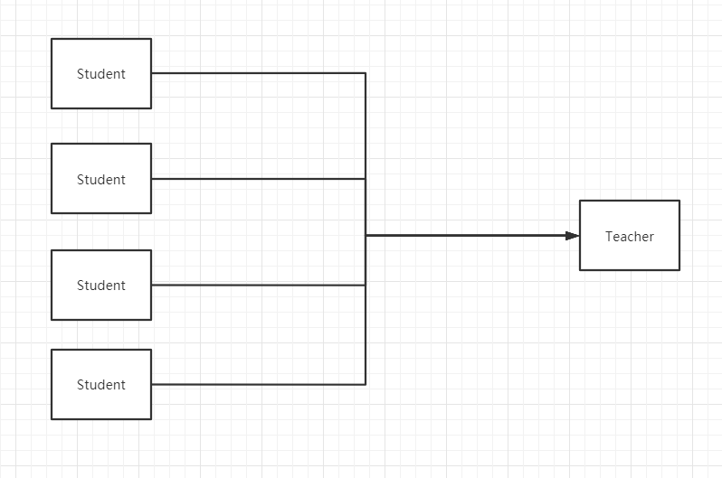

# 1. 简介

## 1.1 什么是MyBatis


* MyBatis 是一款优秀的**持久层框架**；
* 它支持自定义 SQL、存储过程以及高级映射；
* MyBatis 免除了几乎所有的 JDBC 代码以及设置参数和获取结果集的工作；
* MyBatis 可以通过简单的 XML 或注解来配置和映射原始类型、接口和 Java POJO（Plain Old Java Objects，普通老式 Java 对象）为数据库中的记录。


## 1.2 持久层

数据持久化

* 持久化就是将程序的数据再持久状态和瞬时状态转化的过程；
* 内存：**断电易失**；
* 数据库（ jdbc ），IO 文件持久化；
* 生活：冷藏，罐头。

为什么需要持久化？

* 有些对象信息，不能让它遗失；

* 内存价格相比磁盘过于昂贵。


## 1.3 持久层

Dao 层，Service 层， Controller 层

* 完成持久化工作的代码块；
* 层界限十分明显。


## 1.4 为什么需要 MyBatis？

* 帮助程序员将数据存入到数据库中；
* 方便；
* 传统的 JDBC 代码太复杂了，需要简化。引出了相关框架。
* 优点：
  * 简单易学
  * 灵活
  * SQL 和代码的分离，提高了可维护性
  * 提供映射标签，支持对象与数据库的 ORM 字段关系映射
  * 提供对象关系映射标签，支持对象关系组件维护
  * 提供 XML 标签，支持编写动态 SQL


# 2. 第一个 MyBatis 程序

思路：搭建环境 --> 导入 MyBatis --> 编写代码 --> 测试！


## 2.1 搭建环境

搭建数据库

```sql
CREATE DATABASE `mybatis`;

USE `mybatis`;

CREATE TABLE `user`(
	`id` INT NOT NULL PRIMARY KEY,
    `name` varchar(30)  default null,
    `pwd` VARCHAR(30) DEFAULT NULL
)ENGINE=INNODB DEFAULT CHARSET=utf8;

INSERT INTO `user` (`id`, `name`, `pwd`) VALUES
(1, 'jay', '123456'),
(2, 'wu', '123456'),
(3, 'lily', '123456');
```


新建项目

* 新建一个Maven项目
* 删除 src 目录
* 创建子 module
* 添加依赖


## 2.2 创建一个模板

* 编写 MyBatis 的核心配置文件

  ```sql
  <?xml version="1.0" encoding="UTF-8" ?>
  <!DOCTYPE configuration
          PUBLIC "-//mybatis.org//DTD Config 3.0//EN"
          "http://mybatis.org/dtd/mybatis-3-config.dtd">
  <configuration>
      <environments default="development">
          <environment id="development">
              <transactionManager type="JDBC"/>
              <dataSource type="POOLED">
                  <property name="driver" value="com.mysql.cj.jdbc.Driver"/>
                  <property name="url" value="jdbc:mysql://localhost:3306/mybatis?useSSL=false&amp;useUnicode=true&amp;characterEncoding=UTF-8"/>
                  <property name="username" value="root"/>
                  <property name="password" value="123456"/>
              </dataSource>
          </environment>
      </environments>
  
  </configuration>
  ```


* 编写 MyBatis 工具类

```Java
// sqlSessionFactory --> sqlSession
public class MybatisUtils {

    private static SqlSessionFactory sqlSessionFactory;

    static {
        try {
            // step1: get sqlSessionFactory instance
            String resource = "mybatis-config.xml";
            InputStream inputStream = Resources.getResourceAsStream(resource);
            sqlSessionFactory = new SqlSessionFactoryBuilder().build(inputStream);
        } catch (IOException e) {
            e.printStackTrace();
        }
    }

    // 既然有了 SqlSessionFactory，顾名思义，我们可以从中获得 SqlSession 的实例。
    // SqlSession 提供了在数据库执行 SQL 命令所需的所有方法
    public static SqlSession getSqlSession() {
        return sqlSessionFactory.openSession();
    }
    
}

```


## 2.3 编写代码

* 实体类

```Java
public class User {
    private int id;
    private String name;
    private String pwd;

    public User() {
    }

    public User(int id, String name, String pwd) {
        this.id = id;
        this.name = name;
        this.pwd = pwd;
    }

    public int getId() {
        return id;
    }

    public void setId(int id) {
        this.id = id;
    }

    public String getName() {
        return name;
    }

    public void setName(String name) {
        this.name = name;
    }

    public String getPwd() {
        return pwd;
    }

    public void setPwd(String pwd) {
        this.pwd = pwd;
    }

    @Override
    public String toString() {
        return "User{" +
                "id=" + id +
                ", name='" + name + '\'' +
                ", pwd='" + pwd + '\'' +
                '}';
    }
}

```


* Dao 接口

```Java
public interface UserMapper {
    List<User> getUserList();
}
```


* 接口实现类
  * 由原先的 UserMapperImpl转化为 Mapper 配置文件

```xml
<?xml version="1.0" encoding="UTF-8" ?>
<!DOCTYPE mapper
        PUBLIC "-//mybatis.org//DTD Mapper 3.0//EN"
        "http://mybatis.org/dtd/mybatis-3-mapper.dtd">
<mapper namespace="com.jay.mapper.UserMapper">
    <select id="getUserList" resultType="com.jay.pojo.User">
        SELECT * FROM mybatis.user;
    </select>

</mapper>
```


## 2.4 测试

注意点： mapper 没有在 MyBatis 核心配置文件中注册

```
org.apache.ibatis.binding.BindingException: Type interface com.jay.mapper.UserMapper is not known to the MapperRegistry.
```

可能会遇见的问题：

1. 配置文件没有注册；
2. 绑定接口错误；
3. 方法名不对；
4. 返回类型不对；
5. Maven 导出资源问题


# 3. CRUD

## 3.1 namespace

namespace 中的包名要和 Dao/mapper 接口的包名一致！


## 3.2 SELECT

选择，查询语句：

* id：就是对应的 namespace 中的方法名；
* resultType：SQL 语句执行的返回值；
* parameterType：参数类型。


1. 编写接口；

```Java
// get user by id
User getUserById(int id);
```


2. 编写对应的 mapper 中的 SQL 语句；

```xml
<select id="getUserById" parameterType="int" resultType="com.jay.pojo.User">
    SELECT * FROM mybatis.user WHERE id = #{id}
</select>
```


3. 测试。

```Java
@Test
public void getUserById() {

    try (SqlSession sqlSession = MybatisUtils.getSqlSession()) {
        UserMapper mapper = sqlSession.getMapper(UserMapper.class);

        User user = mapper.getUserById(1);
        System.out.println(user);

    }	// close sqlSession
}
```


## 3.3 INSERT

```xml
<insert id="addUser" parameterType="com.jay.pojo.User">
    INSERT INTO mybatis.user (id, name, pwd) VALUES (#{id}, #{name}, #{pwd});
</insert>
```


## 3.4 UPDATE

```xml
<update id="updateUser" parameterType="com.jay.pojo.User">
    update mybatis.user set name = #{name}, pwd=#{pwd} where id=#{id};
</update>
```


## 3.5 DELETE

```xml
<delete id="deleteUser" parameterType="int">
    delete from mybatis.user where id = #{id};
</delete>
```


注意：

* 增删改需要提交事务！


## 3.6 分析错误

* 标签不要匹配错；
* resource 绑定 mapper， 需要使用路径；
* 程序配置文件必须符合规范；
* NullPointerException，没有找到注册资源；
* 输出的 xml 文件中存在中文乱码问题；
* maven 资源没有到处问题；


## 3.7 万能的 Map

假设，我们的实体类，或者数据库中的表，字段或者参数过多，我们应当考虑使用 Map。

```Java
int addUser2(Map<String, Object> map);
```


```XML
<!--    pass key of map-->
<insert id="addUser2" parameterType="map">
    insert into mybatis.user (id, pwd) values (#{userid}, #{password});
</insert>
```


```java
@Test
public void addUser2() {
    try (SqlSession sqlSession = MybatisUtils.getSqlSession()) {
        UserMapper mapper = sqlSession.getMapper(UserMapper.class);
        Map<String, Object> map = new HashMap<>();
        map.put("userid", 5);
        map.put("userName", "peter");
        map.put("password", "111222");
        mapper.addUser2(map);

        sqlSession.commit();
    }
}
```


* Map 传递的参数，直接在 SQL 中取出 Key 即可；
* 对象传递参数，直接在 SQL 中取对象的属性即可；
* 只有一个基本参数类型的情况下，可以直接在 SQL 中取到；
* 多个参数用 Map， **或者注解**。


## 3.8 拓展思考

模糊查询怎么写？

1. Java 代码执行时，传递通配符 `%ja%`

   ```Java
    List<User> users = mapper.getUserLike("%ja%");
   ```

   

2. 在 SQL 拼接中使用通配符

   ```SQl
   select * from mybatis.user where name like concat('%', #{value}, '%'); 
   ```

   

# 4. 配置解析

## 4.1 核心配置文件

* mybatis-config.xml
* MyBatis 的配置文件包含了会深深影响 MyBatis 行为的设置和属性信息；

```
configuration（配置）
	properties（属性）
	settings（设置）
	typeAliases（类型别名）
	typeHandlers（类型处理器）
    objectFactory（对象工厂）
    plugins（插件）
    environments（环境配置）
        environment（环境变量）
            transactionManager（事务管理器）
            dataSource（数据源）
    databaseIdProvider（数据库厂商标识）
    mappers（映射器）
```


## 4.2 环境配置（environments）

MyBatis 可以配置成适应多种环境

**不过要记住：尽管可以配置多个环境，但每个 SqlSessionFactory 实例只能选择一种环境。**


MyBatis 默认的事务管理器就是 JDBC， 连接池是 POOLED


```XML
<environments default="development">
    <environment id="development">
        <transactionManager type="JDBC"/>
        <dataSource type="POOLED">
            <property name="driver" value="com.mysql.cj.jdbc.Driver"/>
            <property name="url"
                      value="jdbc:mysql://localhost:3306/mybatis?useSSL=false&amp;useUnicode=true&amp;characterEncoding=UTF-8"/>
            <property name="username" value="root"/>
            <property name="password" value="123456"/>
        </dataSource>
    </environment>

</environments>
```


## 4.3 属性（properties）

我们可以通过 properties 属性来实现引用配置文件

这些属性可以在外部进行配置，并可以进行动态替换。你既可以在典型的 Java 属性文件中配置这些属性，也可以在 properties 元素的子元素中设置。[db.properties]

编写一个数据库配置文件 `db.properties`

```properties
driver=com.mysql.cj.jdbc.Driver
url=jdbc:mysql://localhost:3306/mybatis?useSSL=false&useUnicode=true&characterEncoding=UTF-8
username=root
password=123456
```

注意，properties 标签必须按照 configuration 中的顺序写：

```log
The content of element type "configuration" must match "(properties?,settings?,typeAliases?,typeHandlers?,objectFactory?,objectWrapperFactory?,reflectorFactory?,plugins?,environments?,databaseIdProvider?,mappers?)".
```

在核心配置文件中引入：

```xml
<!--import properties -->
<properties resource="db.properties">
    <property name="username" value="root"/>
    <property name="password" value="123456"/>
</properties>
```

* 可以直接引入外部文件；
* 可以在其中增加一些属性配置；
* 如果两个文件有同一个字段，优先使用外部配置文件的值；


## 4.4 类型别名（typeAliases）

* 类型别名可为 Java 类型设置一个缩写名字；
* 意在降低冗余的全限定类名书写。

```XMl
<!--alias User-->
<typeAliases>
    <typeAlias type="com.jay.pojo.User" alias="User"/>
</typeAliases>
```

也可以指定一个包名，MyBatis 会在包名下面搜索需要的 Java Bean，比如：

每一个在包 `com.jay.pojo` 中的 Java Bean，在没有注解的情况下，会使用 Bean 的首字母小写的非限定类名来作为它的别名。

```XML
<!--alias User-->
<typeAliases>
    <package name="com.jay.pojo"/>
</typeAliases>
```

在实体类比较少的时候，使用第一种方式，可以自定义别名；

在实体类十分多的时候，使用第二种方式，不可以自定义别名，但可通过注解的方式起别名；

```Java
@Alias("user")
public class User {
    ...
}
```


## 4.5 设置（settings）

这是 MyBatis 中极为重要的调整设置，它们会改变 MyBatis 的运行时行为。 

| 设置名             | 描述                                                         | 有效值        | 默认值 |
| :----------------- | :----------------------------------------------------------- | :------------ | :----- |
| cacheEnabled       | 全局性地开启或关闭所有映射器配置文件中已配置的任何缓存。     | true \| false | true   |
| lazyLoadingEnabled | 延迟加载的全局开关。当开启时，所有关联对象都会延迟加载。 特定关联关系中可通过设置 `fetchType` 属性来覆盖该项的开关状态。 | true \| false | false  |


## 4.6 其他配置

- typeHandlers（类型处理器）
- objectFactory（对象工厂）
- plugins（插件）
  - mybatis-generator-core
  - mybatis-plus
  - 通用 mapper


## 4.7 映射器（mappers）

MapperRegistry：注册 Mapper 文件；

方式一：

```XML
<!-- for each Mapper.xml, we should register it in mybatis core configuration file -->
<mappers>
    <mapper resource="com/jay/mapper/UserMapper.xml"/>
</mappers>
```

方式二：使用 class 文件绑定注册

```xml
<!-- for each Mapper.xml, we should register it in mybatis core configuration file -->
<mappers>
    <mapper class="com.jay.mapper.UserMapper"/>
</mappers>
```
注意：

* 接口和它的 Mapper 配置文件必须同名；
* 接口和它的 Mapper 配置文件必须在同一个包下；


方式三：使用包扫描进行注册绑定

```XML
<!-- for each Mapper.xml, we should register it in mybatis core configuration file -->
<mappers>
    <package name="com.jay.mapper"/>
</mappers>
```
注意：

* 接口和它的 Mapper 配置文件必须同名；
* 接口和它的 Mapper 配置文件必须在同一个包下；


## 4.8 作用域（Scope）和生命周期

理解我们之前讨论过的不同作用域和生命周期类别是至关重要的，因为错误的使用会导致非常严重的**并发问题**。


 **SqlSessionFactoryBuilder**：

* 一旦创建了 SqlSessionFactory，就不再需要它了；
* 局部变量

**SqlSessionFactory**：

* 和数据库连接池的作用类似； 
* SqlSessionFactory 一旦被创建就应该在应用的运行期间一直存在，**没有任何理由丢弃它或重新创建另一个实例**；
* SqlSessionFactory 的最佳作用域是应用作用域；
* 最简单的就是使用**单例模式**或者静态单例模式。

**SqlSession**：

* 连接到连接池的某个请求类似；
* 每个线程都应该有它自己的 SqlSession 实例；
* SqlSession 的实例不是线程安全的，因此是不能被共享的，所以它的最佳的作用域是请求或方法作用域；
* 用完之后关闭，减少资源占用。


这里的每个 Mapper 对应的都是某个具体业务。


# 5. 解决属性名和字段名不一致的问题

## 5.1 问题

数据库中的字段


创建一个新的 module，和之前的 module 除了实体类字段有区别之外，均一致。

```Java
public class User {
    private int id;
    private String name;
    private String password;
   	
   	...
}
```


测试出现问题：


```Java
//  SELECT * FROM mybatis.user WHERE id = #{id}
// TypeHandler
// select id, name, pwd from mybatis.user where id = #{id}
```


解决方法：

* 起别名

```XML
<select id="getUserById" parameterType="int" resultType="com.jay.pojo.User">
    SELECT id, name, pwd as password FROM mybatis.user WHERE id = #{id}
</select>
```


## 5.2 resultMap

结果集映射

```
id	name	pwd
id	name	password
```


```xml
<resultMap id="UserMap" type="User">
    <!-- column <==> database  -->
    <!-- property <==> pojo class field-->
    <result column="id" property="id"/>
    <result column="name" property="name"/>
    <result column="pwd" property="password"/>
</resultMap>

<select id="getUserById" resultMap="UserMap">
    SELECT * FROM mybatis.user WHERE id = #{id}
</select>
```


* `resultMap` 元素是 MyBatis 中最重要最强大的元素。
* ResultMap 的设计思想是，对简单的语句做到零配置，对于复杂一点的语句，只需要描述语句之间的关系就行了。
*  `ResultMap` 的优秀之处——你完全可以不用显式地配置它们。




# 6. 日志

## 6.1 日志工厂

如果一个数据库操作出现了异常，需要对它进行排错。

* sout
* debug
* 日志就是最好的助手！


MyBatis 支持的日志，在设置中设定具体使用哪个日志。

* **SLF4J**
* **LOG4J** 
* LOG4J2 
* JDK_LOGGING 
* COMMONS_LOGGING 
* **STDOUT_LOGGING** 
* NO_LOGGING


**STDOUT_LOGGING** 标准日志输出：

在 MyBatis 核心配置文件中，配置日志：

```xml
<settings>
    <setting name="logImpl" value="STDOUT_LOGGING"/>
</settings>
```

日志输出：

```log
Opening JDBC Connection
Created connection 224100622.
Setting autocommit to false on JDBC Connection [com.mysql.cj.jdbc.ConnectionImpl@d5b810e]
==>  Preparing: SELECT * FROM mybatis.user WHERE id = ?
==> Parameters: 3(Integer)
<==    Columns: id, name, pwd
<==        Row: 3, lily, 123456
<==      Total: 1
User{id=3, name='lily', password='123456'}
Resetting autocommit to true on JDBC Connection [com.mysql.cj.jdbc.ConnectionImpl@d5b810e]
Closing JDBC Connection [com.mysql.cj.jdbc.ConnectionImpl@d5b810e]
Returned connection 224100622 to pool.
```


## 6.2 slf4j 和 logback

* 


# 7. 分页

**思考：为什么要分页？**

* 减少数据的处理量


## 7.1 使用 limit 分页

SQL 语法：

``` sql
SELECT * FROM user LIMIT startIndex, pageSize;
SELECT * FROM user LIMIT 3;		#[0, n]
```


使用 MyBatis 实现分页，核心 SQL：

1. 接口；

```Java
// page limit
List<User> getUserByLimit(Map<String, Integer> map);
```

2. Mapper.xml

```XML
<select id="getUserByLimit" parameterType="map" resultMap="UserMap">
    SELECT * FROM mybatis.user LIMIT #{startIndex}, #{pageSize}
</select>
```
3. 测试

```Java
@Test
public void getUserByLimit() {
    try (SqlSession sqlSession = MybatisUtils.getSqlSession()) {
        UserMapper mapper = sqlSession.getMapper(UserMapper.class);
        Map<String, Integer> map = new HashMap<>();
        map.put("startIndex", 1);
        map.put("pageSize", 3);
        List<User> users = mapper.getUserByLimit(map);

        users.forEach(System.out::println);
    }
}
```


## 7.2 使用 RowBounds 分页

不再使用 SQL 实现分页（不常用）

1. 接口

```Java
// page limit by row bounds
List<User> getUserByRowBounds(Map<String, Integer> map);
```
2. Mapper.xml

```xml
<select id="getUserByRowBounds" resultMap="UserMap">
    SELECT * FROM mybatis.user
</select>
```
3. 测试

```Java
@Test
public void getUserByRowBounds() {
    try (SqlSession sqlSession = MybatisUtils.getSqlSession()) {
        RowBounds rowBounds = new RowBounds(1, 2);
        List<User> users = sqlSession.selectList("com.jay.mapper.UserMapper.getUserByRowBounds", null, rowBounds);

        users.forEach(System.out::println);

    }
}
```


## 7.3 分页插件


了解即可，详细使用参照 [官网使用文档](https://pagehelper.github.io/docs/howtouse/)


# 8. 使用注解开发

## 8.1 面向接口编程

- 大家之前都学过面向对象编程，也学习过接口，但在真正的开发中，很多时候我们会选择面向接口编程
- **根本原因 :  解耦 , 可拓展 , 提高复用 , 分层开发中 , 上层不用管具体的实现 , 大家都遵守共同的标准 , 使得开发变得容易 , 规范性更好**
- 在一个面向对象的系统中，系统的各种功能是由许许多多的不同对象协作完成的。在这种情况下，各个对象内部是如何实现自己的,对系统设计人员来讲就不那么重要了；
- 而各个对象之间的协作关系则成为系统设计的关键。小到不同类之间的通信，大到各模块之间的交互，在系统设计之初都是要着重考虑的，这也是系统设计的主要工作内容。面向接口编程就是指按照这种思想来编程。


**关于接口的理解**

- 接口从更深层次的理解，应是定义（规范，约束）与实现（名实分离的原则）的分离。

- 接口的本身反映了系统设计人员对系统的抽象理解。

- 接口应有两类：

- - 第一类是对一个个体的抽象，它可对应为一个抽象体（abstract class）；
  - 第二类是对一个个体某一方面的抽象，即形成一个抽象面（interface）；

- 一个体有可能有多个抽象面。抽象体与抽象面是有区别的。


**三个面向区别**

- 面向对象是指，我们考虑问题时，以对象为单位，考虑它的属性及方法 .
- 面向过程是指，我们考虑问题时，以一个具体的流程（事务过程）为单位，考虑它的实现 .
- 接口设计与非接口设计是针对复用技术而言的，与面向对象（过程）不是一个问题.更多的体现就是对系统整体的架构


## 8.2 使用注解开发

1. 注解在接口上实现

   ```Java
   @Select("select * from user")
   List<User> getUsers();
   ```

2. 需要在核心配置文件中绑定接口！

   ```xml
   <!-- bind interface -->
   <mappers>
       <mapper class="com.jay.mapper.UserMapper"/>
   </mappers>
   ```

3. 测试

   ```Java
   @Test
   public void getUsers() {
       try (SqlSession sqlSession = MybatisUtils.getSqlSession()) {
           // using reflect
           UserMapper mapper = sqlSession.getMapper(UserMapper.class);
           List<User> users = mapper.getUsers();
   
           users.forEach(System.out::println);
       }
   }
   ```


本质：反射机制实现。

底层：动态代理。


**MyBatis 详细的执行流程！**


## 8.3 CRUD

我们可以在工具类创建的时候实现自动提交事务！

```Java
public static SqlSession getSqlSession() {
    return sqlSessionFactory.openSession(true);
}
```


编写接口，增加注解；

``` Java
public interface UserMapper {

    @Select("select * from user")
    List<User> getUsers();

    // @Param("") should be added before every all parameters
    @Select("select * from user where id = #{id}")
    User getUserById(@Param("id") int id);

    @Insert("insert into user (id, name, pwd) values (#{id}, #{name}, #{password})")
    int addUser(User user);

    @Update("update user set name=#{name}, pwd=#{password} where id=#{id}")
    int updateUser(User user);

    @Delete("delete from user where id=#{uid}")
    int deleteUser(@Param("uid") int id);
}
```


测试类

``` Java
    @Test
    public void getUsers() {
        try (SqlSession sqlSession = MybatisUtils.getSqlSession()) {
            // using reflect
            UserMapper mapper = sqlSession.getMapper(UserMapper.class);
            List<User> users = mapper.getUsers();

            users.forEach(System.out::println);
        }
    }

    @Test
    public void getUserById() {
        try (SqlSession sqlSession = MybatisUtils.getSqlSession()) {
            // using reflect
            UserMapper mapper = sqlSession.getMapper(UserMapper.class);
            User user = mapper.getUserById(1);

            System.out.println(user);
        }
    }


    @Test
    public void addUser() {
        try (SqlSession sqlSession = MybatisUtils.getSqlSession()) {
            UserMapper mapper = sqlSession.getMapper(UserMapper.class);
            mapper.addUser(new User(6, "peter", "123123"));

        }
    }

    @Test
    public void updateUser() {
        try (SqlSession sqlSession = MybatisUtils.getSqlSession()) {
            UserMapper mapper = sqlSession.getMapper(UserMapper.class);

            mapper.updateUser(new User(6, "alice", "123456"));
        }
    }

    @Test
    public void deleteUser() {
        try (SqlSession sqlSession = MybatisUtils.getSqlSession()) {
            UserMapper mapper = sqlSession.getMapper(UserMapper.class);

            mapper.deleteUser(6);
        }
    }

```


注意：我们必须将接口注册绑定到核心配置文件中。


关于 **@Param("uid")** 注解：

* 基本类型的参数或者 String 类型的参数，需要加上；
* 引用类型不需要加；
* 如果只有一个基本类型的话，可以忽略，但是建议都加上；
* 在 SQL 语句中引用的就是此处 `@Param("uid")` 设定的属性名。


#{} ${} 的区别 `#{}` 是预编译，可以防止 SQL 注入， `${}` 是普通执行 SQL 的方式，建议使用 `#{}`


# 9. Lombok

## 9.1 Project Lombok

Project Lombok is a java library that automatically plugs into your editor and build tools, spicing up your java.
Never write another getter or equals method again, with one annotation your class has a fully featured builder, Automate your logging variables, and much more.

* Java library
* Plugin
* Build tools
* With one annotation


# 10. 多对一处理

多对一：


* 多个学生，对应一个老师
* 对于学生而言，关联... 多个学生关联一个老师 【多对一】
* 对于老师而言，集合，一个老师有很多学生【一对多】


SQL：

``` sql
CREATE TABLE `teacher` (
	`id` INT(10) NOT NULL,
    `name` VARCHAR(30) DEFAULT NULL,
    PRIMARY KEY (`id`)
) ENGINE=INNODB DEFAULT CHARSET=utf8;

INSERT INTO teacher(`id`, `name`) VALUES (1, 'Teacher Wu');

CREATE TABLE `student` (
	`id` INT(10) NOT NULL,
    `name` VARCHAR(30) DEFAULT NULL,
    `tid` INT(10) DEFAULT NULL,
    PRIMARY KEY (`id`),
    KEY `fktid` (`tid`),
    CONSTRAINT `fktid` FOREIGN KEY (`tid`) REFERENCES `teacher` (`id`)
)ENGINE=INNODB DEFAULT CHARSET=utf8;

INSERT INTO `student` (`id`, `name`, `tid`) VALUES ('1', 'jay', '1');
INSERT INTO `student` (`id`, `name`, `tid`) VALUES ('2', 'bob', '1');
INSERT INTO `student` (`id`, `name`, `tid`) VALUES ('3', 'lily', '1');
INSERT INTO `student` (`id`, `name`, `tid`) VALUES ('4', 'peter', '1');
INSERT INTO `student` (`id`, `name`, `tid`) VALUES ('5', 'alice', '1');
```


## 10.1 测试环境搭建

1. 导入 Lombok
2. 新建实体类 Teacher，Student
3. 建立 Mapper 接口
4. 建立 Mapper.xml 文件
5. 在核心配置文件中绑定注册我们的 Mapper 接口或者文件！
6. 测试查询是否成功！


## 10.2 按照查询嵌套处理

```XML
<!--
    1: query all students informations
    2. query corresponding teacher by tid of student
-->

<select id="getStudent" resultMap="studentTeacher">
    select * from student;
</select>

<resultMap id="studentTeacher" type="Student">
    <result property="id" column="id"/>
    <result property="name" column="name"/>
    <!-- for complicated property, we should handle it in other way:
     association    <==> instance
     collection     <==> collection
    -->
    <association property="teacher" column="tid" javaType="teacher" select="getTeacher"/>
</resultMap>

<select id="getTeacher" resultType="teacher">
    select * from teacher where id = #{id}
</select>
```
这种方式虽然很简单，但在大型数据集或大型数据表上表现不佳。这个问题被称为“N+1 查询问题”。 概括地讲，N+1 查询问题是这样子的：

- 你执行了一个单独的 SQL 语句来获取结果的一个列表（就是“+1”）。
- 对列表返回的每条记录，你执行一个 select 查询语句来为每条记录加载详细信息（就是“N”）。

这个问题会导致成百上千的 SQL 语句被执行。有时候，我们不希望产生这样的后果。

## 10.3 按照结果嵌套处理

```XML
<select id="getStudent2" resultMap="studentTeacher2">
    select s.id as sid, s.name as sname, t.name as tname
    from student s, teacher t
    where s.tid = t.id
</select>

<resultMap id="studentTeacher2" type="Student">
    <result property="id" column="sid"/>
    <result property="name" column="sname"/>
    <association property="teacher" javaType="Teacher">
        <result property="name" column="tname"/>
    </association>
</resultMap>
```


## 10.4 回顾 MySQL 多对一查询方式：

* 子查询；
* 联表查询


# 11. 一对多处理

比如：一个老师拥有多个学生！

对于老师而言，就是一对多的关系！


## 11.1 环境搭建

实体类：

```Java
@Data
public class Teacher {
    private int id;
    private String name;

    // a teacher should collect several students
    private List<Student> students;
}
```


``` Java
@Data
public class Student {
    private int id;
    private String name;
}
```


## 11.2 按照查询嵌套处理

```xml
<select id="getTeacher2" resultMap="teacherStudentMap2">
    select * from mybatis.teacher where id = #{tid}
</select>

<resultMap id="teacherStudentMap2" type="teacher">
    <result property="id" column="id"/>
    <result property="name" column="name"/>
    <collection property="students" ofType="Student" select="getStudent" column="id"/>
</resultMap>

<select id="getStudent" resultType="Student">
    select *
    from mybatis.student
    where tid=#{tid}
</select>
```


## 11.3 按照结果嵌套处理

```xml
<select id="getTeachers" resultType="teacher">
    select * from mybatis.teacher
</select>

<select id="getTeacher" resultMap="teacherStudentMap">
    select s.id as sid, s.name as sname, t.name as tname, t.id as tid
    from student as s,
        teacher as t
    where s.tid = t.id
    and t.id = #{tid};
</select>

<resultMap id="teacherStudentMap" type="teacher">
    <id property="id" column="tid"/>
    <result property="id" column="tid"/>
    <result property="name" column="tname"/>
    <collection property="students" ofType="Student">
        <result property="id" column="sid"/>
        <result property="name" column="sname"/>
    </collection>
</resultMap>
```


## 11.4 小结

1. 关联 - association 【多对一】
2. 集合 - collection 【一对多】
3. javaType vs. ofType
   1. JavaType：用来指定实体类中属性的类型；
   2. ofType：用来指定映射到 List 或者集合中的实体类，泛型中的约束类型；


注意点：

* 保证 SQL 的可读性，尽量保证通俗易懂
* 注意一对多和一对多中，属性名和字段的问题！
* 如果问题不好排查，可以使用日志，建议使用 SLF4J 日志。


面试高频：

* MySQL 引擎；
* InnoDB 底层原理；
* 索引；
* 索引优化。


# 12. 动态 SQL

==**什么是动态 SQL：动态 SQL 就是根据不同的条件生成不同的 SQL 语句。**==


```
如果你之前用过 JSTL 或任何基于类 XML 语言的文本处理器，你对动态 SQL 元素可能会感觉似曾相识。在 MyBatis 之前的版本中，需要花时间了解大量的元素。借助功能强大的基于 OGNL 的表达式，MyBatis 3 替换了之前的大部分元素，大大精简了元素种类，现在要学习的元素种类比原来的一半还要少。

if
choose (when, otherwise)
trim (where, set)
foreach
```


## 12.1 搭建环境

``` sql
CREATE TABLE `blog` (
	`id` VARCHAR(50) NOT NULL COMMENT '博客 id',
    `title` VARCHAR(100) NOT NULL COMMENT '博客标题',
    `author` VARCHAR(30) NOT NULL COMMENT '博客作者',
    `create_time` DATETIME NOT NULL COMMENT '创建时间',
    `views` INT(30) NOT NULL COMMENT '浏览量'
) ENGINE=INNODB DEFAULT CHARSET=utf8;
```


创建一个基础工程

1. 导入包；

2. 编写配置文件；

3. 编写实体类；

   ```java
   @Data
   public class Blog {
       private int id;
       private String title;
       private String author;
       private LocalDate createTime;
       private int views;
   }
   ```

   

4. 编写实体类对应 Mapper接口和 Mapper.xml 文件


## 12.2 IF

1. 配置接口

``` Java
// query
List<Blog> queryBlogIF(Map<String, Object> map);
```

2. Mapper.xml 添加 `if`

```XML
<select id="queryBlogIF" parameterType="map" resultType="blog">
    select *
    from mybatis.blog
    where 1 = 1
    <if test="title != null">
        and title like #{title}
    </if>
    <if test="author !=null">
        and author=#{author}
    </if>
</select>
```

3. 测试

```Java
@Test
public void queryBlogIF() {
    try (SqlSession sqlSession = MybatisUtils.getSqlSession()) {
        BlogMapper mapper = sqlSession.getMapper(BlogMapper.class);
        Map<String, Object> map = new HashMap<>();
        map.put("title", "Easy%");
        map.put("author", "Jay Wu");

        List<Blog> blogs = mapper.queryBlogIF(map);
        blogs.forEach(System.out::println);
    }
}
```


## 12.3 choose ( when, otherwise)

有时候，我们不想使用所有的条件，而只是想从多个条件中选择一个使用。针对这种情况，MyBatis 提供了 choose 元素，它有点像 Java 中的 switch 语句。

```xml
<select id="queryBlogChoose" parameterType="map" resultType="blog">
    select *
    from mybatis.blog
    where
    <choose>
        <when test="title != null">
            title like #{title}
        </when>
        <when test="author != null">
            and author=#{author}
        </when>
        <otherwise>
            and views=9999
        </otherwise>
    </choose>
</select>
```
如果 `<when test="title != null">` 未匹配而 `<when test="author != null">` 匹配成功，SQL 语句会变成：

``` SQL
select * from mybatis.blog
where
and author= 'Jay Wu'
```


这样的查询语句存在语法问题，因此需要引入 `<where>` 标签。

## 12.4  trim (where, set)

where：*where* 元素只会在子元素返回任何内容的情况下才插入 “WHERE” 子句。而且，若子句的开头为 “AND” 或 “OR”，*where* 元素也会将它们去除。

```xml
<select id="queryBlogWhere" parameterType="map" resultType="blog">
    select * from mybatis.blog
    <where>
        <choose>
            <when test="title != null">
                title like #{title}
            </when>
            <when test="author != null">
                author = #{author}
            </when>
            <otherwise>
                views=9999
            </otherwise>
        </choose>
    </where>
</select>
```


set：*set* 元素会动态地在行首插入 SET 关键字，并会删掉额外的逗号（这些逗号是在使用条件语句给列赋值时引入的）。

```XML
<select id="updateBlog" parameterType="map">
    update mybatis.blog
    <set>
        <if test="title != null">
            title = #{title},
        </if>
        <if test="author != null">
            author = #{author}
        </if>
    </set>
    where id = #{id}
</select>
```


trim： 可以通过自定义 trim 元素来定制 *where* 或 *set* 元素的功能。

* 与 *where* 元素等价的自定义 trim 元素为：

```XML
<trim prefix="WHERE" prefixOverrides="AND |OR ">
  ...
</trim>
```

* 与 *set* 元素等价的自定义 *trim* 元素为：

```XML
<trim prefix="SET" suffixOverrides=",">
  ...
</trim>
```


**所谓的动态 SQL，本质上还是 SQL 语句，只是我们可以在 SQL 层面，执行一些逻辑代码**


## 12.5 foreach


``` SQL
select * from user where 1=1 and (id=1 or id=2 or id=3)
```

动态 SQL 的另一个常见使用场景是对集合进行遍历（尤其是在构建 IN 条件语句的时候）。比如：

```xml
<select id="selectPostIn" resultType="domain.blog.Post">
  SELECT *
  FROM POST P
  WHERE ID in
  <foreach item="item" index="index" collection="list"
      open="(" separator="," close=")">
        #{item}
  </foreach>
</select>
```

*foreach* 元素的功能非常强大，它允许你指定一个集合，声明可以在元素体内使用的集合项（item）和索引（index）变量。它也允许你指定开头与结尾的字符串以及集合项迭代之间的分隔符。这个元素也不会错误地添加多余的分隔符，看它多智能！

**提示** 你可以将任何可迭代对象（如 List、Set 等）、Map 对象或者数组对象作为集合参数传递给 *foreach*。当使用可迭代对象或者数组时，index 是当前迭代的序号，item 的值是本次迭代获取到的元素。当使用 Map 对象（或者 Map.Entry 对象的集合）时，index 是键，item 是值。


``` XML
<select id="queryBlogForEach" parameterType="map" resultType="blog">
    select * from mybatis.blog
    <where>
        <foreach collection="ids" item="id" open="and (" separator="or" close=")">
            id=#{id}
        </foreach>
    </where>
</select>
```


==动态 SQL：在拼接 SQL 语句，我们只要保证 SQL 的正确性，按照 SQL 的格式，去排列组合即可==

建议：

* 先在 MySQL 中写出完整的 SQL，再对应的去修改成为我们的动态 SQL 实现通用即可。

## 12.6 SQL 片段

有的时候，我们可能会将一些公共的部分抽取出来，用于复用。

1. 使用 `sql` 标签抽取公共部分：

   ```sql
   <sql id="if-title-author">
       <if test="title != null">
           and title like #{title}
       </if>
       <if test="author !=null">
           and author=#{author}
       </if>
   </sql>
   ```

2. 在需要引用的地方，使用 `include` 标签导入：

   ```sql
   <select id="queryBlogIF" parameterType="map" resultType="blog">
       select *
       from mybatis.blog
       where 1 = 1
       <include refid="if-title-author"/>
   </select>
   ```


注意事项：

* 最好基于单表来定义 SQL 片段；
* 不要存在 `where` 标签


# 13. 缓存

## 13.1 简介

```
查询：	连接数据库，耗资源
	一次查询的结果，给他暂存在一个可以直接取到的地方！ --> 内存： 缓存
	
我们可以再次查询相同数据的时候，直接走缓存，就不用走数据库了
```


1. 什么是缓存 [ Cache ]？

   - 存在内存中的临时数据。
   - 将用户经常查询的数据放在缓存（内存）中，用户去查询数据就不用从磁盘上(关系型数据库数据文件)查询，从缓存中查询，从而提高查询效率，解决了高并发系统的性能问题。

2. 为什么使用缓存？

   - 减少和数据库的交互次数，减少系统开销，提高系统效率。

3. 什么样的数据能使用缓存？

   - 经常查询并且不经常改变的数据。【可以使用缓存】

     

## 13.2 Mybatis缓存

- MyBatis包含一个非常强大的查询缓存特性，它可以非常方便地定制和配置缓存。缓存可以极大的提升查询效率。
- MyBatis系统中默认定义了两级缓存：**一级缓存**和**二级缓存**
  - 默认情况下，只有一级缓存开启。（SqlSession级别的缓存，也称为本地缓存）

  - 二级缓存需要手动开启和配置，他是基于namespace级别的缓存。

  - 为了提高扩展性，MyBatis定义了缓存接口Cache。我们可以通过实现Cache接口来自定义二级缓存


## 13.3 一级缓存

- 一级缓存也叫本地缓存：  SqlSession
  - 与数据库同一次会话期间查询到的数据会放在本地缓存中。
  - 以后如果需要获取相同的数据，直接从缓存中拿，没必须再去查询数据库；


测试步骤：

1. 开启日志！
2. 分别在一个 Session 中测试查询两次相同和不同的记录

* 进行两次 `id` 值相同的查询操作：

  ``` Java
  @Test
  public void queryUserById() {
      try (SqlSession sqlSession = MybatisUtils.getSqlSession()) {
          UserMapper mapper = sqlSession.getMapper(UserMapper.class);
  
          User user = mapper.queryUserById(1);
          System.out.println(user);
          System.out.println("=========================");
          User user2 = mapper.queryUserById(1);
          System.out.println(user2);
      }
  }
  ```

  输出结果，可看出 SQL 查询语句仅执行了一次。第二次调用 `mapper.queryUserById(1)` 时使用了缓存。

  ``` log
  Opening JDBC Connection
  Created connection 402405659.
  ==>  Preparing: select * from mybatis.user where id = ?
  ==> Parameters: 1(Integer)
  <==    Columns: id, name, pwd
  <==        Row: 1, jay, 123456
  <==      Total: 1
  User(id=1, name=jay, pwd=123456)
  =========================
  User(id=1, name=jay, pwd=123456)
  Closing JDBC Connection [com.mysql.cj.jdbc.ConnectionImpl@17fc391b]
  ```

* 进行两次 `id` 值不同的查询操作：

  ``` Java
  @Test
  public void queryUserById() {
      try (SqlSession sqlSession = MybatisUtils.getSqlSession()) {
          UserMapper mapper = sqlSession.getMapper(UserMapper.class);
  
          User user = mapper.queryUserById(1);
          System.out.println(user);
          System.out.println("=========================");
          User user2 = mapper.queryUserById(2);
          System.out.println(user2);
      }
  }
  ```

  从输出结果可以看出，进行了两次 SQL 查询语句：

  ``` log
  Opening JDBC Connection
  Created connection 1082309267.
  ==>  Preparing: select * from mybatis.user where id = ?
  ==> Parameters: 1(Integer)
  <==    Columns: id, name, pwd
  <==        Row: 1, jay, 123456
  <==      Total: 1
  User(id=1, name=jay, pwd=123456)
  =========================
  ==>  Preparing: select * from mybatis.user where id = ?
  ==> Parameters: 2(Integer)
  <==    Columns: id, name, pwd
  <==        Row: 2, wu, 123456
  <==      Total: 1
  User(id=2, name=wu, pwd=123456)
  Closing JDBC Connection [com.mysql.cj.jdbc.ConnectionImpl@4082ba93]
  ```


缓存失效的情况：

1. 查询不同的 条目

2. 增删改操作，可能会改变原来的数据，所以必定会触发刷新缓存；

   ``` log
   Opening JDBC Connection
   Created connection 724608044.
   ==>  Preparing: select * from mybatis.user where id = ?
   ==> Parameters: 1(Integer)
   <==    Columns: id, name, pwd
   <==        Row: 1, jay, 123456
   <==      Total: 1
   User{id=1, name='jay', pwd='123456'}
   =========================
   ==>  Preparing: update mybatis.user set name=?, pwd=? where id = ?
   ==> Parameters: alice(String), 123123(String), 2(Integer)
   <==    Updates: 1
   =========================
   ==>  Preparing: select * from mybatis.user where id = ?
   ==> Parameters: 1(Integer)
   <==    Columns: id, name, pwd
   <==        Row: 1, jay, 123456
   <==      Total: 1
   User{id=1, name='jay', pwd='123456'}
   Closing JDBC Connection [com.mysql.cj.jdbc.ConnectionImpl@2b30a42c]
   ```

3. 查询不同的 Mapper.xml

4. 手动清理缓存

   ``` log
   Opening JDBC Connection
   Created connection 724608044.
   ==>  Preparing: select * from mybatis.user where id = ?
   ==> Parameters: 1(Integer)
   <==    Columns: id, name, pwd
   <==        Row: 1, jay, 123456
   <==      Total: 1
   User{id=1, name='jay', pwd='123456'}
   =========================
   sqlSesion.clearCache()
   =========================
   ==>  Preparing: select * from mybatis.user where id = ?
   ==> Parameters: 1(Integer)
   <==    Columns: id, name, pwd
   <==        Row: 1, jay, 123456
   <==      Total: 1
   User{id=1, name='jay', pwd='123456'}
   Closing JDBC Connection [com.mysql.cj.jdbc.ConnectionImpl@2b30a42c]
   ```


小结：一级缓存默认是开启的，只在一次 SqlSession 中有效，作用域在方法内。一级缓存就是一个 `ConcurrentHashMap`


## 13.4 二级缓存

- 二级缓存也叫全局缓存，一级缓存作用域太低了，所以诞生了二级缓存
- 基于 namespace 级别的缓存，一个名称空间，对应一个二级缓存；
- 工作机制
  - 一个会话查询一条数据，这个数据就会被放在当前会话的一级缓存中；
  - 如果当前会话关闭了，这个会话对应的一级缓存就没了；但是我们想要的是，会话关闭了，一级缓存中的数据被保存到二级缓存中；
  - 新的会话查询信息，就可以从二级缓存中获取内容；
  - 不同的 mapper 查出的数据会放在自己对应的缓存（map）中；


测试步骤：

1. 开启全局缓存

   ``` xml
   <settings>
       <setting name="cacheEnabled" value="true"/>
   </settings>
   ```

2. 在要使用二级缓存的 Mapper 中开启

   ``` XML
   <cache/>
   ```

   也可以自定义参数：

   ``` XML
   <cache eviction="FIFO"
          flushInterval="60000"
          size="512"
          readOnly="true"/>
   ```

3. 测试

   1. 如果没有设置 `readOnly="true"` ，需要将 `User` 实现 `Serializable` 接口，否则会报错。只读的缓存会给所有调用者返回缓存对象的相同实例。 因此这些对象不能被修改。这就提供了可观的性能提升。而可读写的缓存会（通过序列化）返回**缓存对象的深拷贝**。 速度上会慢一些，但是更安全，因此默认值是 false。


小结：

* 只要开启了二级缓存，在同一个 Mapper 下缓存生效；
* 所有的数据都会先放在一级缓存中；
* 只有当会话提交，或者关闭时，才会提交到二级缓存中。


13.5 缓存原理

缓存的顺序：

1. 先查询二级缓存是否命中相关条目，若未命中，
2. 再查看一级缓存是否命中相关条目，若未命中，
3. 最后查询数据库

