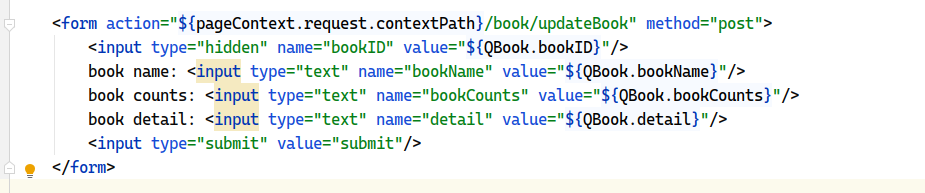
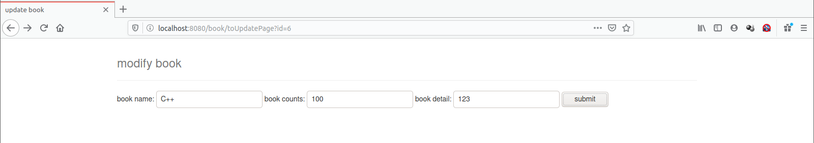
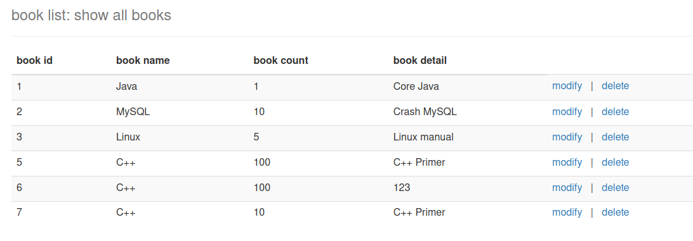
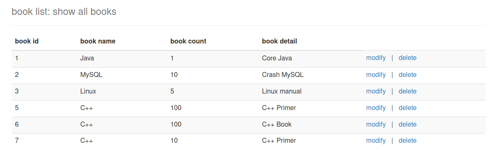
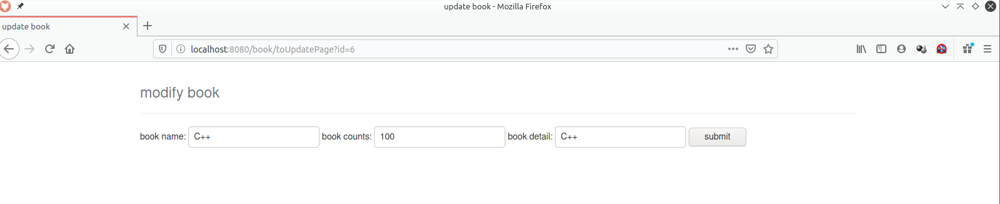
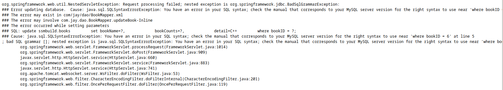
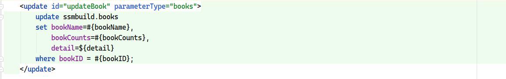

# SSM 框架整合

测试环境：

* IDEA
* MySQL  8.0
* Tomcat 9.0.36
* Maven 3.6.1


使用框架：

* Spring
* Spring MVC
* MaBatis


# 1. 创建 SQL 数据库

```mysql
CREATE DATABASE `ssmbuild`;

USE `ssmbuild`;

DROP TABLE IF EXISTS `books`;

CREATE TABLE `books` (
    `bookID` INT(10) NOT NULL AUTO_INCREMENT,
    `bookName` VARCHAR(100) NOT NULL,
    `bookCounts` INT(11) NOT NULL,
    `detail` VARCHAR(200) NOT NULL,
    KEY `bookID` (`bookID`)
)  ENGINE=INNODB DEFAULT CHARSET=UTF8;

INSERT INTO `books` (`bookID`, `bookName`, `bookCounts`, `detail`) VALUES
(1, 'Java', 1, 'Core Java'),
(2, 'MySQL', 10, 'Crash MySQL'),
(3, 'Linux', 5, 'Linux manual');
```


# 2. 搭建 SSM 环境

1. 新建 maven 项目，添加 web 支持；

2. 导入相关的 maven 依赖：

   ```xml
   <!-- junit, mysql connector, data source, jsp, mybatis, spring -->
   <dependencies>
       <!-- junit -->
       <dependency>
           <groupId>junit</groupId>
           <artifactId>junit</artifactId>
           <version>4.12</version>
       </dependency>
   
       <!-- mysql connector -->
       <dependency>
           <groupId>mysql</groupId>
           <artifactId>mysql-connector-java</artifactId>
           <version>8.0.20</version>
       </dependency>
   
       <!-- data source-->
       <dependency>
           <groupId>com.mchange</groupId>
           <artifactId>c3p0</artifactId>
           <version>0.9.5.2</version>
       </dependency>
   
       <!-- JSP -->
       <dependency>
           <groupId>javax.servlet</groupId>
           <artifactId>servlet-api</artifactId>
           <version>2.5</version>
       </dependency>
       <dependency>
           <groupId>javax.servlet.jsp</groupId>
           <artifactId>jsp-api</artifactId>
           <version>2.2</version>
       </dependency>
       <dependency>
           <groupId>javax.servlet</groupId>
           <artifactId>jstl</artifactId>
           <version>1.2</version>
       </dependency>
   
       <!--mybatis-->
       <dependency>
           <groupId>org.mybatis</groupId>
           <artifactId>mybatis</artifactId>
           <version>3.5.5</version>
       </dependency>
       <dependency>
           <groupId>org.mybatis</groupId>
           <artifactId>mybatis-spring</artifactId>
           <version>2.0.5</version>
       </dependency>
   
       <!-- spring -->
       <dependency>
           <groupId>org.springframework</groupId>
           <artifactId>spring-webmvc</artifactId>
           <version>5.2.7.RELEASE</version>
       </dependency>
       <dependency>
           <groupId>org.springframework</groupId>
           <artifactId>spring-jdbc</artifactId>
           <version>5.2.7.RELEASE</version>
       </dependency>
   
   </dependencies>
   ```

3. 解决 maven 资源过滤问题：

   ```xml
   <build>
       <resources>
           <resource>
               <directory>src/main/java</directory>
               <includes>
                   <include>**/*.properties</include>
                   <include>**/*.xml</include>
               </includes>
               <filtering>false</filtering>
           </resource>
           <resource>
               <directory>src/main/resources</directory>
               <includes>
                   <include>**/*.properties</include>
                   <include>**/*.xml</include>
               </includes>
               <filtering>false</filtering>
           </resource>
       </resources>
   </build>
   ```

4. 建立项目结构和配置框架：

   * com.jay.pojo

   * com.jay.dao

   * com.jay.service

   * com.jay.controller

   * mybatis-config.xml：

     ```xml
     <?xml version="1.0" encoding="UTF-8" ?>
     <!DOCTYPE configuration
            PUBLIC "-//mybatis.org//DTD Config 3.0//EN"
            "http://mybatis.org/dtd/mybatis-3-config.dtd">
     <configuration>
     
     </configuration>
     ```

   * applicationContext.xml

     ```xml
     <?xml version="1.0" encoding="UTF-8"?>
     <beans xmlns="http://www.springframework.org/schema/beans"
            xmlns:xsi="http://www.w3.org/2001/XMLSchema-instance"
            xsi:schemaLocation="http://www.springframework.org/schema/beans http://www.springframework.org/schema/beans/spring-beans.xsd">
     
     </beans>
     ```

     

# 3. MyBatis 层和 Service 层

1. 数据库配置文件 database.properties：

   ```properties
   jdbc.driver=com.mysql.cj.jdbc.Driver
   jdbc.url=jdbc:mysql://localhost:3306/ssmbuild?useSSL=false?useUnicode=true&characterEncoding=utf8
   jdbc.username=root
   jdbc.password=123456
   ```

2. IDEA 关联数据库

3. 编写 MyBatis 的核心配置文件：

   ```xml
   <?xml version="1.0" encoding="UTF-8" ?>
   <!DOCTYPE configuration
           PUBLIC "-//mybatis.org//DTD Config 3.0//EN"
           "http://mybatis.org/dtd/mybatis-3-config.dtd">
   <configuration>
   
       <typeAliases>
           <package name="com.jay.pojo"/>
       </typeAliases>
       <mappers>
           <mapper resource="com/jay/dao/BookMapper.xml"/>
       </mappers>
   
   </configuration>
   ```

4. 编写数据库对应的实体类 com.jay.pojo.Books：

   ```Java
   public class Books {
       private int bookID;
       private String bookName;
       private int bookCounts;
       private String detail;
   
       // constructors
       // getters and setters
       // toString
   }
   ```

5. 编写 dao 层的 Mapper 接口：

   ```Java
   public interface BookMapper {
   
       int addBook(Books books);
   
       int deleteBook(int id);
   
       int updateBook(Books books);
   
       Books queryBookById(int id);
   
       List<Books> queryAllBook();
   }
   ```

6. 编写接口对应的 Mapper.xml 文件，命名空间中指定 BookMapper 接口的全限定类名：

   ```xml
   <?xml version="1.0" encoding="UTF-8" ?>
   <!DOCTYPE mapper
           PUBLIC "-//mybatis.org//DTD Config 3.0//EN"
           "http://mybatis.org/dtd/mybatis-3-mapper.dtd">
   
   <mapper namespace="com.jay.dao.BookMapper">
   
       <insert id="addBook" parameterType="books">
           insert into ssmbuild.books (bookName, bookCounts, detail)
           values (#{bookName}, #{bookCounts}, #{detail});
       </insert>
   
       <delete id="deleteBook">
           delete
           from ssmbuild.books
           where bookID = #{bookID}
       </delete>
   
       <update id="updateBook" parameterType="books">
           update ssmbuild.books
           set bookName=#{bookName},
               bookCounts=#{bookCounts},
               detail=#{detail}
           where bookID = #{bookID};
       </update>
   
       <select id="queryBookById" resultType="books">
           select *
           from ssmbuild.books
           where bookID = #{bookID}
       </select>
   
       <select id="queryAllBook" resultType="books">
           select *
           from ssmbuild.books
       </select>
   
   </mapper>
   
   ```

7. 编写 service 层的接口和实现类（静态代理模式）：

   * `BookService` 接口：

     ```Java
     public interface BookMapper {
     
         int addBook(Books books);
     
         int deleteBook(int id);
     
         int updateBook(Books books);
     
         Books queryBookById(int id);
     
         List<Books> queryAllBook();
     }
     ```

   * `BookServiceImpl` 实现类：

     ```Java
     public class BookServiceImpl implements BookService {
     
         private BookMapper bookMapper;
     
         public void setBookMapper(BookMapper bookMapper) {
             this.bookMapper = bookMapper;
         }
     
         @Override
         public int addBook(Books book) {
             return bookMapper.addBook(book);
         }
     
         @Override
         public int deleteBookById(int id) {
             return bookMapper.deleteBook(id);
         }
     
         @Override
         public int updateBook(Books books) {
             return bookMapper.updateBook(books);
         }
     
         @Override
         public Books queryBookById(int id) {
             return bookMapper.queryBookById(id);
         }
     
         @Override
         public List<Books> queryAllBook() {
             return bookMapper.queryAllBook();
         }
     
     }
     ```


至此，Mybatis 层和 service 层编写完成。


# 4. Spring 层

1. 配置 **Spring 整合 MyBatis**，使用的数据源为 `c3p0` 连接池，编写 Spring 整合 Myabtis 的相关的配置文件： spring-dao.xml：

   ```xml
   <?xml version="1.0" encoding="UTF-8"?>
   <beans xmlns="http://www.springframework.org/schema/beans"
          xmlns:xsi="http://www.w3.org/2001/XMLSchema-instance"
          xmlns:context="http://www.springframework.org/schema/context"
          xsi:schemaLocation="http://www.springframework.org/schema/beans
          http://www.springframework.org/schema/beans/spring-beans.xsd
          http://www.springframework.org/schema/context
          https://www.springframework.org/schema/context/spring-context.xsd">
   
       <!--1. bind database property -->
       <context:property-placeholder location="classpath:database.properties"/>
   
       <!--
       2. datasource
       dbcp 半自动化操作 不能自动连接
       c3p0 自动化操作（自动的加载配置文件 并且设置到对象里面）
       druid:
       hikari:
        -->
       <bean id="datasource" class="com.mchange.v2.c3p0.ComboPooledDataSource">
           <!-- datasource property-->
           <property name="driverClass" value="${jdbc.driver}"/>
           <property name="jdbcUrl" value="${jdbc.url}"/>
           <property name="user" value="${jdbc.username}"/>
           <property name="password" value="${jdbc.password}"/>
   
           <!-- c3p0 datasource private property-->
           <property name="maxPoolSize" value="30"/>
           <property name="minPoolSize" value="10"/>
   
           <property name="autoCommitOnClose" value="false"/>
           <property name="checkoutTimeout" value="10000"/>
           <property name="acquireRetryAttempts" value="2"/>
       </bean>
   
       <!--3. sqlSessionFactory -->
       <bean id="sqlSessionFactory" class="org.mybatis.spring.SqlSessionFactoryBean">
           <!-- inject sql datasource -->
           <property name="dataSource" ref="datasource"/>
           <!-- MyBatis core configuration file-->
           <property name="configLocation" value="classpath:mybatis-config.xml"/>
       </bean>
   
       <!-- 4. scan dao interface package -->
       <bean class="org.mybatis.spring.mapper.MapperScannerConfigurer">
           <property name="basePackage" value="com.jay.dao"/>
           <!-- inject sqlSessionFactory -->
           <property name="sqlSessionFactoryBeanName" value="sqlSessionFactory"/>
       </bean>
   </beans>
   ```

2. 配置 **Spring 整合 service 层**，编写 Spring 整合 service 的相关的配置文件： spring-service.xml：

   ```xml
   <?xml version="1.0" encoding="UTF-8"?>
   <beans xmlns="http://www.springframework.org/schema/beans"
          xmlns:xsi="http://www.w3.org/2001/XMLSchema-instance"
          xmlns:context="http://www.springframework.org/schema/context"
          xsi:schemaLocation="http://www.springframework.org/schema/beans http://www.springframework.org/schema/beans/spring-beans.xsd http://www.springframework.org/schema/context https://www.springframework.org/schema/context/spring-context.xsd">
   
       <!-- 1. scan service package-->
       <context:component-scan base-package="com.jay.service"/>
   
       <!-- 2. inject all service class in Spring, using configuration or annotation-->
       <bean id="bookServiceImpl" class="com.jay.service.BookServiceImpl">
           <property name="bookMapper" ref="bookMapper"/>
       </bean>
   
       <!-- 3. transaction manager-->
       <bean id="transactionManager" class="org.springframework.jdbc.datasource.DataSourceTransactionManager">
           <property name="dataSource" ref="datasource"/>
       </bean>
   
       <!-- 4. aop transaction support-->
   
   </beans>
   ```


至此，Spring 层将上一节中的 MyBatis 层和 service 层整合托管到了一起。


# 5. Spring MVC 层

1. 添加 web 框架支持，配置 web.xml，这里 contextConfigLocation 对的值要设置为包含其它的所有的 Spring 配置文件的 **applicationContext.xml** ：

   ```xml
   <?xml version="1.0" encoding="UTF-8"?>
   <web-app xmlns="http://xmlns.jcp.org/xml/ns/javaee"
            xmlns:xsi="http://www.w3.org/2001/XMLSchema-instance"
            xsi:schemaLocation="http://xmlns.jcp.org/xml/ns/javaee http://xmlns.jcp.org/xml/ns/javaee/web-app_4_0.xsd"
            version="4.0">
   
       <!-- 1. DispatchServlet -->
       <servlet>
           <servlet-name>springmvc</servlet-name>
           <servlet-class>org.springframework.web.servlet.DispatcherServlet</servlet-class>
           <init-param>
               <param-name>contextConfigLocation</param-name>
               <param-value>classpath:applicationContext.xml</param-value>
           </init-param>
   
           <load-on-startup>1</load-on-startup>
       </servlet>
       <servlet-mapping>
           <servlet-name>springmvc</servlet-name>
           <url-pattern>/</url-pattern>
       </servlet-mapping>
   
       <!-- 2. Character encoding filter-->
       <filter>
           <filter-name>encodingFilter</filter-name>
           <filter-class>org.springframework.web.filter.CharacterEncodingFilter</filter-class>
           <init-param>
               <param-name>encoding</param-name>
               <param-value>utf-8</param-value>
           </init-param>
       </filter>
       <filter-mapping>
           <filter-name>encodingFilter</filter-name>
           <url-pattern>/*</url-pattern>
       </filter-mapping>
   
       <!-- 3. session timeout-->
       <session-config>
           <session-timeout>15</session-timeout>
       </session-config>
   
   </web-app>
   ```

2. 配置 spring-mvc.xml：

   ```xml
   <?xml version="1.0" encoding="UTF-8"?>
   <beans xmlns="http://www.springframework.org/schema/beans"
          xmlns:xsi="http://www.w3.org/2001/XMLSchema-instance"
          xmlns:mvc="http://www.springframework.org/schema/mvc"
          xmlns:context="http://www.springframework.org/schema/context"
          xsi:schemaLocation="http://www.springframework.org/schema/beans 
          http://www.springframework.org/schema/beans/spring-beans.xsd 
          http://www.springframework.org/schema/mvc 
          http://www.springframework.org/schema/mvc/spring-mvc.xsd http://www.springframework.org/schema/context https://www.springframework.org/schema/context/spring-context.xsd">
   
       <!-- 1. annotation driven-->
       <mvc:annotation-driven/>
       <!-- 2. static resource filter-->
       <mvc:default-servlet-handler/>
       <!-- 3. scan package: controller-->
       <context:component-scan base-package="com.jay.controller"/>
       <!-- 4. view resolver-->
       <bean id="internalResourceViewResolver" class="org.springframework.web.servlet.view.InternalResourceViewResolver">
           <property name="prefix" value="/WEB-INF/jsp/"/>
           <property name="suffix" value=".jsp"/>
       </bean>
   
   </beans>
   ```

3. Spring 配置整合文件，applicationContext.xml：

   ```xml
   <?xml version="1.0" encoding="UTF-8"?>
   <beans xmlns="http://www.springframework.org/schema/beans"
          xmlns:xsi="http://www.w3.org/2001/XMLSchema-instance"
          xsi:schemaLocation="http://www.springframework.org/schema/beans http://www.springframework.org/schema/beans/spring-beans.xsd">
   
       <import resource="spring-dao.xml"/>
       <import resource="spring-service.xml"/>
       <import resource="spring-mvc.xml"/>
   
   </beans>
   ```


至此，SSM 框架的配置结束。


# 6. Controller 和 视图层编写

## 6.1 查询所有书籍信息方法

1. BookController 类：

   ```Java
   @Controller
   @RequestMapping("/book")
   public class BookController {
   
       // controller invoke service
       @Autowired
       @Qualifier("bookServiceImpl")
       private BookService bookService;
   
       // query all books, jump to a jsp
       @RequestMapping("/allBook")
       public String list(Model model) {
           List<Books> books = bookService.queryAllBook();
           model.addAttribute("list", books);
           return "allBook";
       }
   }
   
   ```

2. 编写首页 index.jsp：

   ```jsp
   <%@ page contentType="text/html;charset=UTF-8" language="java" %>
   <html>
   <head>
       <title>Home Page</title>
   
       <style>
   
           a {
               text-decoration: none;
               color: black;
               font-size: 18px;
           }
   
           h3 {
               width: 200px;
               height: 38px;
               margin: 100px auto;
               text-align: center;
               line-height: 38px;
               background: deepskyblue;
               border-radius: 5px;
           }
   
       </style>
   
   </head>
   <body>
   
   <h3>
       <a href="${pageContext.request.contextPath}/book/allBook">enter books page</a>>
   </h3>
   
   </body>
   </html>
   
   ```

3. 书籍列表 allbook.jsp：

   ```jsp
   <%@ taglib prefix="c" uri="http://java.sun.com/jsp/jstl/core" %>
   <%@ page contentType="text/html;charset=UTF-8" language="java" %>
   <html>
   <head>
       <title>books display</title>
   
       <link href="https://cdn.staticfile.org/twitter-bootstrap/3.3.7/css/bootstrap.min.css" rel="stylesheet">
   
   </head>
   <body>
   
   <div class="container">
       <div class="row clearfix">
           <div class="col-md-12 column">
               <div class="page-header">
                   <h1>
                       <small> book list: show all books</small>
                   </h1>
               </div>
           </div>
       </div>
   
       <div class="row clearfix">
           <div class="col-md-12 column">
               <table class="table table-hover table-striped">
                   <thead>
                   <tr>
                       <th>book id</th>
                       <th>book name</th>
                       <th>book count</th>
                       <th>book detail</th>
                   </tr>
                   </thead>
   
                   <tbody>
                   <c:forEach var="book" items="${list}">
                       <tr>
                           <td>${book.bookID}</td>
                           <td>${book.bookName}</td>
                           <td>${book.bookCount}</td>
                           <td>${book.detail}</td>
                       </tr>
                   </c:forEach>
                   </tbody>
   
               </table>
           </div>
       </div>
   
   </div>
   
   </body>
   </html>
   
   ```

   

## 6.2 添加书籍方法

1. 在 BookController 类中添加相关方法；

   ```Java
   // jumpt to add book page
   @RequestMapping("/toAddPage")
   public String toAddPage() {
       return "addBook";
   }
   
   @PostMapping("/addBook")
   public String addBook(Books book, Model model) {
       bookService.addBook(book);
   
       // jump to list method: query all books after add a book
       return "redirect:/book/allBook";
   }
   ```

2. 在 JSP 首页添加页面跳转，目标的 URL为 `/book/toAddPage`。这个 URL 会被映射到 Controller 中的 `toAddPage` 方法，SpringMVC 控制视图跳转到 addBook.jsp 页面；

   ```jsp
   <h3>
       <a href="${pageContext.request.contextPath}/book/toAddPage">add book</a>
   </h3>
   ```

3. 编写添加书籍页面，addBook.jsp。其中的 form 表单使用 `POST` 方式传递新增 Book 数据，目标的 URL为 `/book/addBook`。这个 URL 会被映射到 Controller 中的 `addBook` 方法，Spring MVC 重定向视图到 `/book/allBook`；

   ```jsp
   <%@ page contentType="text/html;charset=UTF-8" language="java" %>
   <html>
   <head>
       <title>add book</title>
   
       <link href="https://cdn.staticfile.org/twitter-bootstrap/3.3.7/css/bootstrap.min.css" rel="stylesheet">
   
   </head>
   <body>
   
   <div class="container">
   
       <div class="row clearfix">
           <div class="col-md-12 column">
               <div class="page-header">
                   <h1>
                       <small> add book </small>
                   </h1>
               </div>
           </div>
       </div>
   
       <form action="${pageContext.request.contextPath}/book/addBook" method="post">
           book name: <input type="text" name="bookName"><br><br><br>
           book counts: <input type="text" name="bookCounts"><br><br><br>
           book detail: <input type="text" name="detail"><br><br><br>
           <input type="submit" value="add">
       </form>
   
   </div>
   
   </body>
   </html>
   
   ```


## 6.3 修改书籍方法

1. 在 `BookController` 类中添加相关方法：

   ```Java
   @RequestMapping("/toUpdatePage")
   public String toUpdatePage(int id, Model model) {
    Books book = bookService.queryBookById(id);
   
       model.addAttribute("QBook", book);
       return "updateBook";
   }
   
   @PostMapping("updateBook")
   public String updateBook(Books book, Model model) {
       System.out.println(book);
       bookService.updateBook(book);
       Books books = bookService.queryBookById(book.getBookID());
       model.addAttribute("books", books);
   
       return "redirect:/book/allBook";
   }
   ```
   
2. 在 allBook.jsp 展示界面添加修改链接跳转，跳转时附加传递选中书籍的 `bookID` 参数：

   ```JSP
   <tbody>
       <c:forEach var="book" items="${list}">
           <tr>
               <td>${book.bookID}</td>
               <td>${book.bookName}</td>
               <td>${book.bookCounts}</td>
               <td>${book.detail}</td>
               <td>
                   <a href="${pageContext.request.contextPath}/book/toUpdatePage?id=${book.bookID}">modify</a>
                   &nbsp; | &nbsp;
                   <a href="#">delete</a>
               </td>
           </tr>
       </c:forEach>
   </tbody>
   ```

3. 添加 updateBook.jsp，修改书籍信息后，跳转到 `/book/updateBook` 方法调用 service 层更新数据到数据库中：

   ```JSP
   <%@ page contentType="text/html;charset=UTF-8" language="java" %>
   <html>
   <head>
       <title>update book</title>
   
       <link href="https://cdn.staticfile.org/twitter-bootstrap/3.3.7/css/bootstrap.min.css" rel="stylesheet">
   
   </head>
   <body>
   
   <div class="container">
   
       <div class="row clearfix">
           <div class="col-md-12 column">
               <div class="page-header">
                   <h1>
                       <small> modify book </small>
                   </h1>
               </div>
           </div>
       </div>
   
       <form action="${pageContext.request.contextPath}/book/updateBook" method="post">
           <input type="hidden" name="bookID" value="${QBook.bookID}"/>
           book name: <input type="text" name="bookName" value="${QBook.bookName}"/>
           book counts: <input type="text" name="bookCounts" value="${QBook.bookCounts}"/>
           book detail: <input type="text" name="detail" value="${QBook.detail}"/>
           <input type="submit" value="submit"/>
       </form>
   
   </div>
   </body>
   </html>
   
   ```


## 6.4 删除书籍方法

1. 在 `BookController` 类中添加相关方法：

   ```Java
   @RequestMapping("/deleteBook/{bookID}")
   public String deleteBook(@PathVariable("bookID") int id) {
       System.out.println("bookID: " + id);
       bookService.deleteBookById(id);
   
       return "redirect:/book/allBook";
   }
   ```

2. 在 allBook.jsp 展示界面添加删除链接跳转，使用 RESTful 风格传递选中书籍的 `bookID` 参数：

   ```JSP
   <tbody>
       <c:forEach var="book" items="${list}">
           <tr>
               <td>${book.bookID}</td>
               <td>${book.bookName}</td>
               <td>${book.bookCounts}</td>
               <td>${book.detail}</td>
               <td>
                   <a href="${pageContext.request.contextPath}/book/toUpdatePage?id=${book.bookID}">modify</a>
                   &nbsp; | &nbsp;
                   <a href="${pageContext.request.contextPath}/book/deleteBook/${book.bookID}">delete</a>
               </td>
           </tr>
       </c:forEach>
   </tbody>
   ```


至此， SSM 项目整个就完成了。

# 7. 排错思路

**问题： Bean 创建失败。**

步骤：

1. 查看 Bean 注入是否成功；
2. Junit 单元测试，看在代码中我们是否能够得到查询结果；
3. 问题不是在我们写的业务逻辑中，而是在 Spring 的配置中；
4. Spring MVC，整合式没有调用 service 层的 Bean；
   1. applicationContext.xml 没有注入 Bean
   2. web.xml 中，绑定的是 spring-mvc.xml，其中并没有 service 层的 bean；
   3. 改为绑定正确的 applicationContext.xml


**问题：update 更新数据库时出错。**



更新数据时， book detail 如果是数字或附加引号的字符串，则可以正常更新。



更新结果：






如果 book detail 的值为字符串且没有使用引号，会报错。






```
org.springframework.web.util.NestedServletException: Request processing failed; nested exception is org.springframework.jdbc.BadSqlGrammarException: 
### Error updating database.  Cause: java.sql.SQLSyntaxErrorException: You have an error in your SQL syntax; check the manual that corresponds to your MySQL server version for the right syntax to use near 'where bookID = 6' at line 5
### The error may exist in com/jay/dao/BookMapper.xml
### The error may involve com.jay.dao.BookMapper.updateBook-Inline
### The error occurred while setting parameters
### SQL: update ssmbuild.books         set bookName=?,             bookCounts=?,             detail=C++         where bookID = ?;
### Cause: java.sql.SQLSyntaxErrorException: You have an error in your SQL syntax; check the manual that corresponds to your MySQL server version for the right syntax to use near 'where bookID = 6' at line 5
; bad SQL grammar []; nested exception is java.sql.SQLSyntaxErrorException: You have an error in your SQL syntax; check the manual that corresponds to your MySQL server version for the right syntax to use near 'where bookID = 6' at line 5
	org.springframework.web.servlet.FrameworkServlet.processRequest(FrameworkServlet.java:1014)
	org.springframework.web.servlet.FrameworkServlet.doPost(FrameworkServlet.java:909)
	javax.servlet.http.HttpServlet.service(HttpServlet.java:660)
	org.springframework.web.servlet.FrameworkServlet.service(FrameworkServlet.java:883)
	javax.servlet.http.HttpServlet.service(HttpServlet.java:741)
	org.apache.tomcat.websocket.server.WsFilter.doFilter(WsFilter.java:53)
	org.springframework.web.filter.CharacterEncodingFilter.doFilterInternal(CharacterEncodingFilter.java:201)
	org.springframework.web.filter.OncePerRequestFilter.doFilter(OncePerRequestFilter.java:119)

```


定位问题所在：




detail 中 使用 占位符 `${detail}` 即可解决这个问题。


拓展：

* `${}` 是 Properties 文件中的变量占位符，可以用于标签属性值和 SQL 语句内部，属于静态文本替换，此处的 `${detail}` 会被直接替换成 `C++`，由于 `C++` 没有被识别成字符串，所以 SQL 语句会报错。如果此处输入的值为 数字 `1` 或使用引号的字符串 `"C++"`，符合 SQL 语法要求，数据被正常更新。
* `#{}` 是 SQL 的参数占位符，MyBatis 会将 SQL 中的 `#{}` 替换为 `?`，在执行 SQL 前会使用 PreparedStatement 的方式预处理 SQL 语句，并使用反射按序给 `?` 占位符处设置参数。此处的 #{bookName} 的属性值相当于 `getBookName()` 方法的返回值。