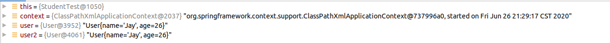

# 1. Spring

## 1.1 简介

* Spring是为企业Java最流行的应用程序开发框架。数以百万计的世界各地的开发人员使用Spring框架来创建高性能，易于测试的，可重用的代码。
* Spring框架是一个开源的Java平台，它最初是由Rod Johnson编写并在2003年6月在Apache2.0许可下首次发布。
* Spring 理念：使现有的技术更加容易使用，本身是一个大杂烩，整合了现有的技术框架


* SSH： Struct2 + Spring + Hibernate
* SSM：SpringMVC + Spring + MyBatis


官网：https://spring.io/projects/spring-framework#overview

官方下载地址：https://repo.spring.io/release/org/springframework/spring/

GitHub：https://github.com/spring-projects/spring-framework

Maven 依赖：导入 spring-webmvc

``` xml
<!-- https://mvnrepository.com/artifact/org.springframework/spring-webmvc -->
<dependency>
    <groupId>org.springframework</groupId>
    <artifactId>spring-webmvc</artifactId>
    <version>5.2.7.RELEASE</version>
</dependency>

<!-- https://mvnrepository.com/artifact/org.springframework/spring-jdbc -->
<dependency>
    <groupId>org.springframework</groupId>
    <artifactId>spring-jdbc</artifactId>
    <version>5.2.7.RELEASE</version>
</dependency>

```


## 1.2 优点

* Spring 是一个开源的免费的框架（容器）；
* Spring 是一个轻量级、非侵入式的框架；
* 控制反转（IOC），面向切面编程（AOP）；
* 支持事务的处理，对框架整合的支持。


==Spring 就是一个轻量级的控制反转（IOC）和面向切面编程（AOP）的框架==


## 1.3 组成


## 1.4 拓展

* Spring Boot
  * 一个快速开啊的脚手架；
  * 基于 SpringBoot 可以快速的开发单个微服务；
  * 约定大于配置
* Spring Cloud
  * Spring Cloud 是基于 Spring Boot 实现；


现在大多数公司都在 Spring Boot 进行快速开发，学习 Spring Boot 的前，需要完全掌握 Spring 及 Spring MVC。承上启下的作用。


**弊端：发展了太久之后，违背了原来的理念！配置十分繁琐，人称：“配置地狱”！**


# 2. IOC 理论指导

1. UserDao 接口；
2. UserDaoImpt 实现类；
3. UserService 业务接口；
4. UserServiceImpl 业务实现类；

在之前的业务中，用户的需求可能会影响原有代码，我们需要根据新需求去修改原有代码。如果程序代码量十分大，修改一次的成本代价十分大！


我们使用一个 Set 接口实现，已经发生了革命性变化。

``` Java
private UserDao userDao;

// dynamically injection
@Override
public void setUserDao(UserDao userDao) {
    this.userDao = userDao;
}
```


* 之前，程序是主动创建对象！控制权在程序员手上；
* 使用了 set 注入后，程序不再具有主动性，而是编程了被动地接收对象。


这种思想，从本质上解决了问题，程序员不用再去管理对象的创建了。系统的耦合性大大降低，可以更加专注于业务的实现上。这是 IOC 的原型。


## 2.1 IOC 本质

**控制反转 IoC（Inversion of Control），是一种设计思想，DI（依赖注入）是实现 IoC 的一种方式**，也有人认为 DI 只是 IoC 的另一种说法。没有 IoC 的程序中，我们使用面向对象编程，对象的创建与对象的依赖关系完全硬编码在程序中，对象的创建由程序员自己控制，控制反转后将对象的创建转移给对三方。也就是说：获得依赖对象的方式反转了。


采用 XML 方式配置 Bean 的时候， Bean 的定义信息是和实现分离的，而采用注解的方式可以把两者合为一体，Bean 的定义信息直接以注解的星是定义在实现类中，从而达到了零配置的目的。


**控制反转是一种通过描述（XML 或注解）并通过第三方去生产或获取特定对象的方式。在 Spring 中实现控制反转的是 IoC 容器，其实现方法是依赖注入（ Dependency Injection，DI）。**


> This chapter covers the Spring Framework implementation of the Inversion of Control (IoC) principle. IoC is also known as dependency injection (DI). It is a process whereby objects define their dependencies (that is, the other objects they work with) only through constructor arguments, arguments to a factory method, or properties that are set on the object instance after it is constructed or returned from a factory method. The container then injects those dependencies when it creates the bean. This process is fundamentally the inverse (hence the name, Inversion of Control) of the bean itself controlling the instantiation or location of its dependencies by using direct construction of classes or a mechanism such as the Service Locator pattern.


# 3. HelloSpring

1. 创建 Maven 项目；

2. 导入 Spring maven 依赖：

   ``` xml
   <dependency>
       <groupId>org.springframework</groupId>
       <artifactId>spring-webmvc</artifactId>
       <version>5.2.7.RELEASE</version>
   </dependency>
   ```

3. 编写实体类：

   ``` Java
   public class Hello {
       public String str;
   
       public String getStr() {
           return str;
       }
   
       public void setStr(String str) {
           this.str = str;
       }
   
       @Override
       public String toString() {
           return "Hello{" +
                   "str='" + str + '\'' +
                   '}';
       }
   }
   ```

4. 在 Spring 配置文件 `beans.xml` 中注册 `Hello` 类：

   ``` xml
   <!--
          T object = new T();
          Hello hello = new Hello();
          id == instance
          class == T
          property == set property in instance
    -->
   <bean id="hello" class="com.jay.pojo.Hello">
       <property name="str" value="Spring"/>
   </bean>
   ```

5. 测试：

   ```java
   @Test
   public void hello() {
       // get spring context instance, Instantiating a Container
       ApplicationContext context = new ClassPathXmlApplicationContext("beans.xml");
       // Spring container manages all objects
       Hello hello = (Hello) context.getBean("hello");
       
       System.out.println(hello);
   }
   ```

6. 输出结果：

   ``` log
   Hello{str='Spring'}
   ```


思考问题：

1. `Hello` 对象是谁创建的？
   * `hello` 对象是由 Spring 创建的。
2. Hello 对象的属性是怎么设置的？
   * `hello` 对象的属性是由 Spring 容器设置的。

这个过程就称为控制反转：

**控制**：谁来控制对象的创建，传统应用程序的对象是由程序本身控制创建的，使用 Spring 后，对象是由 Spring 容器来创建；

**反转**：程序本身不创建对象，而变成被动地接收对象；

**依赖注入**：就是利用 `set` 方法来进行注入的；

IOC 是一种编程思想，由主动的编程变为被动地接收。


# 4. IOC 创建对象的方式

## 4.1 构造器注入

* 使用无参构造创建对象，默认！

* 如果我们要使用有参构造对象，可以使用 Constructor-based Dependency Injection：

  1. 使用 **Constructor argument index**：

     ``` xml
     <bean id="user" class="com.jay.pojo.User">
         <constructor-arg index="0" value="Jay"/>
     </bean>
     ```

  2. 使用 **Constructor argument type matching**：

     ``` xml
     <bean id="user" class="com.jay.pojo.User">
         <constructor-arg type="java.lang.String" value="Jay"/>
         <constructor-arg type="java.lang.String" value="Nanjing"/>
     </bean>
     ```

     如果有多个相同类型的参数，则可以按照顺序来赋值。如果

  3. 使用 **Constructor argument name**：

     ``` xml
     <bean id="user" class="com.jay.pojo.User">
         <constructor-arg name="name" value="Jay"/>
         <constructor-arg name="address" value="Nanjing"/>
     </bean>
     ```

* 上述三种构造器注入方式分别是为了对应不同的构造器重载方式而存在的，尤其是第二种按类型注入：加入某个类有多个构造器，参数类型不同但个数相等，这时，为了区分重载就只能使用第二种按类型注入的方式。


* 思考：Spring 中的 bean 是何时被实例化的？

  * Spring 在通过 `beans.xml` 获取 `context` 容器后，注册的 bean 便会实例化并保存在 `context.classLoader.classes` 中：

    ``` Java
    ApplicationContext context = new ClassPathXmlApplicationContext("beans.xml");
    ```


# 5. Spring 配置

## 5.1 别名

``` XML
<alias name="user" alias="userAlias"/>
```


``` java
@Test
public void test1() {
    ClassPathXmlApplicationContext context = new ClassPathXmlApplicationContext("beans.xml");
    User user = (User) context.getBean("userAlias");

    user.show();
}
```


## 5.2 Bean 的配置

| 标签  | 作用                                   |
| ----- | -------------------------------------- |
| id    | bean 的唯一标识符，类似于对象名        |
| class | bean 对象对应的全限定名：package.type  |
| name  | 也是别名，而且 name 可以同时取多个别名 |

```xml
<bean id="user2" class="com.jay.pojo.User2" name="u2 u3,u4;u5">
    <property name="name" value="Jay"/>
    <property name="address" value="Nanjing"/>
</bean>
```


## 5.3 import

import：一般用于团队开发使用，它可以将多个配置文件，导入合并为一个

假设，项目中有多个开发人员，每人负责不同的类开发，不同的类需要注册在不同的 bean 中，我们可以利用 import 将所有人的 beans.xml 合并到总的配置文件中。如果有多个重名的 bean 标识符，最终结果是按最后一个重名的 bean 标识符创建对象。

* 张三

* 李四

* 王五

* applicationContext.xml

  ``` xml
  <import resource="beans.xml"/>
  <import resource="beans2.xml"/>
  <import resource="beans3.xml"/>
  ```


使用：

``` java
ApplicationContext context = new ClassPathXmlApplicationContext("applicationContext.xml");
```


# 6. 依赖注入


## 6.1 构造器注入

见 4.1。


## 6.2 Set 方式注入【重点】

* 依赖注入： Set注入！
  * 依赖：bean 对象保存在容器中，依赖是值和某个 bean 共同工作的其它 bean 对象（the other objects they work with）
  * 注入：bean 对象中的所有属性，由容器来注入。


【环境搭建】

1. 复杂类型；

   ``` Java
   public class Address {
       private String address;
   
       // getter, setter, toString
   }
   ```

2. 真实测试对象；

   ``` java
   public class Student {
       private String name;
       private Address address;
   
       private String[] books;
       private List<String> hobbies;
       private Map<String, String> card;
       private Set<String> games;
       private String wife;
       private Properties info;
       
   	// getter, setter, toString
   
   }
   ```

3. applicationContext.xml

   ``` xml
   <?xml version="1.0" encoding="UTF-8"?>
   <beans xmlns="http://www.springframework.org/schema/beans"
          xmlns:xsi="http://www.w3.org/2001/XMLSchema-instance"
          xsi:schemaLocation="http://www.springframework.org/schema/beans http://www.springframework.org/schema/beans/spring-beans.xsd">
   
       <bean id="student" class="com.jay.pojo.Student">
           <property name="name" value="Jay"/>
       </bean>
   </beans>
   ```

4. 测试类

   ``` java
   public class StudentTest {
   
       @Test
       public void test() {
           ApplicationContext context = new ClassPathXmlApplicationContext("applicationContext.xml");
           Student student = (Student) context.getBean("student");
   
           System.out.println(student.getName());
       }
   }
   ```

5. 完善注入信息

   ``` xml
   <?xml version="1.0" encoding="UTF-8"?>
   <beans xmlns="http://www.springframework.org/schema/beans"
          xmlns:xsi="http://www.w3.org/2001/XMLSchema-instance"
          xsi:schemaLocation="http://www.springframework.org/schema/beans http://www.springframework.org/schema/beans/spring-beans.xsd">
   
       <bean id="address" class="com.jay.pojo.Address">
           <property name="address" value="Nanjing"/>
       </bean>
   
   
       <bean id="student" class="com.jay.pojo.Student">
           <!-- Straight Values (Primitives, Strings, and so on) -->
           <property name="name" value="Jay"/>
   
           <!-- References to Other Beans (Collaborators) -->
           <property name="address" ref="address"/>
   
           <!-- Arrays -->
           <property name="books">
               <array>
                   <value>san guo yan yi</value>
                   <value>shui hu zhuan</value>
                   <value>xi you ji</value>
                   <value>hong lou meng</value>
               </array>
           </property>
   
           <!-- List -->
           <property name="hobbies">
               <list>
                   <value>singing</value>
                   <value>coding</value>
                   <value>dancing</value>
               </list>
           </property>
   
           <!-- Map -->
           <property name="card">
               <map>
                   <entry key="ID" value="111111222222223333"/>
                   <entry key="ICBC" value="123123"/>
               </map>
           </property>
   
           <!-- Set -->
           <property name="games">
               <set>
                   <value>LOL</value>
                   <value>KOF</value>
               </set>
           </property>
   
           <!-- Null -->
           <property name="wife">
               <null/>
           </property>
   
           <!-- Properties -->
           <property name="info">
               <props>
                   <prop key="sid">MP1833034</prop>
                   <prop key="name">Jay</prop>
               </props>
           </property>
   
       </bean>
   </beans>
   ```

   

## 6.2 拓展方式注入

我们可以使用 p-namespace 和 c-namespace 进行注入

使用：

``` xml
<?xml version="1.0" encoding="UTF-8"?>
<beans xmlns="http://www.springframework.org/schema/beans"
       xmlns:xsi="http://www.w3.org/2001/XMLSchema-instance"
       xmlns:p="http://www.springframework.org/schema/p"
       xmlns:c="http://www.springframework.org/schema/c"
       xsi:schemaLocation="http://www.springframework.org/schema/beans http://www.springframework.org/schema/beans/spring-beans.xsd">

    <!-- p-namespace -->
    <bean id="user" class="com.jay.pojo.User" p:name="Jay" p:age="26"/>

    <!-- c-namespace -->
    <bean id="user2" class="com.jay.pojo.User" c:age="25" c:name="Jay"/>
</beans>
```

测试：

``` Java
@Test
public void test2() {
    ApplicationContext context = new ClassPathXmlApplicationContext("userBeans.xml");
    User user = context.getBean("user", User.class);
    User user2 = context.getBean("user2", User.class);
    System.out.println(user);
    System.out.println(user2);
}
```


注意：`p-namespace` 和 `c-namespace` 要导入 xml 约束：

``` xml
<beans>
    xmlns:p="http://www.springframework.org/schema/p"
    xmlns:c="http://www.springframework.org/schema/c"
</beans>
```


## 6.4 Bean 的作用域

| Scope                                                        | Description                                                  |
| :----------------------------------------------------------- | :----------------------------------------------------------- |
| [singleton](https://docs.spring.io/spring/docs/5.2.7.RELEASE/spring-framework-reference/core.html#beans-factory-scopes-singleton) | (Default) Scopes a single bean definition to a single object instance for each Spring IoC container. |
| [prototype](https://docs.spring.io/spring/docs/5.2.7.RELEASE/spring-framework-reference/core.html#beans-factory-scopes-prototype) | Scopes a single bean definition to any number of object instances. |
| [request](https://docs.spring.io/spring/docs/5.2.7.RELEASE/spring-framework-reference/core.html#beans-factory-scopes-request) | Scopes a single bean definition to the lifecycle of a single HTTP request. That is, each HTTP request has its own instance of a bean created off the back of a single bean definition. Only valid in the context of a web-aware Spring `ApplicationContext`. |
| [session](https://docs.spring.io/spring/docs/5.2.7.RELEASE/spring-framework-reference/core.html#beans-factory-scopes-session) | Scopes a single bean definition to the lifecycle of an HTTP `Session`. Only valid in the context of a web-aware Spring `ApplicationContext`. |
| [application](https://docs.spring.io/spring/docs/5.2.7.RELEASE/spring-framework-reference/core.html#beans-factory-scopes-application) | Scopes a single bean definition to the lifecycle of a `ServletContext`. Only valid in the context of a web-aware Spring `ApplicationContext`. |
| [websocket](https://docs.spring.io/spring/docs/5.2.7.RELEASE/spring-framework-reference/web.html#websocket-stomp-websocket-scope) | Scopes a single bean definition to the lifecycle of a `WebSocket`. Only valid in the context of a web-aware Spring `ApplicationContext`. |


1. 单例模式（默认）

   一个 bean 对应唯一实例

   

   ``` xml
   <bean id="user" class="com.jay.pojo.User" p:name="Jay" p:age="26" scope="singleton"/>
   ```

   debug 显示，获取同一个实例：

   

2. 原型模式

   一个 bean 可以由多个实例，每次从容器中 getBean 时，都会产生一个新的对象。

   

   ``` xml
   <bean id="user" class="com.jay.pojo.User" p:name="Jay" p:age="26" scope="prototype"/>
   ```

   debug 显示，获取到不同的实例：

   

3. 其余的 request，session，application等作用域，只能在 web 开发中使用。


# 7. Bean 的自动装配

## 7.1 自动装配模式

| Mode          | Explanation                                                  |
| :------------ | :----------------------------------------------------------- |
| `no`          | (Default) No autowiring. Bean references must be defined by `ref` elements. Changing the default setting is not recommended for larger deployments, because specifying collaborators explicitly gives greater control and clarity. To some extent, it documents the structure of a system. |
| `byName`      | Autowiring by property name. Spring looks for a bean with the same name as the property that needs to be autowired. For example, if a bean definition is set to autowire by name and it **contains a `master` property (that is, it has a `setMaster(..)` method)**, Spring looks for a bean definition named `master` and uses it to set the property. |
| `byType`      | Lets a property be autowired if **exactly one bean of the property type** exists in the container. If more than one exists, a fatal exception is thrown, which indicates that you may not use `byType` autowiring for that bean. If there are no matching beans, nothing happens (the property is not set). |
| `constructor` | Analogous to `byType` but applies to constructor arguments. If there is not exactly one bean of the constructor argument type in the container, a fatal error is raised. |

* 自动装配是 Spring 满足 bean 依赖注入的一种方式；
* Spring 会在上下文中自动寻找，并自动给 bean 装配属。


在 Spring 中由三种装配的方式：

1. 在 xml 中显式的配置
2. 在 Java 中显式的配置
3. 隐式的自动装配 bean【重要】


## 7.2 测试

环境搭建：一个人有两个宠物。

``` Java
// Dog
public class Dog {
    public void shout() {
        System.out.println("wang~");
    }
}

// Cat
public class Cat {
    public void shout() {
        System.out.println("miao~");
    }
}

// Person
public class Person {
    private String name;
    private Dog dog;
    private Cat cat;

    // getter setter toString
}
```

``` xml
<?xml version="1.0" encoding="UTF-8"?>
<beans xmlns="http://www.springframework.org/schema/beans"
       xmlns:xsi="http://www.w3.org/2001/XMLSchema-instance"
       xsi:schemaLocation="http://www.springframework.org/schema/beans http://www.springframework.org/schema/beans/spring-beans.xsd">

    <bean id="cat" class="com.jay.pojo.Cat"/>
    <bean id="dog" class="com.jay.pojo.Dog"/>

    <bean id="person" class="com.jay.pojo.Person">
        <property name="name" value="Jay"/>
        <property name="cat" ref="cat"/>
        <property name="dog" ref="dog"/>
    </bean>
</beans>
```


## 7.3 byName 自动装配

* byName：需要保证所有 bean 的 id 唯一，并且这个 bean 需要和自动注入的属性相同，并且这个属性有 set 方法；

``` XML
<?xml version="1.0" encoding="UTF-8"?>
<beans xmlns="http://www.springframework.org/schema/beans"
       xmlns:xsi="http://www.w3.org/2001/XMLSchema-instance"
       xsi:schemaLocation="http://www.springframework.org/schema/beans http://www.springframework.org/schema/beans/spring-beans.xsd">

    <bean id="cat" class="com.jay.pojo.Cat"/>
    <bean id="dog" class="com.jay.pojo.Dog"/>

    <bean id="person" class="com.jay.pojo.Person" autowire="byName">
        <property name="name" value="Jay"/>
    </bean>
</beans>
```


## 7.4 byType 自动装配

* byType：需要保证所有的 bean 的 class 唯一，并且这个 bean 需要的自动注入的属性的类型一致。

``` xml
<?xml version="1.0" encoding="UTF-8"?>
<beans xmlns="http://www.springframework.org/schema/beans"
       xmlns:xsi="http://www.w3.org/2001/XMLSchema-instance"
       xsi:schemaLocation="http://www.springframework.org/schema/beans http://www.springframework.org/schema/beans/spring-beans.xsd">

    <bean id="cat" class="com.jay.pojo.Cat"/>
    <bean id="dog" class="com.jay.pojo.Dog"/>

    <bean id="person" class="com.jay.pojo.Person" autowire="byType">
        <property name="name" value="Jay"/>
    </bean>
</beans>
```

如果出现多个类型候选冲突的情况下，可以使用 `autowire-candidate="false"`  申明此 bean 取消候选，或 `primary="true"` 申明此 bean 优先候选，解决冲突。


## 7.5 使用注解实现自动装配

### 7.5.1 注解 vs. XML

**Are annotations better than XML for configuring Spring?**

The introduction of annotation-based configuration raised the question of whether this approach is “better” than XML. The short answer is “it depends.” The long answer is that each approach has its pros and cons, and, usually, it is up to the developer to decide which strategy suits them better. Due to the way they are defined, annotations provide a lot of context in their declaration, leading to shorter and more concise configuration. However, XML excels at wiring up components without touching their source code or recompiling them. Some developers prefer having the wiring close to the source while others argue that annotated classes are no longer POJOs and, furthermore, that the configuration becomes decentralized and harder to control.

No matter the choice, Spring can accommodate both styles and even mix them together. It is worth pointing out that through its [JavaConfig](https://docs.spring.io/spring/docs/5.2.7.RELEASE/spring-framework-reference/core.html#beans-java) option, Spring lets annotations be used in a non-invasive way, without touching the target components source code and that, in terms of tooling, all configuration styles are supported by the [Spring Tools for Eclipse](https://spring.io/tools).


使用注解开发是否优于使用 XML 配置开发？

简要的回答是：看情况。详细点的回答是：每个方式都有它自己的 `pros` 和 `cons`，通常来说，它取决于开发人员决定哪种策略，其对应方式能更好的适用于这些 `pros` 和 `cons`。

因为定义的方式不同，注解方式在声明时提供了大量的上下文，使得配置上更加简短和精炼。XML 更加擅长于不修改源代码和重新编译的方式来增加组件。

有些开发人员倾向于在源码附近修改，而另一些开发人员则认为加了注解的类不再是 POJO，另外这些配置显得十分去中心化并且难以控制。

Spring 提供了两种配置方式，你甚至可以混合使用它们。值得一提的是，通过 `JavaConfig` 选项，Srping 中的注解不再是侵入性的，可以不用修改目标组件的源代码了。


JDK 1.5 支持的注解， Spring 2.5 就支持注解了。

使用注解须知：

1. 导入约束，`context` 约束

2. 配置注解的支持，`    <context:anotation-config/>`

   ``` xml
   <?xml version="1.0" encoding="UTF-8"?>
   <beans xmlns="http://www.springframework.org/schema/beans"
       xmlns:xsi="http://www.w3.org/2001/XMLSchema-instance"
       xmlns:context="http://www.springframework.org/schema/context"
       xsi:schemaLocation="http://www.springframework.org/schema/beans
           https://www.springframework.org/schema/beans/spring-beans.xsd
           http://www.springframework.org/schema/context
           https://www.springframework.org/schema/context/spring-context.xsd">
   
       <context:annotation-config/>
   
   </beans>
   ```

   

### 7.5.2 使用 `@AutoWired`

* 直接在属性上使用即可！也可以在 set 方法上使用；

* 使用 `@AutoWired` 后我们可以不用再编写 set 方法，前提是这个自动装配的属性再 IOC（Spring）容器中存在，且按照 `byType`，如果 bean 类型相同，再按照 `byName` 查询；

  ``` xml
  <?xml version="1.0" encoding="UTF-8"?>
  <beans xmlns="http://www.springframework.org/schema/beans"
         xmlns:xsi="http://www.w3.org/2001/XMLSchema-instance"
         xmlns:context="http://www.springframework.org/schema/context"
         xsi:schemaLocation="http://www.springframework.org/schema/beans
          https://www.springframework.org/schema/beans/spring-beans.xsd
          http://www.springframework.org/schema/context
          https://www.springframework.org/schema/context/spring-context.xsd">
  
      <bean id="cat1" class="com.jay.pojo.Cat"/>
      <bean id="dog1" class="com.jay.pojo.Dog"/>
  
  <!--    <bean id="cat111" class="com.jay.pojo.Cat"/>-->
  <!--    <bean id="dog111" class="com.jay.pojo.Dog"/>-->
  
      <bean id="person" class="com.jay.pojo.Person"/>
  
      <context:annotation-config/>
  </beans>
  ```

  ``` java
  public class Person {
      private String name;
      @Autowired
      private Dog dog;
      @Autowired
      private Cat cat;
  	
      // getters, toString
  }
  ```

  此时 `cat` 属性标记的  `@Autowired` 可以按照类型匹配唯一的 bean，bean id 为 `cat1`。如果取消注释，则按照类型会找到两个 bean， 但它们的名称都不是 `cat`，会抛出以下异常：

  

  

****

### 7.5.3 使用 `@Qualifier`

如果 `@Autowired` 自动装配的环境比较复杂，自动装配无法通过一个注解【@Autowired】完成时，出现上述情况时，我们可以使用 `@Qualifier(value="xxx"` 去配置 `@Autowired` 的使用，指定一个唯一的 bean 对象的注入：

``` xml
<?xml version="1.0" encoding="UTF-8"?>
<beans xmlns="http://www.springframework.org/schema/beans"
       xmlns:xsi="http://www.w3.org/2001/XMLSchema-instance"
       xmlns:context="http://www.springframework.org/schema/context"
       xsi:schemaLocation="http://www.springframework.org/schema/beans
        https://www.springframework.org/schema/beans/spring-beans.xsd
        http://www.springframework.org/schema/context
        https://www.springframework.org/schema/context/spring-context.xsd">

    <bean id="cat1" class="com.jay.pojo.Cat"/>
    <bean id="dog1" class="com.jay.pojo.Dog"/>

    <bean id="cat111" class="com.jay.pojo.Cat"/>
    <bean id="dog111" class="com.jay.pojo.Dog"/>

    <bean id="person" class="com.jay.pojo.Person"/>

    <context:annotation-config/>
</beans>
```

``` Java
public class Person {
    private String name;
    @Autowired
    @Qualifier(value = "dog111")
    private Dog dog;
    @Autowired
    @Qualifier(value = "cat111")
    private Cat cat;

    // getters, setters, toString
}
```


### 7.5.4 使用 `@Resource`

添加 maven 依赖：

``` xml
        <!-- Javax Annotation -->
        <dependency>
            <groupId>javax.annotation</groupId>
            <artifactId>jsr250-api</artifactId>
            <version>1.0</version>
        </dependency>
```

在属性上使用 `@Resource`

``` Java
import javax.annotation.Resource;

public class Person {
    private String name;

    @Resource(name = "dog111")
    private Dog dog;
    @Resource
    private Cat cat;
```

小结：

`@Resource` 和 `@Autowired` 的区别：

* 都是用来实现自动装配，都可以放在属性字段上；
* `@Autowired` 通过 `byType` 的方式实现，而且必须要求这个对象存在！【常用】
* `@Resource` 默认通过 `byName` 的方式实现，如果找不到名字，则通过 `byType` 实现！如果两个都找不到的情况下，就报错！【常用】
* 执行顺序不同：`@Autowired` 通过 `byType` 方式实现， `@Resource` 默认通过 `byName` 的方式实现。


# 8. 使用注解开发

Spring 4之后的版本要使用注解开发，必须保证 aop 依赖包导入：


注解需要导入 `context` 约束，增加注解的支持：

``` xml
<?xml version="1.0" encoding="UTF-8"?>
<beans xmlns="http://www.springframework.org/schema/beans"
       xmlns:xsi="http://www.w3.org/2001/XMLSchema-instance"
       xmlns:context="http://www.springframework.org/schema/context"
       xsi:schemaLocation="http://www.springframework.org/schema/beans
        https://www.springframework.org/schema/beans/spring-beans.xsd
        http://www.springframework.org/schema/context
        https://www.springframework.org/schema/context/spring-context.xsd">

    <context:annotation-config/>
</beans>
```


## 8.1 bean

见 5.2

## 8.2 属性如何注入

``` Java
// <bean id="user" class="com.jay.pojo"/>
@Component
public class User {

    // <property name="name" value="Jay"/>
    @Value("Jay")
    public String name;

    @Override
    public String toString() {
        return "User{" +
                "name='" + name + '\'' +
                '}';
    }
}
```


## 8.3 衍生的注解

`@Component` 有几个衍生注解，在 Web 开发中，会按照 MVC 三层架构分层：

* dao 【@Repository】
* service 【@Service】
* controller 【@Controller】

这四个注解的功能都是一样的，代表将某个类注册到 Spring 中，装配 Bean

## 8.4 自动装配

见 7.5

## 8.5 作用域

`@Scope`

``` Java
// <bean id="user" class="com.jay.pojo"/>
@Component
@Scope(value = "singleton")
public class User {

    // <property name="name" value="Jay"/>
    @Value("Jay")
    public String name;

    @Override
    public String toString() {
        return "User{" +
                "name='" + name + '\'' +
                '}';
    }
}
```


## 8.6 小结

XML 与注解：

* XML 更加万能，适用于任何场合，维护简单方便；
* 注解，不是自己定义的类使用不了，维护相对复杂。


XML 与注解的最佳实践：

* XML 用来管理 Bean；
* 注解只负责完成属性的注入；


# 9. 使用 Java 的方式配置 Spring

我们现在要完全不适用 Spring 的 XML 配置，全由 Java 来做。

JavaConfig 是 Spring 的一个子项目，在 Spring4 之后，它成为核心功能；

``` Java
@Configuration
public class AppConfig {

    @Bean
    public MyService myService() {
        return new MyServiceImpl();
    }
}
```

这种方式等同于用 XML 配置：

``` xml
<beans>
    <bean id="myService" class="com.acme.services.MyServiceImpl"/>
</beans>
```


1. 实体类：

   ``` Java
   package com.jay.pojo;
   
   import org.springframework.beans.factory.annotation.Value;
   import org.springframework.stereotype.Component;
   
   @Component
   public class User {
       private String name;
   
       public String getName() {
           return name;
       }
   
       @Value("Jay")
       public void setName(String name) {
           this.name = name;
       }
   
       @Override
       public String toString() {
           return "User{" +
                   "name='" + name + '\'' +
                   '}';
       }
   }
   ```

2. 配置类：

   ``` Java
   package com.jay.config;
   
   import com.jay.pojo.User;
   import org.springframework.context.annotation.Bean;
   import org.springframework.context.annotation.ComponentScan;
   import org.springframework.context.annotation.Configuration;
   
   @Configuration
   @ComponentScan("com.jay.pojo")
   public class JayConfig {
   
       // register a bean
       @Bean(value = {"user", "getUser"})
       public User getUser() {
           return new User();
       }
   }
   
   ```

3. 测试类：

   ``` Java
   @Test
   public void test1() {
       ApplicationContext context = new AnnotationConfigApplicationContext(JayConfig.class);
       User user = context.getBean("user", User.class);
   
       System.out.println(user);
   }
   ```


这种纯 Java 的配置方式，在 SpringBoot 中随处可见。


# 10. 代理模式

为什么要学习代理模式？

* 这是 Spring AOP 的底层模式，面试必问：Spring AOP 和 Spring MVC。


代理模式的分类：

* 静态代理；
* 动态代理；


## 10.1 静态代理

角色分析：

* 抽象角色：一般会使用接口或者抽象类来解决；
* 真实角色：被代理的角色；
* 代理角色：代理真实角色，代理真实角色后，我们一般会做一些附属操作；
* 客户：访问代理对象的人。


示例代码：

1. 抽象角色 `Rent.java` 接口，定义租房行为：

   ``` Java
   public interface Rent {
       public void rent();
   }
   ```

2. 真实角色 `Landlord.java` 类，房东实现租房行为：

   ``` Java
   public class Landlord implements Rent{
   
       @Override
       public void rent() {
           System.out.println("Landlord rents a house.");
       }
   }
   ```

3. 代理角色 `Agent.java`类，房屋中介，实现租房行为，增加其它附属业务；

   ``` Java
   public class Agent implements Rent {
       private Landlord landlord;
   
       public Agent() {
       }
   
       public Agent(Landlord landlord) {
           this.landlord = landlord;
       }
   
       public void showHouse() {
           System.out.println("Agent shows you the house.");
       }
   
       public void agencyFee() {
           System.out.println("Agent charges agency fee.");
       }
   
       public void signContrast() {
           System.out.println("Agent signs a contrast with you.");
       }
   
       @Override
       public void rent() {
           showHouse();
           agencyFee();
           signContrast();
           landlord.rent();
       }
   }
   ```

4. 客户：`Tenant.java` 类，租客与房屋中介租房：

   ``` Java
   public class Tenant {
       public static void main(String[] args) {
           Landlord landlord = new Landlord();
   
           Agent agent = new Agent(landlord);
           agent.rent();
       }
   }
   ```

5. 测试结果：

   ``` log
   Agent shows you the house.
   Agent charges agency fee.
   Agent signs a contrast with you.
   Landlord rents a house.
   ```

   

代理模式

优点：

* 可以使真实角色的操作更加纯粹，不用去关注一些公共的业务；
* 公共业务交付给代理角色，实现了业务的分工；
* 公共业务发生扩展时，方便集中管理。

缺点：

* 一个真实角色就会产生一个代理角色，代码量会翻倍，开发效率会变低。


## 10.2 加深理解

1. 改动原有的业务代码，是企业开发的大忌；
2. 在不修改原有代码的情况下，横向加入功能。


示例代码：

1. `UserService.java` 接口：

   ```Java
   public interface UserService {
       void add();
   
       void delete();
   
       void update();
   
       void query();
   }
   ```

2. `UserServiceImpl.java` 实现类：

   ```Java
   public class UserServiceImpl implements UserService {
       @Override
       public void add() {
           System.out.println("Add a user.");
       }
   
       @Override
       public void delete() {
           System.out.println("Delete a user.");
       }
   
       @Override
       public void update() {
           System.out.println("Update a user.");
       }
   
       @Override
       public void query() {
           System.out.println("Query a user.");
       }
   }
   ```

3. `UserServiceProxy.java` 代理实现类：

   ```Java
   public class UserServiceProxy implements UserService {
   
       UserServiceImpl userService;
   
       public void setUserService(UserServiceImpl userService) {
           this.userService = userService;
       }
   
       @Override
       public void add() {
           log("add");
           userService.add();
       }
   
       @Override
       public void delete() {
           log("delete");
           userService.delete();
       }
   
       @Override
       public void update() {
           log("update");
           userService.update();
       }
   
       @Override
       public void query() {
           log("query");
           userService.query();
       }
       
       // log method
       public void log(String message) {
           System.out.println("[debug] using " + message + " method.");
   
       }
   }
   ```

4. `Client.java` 类：

   ```
   public class Client {
       public static void main(String[] args) {
           UserServiceImpl userService = new UserServiceImpl();
           UserServiceProxy proxy = new UserServiceProxy();
   
           proxy.setUserService(userService);
   
           proxy.add();
           proxy.delete();
           proxy.update();
           proxy.query();
   
       }
   }
   ```

5. 测试结果：

   ```log
   [debug] using add method.
   Add a user.
   [debug] using delete method.
   Delete a user.
   [debug] using update method.
   Update a user.
   [debug] using query method.
   Query a user.
   ```

   

## 10.3 动态代理

* 动态代理和静态代理角色一样；
* 动态代理的代理类是动态生成的，不是我们直接写好的；
* 动态代理分为两大类：基于接口的动态代理，基于类的动态代理
  * 基于接口：JDK 的动态代理；【我们在这里使用】
  * 基于类： cglib
  * Java 字节码实现：JAVAsist


需要了解两个类：

* Proxy：代理，
* InvocationHandler：调用处理程序

| 类型                |                                                              |
| ------------------- | ------------------------------------------------------------ |
| `Proxy`             | `Proxy` provides static methods for creating objects that act like instances of interfaces but allow for customized method invocation |
| `InvocationHandler` | `InvocationHandler` is the interface implemented by the *invocation handler* of a proxy instance. |


示例代码：

1. `rent.java` 接口，`Landlord.java` 实现类：

   ``` Java
   public interface Rent {
       void rent();
   }
   
   public class Landlord implements Rent {
       @Override
       public void rent() {
           System.out.println("Landlord rents a house.");
       }
   }
   ```

2. `ProxyInvocationHandler.java` 代理处理类，动态地生成 `rent` 接口的代理：

   ``` Java
   
   /**
    * automatically generate proxy instance
    *
    * @author jay
    */
   public class ProxyInvocationHandler implements InvocationHandler {
   
       /**
        * proxy interface
        */
       private Rent rent;
   
       public void setRent(Rent rent) {
           this.rent = rent;
       }
   
       /**
        * generate proxy instance
        */
       public Object getProxy() {
           return Proxy.newProxyInstance(this.getClass().getClassLoader(),
                   rent.getClass().getInterfaces(),
                   this
           );
       }
   
       /**
        * Processes a method invocation on a proxy instance and returns the result.
        */
       @Override
       public Object invoke(Object proxy, Method method, Object[] args) throws Throwable {
   
           showHouse();
           // dynamic proxy's essence: reflection
           Object result = method.invoke(rent, args);
           return result;
       }
   
       public void showHouse() {
           System.out.println("Agency shows house.");
       }
   }
   ```

3. `Client.java`类：

   ```Java
   public class Client {
   
       public static void main(String[] args) {
           // real character
           Landlord landlord = new Landlord();
   
           // proxy character
           ProxyInvocationHandler invocationHandler = new ProxyInvocationHandler();
   
           invocationHandler.setRent(landlord);
           // get dynamic proxy
           Rent proxy = (Rent) invocationHandler.getProxy();
   
           proxy.rent();
       }
   }
   ```


动态代理：

* 优点：
  * 可以使真实角色的操作更加纯粹，不用去关注一些公共的业务；
  * 公共业务交付给代理角色，实现了业务的分工；
  * 公共业务发生扩展时，方便集中管理；
  * 一个动态代理类代理的是一个接口，一般就是对应的一类业务；
  * 一个动态代理类可以代理多个类，只要实现了同一个接口即可。


# 11. AOP

## 11.1 什么是 AOP

AOP（Aspect Oriented Programming）意为：面向切面编程，通过预编译方式和运行期动态代理实现程序功能的统一维护的一种技术。AOP是OOP的延续，是软件开发中的一个热点，也是Spring框架中的一个重要内容，是函数式编程的一种衍生范型。利用AOP可以对业务逻辑的各个部分进行隔离，从而使得业务逻辑各部分之间的耦合度降低，提高程序的可重用性，同时提高了开发的效率。


## 11.2 Aop在Spring中的作用

==提供声明式事务；允许用户自定义切面==

以下名词需要了解下：

- 横切关注点：跨越应用程序多个模块的方法或功能。即是，与我们业务逻辑无关的，但是我们需要关注的部分，就是横切关注点。如日志 , 安全 , 缓存 , 事务等等 ....
- 切面（ASPECT）：横切关注点 被模块化 的特殊对象。即，它是一个类。
- 通知（Advice）：切面必须要完成的工作。即，它是类中的一个方法。
- 目标（Target）：被通知对象。
- 代理（Proxy）：向目标对象应用通知之后创建的对象。
- 切入点（PointCut）：切面通知 执行的 “地点”的定义。
- 连接点（JointPoint）：与切入点匹配的执行点。


SpringAOP中，通过Advice定义横切逻辑，Spring中支持5种类型的Advice:


即 Aop 在 不改变原有代码的情况下 , 去增加新的功能 .


## 11.3 使用Spring实现Aop

【重点】使用AOP织入，需要导入一个依赖包！

```xml
<!-- https://mvnrepository.com/artifact/org.aspectj/aspectjweaver -->
<dependency>
   <groupId>org.aspectj</groupId>
   <artifactId>aspectjweaver</artifactId>
   <version>1.9.4</version>
</dependency>
```


## 11.3.1 使用 Spring 接口实现 AOP

首先编写我们的业务接口和实现类

```Java
public interface UserService {

   public void add();

   public void delete();

   public void update();

   public void search();

}
public class UserServiceImpl implements UserService{

   @Override
   public void add() {
       System.out.println("增加用户");
  }

   @Override
   public void delete() {
       System.out.println("删除用户");
  }

   @Override
   public void update() {
       System.out.println("更新用户");
  }

   @Override
   public void search() {
       System.out.println("查询用户");
  }
}
```

然后去写我们的增强类 , 我们编写两个 , 一个前置增强 一个后置增强

```Java
public class Log implements MethodBeforeAdvice {

   //method : 要执行的目标对象的方法
   //objects : 被调用的方法的参数
   //Object : 目标对象
   @Override
   public void before(Method method, Object[] objects, Object o) throws Throwable {
       System.out.println( o.getClass().getName() + "的" + method.getName() + "方法被执行了");
  }
}
public class AfterLog implements AfterReturningAdvice {
   //returnValue 返回值
   //method被调用的方法
   //args 被调用的方法的对象的参数
   //target 被调用的目标对象
   @Override
   public void afterReturning(Object returnValue, Method method, Object[] args, Object target) throws Throwable {
       System.out.println("执行了" + target.getClass().getName()
       +"的"+method.getName()+"方法,"
       +"返回值："+returnValue);
  }
}
```

最后去spring的文件中注册 , 并实现aop切入实现 , 注意导入约束 .

```XML
<?xml version="1.0" encoding="UTF-8"?>
<beans xmlns="http://www.springframework.org/schema/beans"
      xmlns:xsi="http://www.w3.org/2001/XMLSchema-instance"
      xmlns:aop="http://www.springframework.org/schema/aop"
      xsi:schemaLocation="http://www.springframework.org/schema/beans
       http://www.springframework.org/schema/beans/spring-beans.xsd
       http://www.springframework.org/schema/aop
       http://www.springframework.org/schema/aop/spring-aop.xsd">

   <!--注册bean-->
   <bean id="userService" class="com.kuang.service.UserServiceImpl"/>
   <bean id="log" class="com.kuang.log.Log"/>
   <bean id="afterLog" class="com.kuang.log.AfterLog"/>

   <!--aop的配置-->
   <aop:config>
       <!--切入点 expression:表达式匹配要执行的方法-->
       <aop:pointcut id="pointcut" expression="execution(* com.kuang.service.UserServiceImpl.*(..))"/>
       <!--执行环绕; advice-ref执行方法 . pointcut-ref切入点-->
       <aop:advisor advice-ref="log" pointcut-ref="pointcut"/>
       <aop:advisor advice-ref="afterLog" pointcut-ref="pointcut"/>
   </aop:config>

</beans>
```

测试

```Java
public class MyTest {
   @Test
   public void test(){
       ApplicationContext context = new ClassPathXmlApplicationContext("beans.xml");
       UserService userService = (UserService) context.getBean("userService");
       userService.search();
  }
}
```

Aop的重要性 : 很重要 . 一定要理解其中的思路 , 主要是思想的理解这一块 .

Spring的Aop就是将公共的业务 (日志 , 安全等) 和领域业务结合起来 , 当执行领域业务时 , 将会把公共业务加进来 . 实现公共业务的重复利用 . 领域业务更纯粹 , 程序员专注领域业务 , 其本质还是动态代理 . 


## 11.3.2 使用自定义类实现 AOP

目标业务类不变依旧是userServiceImpl

第一步 : 写我们自己的一个切入类

```Java
public class DiyPointcut {

   public void before(){
       System.out.println("---------方法执行前---------");
  }
   public void after(){
       System.out.println("---------方法执行后---------");
  }
   
}
```

去spring中配置

```xml
<!--第二种方式自定义实现-->
<!--注册bean-->
<bean id="diy" class="com.kuang.config.DiyPointcut"/>

<!--aop的配置-->
<aop:config>
   <!--第二种方式：使用AOP的标签实现-->
   <aop:aspect ref="diy">
       <aop:pointcut id="diyPonitcut" expression="execution(* com.kuang.service.UserServiceImpl.*(..))"/>
       <aop:before pointcut-ref="diyPonitcut" method="before"/>
       <aop:after pointcut-ref="diyPonitcut" method="after"/>
   </aop:aspect>
</aop:config>
```

测试：

```Java
public class MyTest {
   @Test
   public void test(){
       ApplicationContext context = new ClassPathXmlApplicationContext("beans.xml");
       UserService userService = (UserService) context.getBean("userService");
       userService.add();
  }
}
```


## 11.3.3 使用注解实现 AOP

第一步：编写一个注解实现的增强类

```java
package com.kuang.config;

import org.aspectj.lang.ProceedingJoinPoint;
import org.aspectj.lang.annotation.After;
import org.aspectj.lang.annotation.Around;
import org.aspectj.lang.annotation.Aspect;
import org.aspectj.lang.annotation.Before;

@Aspect
public class AnnotationPointcut {
   @Before("execution(* com.kuang.service.UserServiceImpl.*(..))")
   public void before(){
       System.out.println("---------方法执行前---------");
  }

   @After("execution(* com.kuang.service.UserServiceImpl.*(..))")
   public void after(){
       System.out.println("---------方法执行后---------");
  }

   @Around("execution(* com.kuang.service.UserServiceImpl.*(..))")
   public void around(ProceedingJoinPoint jp) throws Throwable {
       System.out.println("环绕前");
       System.out.println("签名:"+jp.getSignature());
       //执行目标方法proceed
       Object proceed = jp.proceed();
       System.out.println("环绕后");
       System.out.println(proceed);
  }
}
```

第二步：在Spring配置文件中，注册bean，并增加支持注解的配置

```xml
<!--第三种方式:注解实现-->
<bean id="annotationPointcut" class="com.kuang.config.AnnotationPointcut"/>
<aop:aspectj-autoproxy/>
```

aop:aspectj-autoproxy：说明

```xml
通过aop命名空间的<aop:aspectj-autoproxy />声明自动为spring容器中那些配置@aspectJ切面的bean创建代理，织入切面。当然，spring 在内部依旧采用AnnotationAwareAspectJAutoProxyCreator进行自动代理的创建工作，但具体实现的细节已经被<aop:aspectj-autoproxy />隐藏起来了

<aop:aspectj-autoproxy />有一个proxy-target-class属性，默认为false，表示使用jdk动态代理织入增强，当配为<aop:aspectj-autoproxy  poxy-target-class="true"/>时，表示使用CGLib动态代理技术织入增强。不过即使proxy-target-class设置为false，如果目标类没有声明接口，则spring将自动使用CGLib动态代理。
```


# 12. 整合 MyBatis

步骤：

1. 导入相关依赖

   1. JUnit
   2. MyBatis
   3. MySQL-connector
   4. Spring
   5. AOP aspect
   6. mybatis-spring

   ``` xml
   <dependencies>
       <dependency>
           <groupId>junit</groupId>
           <artifactId>junit</artifactId>
           <version>4.12</version>
       </dependency>
       <dependency>
           <groupId>mysql</groupId>
           <artifactId>mysql-connector-java</artifactId>
           <version>8.0.20</version>
       </dependency>
       <dependency>
           <groupId>org.mybatis</groupId>
           <artifactId>mybatis</artifactId>
           <version>3.5.5</version>
       </dependency>
   
       <dependency>
           <groupId>org.springframework</groupId>
           <artifactId>spring-webmvc</artifactId>
           <version>5.2.7.RELEASE</version>
       </dependency>
       <dependency>
           <groupId>org.springframework</groupId>
           <artifactId>spring-jdbc</artifactId>
           <version>5.2.7.RELEASE</version>
       </dependency>
   
       <dependency>
           <groupId>org.aspectj</groupId>
           <artifactId>aspectjweaver</artifactId>
           <version>1.9.4</version>
       </dependency>
       <!-- https://mvnrepository.com/artifact/org.mybatis/mybatis-spring -->
       <dependency>
           <groupId>org.mybatis</groupId>
           <artifactId>mybatis-spring</artifactId>
           <version>2.0.5</version>
       </dependency>
   </dependencies>
   ```

2. 编写配置文件；

3. 测试。


## 12.1 回顾 MyBatis

1. 编写实体类；
2. 编写核心配置文件；
3. 编写接口；
4. 编写 Mapper.xml；
5. 测试。


## 12.2 MyBatis-Spring

官网地址： http://mybatis.org/spring/zh/

1. 编写数据源配置，`applicationContext.xml` 中注入 bean：

   ``` xml
   <!--DataSource: use spring datasource to replace MyBatis setting c3p0 dbcp druid
       we use jdbc provided by Spring: org.springframework.jdbc.datasource
       -->
   <bean id="datasource" class="org.springframework.jdbc.datasource.DriverManagerDataSource">
       <property name="driverClassName" value="com.mysql.cj.jdbc.Driver"/>
       <property name="url"
                 value="jdbc:mysql://localhost:3306/mybatis?useSSL=false&amp;useUnicode=true&amp;characterEncoding=UTF-8"/>
       <property name="username" value="root"/>
       <property name="password" value="123456"/>
   </bean>
   ```

   

2. sqlSessionFactory，`applicationContext.xml` 中注入 bean：

   ``` XML
   <!--sqlSessionFactory-->
   <bean id="sqlSessionFactory" class="org.mybatis.spring.SqlSessionFactoryBean">
       <property name="dataSource" ref="datasource"/>
       <!-- bind MyBatis configuration -->
       <property name="configLocation" value="classpath:mybatis-config.xml"/>
       <property name="mapperLocations" value="classpath*:com/jay/**/*.xml"/>
   </bean>
   ```

   

3. sqlSessionTemplate，`applicationContext.xml` 中注入 bean：

   ``` xml
   <bean id="sqlSessionTemplate" class="org.mybatis.spring.SqlSessionTemplate">
       <!-- sqlSessionTemplate has no setter, using constructor to inject-->
       <constructor-arg index="0" ref="sqlSessionFactory"/>
   </bean>
   ```

   

4. 给接口添加实现类 `UserMapperImpl.java`，用于实现具体业务【新增】：

   ``` Java
   // 方法1
   public class UserMapperImpl implements UserMapper {
       // now, we only use sqlSessionTemplate
       private SqlSessionTemplate sqlSessionTemplate;
   
       public void setSqlSessionTemplate(SqlSessionTemplate sqlSessionTemplate) {
           this.sqlSessionTemplate = sqlSessionTemplate;
       }
   
       @Override
       public List<User> selectUser() {
           UserMapper mapper = sqlSessionTemplate.getMapper(UserMapper.class);
           return mapper.selectUser();
       }
   }
   
   // 方法2
   public class UserMapperImpl2 extends SqlSessionDaoSupport implements UserMapper {
       @Override
       public List<User> selectUser() {
           return getSqlSession().getMapper(UserMapper.class).selectUser();
       }
   }
   
   ```

5. 将实现类注入到 Spring 容器中，`applicationContext.xml` 中注入 bean：

   ``` XML
   <bean id="userMapper" class="com.jay.mapper.UserMapperImpl">
       <property name="sqlSessionTemplate" ref="sqlSessionTemplate"/>
   </bean>
   
   <bean id="userMapper2" class="com.jay.mapper.UserMapperImpl2">
       <property name="sqlSessionFactory" ref="sqlSessionFactory"/>
   </bean>
   ```

   

6. 测试类：

   ``` Java
   @Test
   public void test1() {
       ApplicationContext context = new ClassPathXmlApplicationContext("applicationContext.xml");
       UserMapper userMapper = context.getBean("userMapper", UserMapper.class);
       List<User> users = userMapper.selectUser();
   
       users.forEach(System.out::println);
   }
   
@Test
   public void test2() {
       ApplicationContext context = new ClassPathXmlApplicationContext("applicationContext.xml");
       UserMapper userMapper = context.getBean("userMapper2", UserMapper.class);
       List<User> users = userMapper.selectUser();
   
       users.forEach(System.out::println);
   }
   ```
   
   


# 13. 事务式声明

## 13.1 回顾事务

* 把一组业务当作一个独立的工作单元来执行，要么都成功，要么都失败；
* 事务在项目开发中，十分的重要，涉及到数据的一致性问题，不能马虎；
* 确保完整性和一致性；


事务 ACID

* 原子性（Atomicity）
* 一致性（Consistency）
* 隔离性（Isolation）
  * 多个业务可能操作同一个资源，防止数据损坏
* 持久性（Durability）
  * 事务一旦提交，无论系统发生什么问题，结果都不会再被影响，被持久化地写到存储器中。


## 13.2 Spring 中的事务管理

* 声明式事务：AOP
* 编程式事务


测试
将上面的代码拷贝到一个新项目中

在之前的案例中，我们给userDao接口新增两个方法，删除和增加用户；

``` Java
//添加一个用户
int addUser(User user);

//根据id删除用户
int deleteUser(int id);
```


mapper文件，我们故意把 deletes 写错，测试！

``` xml
<insert id="addUser" parameterType="com.kuang.pojo.User">
insert into user (id,name,pwd) values (#{id},#{name},#{pwd})
</insert>

<delete id="deleteUser" parameterType="int">
deletes from user where id = #{id}
</delete>
```


编写接口的实现类，在实现类中，我们去操作一波

``` Java
public class UserDaoImpl extends SqlSessionDaoSupport implements UserMapper {

   //增加一些操作
   public List<User> selectUser() {
       User user = new User(4,"小明","123456");
       UserMapper mapper = getSqlSession().getMapper(UserMapper.class);
       mapper.addUser(user);
       mapper.deleteUser(4);
       return mapper.selectUser();
  }

   //新增
   public int addUser(User user) {
       UserMapper mapper = getSqlSession().getMapper(UserMapper.class);
       return mapper.addUser(user);
  }
   //删除
   public int deleteUser(int id) {
       UserMapper mapper = getSqlSession().getMapper(UserMapper.class);
       return mapper.deleteUser(id);
  }
}
```


测试

``` Java
@Test
public void test2(){
   ApplicationContext context = new ClassPathXmlApplicationContext("beans.xml");
   UserMapper mapper = (UserMapper) context.getBean("userDao");
   List<User> user = mapper.selectUser();
   System.out.println(user);
}
```


报错：sql异常，delete写错了

结果 ：插入成功！

没有进行事务的管理；我们想让他们都成功才成功，有一个失败，就都失败，我们就应该需要事务！

以前我们都需要自己手动管理事务，十分麻烦！

但是Spring给我们提供了事务管理，我们只需要配置即可；


Spring中的事务管理

Spring在不同的事务管理API之上定义了一个抽象层，使得开发人员不必了解底层的事务管理API就可以使用Spring的事务管理机制。Spring支持编程式事务管理和声明式的事务管理。

编程式事务管理

将事务管理代码嵌到业务方法中来控制事务的提交和回滚

缺点：必须在每个事务操作业务逻辑中包含额外的事务管理代码

声明式事务管理

一般情况下比编程式事务好用。

将事务管理代码从业务方法中分离出来，以声明的方式来实现事务管理。

将事务管理作为横切关注点，通过aop方法模块化。Spring中通过Spring AOP框架支持声明式事务管理。

使用Spring管理事务，注意头文件的约束导入 : tx

``` xml
xmlns:tx="http://www.springframework.org/schema/tx"

http://www.springframework.org/schema/tx
http://www.springframework.org/schema/tx/spring-tx.xsd">
```


事务管理器

无论使用Spring的哪种事务管理策略（编程式或者声明式）事务管理器都是必须的。

就是 Spring的核心事务管理抽象，管理封装了一组独立于技术的方法。

JDBC事务

``` xml
<bean id="transactionManager" class="org.springframework.jdbc.datasource.DataSourceTransactionManager">
       <property name="dataSource" ref="dataSource" />
</bean>
```


配置好事务管理器后我们需要去配置事务的通知

``` xml
<!--配置事务通知-->
<tx:advice id="txAdvice" transaction-manager="transactionManager">
   <tx:attributes>
       <!--配置哪些方法使用什么样的事务,配置事务的传播特性-->
       <tx:method name="add" propagation="REQUIRED"/>
       <tx:method name="delete" propagation="REQUIRED"/>
       <tx:method name="update" propagation="REQUIRED"/>
       <tx:method name="search*" propagation="REQUIRED"/>
       <tx:method name="get" read-only="true"/>
       <tx:method name="*" propagation="REQUIRED"/>
   </tx:attributes>
</tx:advice>
```


spring事务传播特性：

事务传播行为就是多个事务方法相互调用时，事务如何在这些方法间传播。spring支持7种事务传播行为：

propagation_requierd：如果当前没有事务，就新建一个事务，如果已存在一个事务中，加入到这个事务中，这是最常见的选择。

propagation_supports：支持当前事务，如果没有当前事务，就以非事务方法执行。

propagation_mandatory：使用当前事务，如果没有当前事务，就抛出异常。

propagation_required_new：新建事务，如果当前存在事务，把当前事务挂起。

propagation_not_supported：以非事务方式执行操作，如果当前存在事务，就把当前事务挂起。

propagation_never：以非事务方式执行操作，如果当前事务存在则抛出异常。

propagation_nested：如果当前存在事务，则在嵌套事务内执行。如果当前没有事务，则执行与propagation_required类似的操作

Spring 默认的事务传播行为是 PROPAGATION_REQUIRED，它适合于绝大多数的情况。

假设 ServiveX#methodX() 都工作在事务环境下（即都被 Spring 事务增强了），假设程序中存在如下的调用链：Service1#method1()->Service2#method2()->Service3#method3()，那么这 3 个服务类的 3 个方法通过 Spring 的事务传播机制都工作在同一个事务中。

就好比，我们刚才的几个方法存在调用，所以会被放在一组事务当中！

配置AOP

导入aop的头文件！

``` xml
<!--配置aop织入事务-->
<aop:config>
   <aop:pointcut id="txPointcut" expression="execution(* com.kuang.dao.*.*(..))"/>
   <aop:advisor advice-ref="txAdvice" pointcut-ref="txPointcut"/>
</aop:config>
```


进行测试

删掉刚才插入的数据，再次测试！

``` Java
@Test
public void test2(){
   ApplicationContext context = new ClassPathXmlApplicationContext("beans.xml");
   UserMapper mapper = (UserMapper) context.getBean("userDao");
   List<User> user = mapper.selectUser();
   System.out.println(user);
}
```


思考问题？

为什么需要配置事务？

如果不配置，就需要我们手动提交控制事务；

事务在项目开发过程非常重要，涉及到数据的一致性的问题，不容马虎！

