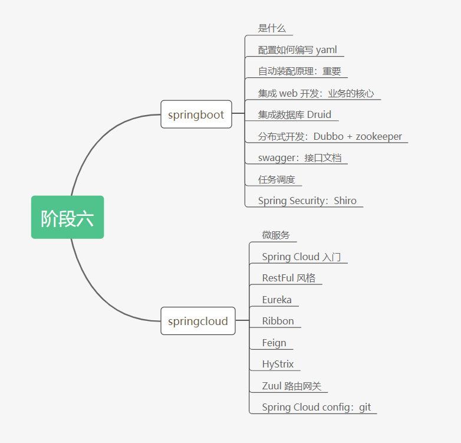
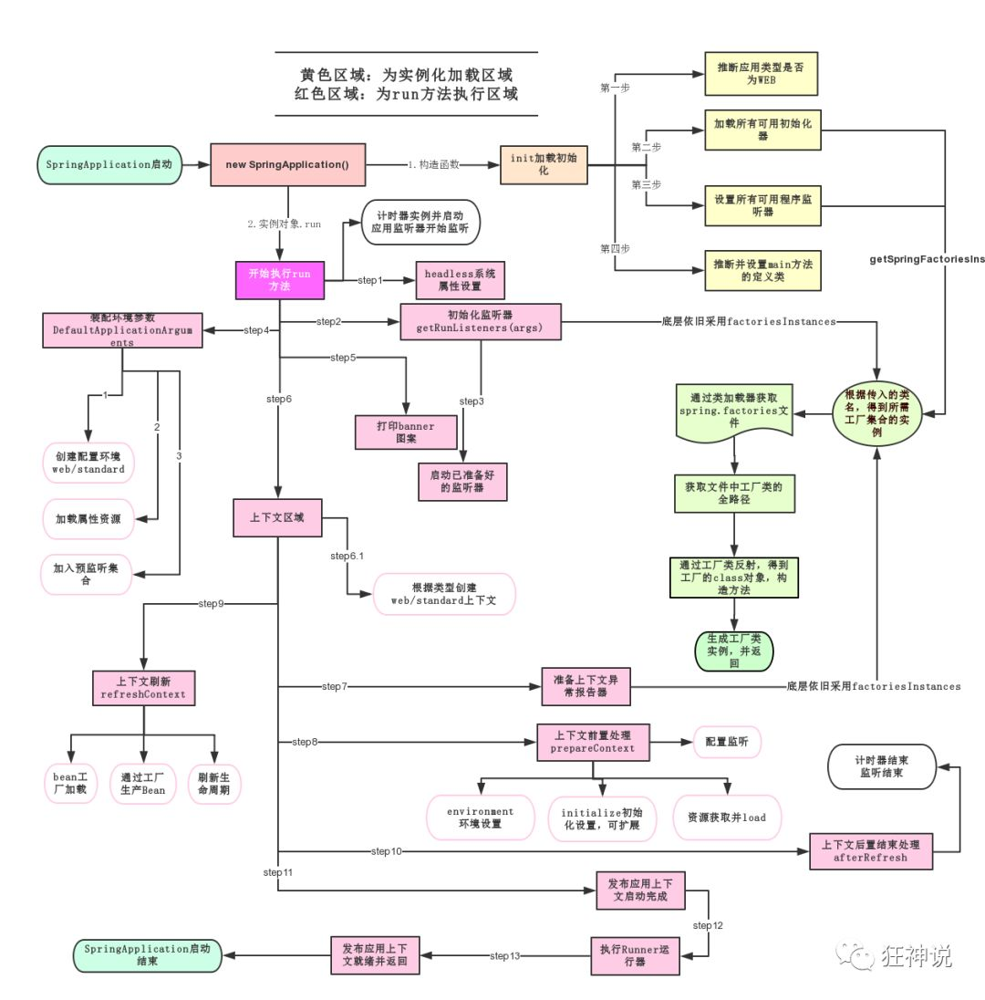
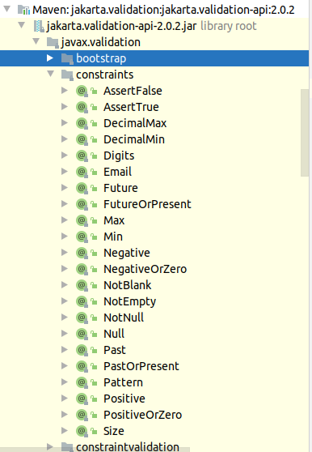

微服务阶段

Java SE：OOP

MySQL：持久化

HTML + CSS + JS + jQuery + 框架：视图，框架不熟练，CSS 不熟练；

Java Web：独立开发 MVC 三层架构的网站：原始；

SSM 框架：简化了开发流程，配置开始变得复杂起来。

war包：Tomcat 运行


Spring 再简化：Spring Boot，导出 jar 包，内嵌 Tomcat；微服务架构！

服务越来越多：Spring Cloud。





# 1. Spring Boot 简介

## 1.1 回顾什么是 Spring

Spring是一个开源框架，2003 年兴起的一个轻量级的Java 开发框架，作者：Rod Johnson  。

**Spring是为了解决企业级应用开发的复杂性而创建的，简化开发。**


## 1.2 Spring是如何简化Java开发的

为了降低Java开发的复杂性，Spring采用了以下4种关键策略：

1、基于POJO的轻量级和最小侵入性编程，所有东西都是bean；

2、通过IOC，依赖注入（DI）和面向接口实现松耦合；

3、基于切面（AOP）和惯例进行声明式编程；

4、通过切面和模版减少样式代码，RedisTemplate，xxxTemplate；

## 1.3 什么是 Spring Boot

Spring Boot 基于 Spring 开发，Spring Boot 本身并不提供 Spring 框架的核心特性以及扩展功能，只是用于快速、敏捷地开发新一代基于 Spring 框架的应用程序。也就是说，它并不是用来替代 Spring 的解决方案，而是和 Spring 框架紧密结合用于提升 Spring 开发者体验的工具。Spring Boot 以**约定大于配置的核心思想**，默认帮我们进行了很多设置，多数 Spring Boot 应用只需要很少的 Spring 配置。同时它集成了大量常用的第三方库配置（例如 Redis、MongoDB、Jpa、RabbitMQ、Quartz 等等），Spring Boot 应用中这些第三方库几乎可以零配置的开箱即用。


**Spring Boot的主要优点：**

- 为所有Spring开发者更快的入门
- **开箱即用**，提供各种默认配置来简化项目配置
- 内嵌式容器简化Web项目
- 没有冗余代码生成和XML配置的要求


# 2. 微服务简介

## 2.1 背景（以 Dubbo 为例）

> http://dubbo.apache.org/zh-cn/docs/user/preface/background.html


随着互联网的发展，网站应用的规模不断扩大，常规的垂直应用架构已无法应对，分布式服务架构以及流动计算架构势在必行，亟需一个治理系统确保架构有条不紊的演进。


### 单一应用架构

当网站流量很小时，只需一个应用，将所有功能都部署在一起，以减少部署节点和成本。此时，用于简化增删改查工作量的数据访问框架(ORM)是关键。

### 垂直应用架构

当访问量逐渐增大，单一应用增加机器带来的加速度越来越小，提升效率的方法之一是将应用拆成互不相干的几个应用，以提升效率。此时，用于加速前端页面开发的Web框架(MVC)是关键。

### 分布式服务架构

当垂直应用越来越多，应用之间交互不可避免，将核心业务抽取出来，作为独立的服务，逐渐形成稳定的服务中心，使前端应用能更快速的响应多变的市场需求。此时，用于提高业务复用及整合的分布式服务框架(RPC)是关键。

### 流动计算架构

当服务越来越多，容量的评估，小服务资源的浪费等问题逐渐显现，此时需增加一个调度中心基于访问压力实时管理集群容量，提高集群利用率。此时，用于提高机器利用率的资源调度和治理中心(SOA)是关键。

## 2.2 需求


在大规模服务化之前，应用可能只是通过 RMI 或 Hessian 等工具，简单的暴露和引用远程服务，通过配置服务的URL地址进行调用，通过 F5 等硬件进行负载均衡。

**当服务越来越多时，服务 URL 配置管理变得非常困难，F5 硬件负载均衡器的单点压力也越来越大。** 此时需要一个服务注册中心，动态地注册和发现服务，使服务的位置透明。并通过在消费方获取服务提供方地址列表，实现软负载均衡和 Failover，降低对 F5 硬件负载均衡器的依赖，也能减少部分成本。

**当进一步发展，服务间依赖关系变得错踪复杂，甚至分不清哪个应用要在哪个应用之前启动，架构师都不能完整的描述应用的架构关系。** 这时，需要自动画出应用间的依赖关系图，以帮助架构师理清关系。

**接着，服务的调用量越来越大，服务的容量问题就暴露出来，这个服务需要多少机器支撑？什么时候该加机器？** 为了解决这些问题，第一步，要将服务现在每天的调用量，响应时间，都统计出来，作为容量规划的参考指标。其次，要可以动态调整权重，在线上，将某台机器的权重一直加大，并在加大的过程中记录响应时间的变化，直到响应时间到达阈值，记录此时的访问量，再以此访问量乘以机器数反推总容量。

以上是 Dubbo 最基本的几个需求。


# 3. Sprint Boot 原理与配置

父依赖：

```xml
<parent>
    <groupId>org.springframework.boot</groupId>
    <artifactId>spring-boot-starter-parent</artifactId>
    <version>2.3.2.RELEASE</version>
    <relativePath/> <!-- lookup parent from repository -->
</parent>
```

父依赖还有一个父依赖：

```xml
<parent>
    <groupId>org.springframework.boot</groupId>
    <artifactId>spring-boot-dependencies</artifactId>
    <version>2.3.2.RELEASE</version>
</parent>
```

这里才是真正管理SpringBoot应用里面所有依赖版本的地方，SpringBoot的版本控制中心；

**以后我们导入依赖默认是不需要写版本；但是如果导入的包没有在依赖中管理着就需要手动配置版本了；**


## 3.1 启动器 spring-boot-starter

```xml
<dependency>
    <groupId>org.springframework.boot</groupId>
    <artifactId>spring-boot-starter-websocket</artifactId>
</dependency>
```


**springboot-boot-starter-xxx**：就是spring-boot的场景启动器

**spring-boot-starter-web**：帮我们导入了web模块正常运行所依赖的组件；

SpringBoot将所有的功能场景都抽取出来，做成一个个的starter （启动器），只需要在项目中引入这些starter即可，所有相关的依赖都会导入进来 ， 我们要用什么功能就导入什么样的场景启动器即可 ；我们未来也可以自己自定义 starter；


主启动类：

```java
@SpringBootApplication
public class HelloworldApplication {

    public static void main(String[] args) {
        SpringApplication.run(HelloworldApplication.class, args);
    }

}

```


结论： spring boot 所有自动配置都是在启动的时候扫描并加载：`spring.factories` 所有的自动配置类都在这里，但是不一定生效，要判断条件是否成立，只要导入了对应的 start，就有了对应的启动器，有了启动器自动装配就会生效，然后就配置成功了。


## 3.2 Spring Boot 自动装载流程

1. Spring Boot 在启动时，从类路径下 `/META-INF/spring.factories` 获取指定的值；
2. 将这些自动配置的类导入容器，自动配置就会生效，帮我们进行自动配置；
3. 以前我们需要自动配置的东西，现在 Spring Boot 帮我们做了；
4. 整合 Java EE，解决方案和自动配置的东西都在 `spring-boot-autoconfigure-2.3.2.RELEASE.jar` 中；
5. 它会所有需要导入的组件，以类名的方式返回，这些组件就会被添加到容器；
6. 容器中也会存在非常多的 `XXXAutoConfiguration` 的文件（`@Bean`），就是这些类给容器中导入了这个场景需要的所有组件；冰冻配置， @Configuration， JavaConfig；
7. 有了自动配置类，免去了我们自动手写编写配置文件的工作。


## 3.3 SpringApplication


### 不简单的方法

我最初以为就是运行了一个main方法，没想到却开启了一个服务；

```Java
@SpringBootApplicationpublic 
class SpringbootApplication {  
    public static void main(String[] args) {  
        SpringApplication.run(SpringbootApplication.class, args);    
    }
}
```

**SpringApplication.run分析**

分析该方法主要分两部分，一部分是SpringApplication的实例化，二是run方法的执行；

### SpringApplication

**这个类主要做了以下四件事情：**

1、推断应用的类型是普通的项目还是Web项目

2、查找并加载所有可用初始化器 ， 设置到initializers属性中

3、找出所有的应用程序监听器，设置到listeners属性中

4、推断并设置main方法的定义类，找到运行的主类

查看构造器：

```java

public SpringApplication(ResourceLoader resourceLoader, Class... primarySources) {
    // ......
    this.webApplicationType = WebApplicationType.deduceFromClasspath();
    this.setInitializers(this.getSpringFactoriesInstances();
    this.setListeners(this.getSpringFactoriesInstances(ApplicationListener.class));
    this.mainApplicationClass = this.deduceMainApplicationClass();
}
```


### run 方法流程分析





关于 Spring Boot，谈谈你的理解：

* 自动装配；
* run() 方法。


## 3.4 yaml概述

YAML是 "YAML Ain't a Markup Language" （YAML不是一种标记语言）的递归缩写。在开发的这种语言时，YAML 的意思其实是："Yet Another Markup Language"（仍是一种标记语言）

以前的配置文件，大多数都是使用xml来配置；比如一个简单的端口配置，我们来对比下yaml和xml

传统xml配置：

```xml
<server>    
    <port>8081</port>
</server>
```

yaml配置：

```yaml
server:  
  port: 8080
```


### yaml语法和赋值

说明：语法要求严格！

1、空格不能省略

2、以缩进来控制层级关系，只要是左边对齐的一列数据都是同一个层级的。

3、属性和值的大小写都是十分敏感的。

springboot使用一个全局的配置文件,配置文件名称是固定的

- application.properties

  - key=value

- applicaton.yaml

  - key: value (注意:后面的空格)

  - ```yaml
    server:
      port: 8081
    ```

同时yaml可以用来存放对象,数组

```yaml
#对象
boy:
  name: jay
  age: 5
#行内写法
girl: {name: lily,age: 1}

# list
fruits:
  - apple
  - banana
  - peach
#行内写法
pets: [cat,dog,pig]
```

------

通过yaml赋值

```yaml
# k=v
person:
  name: jay${random.int}
  age: 26
  happy: true
  birthday: 2020/07/27
  maps: {k1: v1,k2: v2}
  hello: hi
  lists:
    - code
    - music
    - girl
  dog:
    name: ${person.hello:hello}_gg
    age: 3

```

在原实体类加上

```java
@ConfigurationProperties(prefix = "person")
```

测试类

```java
@Autowired
private Person person;
```

------

出现的提示

```
Spring Boot Configuration Annotation Processor not found in classpath
```

解决方法: 添加依赖

```pom
<dependency>
	<groupId>org.springframework.boot</groupId>
	<artifactId>spring-boot-configuration-processor</artifactId>
	<optional>true</optional>
</dependency>
```


在实体类上添加注解 `@Component` 和 `@ConfigurationProperties(prefix = "person")`，导入 yaml 中定义的配置。

```Java
@Component
@ConfigurationProperties(prefix = "person")
public class Person {
    private String name;
    private Integer age;
    private Boolean happy;
    private Date birthday;
    private Map<String, Object> maps;
    private List<Object> lists;
    private Dog dog;
	
	// cons
	// getters setters
	// toString
}
```


## 3.5 JSR-303

### Bean Validation 中的 constraint

### 表 1. Bean Validation 中内置的 constraint

| **Constraint**                | **详细信息**                                             |
| :---------------------------- | :------------------------------------------------------- |
| `@Null`                       | 被注释的元素必须为 `null`                                |
| `@NotNull`                    | 被注释的元素必须不为 `null`                              |
| `@AssertTrue`                 | 被注释的元素必须为 `true`                                |
| `@AssertFalse`                | 被注释的元素必须为 `false`                               |
| `@Min(value)`                 | 被注释的元素必须是一个数字，其值必须大于等于指定的最小值 |
| `@Max(value)`                 | 被注释的元素必须是一个数字，其值必须小于等于指定的最大值 |
| `@DecimalMin(value)`          | 被注释的元素必须是一个数字，其值必须大于等于指定的最小值 |
| `@DecimalMax(value)`          | 被注释的元素必须是一个数字，其值必须小于等于指定的最大值 |
| `@Size(max, min)`             | 被注释的元素的大小必须在指定的范围内                     |
| `@Digits (integer, fraction)` | 被注释的元素必须是一个数字，其值必须在可接受的范围内     |
| `@Past`                       | 被注释的元素必须是一个过去的日期                         |
| `@Future`                     | 被注释的元素必须是一个将来的日期                         |
| `@Pattern(value)`             | 被注释的元素必须符合指定的正则表达式                     |

### 表 2. Hibernate Validator 附加的 constraint

| **Constraint** | **详细信息**                           |
| :------------- | :------------------------------------- |
| `@Email`       | 被注释的元素必须是电子邮箱地址         |
| `@Length`      | 被注释的字符串的大小必须在指定的范围内 |
| `@NotEmpty`    | 被注释的字符串的必须非空               |
| `@Range`       | 被注释的元素必须在合适的范围内         |

一个 constraint 通常由 annotation 和相应的 constraint validator 组成，它们是一对多的关系。也就是说可以有多个 constraint validator 对应一个 annotation。在运行时，Bean Validation 框架本身会根据被注释元素的类型来选择合适的 constraint validator 对数据进行验证。

有些时候，在用户的应用中需要一些更复杂的 constraint。Bean Validation 提供扩展 constraint 的机制。可以通过两种方法去实现，一种是组合现有的 constraint 来生成一个更复杂的 constraint，另外一种是开发一个全新的 constraint。


在 validation jar包中




## 3.6 多环境配置及配置文件位置

profile是Spring对不同环境提供不同配置功能的支持，可以通过激活不同的环境版本，实现快速切换环境；

### 多配置文件

多环境配置的 application.yaml 文件按以下顺序开始扫描，

`classpath:/,classpath:/config/,file:./,file:./config/*/,file:./config/` 

因此以下顺序的配置文件优先级递减：

1. `file:./config/`
2. `file:./config/*/`
3. `file:./`
4. `classpath:/config/`
5. `classpath:/`


我们在主配置文件编写的时候，文件名可以是 application-{profile}.properties/yml , 用来指定多个环境版本；

**例如：**

application-test.properties 代表测试环境配置

application-dev.properties 代表开发环境配置

但是Springboot并不会直接启动这些配置文件，它**默认使用application.properties主配置文件**；

我们需要通过一个配置来选择需要激活的环境：

```properties
#比如在配置文件中指定使用dev环境，我们可以通过设置不同的端口号进行测试；
#我们启动SpringBoot，就可以看到已经切换到dev下的配置了；
spring.profiles.active=dev
```

### yaml的多文档块

在一个 yaml 文件中多环境配置：

```yaml
server:
  port: 8081
spring:
  profiles:
    active: test
---
server:
  port: 8082
spring:
  profiles: dev

---
server:
  port: 8083
spring:
  profiles: test
```


## 3.7 自动配置原理再理解


```Java
// 表示这是一个配置类
@Configuration(proxyBeanMethods = false)

//启动指定类的 ConfigurationProperties 功能；
  //进入这个 ServerProperties 查看，将配置文件中对应的值和 ServerProperties 绑定起来；
  //并把 ServerProperties 加入到ioc容器中
@EnableConfigurationProperties(ServerProperties.class)

//Spring底层 @Conditional 注解
  //根据不同的条件判断，如果满足指定的条件，整个配置类里面的配置就会生效；
  //这里的意思就是判断当前应用是否是web应用，如果是，当前配置类生效
@ConditionalOnWebApplication(
    type = ConditionalOnWebApplication.Type.SERVLET
)
@ConditionalOnClass(CharacterEncodingFilter.class)
//判断配置文件中是否存在某个配置：server.servlet.encoding.enabled；
  //如果不存在，判断也是成立的
  //即使我们配置文件中不配置 server.servlet.encoding.enabled=true，也是默认生效的；
@ConditionalOnProperty(
    prefix = "server.servlet.encoding", 
    value = "enabled", 
    matchIfMissing = true)
public class HttpEncodingAutoConfiguration {
    // ..
}
```

**一句话总结 ：根据当前不同的条件判断，决定这个配置类是否生效！**

- 一但这个配置类生效；这个配置类就会给容器中添加各种组件；

- 这些组件的属性是从对应的properties类中获取的，这些类里面的每一个属性又是和配置文件绑定的；

- 所有在配置文件中能配置的属性都是在xxxxProperties类中封装着；

- 配置文件能配置什么就可以参照某个功能对应的这个属性类

  ```java
  @ConfigurationProperties(prefix = "server", ignoreUnknownFields = true)
  public class ServerProperties {
  	// ...
  }
  ```

  

总结：

1、SpringBoot启动会加载大量的自动配置类

2、我们看我们需要的功能有没有在SpringBoot默认写好的自动配置类当中；

3、我们再来看这个自动配置类中到底配置了哪些组件；（只要我们要用的组件存在在其中，我们就不需要再手动配置了）

4、给容器中自动配置类添加组件的时候，会从properties类中获取某些属性。我们只需要在配置文件中指定这些属性的值即可；

**xxxxAutoConfigurartion：自动配置类；**给容器中添加组件

**xxxxProperties:封装配置文件中相关属性；**


# 4. Spring Boot Web 开发

jar：webapp！

自动装配

* **xxxxAutoConfigurartion：自动配置类；**给容器中添加组件
* **xxxxProperties:封装配置文件中相关属性；**


要解决的问题：

1. 导入静态资源；
2. 首页；
3. JSP，模板引擎 Thymeleaf
4. 装配拓展 Spring MVC
5. 增删改查
6. 拦截器
7. 国际化


## 4.1 静态资源导入


```Java
@Override
public void addResourceHandlers(ResourceHandlerRegistry registry) {
    if (!this.resourceProperties.isAddMappings()) {
        logger.debug("Default resource handling disabled");
        return;
    }
    Duration cachePeriod = this.resourceProperties.getCache().getPeriod();
    CacheControl cacheControl = this.resourceProperties.getCache().getCachecontrol().toHttpCacheControl();
    if (!registry.hasMappingForPattern("/webjars/**")) {
        customizeResourceHandlerRegistration(registry.addResourceHandler("/webjars/**")
                                             .addResourceLocations("classpath:/META-INF/resources/webjars/")
                                             .setCachePeriod(getSeconds(cachePeriod)).setCacheControl(cacheControl));
    }
    String staticPathPattern = this.mvcProperties.getStaticPathPattern();
    if (!registry.hasMappingForPattern(staticPathPattern)) {
        customizeResourceHandlerRegistration(registry.addResourceHandler(staticPathPattern)
                                             .addResourceLocations(getResourceLocations(this.resourceProperties.getStaticLocations()))
                                             .setCachePeriod(getSeconds(cachePeriod)).setCacheControl(cacheControl));
    }
}
```


1. 在 Spring Boot 中，获取静态资源的方式：
   * webjars	`localhost:8080/webjars/`
   * public，static，resources，/**  `localhost:8080/`
2. 优先级： resources > static（默认）> public


