# SpringMVC

ssm：MyBatis + Spring + SpringMVC **MVC三层架构**


JavaSE：认真学习，老师带，入门快

JavaWeb：认真学习，老师带，入门快

SSM 框架：研究官方文档，锻炼自学能力，锻炼笔记能力，锻炼项目能力


SpringMVC + Vue + SpringBoot + SpringCloud + Linux


Spring：IOC 和 AOP

SpringMVC：SpringMVC 的执行流程。

SpringMVC：SSM框架整合。


# 1. 回顾 MVC

## 1.1 什么是 MVC

MVC：模型（dao，service） 视图（JSP） 控制器（Servlet）

**Model（模型）：**数据模型，提供要展示的数据，因此包含数据和行为，可以认为是领域模型或JavaBean组件（包含数据和行为），不过现在一般都分离开来：Value Object（数据Dao） 和 服务层（行为Service）。也就是模型提供了模型数据查询和模型数据的状态更新等功能，包括数据和业务。

**View（视图）：**负责进行模型的展示，一般就是我们见到的用户界面，客户想看到的东西。

**Controller（控制器）：**接收用户请求，委托给模型进行处理（状态改变），处理完毕后把返回的模型数据返回给视图，由视图负责展示。也就是说控制器做了个调度员的工作。

**最典型的MVC就是JSP + servlet + javabean的模式。**


dao

service

servlet：转发，重定向

JSP/html


前端	数据传输	实体类

实体类：用户名，密码，生日，爱好 等

前端：用户名， 密码

| POJO | User   |
| ---- | ------ |
| VO   | userVo |


JSP：本质是一个Servlet


假设：你的项目的架构，是设计好的，还是演进的？


## 1.2 Servlet 回顾

1. 新建maven 父工程项目，导入 maven 依赖：

   ``` XML
   <dependencies>
       <dependency>
           <groupId>junit</groupId>
           <artifactId>junit</artifactId>
           <version>4.12</version>
           <scope>test</scope>
       </dependency>
       <dependency>
           <groupId>org.springframework</groupId>
           <artifactId>spring-webmvc</artifactId>
           <version>5.2.7.RELEASE</version>
       </dependency>
       <dependency>
           <groupId>javax.servlet</groupId>
           <artifactId>servlet-api</artifactId>
           <version>2.5</version>
       </dependency>
       <dependency>
           <groupId>javax.servlet.jsp</groupId>
           <artifactId>jsp-api</artifactId>
           <version>2.2</version>
       </dependency>
       <dependency>
           <groupId>javax.servlet</groupId>
           <artifactId>jstl</artifactId>
           <version>1.2</version>
       </dependency>
   </dependencies>
   ```

2. 创建一个 Module： springmvc-01-servlet，添加 Web 框架支持

   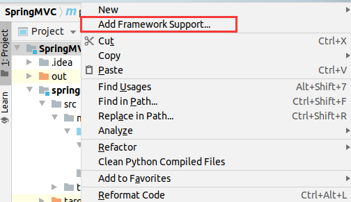

   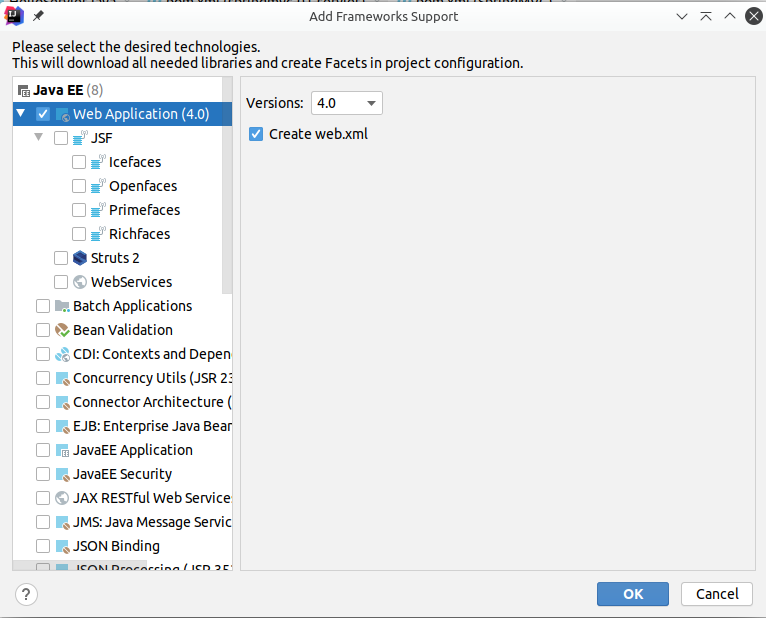

3. 导入 servlet 和 jsp 的 maven 依赖（如果父工程已经导入相关依赖，可省略）：

   ``` XML
   <dependencies>
       <dependency>
           <groupId>javax.servlet.jsp</groupId>
           <artifactId>jsp-api</artifactId>
           <version>2.2</version>
       </dependency>
       <dependency>
           <groupId>javax.servlet</groupId>
           <artifactId>jstl</artifactId>
           <version>1.2</version>
       </dependency>
   
   </dependencies>
   ```

4. 编写一个 Servlet 类，用来处理用户的请求，`HelloServlet` 继承了 `HttpServet` ，重写了 `doGet` 和 `doPost` 方法：

   ``` java
   public class HelloServlet extends HttpServlet {
       @Override
       protected void doGet(HttpServletRequest req, HttpServletResponse resp) throws ServletException, IOException {
           System.out.println("enter in HelloServlet.");
           // get front-end parameters
           String method = req.getParameter("method");
           if (Objects.equals(method, "add")) {
               req.getSession().setAttribute("msg", "Executed add method");
           }
           if (Objects.equals(method, "delete")) {
               req.getSession().setAttribute("msg", "Executed delete method");
           }
           // invoke service layer
   
           // view forward or redirect
           req.getRequestDispatcher("/WEB-INF/jsp/hello.jsp").forward(req, resp);
       }
   
       @Override
       protected void doPost(HttpServletRequest req, HttpServletResponse resp) throws ServletException, IOException {
           doGet(req, resp);
       }
   }
   ```

5. 编写 `hello.jsp`，在 WEB-INF 目录下创建 jsp 目录，创建 `hello.jsp`：

   ``` jsp
   <%@ page contentType="text/html;charset=UTF-8" language="java" %>
   <html>
   <head>
       <title>Title</title>
   </head>
   <body>
   <h1> hello.jsp </h1>
   ${msg}
   </body>
   </html>
   
   ```

6. 在 web.xml 中注册 `HelloServlet`：

   ``` xml
   <?xml version="1.0" encoding="UTF-8"?>
   <web-app xmlns="http://xmlns.jcp.org/xml/ns/javaee"
            xmlns:xsi="http://www.w3.org/2001/XMLSchema-instance"
            xsi:schemaLocation="http://xmlns.jcp.org/xml/ns/javaee http://xmlns.jcp.org/xml/ns/javaee/web-app_4_0.xsd"
            version="4.0">
   
       <servlet>
           <servlet-name>hello</servlet-name>
           <servlet-class>com.jay.servlet.HelloServlet</servlet-class>
       </servlet>
       <servlet-mapping>
           <servlet-name>hello</servlet-name>
           <url-pattern>/hello</url-pattern>
       </servlet-mapping>
   
       <session-config>
           <session-timeout>15</session-timeout>
       </session-config>
   
       <welcome-file-list>
           <welcome-file>index.jsp</welcome-file>
       </welcome-file-list>
   
   </web-app>
   ```

7. 配置 Tomcat 容器，启动测试：

   * localhost:8080/hello?method=add
   * localhost:8080/hello?method=delete


如果出现 404 找不到 hello.jsp，可能是用 IDEA 打包的 war 包中没有 lib，重新创建 artifact 或者 手动创建 `/lib` 目录导入依赖包。


MVC 框架的工作流程：

1. 将 URL 映射到 Java 类或 Java 类的方法；
2. 封装用户提交的数据；
3. 处理请求，调用相关的业务处理，封装响应数据；
4. 将相应的数据进行渲染，JSP/HTML 等表示层数据。


# 2. Spring MVC 

## 2.1 什么是 Spring MVC

> Spring Web MVC is the original web framework built on the Servlet API and has been included in the Spring Framework from the very beginning. The formal name, “Spring Web MVC,” comes from the name of its source module ([`spring-webmvc`](https://github.com/spring-projects/spring-framework/tree/master/spring-webmvc)), but it is more commonly known as “Spring MVC”.

Spring MVC 又名 Spring Web MVC， 是一个基于 Servlet 的原生 web 框架。Spring MVC 从最开始就被加入到 Spring 框架中。


Spring MVC 的特定：

1. 轻量级框架，简单易学；
2. 高效，基于请求响应的 MVC 框架；
3. 与 Spring 兼容性好，无缝结合；
4. 约定优于配置；
5. 功能强大：RESTful、数据验证、格式化、本地化、主题等；
6. 简洁灵活。


## 2.2 DispatcherServlet

> Spring MVC, as many other web frameworks, is designed around the front controller pattern where a central `Servlet`, the `DispatcherServlet`, provides a shared algorithm for request processing, while actual work is performed by configurable delegate components. This model is flexible and supports diverse workflows.
>
> The `DispatcherServlet`, as any `Servlet`, needs to be declared and mapped according to the Servlet specification by using Java configuration or in `web.xml`. In turn, the `DispatcherServlet` uses Spring configuration to discover the delegate components it needs for request mapping, view resolution, exception handling, [and more](https://docs.spring.io/spring/docs/5.2.7.RELEASE/spring-framework-reference/web.html#mvc-servlet-special-bean-types).


Spring MVC 和许多其它的 web 框架一样，是围绕着 `DispatcherServlet` 前端控制模块进行设计的。`DispatcherServlet` 对配置的委托组件产生的请求提供一个共享的处理算法。这个 model 可扩展，并且支持多种工作流。

与任何 `Servlet` 一样，我们需要在 `web.xml` 配置文件中声明和映射 `DispatcherServlet`。反过来，`DispatcherServlet` 使用 Spring 配置来发现请求映射，视图解析，异常处理等所需的委托组件。


## 2.3 Spring MVC 原理分析

Spring MVC 原理示意图：


* `DispacherServlet` ：
  * 表示前端控制器，是整个 SpringMVC 的控制中心。
* `HandlerMapping` ，处理器映射器：
  * 通过 URL 映射到某个特定 `HandlerExecutionChain`。
* `HandlerAdapter`，处理器适配器 ：
  * 根据传入的 `handler` 来定位 `Controller`。
* ``ViewResolver` `，视图解析器：
  * 解析视图。

使用注解 `<mvc:annotation-driven/>` 可以配置默认的 `HanlerMapper` 和 `HandlerAdapter`。


`Spring MVC` 处理流程：

1. `DispacherServlet` 接收并拦截用户发出的 request；（步骤1）
2. `DispatcherServlet` 调用 `HandlerMapping` 得到其中的 `handler` ；（步骤2，3，4）
3. `DispatcherServlet` 调用 `HandlerAdapter` 得到相应的 `Controller`，`Controller` 通过执行响应的业务逻辑，返回`ModelAndView`；（步骤5，6，7，8）
4. `DispatcherServlet` 调用 `ViewResolver` 解析页面并跳转到响应页面；（步骤9，10，11）
5. 返回页面内容给用户。（步骤12）

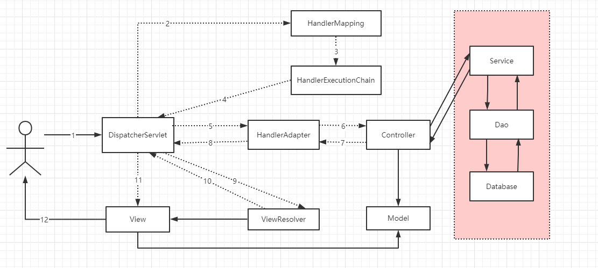

上述原理图中的虚线部分都可以使用 Spring MVC 默认配置实现，实现部分需要程序员自行实现。

尤其是控制器 `Controller` ，它负责解析用户的请求并将其转换为一个模型。

## 2.4 配置版 HelloSpringMVC

实现 `Controller` 的方式有两种，本小节介绍使用实现 `Controller` 接口并重写 `handlerRequest` 方法的方式：

[Controller](https://docs.spring.io/spring/docs/5.2.7.RELEASE/javadoc-api/org/springframework/web/servlet/mvc/Controller.html) 接口：

``` Java

@FunctionalInterface
public interface Controller {

	/**
	 * Process the request and return a ModelAndView object which the DispatcherServlet
	 * will render. A {@code null} return value is not an error: it indicates that
	 * this object completed request processing itself and that there is therefore no
	 * ModelAndView to render.
	 * @param request current HTTP request
	 * @param response current HTTP response
	 * @return a ModelAndView to render, or {@code null} if handled directly
	 * @throws Exception in case of errors
	 */
	@Nullable
	ModelAndView handleRequest(HttpServletRequest request, HttpServletResponse response) throws Exception;

}

```


示例代码：

1. 新建Module，springmvc-03-hellomvc，添加 web 支持，解决资源过滤问题：

   ``` xml
   <build>
      <resources>
          <resource>
              <directory>src/main/java</directory>
              <includes>
                  <include>**/*.properties</include>
                  <include>**/*.xml</include>
              </includes>
              <filtering>false</filtering>
          </resource>
          <resource>
              <directory>src/main/resources</directory>
              <includes>
                  <include>**/*.properties</include>
                  <include>**/*.xml</include>
              </includes>
              <filtering>false</filtering>
          </resource>
      </resources>
   </build>
   ```

2. web.xml 注册 `DispatcherServlet`：

   ``` XML
   <?xml version="1.0" encoding="UTF-8"?>
   <web-app xmlns="http://xmlns.jcp.org/xml/ns/javaee"
            xmlns:xsi="http://www.w3.org/2001/XMLSchema-instance"
            xsi:schemaLocation="http://xmlns.jcp.org/xml/ns/javaee http://xmlns.jcp.org/xml/ns/javaee/web-app_4_0.xsd"
            version="4.0">
   
       <!--1.注册DispatcherServlet-->
       <servlet>
           <servlet-name>springmvc</servlet-name>
           <servlet-class>org.springframework.web.servlet.DispatcherServlet</servlet-class>
           <!--关联一个springmvc的配置文件:【servlet-name】-servlet.xml-->
           <init-param>
               <param-name>contextConfigLocation</param-name>
               <param-value>classpath:springmvc-servlet.xml</param-value>
           </init-param>
           <!--启动级别-1-->
           <load-on-startup>1</load-on-startup>
       </servlet>
   
       <!--/ 匹配所有的请求；（不包括.jsp）-->
       <!--/* 匹配所有的请求；（包括.jsp）-->
       <servlet-mapping>
           <servlet-name>springmvc</servlet-name>
           <url-pattern>/</url-pattern>
       </servlet-mapping>
   
   </web-app>
   ```

3. 编写 `HelloController.java` 控制器，用于操作业务，可以用实现 `Controller` 接口，也可以添加注解。返回一个存放数据，封装视图的 `ModelAndView` 对象：

   ```Java
   public class HelloController implements Controller {
       @Override
       public ModelAndView handleRequest(HttpServletRequest request, HttpServletResponse response) throws Exception {
           //ModelAndView 模型和视图
           ModelAndView mv = new ModelAndView();
   
           //封装对象，放在ModelAndView中。Model
           mv.addObject("msg", "HelloSpringMVC!");
           //封装要跳转的视图，放在ModelAndView中
           mv.setViewName("hello"); //: /WEB-INF/jsp/hello.jsp
           return mv;
       }
   }
   
   ```

4. 在 `Springmvc-servlet.xml`（DispatcherServlet 注册时指定配置文件）中注册 Bean：

   ``` xml
   <?xml version="1.0" encoding="UTF-8"?>
   <beans xmlns="http://www.springframework.org/schema/beans"
          xmlns:xsi="http://www.w3.org/2001/XMLSchema-instance"
          xsi:schemaLocation="http://www.springframework.org/schema/beans
          http://www.springframework.org/schema/beans/spring-beans.xsd">
   
       <bean id="/hello" class="com.jay.controller.HelloController"/>
   
   </beans>
   ```

5. 添加处理映射器，处理器适配器和视图解析器：

   ``` xml
   <?xml version="1.0" encoding="UTF-8"?>
   <beans xmlns="http://www.springframework.org/schema/beans"
          xmlns:xsi="http://www.w3.org/2001/XMLSchema-instance"
          xsi:schemaLocation="http://www.springframework.org/schema/beans
          http://www.springframework.org/schema/beans/spring-beans.xsd">
   
       <bean class="org.springframework.web.servlet.handler.BeanNameUrlHandlerMapping"/>
       <bean class="org.springframework.web.servlet.mvc.SimpleControllerHandlerAdapter"/>
   
       <!--视图解析器:DispatcherServlet给他的ModelAndView-->
       <bean class="org.springframework.web.servlet.view.InternalResourceViewResolver" id="InternalResourceViewResolver">
           <!--前缀-->
           <property name="prefix" value="/WEB-INF/jsp/"/>
           <!--后缀-->
           <property name="suffix" value=".jsp"/>
       </bean>
   
       <bean id="/hello" class="com.jay.controller.HelloController"/>
   
   </beans>
   ```

6. 写 `HelloController`中指定的跳转界面，路径为 `/WEB-INF/jsp/hello.jsp`：

   ``` jsp
   <%@ page contentType="text/html;charset=UTF-8" language="java" %>
   <html>
   <head>
       <title>Title</title>
   </head>
   <body>
   ${msg}
   </body>
   </html>
   ```

7. 配置启动 Tomcat，测试跳转：

   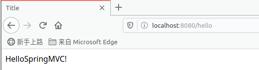


## 2.5 注解版 HelloSpringMVC

本小节介绍使用添加 `@Controller` 注解的方式实现 Controller ，在Controller 类上添加 `@Controller` 注解，表明由 Spring 托管此类，可以在类中添加多个方法，实现不同的 `Controller` 功能，简化了开发过程。

工作中常用的就是注解方式。


示例代码：

1. 新建 Module，springmvc-03-helloannotation，添加 web 框架，解决资源过滤问题：

   ```xml
   <build>
      <resources>
          <resource>
              <directory>src/main/java</directory>
              <includes>
                  <include>**/*.properties</include>
                  <include>**/*.xml</include>
              </includes>
              <filtering>false</filtering>
          </resource>
          <resource>
              <directory>src/main/resources</directory>
              <includes>
                  <include>**/*.properties</include>
                  <include>**/*.xml</include>
              </includes>
              <filtering>false</filtering>
          </resource>
      </resources>
   </build>
   ```

2. `web.xml` 中注册 `DispatcherServlet`，指定 `springmvc-servlet.xml` 配置文件路径，设置启动级别为 1，和 Tomcat 同时启动：

   ``` xml
   <?xml version="1.0" encoding="UTF-8"?>
   <web-app xmlns="http://xmlns.jcp.org/xml/ns/javaee"
            xmlns:xsi="http://www.w3.org/2001/XMLSchema-instance"
            xsi:schemaLocation="http://xmlns.jcp.org/xml/ns/javaee http://xmlns.jcp.org/xml/ns/javaee/web-app_4_0.xsd"
            version="4.0">
   
       <servlet>
           <servlet-name>springmvc</servlet-name>
           <servlet-class>org.springframework.web.servlet.DispatcherServlet</servlet-class>
           <init-param>
               <param-name>contextConfigLocation</param-name>
               <param-value>classpath:springmvc-servlet.xml</param-value>
           </init-param>
   
           <load-on-startup>1</load-on-startup>
       </servlet>
   
       <!--
   	/ 表示匹配所有请求，但不会匹配到 jsp
    	/* 表示匹配所有请求，并且可以匹配到 *.jsp
   	-->   
       <servlet-mapping>
           <servlet-name>springmvc</servlet-name>
           <url-pattern>/</url-pattern>
       </servlet-mapping>
   
   </web-app>
   ```

3. `springmvc-servlet.xml`：

   ``` xml
   <?xml version="1.0" encoding="UTF-8"?>
   <beans xmlns="http://www.springframework.org/schema/beans"
          xmlns:xsi="http://www.w3.org/2001/XMLSchema-instance"
          xmlns:context="http://www.springframework.org/schema/context"
          xmlns:mvc="http://www.springframework.org/schema/mvc"
          xsi:schemaLocation="http://www.springframework.org/schema/beans http://www.springframework.org/schema/beans/spring-beans.xsd http://www.springframework.org/schema/context https://www.springframework.org/schema/context/spring-context.xsd http://www.springframework.org/schema/mvc https://www.springframework.org/schema/mvc/spring-mvc.xsd">
   
       <!-- 自动扫描包，让指定包下的注解生效,由IOC容器统一管理 -->
       <context:component-scan base-package="com.jay.controller"/>
       <!-- 让Spring MVC不处理静态资源 -->
       <mvc:default-servlet-handler/>
       <!--
      	支持mvc注解驱动
          在spring中一般采用@RequestMapping注解来完成映射关系
          要想使@RequestMapping注解生效
          必须向上下文中注册DefaultAnnotationHandlerMapping
          和一个AnnotationMethodHandlerAdapter实例
          这两个实例分别在类级别和方法级别处理。
          而annotation-driven配置帮助我们自动完成上述两个实例的注入。
       -->
       <mvc:annotation-driven/>
   
       <bean class="org.springframework.web.servlet.view.InternalResourceViewResolver"
             id="internalResourceViewResolver">
           <property name="prefix" value="/WEB-INF/jsp/"/>
           <property name="suffix" value=".jsp"/>
       </bean>
   
   </beans>
   ```

4. 编写 `HelloController.java`，使用注解注册 Bean：

   ```JAVA
   @Controller
   @RequestMapping("hello")
   public class HelloController {
   
       // localhost:8080/hello/h1
       @RequestMapping("/h1")
       public String hello(Model model) {
           model.addAttribute("msg", "Hello, Spring MVC Annotation!");
           return "hello";     // view resolver will handle this
       }
   }
   
   ```

   `@Controller` ，代表此类被 Spring 接管，注解下的类的方法返回值会自动跳转视图；

   `@RestController`，代表此类被 Spring 接管，注解下的类的方法返回只是一个 `String`，而不会自动跳转视图。适用于使用 JSON 格式传递数据；

   `@RequestMapping` 注解可以同时作用于类和方法上，如果作用在类上，表示类中的所有响应请求的方法都是以该地址为父路径。请求的 URL 上的请求格式为 类上注解值 + 方法上注解值：`localhost:8080/hello/h1`；

5. 写 `HelloController`中指定的跳转界面，路径为 `/WEB-INF/jsp/hello.jsp`：

   ``` jsp
   <%@ page contentType="text/html;charset=UTF-8" language="java" %>
   <html>
   <head>
       <title>Title</title>
   </head>
   <body>
   ${msg}
   </body>
   </html>
   ```

6. 配置启动 Tomcat，测试跳转：

   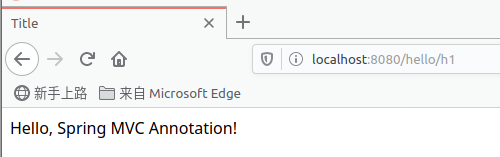


# 3. RESTful 风格

## 3.1 什么是 RESTful

REST这个词，是 [Roy Thomas Fielding](http://en.wikipedia.org/wiki/Roy_Fielding) 在他2000年的[博士论文](http://www.ics.uci.edu/~fielding/pubs/dissertation/top.htm)中提出的。他写这篇论文的目的，就是在符合架构原理的前提下，理解和评估以网络为基础的应用软件的架构设计，得到一个功能强、性能好、适宜通信的架构。

REST指的是一组架构约束条件和原则。" 如果一个架构符合REST的约束条件和原则，我们就称它为RESTful架构。


在 Restful 之前的操作：

| URL                           | 方式     | 功能                   |
| ----------------------------- | -------- | ---------------------- |
| http://127.0.0.1/user/query/1 | GET      | 根据用户id查询用户数据 |
| http://127.0.0.1/user/save    | POST     | 新增用户               |
| http://127.0.0.1/user/update  | POST     | 修改用户信息           |
| http://127.0.0.1/user/delete  | GET/POST | 删除用户信息           |


RESTful 用法：

| URL                     | 方式   | 功能                   |
| ----------------------- | ------ | ---------------------- |
| http://127.0.0.1/user/1 | GET    | 根据用户id查询用户数据 |
| http://127.0.0.1/user   | POST   | 新增用户               |
| http://127.0.0.1/user   | PUT    | 修改用户信息           |
| http://127.0.0.1/user   | DELETE | 删除用户信息           |


## 3.2 传统风格和 RESTful 风格对比

**传统风格的 URL**：`http://localhost:8080/add?a=1&b=2`

示例代码：

1. 编写 `Controller`：

   ``` Java
   @Controller
   public class RESTfulController {
   
       @RequestMapping("/add")
       public String test1(int a, int b, Model model) {
           int result = a + b;
           model.addAttribute("msg", "result: " + result);
           return "test";
       }
   }
   ```

2. 客户端访问：

   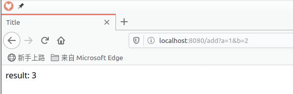


**RESTful 风格的 URL**：`http://localhost:8080/add/1/2`

示例代码：

1. 编写 `Controller`：

   ```Java
   @Controller
   public class RESTfulController {
   
       @RequestMapping("/add/{aa}/{b}")
       public String test1(@PathVariable(value = "aa") int a, @PathVariable int b, Model model) {
           int result = a + b;
           model.addAttribute("msg", "result: " + result);
           return "test";
       }
   }
   ```

2. 客户端访问：

   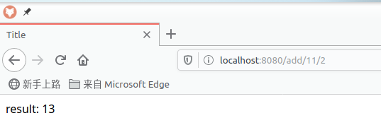


`@RequestMapping` 注解源码中有 method 属性，它是一个枚举对象，包含了 GET, HEAD, POST, PUT, PATCH, DELETE, OPTIONS, TRACE 等 HTTP 连接方式：

```Java
@Target({ElementType.TYPE, ElementType.METHOD})
@Retention(RetentionPolicy.RUNTIME)
@Documented
@Mapping
public @interface RequestMapping {
    // ...
    
	/**
	 * The HTTP request methods to map to, narrowing the primary mapping:
	 * GET, POST, HEAD, OPTIONS, PUT, PATCH, DELETE, TRACE.
	 * <p><b>Supported at the type level as well as at the method level!</b>
	 * When used at the type level, all method-level mappings inherit
	 * this HTTP method restriction (i.e. the type-level restriction
	 * gets checked before the handler method is even resolved).
	 */
	RequestMethod[] method() default {};
    
    // ...
}
```

`RequestMethod` 是一个枚举类：

```Java
public enum RequestMethod {

	GET, HEAD, POST, PUT, PATCH, DELETE, OPTIONS, TRACE

}
```


我们也可以使用组合注解来简化开发，根据请求方式的不同，方法级别的注解变体有如下几个：

```Java
//  @GetMapping` 等价于 @RequestMapping(method = RequestMethod.GeT)
@GetMapping
@PostMapping
@PutMapping
@DeleteMapping
@PatchMapping
```

使用组合注解：

```java
@Controller
public class RESTfulController {

    @GetMapping(value = "/add/{aa}/{b}")
    public String test1(@PathVariable(value = "aa") int a, @PathVariable String b, Model model) {
        String result = a + b;
        model.addAttribute("msg", "result: " + result);
        return "getTest";
    }

    @PostMapping(value = "/add/{aa}/{b}")
    public String test2(@PathVariable(value = "aa") int a, @PathVariable String b, Model model) {
        String result = a + b;
        model.addAttribute("msg", "result: " + result);
        return "postTest";
    }

}

```


## 3.2 常见 bug

总结常见 bug：

1. `@RequestMapping` 注解 `name` 属性出错。

    * 如果参数注解 `@PathVariable(value = "aa")`，为 value 赋值，而方法注解 `@RequestMapping(name="/add/{aa}/{b}")` 为 name 赋值会出现映射错误：

      ```Java
      @Controller
      public class RESTfulController {
      
          @RequestMapping(name = "/add/{aa}/{b}", method = RequestMethod.GET)
          public String test1(@PathVariable(value = "aa") int a, @PathVariable int b, Model model) {
              int result = a + b;
              model.addAttribute("msg", "result: " + result);
              return "test";
          }
      }
      ```

      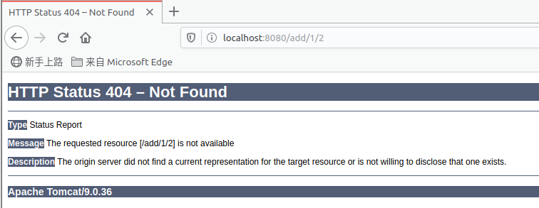
      
    * `@RequestMapping` 注解的 `name` 属性表示的是 Spring 托管映射的路径。这里应该使用 `value` 或 `path` 属性，两者互为别名，作用相同。源码如下：
    
      ```Java
      @Target({ElementType.TYPE, ElementType.METHOD})
      @Retention(RetentionPolicy.RUNTIME)
      @Documented
      @Mapping
      public @interface RequestMapping {
          // ...
          
      	/**
      	 * Assign a name to this mapping.
      	 * <p><b>Supported at the type level as well as at the method level!</b>
      	 * When used on both levels, a combined name is derived by concatenation
      	 * with "#" as separator.
      	 * @see org.springframework.web.servlet.mvc.method.annotation.MvcUriComponentsBuilder
      	 * @see org.springframework.web.servlet.handler.HandlerMethodMappingNamingStrategy
      	 */
      	String name() default "";
      
      	/**
      	 * The primary mapping expressed by this annotation.
      	 * <p>This is an alias for {@link #path}. For example,
      	 * {@code @RequestMapping("/foo")} is equivalent to
      	 * {@code @RequestMapping(path="/foo")}.
      	 * <p><b>Supported at the type level as well as at the method level!</b>
      	 * When used at the type level, all method-level mappings inherit
      	 * this primary mapping, narrowing it for a specific handler method.
      	 * <p><strong>NOTE</strong>: A handler method that is not mapped to any path
      	 * explicitly is effectively mapped to an empty path.
      	 */
      	@AliasFor("path")
      	String[] value() default {};
      
      	/**
      	 * The path mapping URIs (e.g. {@code "/profile"}).
      	 * <p>Ant-style path patterns are also supported (e.g. {@code "/profile/**"}).
      	 * At the method level, relative paths (e.g. {@code "edit"}) are supported
      	 * within the primary mapping expressed at the type level.
      	 * Path mapping URIs may contain placeholders (e.g. <code>"/${profile_path}"</code>).
      	 * <p><b>Supported at the type level as well as at the method level!</b>
      	 * When used at the type level, all method-level mappings inherit
      	 * this primary mapping, narrowing it for a specific handler method.
      	 * <p><strong>NOTE</strong>: A handler method that is not mapped to any path
      	 * explicitly is effectively mapped to an empty path.
      	 * @since 4.2
      	 */
      	@AliasFor("value")
      	String[] path() default {};
          
          // ...
      }
      ```


2. `@RequestMapping` 注解 `method` 属性出错。

   * 如果注解 `@RequestMapping` 的属性 `method` 设置为 `RequestMethod.DELETE` 而客户端浏览器默认使用 GET 方式访问，会出现类型不支持错误。

     ```Java
     @Controller
     public class RESTfulController {
     
         @RequestMapping(value = "/add/{aa}/{b}", method = RequestMethod.DELETE)
         public String test1(@PathVariable(value = "aa") int a, @PathVariable String b, Model model) {
             String result = a + b;
             model.addAttribute("msg", "result: " + result);
             return "test";
         }
     }
     ```

     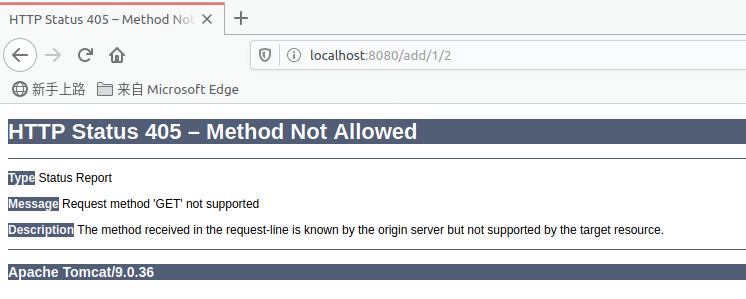

   

# 4. 视图跳转与页面处理

## 4.1 结果跳转方式

视图解析器中配置 prefix 和 suffix ，设置 ModelAndView 对象，根据 viewName 我们可以获取到完整的页面全名为 prefix + viewName + suffix。

```xml
<bean class="org.springframework.web.servlet.view.InternalResourceViewResolver"
      id="internalResourceViewResolver">
    <property name="prefix" value="/WEB-INF/jsp/"/>
    <property name="suffix" value=".jsp"/>
</bean>
```

对应的 `Controller` 类：

``` Java
public class HelloController implements Controller {

    @Override
    public ModelAndView handleRequest(HttpServletRequest request, HttpServletResponse response) throws Exception {
        ModelAndView modelAndView = new ModelAndView();

        modelAndView.addObject("msg", "Welcome to Spring MVC!");
        modelAndView.setViewName("hello");
        return modelAndView;
    }
}
```


还有使用 Servlet API 和 Spring MVC 来实现转发和重定向进行视图跳转的方式。尽管它们无需视图解析器，但是并不推荐使用。


## 4.2 数据处理

### 4.2.1 处理提交数据

1. 前端提交的属性名和处理方法的参数名一致

   * 访问 URL `http://localhost:8080/user/t1?name=jay`，其中提交的属性为 `name`，提交值为 `jay`；

   * 处理方法中的参数名也为 `name`：

     ```Java
     @Controller
     @RequestMapping("/user")
     public class UserController {
         // locahost:8080/usr/t1?name=xxx
         @GetMapping("/t1")
         public String test1(String name, Model model) {
             // get front-end request parameter
             System.out.println("get request parameter: "+name);
             // return result to front-end
             model.addAttribute("msg", name);
             // view jump
             return "test";
         }
     }
     ```

   * 访问结果：

     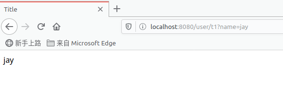

2. 提交的属性名和处理方法的参数名不一致

   * 访问 URL `http://localhost:8080/user/t1?username=jay`，其中提交的属性为 `username`，提交值为 `jay`；

   * 处理方法中的参数名为 `name`，但添加了一个注解 `@RequestParam("username")`，Spring MVC 会使用注解中的值匹配前端提交的属性；

     ```Java
     @Controller
     @RequestMapping("/user")
     public class UserController {
         // locahost:8080/usr/t1?name=xxx
         @GetMapping("/t1")
         public String test1(@RequestParam("username") String name, Model model) {
             // get front-end request parameter
             System.out.println("get request parameter: "+name);
             // return result to front-end
             model.addAttribute("msg", name);
             // view jump
             return "test";
         }
     }
     
     ```

   * 访问结果：

     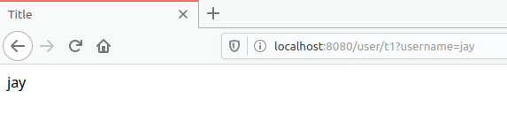

3. 提交的是一个对象：

   要求提交的表单属性和对象的属性名一致，参数使用对象即可：

   * 实体类：

     ```Java
     public class User {
         private int id;
         private String name;
         private int age;
     
         // constructors
         // getters, setters
         // toString
     }
     ```

   * 提交 URL：`http://localhost:8080/user/user?name=jay&id=1&age=26`；

   * 处理方法：

     ```Java
     @RequestMapping("/user")
     public String user(User user, Model model) {
         System.out.println(user);
         model.addAttribute("msg", user);
     
         return "hello";
     }
     ```

   * 访问结果：

     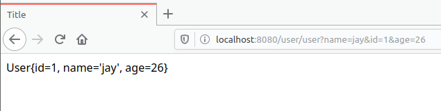

   * 如果使用对象的话，前端传递的参数名和对象名必须一致，否则传入值为 null。

     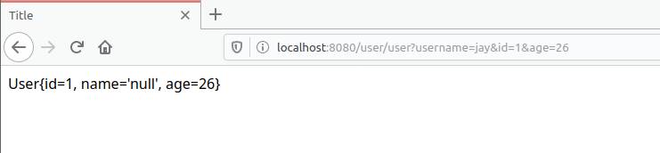

### 4.2.2 数据显示到前端

1. 通过 `ModelAndView`：

   ```Java
   @RequestMapping("/t2")
   public ModelAndView test2(User user) {
       System.out.println(user);
       ModelAndView modelAndView = new ModelAndView();
       modelAndView.addObject("msg", user);
       modelAndView.setViewName("hello");
   
       return modelAndView;
   }
   ```

2. 通过 ModelMap：

   ```Java
   @RequestMapping("/t3")
   public String test3(User user, ModelMap model) {
       System.out.println(user);
       model.addAttribute("msg", user);
   
       return "hello";
   }
   ```

3. 通过 Model：

   ```Java
   @RequestMapping("/t4")
   public String test3(User user, Model model) {
       System.out.println(user);
       model.addAttribute("msg", user);
   
       return "hello";
   }
   ```


对比：

1. Model 是一个接口，只定义了几个方法，适合于存储数据；
2. ModelMap 继承了 LinkedHashMap，除了实现了自身的一些方法，还可以使用继承自父类的方法；
3. ModelAndView 可以在存储数据的同时，设置视图跳转的目标页面。


### 4.2.3 三种视图跳转方式的关系

**Model 和 ModelMap 的关系**

从 UML 类图中可以看到 `RedirectAttributesModelMap` 类实现了 `Model` 接口，并且继承了 `ModelMap` 类。

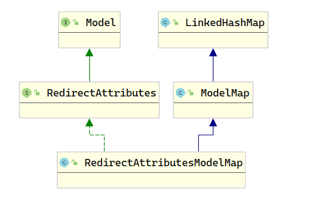

以下用常用的 `addAttribute` 方法为例，阐述 `RedirectAttributesModelMap` 子类是怎么关联 `Model` 和 `ModelMap` 的：

1. `addAttribute`  在 `Model` 接口中的定义是：

   ```Java
   Model addAttribute(String attributeName, @Nullable Object attributeValue);
   ```

2. `addAttribute` 在 `RedirectAttributesModelMap`  中的实现如下，直接调用了父类 `ModelMap` 的 `addAttribute` 方法：

   ```Java
   @Override
   public RedirectAttributesModelMap addAttribute(String attributeName, @Nullable Object attributeValue) {
       super.addAttribute(attributeName, formatValue(attributeValue));
       return this;
   }
   ```

3. 再来看 `ModelMap` 类中 `addAttribute` 的实现：

   ```Java
   public ModelMap addAttribute(String attributeName, @Nullable Object attributeValue) {
       Assert.notNull(attributeName, "Model attribute name must not be null");
       put(attributeName, attributeValue);
       return this;
   }
   ```

4. 可以看出无论我们在使用 `Model` 还是 `ModelMap` 的方式来传递数据，底层的处理逻辑都在同一个子类（实现类）的方法中完成的。


**ModelAndView 和 ModelMap 的关系：**

1. ModelAndView 类中包含一个 ModelMap 类型的属性，并且它的 `addObject` 方法也是调用了 `ModelMap` 的 `addAttribute` 方法实现传递数据到前端的 ：

   ```Java
   public class ModelAndView {
   
       /** Model Map. */
       @Nullable
       private ModelMap model;
   
       public ModelAndView addObject(String attributeName, @Nullable Object attributeValue) {
           getModelMap().addAttribute(attributeName, attributeValue);
           return this;
       }
   }
   ```

2. 可以看出 `ModelAndView` 和 `ModelMap` 是组合关系；


**小结**：如果读者了解设计模式原理的话，可以从上述两种对比找到适配器模式的身影：

	1. `Model` 和 `ModelMap` 使用的是类适配器（继承模式）；
 	2. `ModelAndView` 和 `ModelMap` 使用的是对象适配器（组合模式）。


# 5. 乱码处理


测试步骤：

1. 在首页编写一个提交的表单 `form.jsp` ：

   ```xml
   <form action="/e/t1" method="post">
       <input type="text" name="name">
       <input type="submit">
   </form>
   ```

2. 编写 `EncodingController` 处理类：

   ```Java
   @Controller
   public class EncodingController {
   
       @PostMapping("/e/t1")
       public String test1(String name, Model model) {
           System.out.println(name);
           model.addAttribute("msg", name);
           return "test";
       }
   }
   ```

3. 前端传递中文数据：

   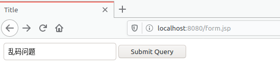

   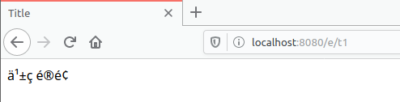

   

4. 定位乱码问题发生在后端：

   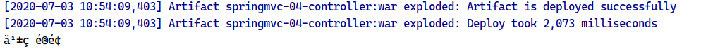

5. 在 `web.xml` 中配置 Spring MVC 的编码过滤器，设置字符编码为 UTF-8 ，解决乱码问题：

   ```XML
   <filter>
       <filter-name>encoding</filter-name>
       <filter-class>org.springframework.web.filter.CharacterEncodingFilter</filter-class>
       <init-param>
           <param-name>encoding</param-name>
           <param-value>utf-8</param-value>
       </init-param>
   </filter>
   
   <!-- 
   <url-pattern> 中必须匹配 /*， 如果为 / 过滤不了 jsp页面 
   -->
   <filter-mapping>
       <filter-name>encoding</filter-name>
       <url-pattern>/*</url-pattern>
   </filter-mapping>
   ```

6. 再次传递中文数据，编码问题解决了：

   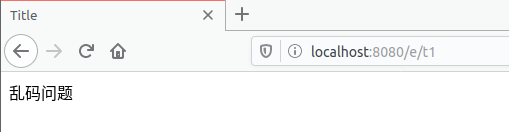


# 6. JSON

## 6.1 什么是 JSON

* JSON(JavaScript Object Notation, JS 对象简谱) 是一种轻量级的数据交换格式；
* 它基于 ECMAScript (欧洲计算机协会制定的js规范)的一个子集，采用完全独立于编程语言的文本格式来存储和表示数据；
* 简洁和清晰的层次结构使得 JSON 成为理想的数据交换语言；
* 易于人阅读和编写，同时也易于机器解析和生成，并有效地提升网络传输效率。


| 前后端分离的时代： |                                  |
| ------------------ | -------------------------------- |
| 后端               | 部署在服务器，提供接口，提供数据 |
|                    | 使用 JSON 等传输数据             |
| 前端               | 独立部署，负责渲染后端的数据     |


JSON 和 JavaScript 对象相互转换:

1. 前端 HTML 中嵌入 JavaScript 语句：

   ```HTML
   <script type="text/javascript">
   
       let user = {
           name: "Jay",
           age: 25,
           sex: "Male"
       }
   
       // convert js object to JSON
       let json = JSON.stringify(user);
       console.log(json);
   
       console.log("===========================")
       
       // convert JSON to js object
       let obj = JSON.parse(json);
       console.log(obj);
   
   </script>
   ```

2. 结果显示：

   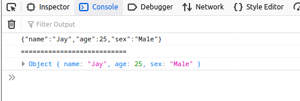


## 6.2 Controller 返回 JSON 数据

Jackson应该是目前比较好的json解析工具。

导入 Jackson 依赖：

```xml
<!-- https://mvnrepository.com/artifact/com.fasterxml.jackson.core/jackson-databind -->
<dependency>
    <groupId>com.fasterxml.jackson.core</groupId>
    <artifactId>jackson-databind</artifactId>
    <version>2.11.1</version>
</dependency>
```


有两种方式可以让 `@RequestMapping` 的方法返回字符串而不是跳转视图：

1. 在 `Controller` 类上使用 `@Controller` 在方法上使用  `@ResponseBody` 注解；

   ```Java
   @Controller
   public class UserController {
   
       @RequestMapping("/j1")
       @ResponseBody
       public String json1() throws JsonProcessingException {
   
           // jackson ObjectMapper
           ObjectMapper mapper = new ObjectMapper();
           User user = new User("Jay", 25, "Male");
           String string = mapper.writeValueAsString(user);
   
           return string;
       }
   }
   ```

   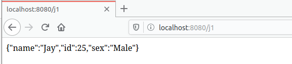

2. 直接在 `Controller` 类上 使用 `@RestController` 注解。

   ```Java
   @RestController
   public class UserController {
   
       @RequestMapping("/j2")
       public String json2() throws JsonProcessingException {
           ObjectMapper mapper = new ObjectMapper();
           User user1 = new User("Jay", 25, "M");
           User user2 = new User("Lily", 20, "F");
           User user3 = new User("Bob", 25, "M");
   
   
           ArrayList<User> list = new ArrayList<>();
           list.add(user1);
           list.add(user2);
           list.add(user3);
   
           String string = mapper.writeValueAsString(list);
           return string;
       }
   }
   ```

   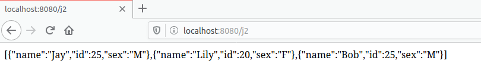


# 7 总结 Spring MVC 中使用的设计模式


Controller 中 使用组合模式的适配器模式： `HandlerAdapter`，处理器适配器 ，根据传入的 `handler` 来定位 `Controller`。


**小结**：如果读者了解设计模式原理的话，可以从上述两种对比找到适配器模式的身影：

 	1. `Model` 和 `ModelMap` 使用的是类适配器（继承模式）；
 	2. `ModelAndView` 和 `ModelMap` 使用的是对象适配器（组合模式）。