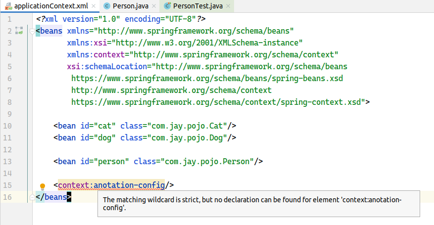
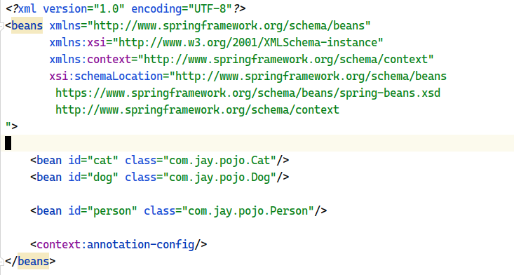
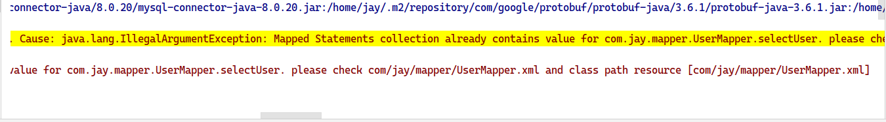
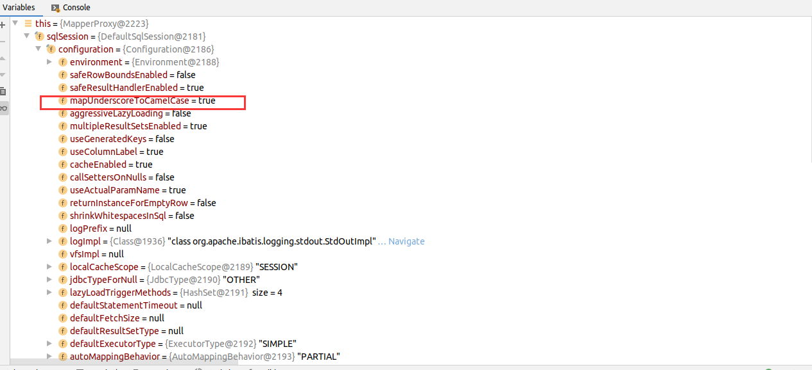
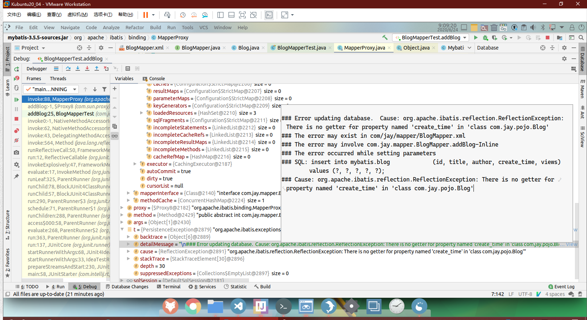
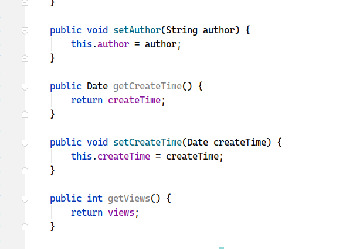
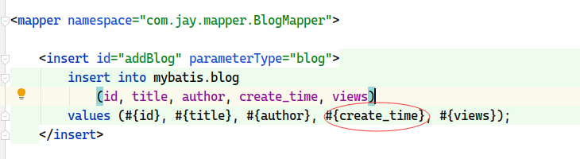
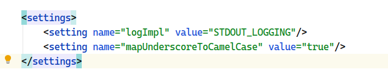

# 一 Spring

## 1. `<context:annotation-config/>` 配置错误

> XML文件报“The matching wildcard is strict, but no declaration can be found for element 'context:annotation-config'.”



此处的 `<context:anotation-config/>` 出现笔误，应为 `<context:annotation-config/>`



缺少 ` https://www.springframework.org/schema/context/spring-context.xsd` 约束，会报以下错误：

``` log
The matching wildcard is strict, but no declaration can be found for element 'context:annotation-config'.
```


## 2. Spring 整合 MyBatis 时出错

Spring 整合 MyBatis 时出错：

``` log
Jun 28, 2020 5:06:10 PM org.springframework.context.support.AbstractApplicationContext refresh
WARNING: Exception encountered during context initialization - cancelling refresh attempt: org.springframework.beans.factory.BeanCreationException: Error creating bean with name 'sqlSessionFactory' defined in class path resource [applicationContext.xml]: Invocation of init method failed; nested exception is org.springframework.core.NestedIOException: Failed to parse mapping resource: 'class path resource [com/jay/mapper/UserMapper.xml]'; nested exception is org.apache.ibatis.builder.BuilderException: Error parsing Mapper XML. The XML location is 'class path resource [com/jay/mapper/UserMapper.xml]'. Cause: java.lang.IllegalArgumentException: Mapped Statements collection already contains value for com.jay.mapper.UserMapper.selectUser. please check com/jay/mapper/UserMapper.xml and class path resource [com/jay/mapper/UserMapper.xml]

org.springframework.beans.factory.BeanCreationException: Error creating bean with name 'sqlSessionFactory' defined in class path resource [applicationContext.xml]: Invocation of init method failed; nested exception is org.springframework.core.NestedIOException: Failed to parse mapping resource: 'class path resource [com/jay/mapper/UserMapper.xml]'; nested exception is org.apache.ibatis.builder.BuilderException: Error parsing Mapper XML. The XML location is 'class path resource [com/jay/mapper/UserMapper.xml]'. Cause: java.lang.IllegalArgumentException: Mapped Statements collection already contains value for com.jay.mapper.UserMapper.selectUser. please check com/jay/mapper/UserMapper.xml and class path resource [com/jay/mapper/UserMapper.xml]

```



错误提示说，`com.jay.mapper.UserMapper.selectUser` 已经被注册过了，查看 Spring 的配置文件和 MyBatis的配置文件：

* `applicationContext.xml`：

  ``` xml
  <?xml version="1.0" encoding="UTF-8"?>
  <beans xmlns="http://www.springframework.org/schema/beans"
         xmlns:xsi="http://www.w3.org/2001/XMLSchema-instance"
         xsi:schemaLocation="http://www.springframework.org/schema/beans http://www.springframework.org/schema/beans/spring-beans.xsd">
  
      <!--DataSource: use spring datasource to replace MyBatis setting c3p0 dbcp druid
      we use jdbc provided by Spring: org.springframework.jdbc.datasource
      -->
      <bean id="datasource" class="org.springframework.jdbc.datasource.DriverManagerDataSource">
          <property name="driverClassName" value="com.mysql.cj.jdbc.Driver"/>
          <property name="url"
                    value="jdbc:mysql://localhost:3306/mybatis?useSSL=false&amp;useUnicode=true&amp;characterEncoding=UTF-8"/>
          <property name="username" value="root"/>
          <property name="password" value="123456"/>
      </bean>
  
      <!--sqlSessionFactory-->
      <bean id="sqlSessionFactory" class="org.mybatis.spring.SqlSessionFactoryBean">
          <property name="dataSource" ref="datasource"/>
          <!-- bind MyBatis configuration -->
          <property name="configLocation" value="classpath:mybatis-config.xml"/>
          <property name="mapperLocations" value="classpath:com/jay/mapper/UserMapper.xml"/>
      </bean>
  
      <bean id="sqlSessionTemplate" class="org.mybatis.spring.SqlSessionTemplate">
          <!-- sqlSessionTemplate has no setter, using constructor to inject-->
          <constructor-arg index="0" ref="sqlSessionFactory"/>
      </bean>
  
      <bean id="userMapper" class="com.jay.mapper.UserMapperImpl">
          <property name="sqlSessionTemplate" ref="sqlSessionTemplate"/>
      </bean>
  </beans>
  ```

* `mybatis-config.xml` ：

  ``` XML
  <?xml version="1.0" encoding="UTF-8" ?>
  <!DOCTYPE configuration
          PUBLIC "-//mybatis.org//DTD Config 3.0//EN"
          "http://mybatis.org/dtd/mybatis-3-config.dtd">
  <configuration>
  
      <typeAliases>
          <package name="com.jay.pojo"/>
      </typeAliases>
  
      <mappers>
          <mapper class="com.jay.mapper.UserMapper"/>
      </mappers>
  
  </configuration>
  ```

对比后发现， `com.jay.mapper.UserMapper` 确实被重复注册了，只需要在 `mybatis-config.xml`中取消注册即可解决此问题。


# 二 MyBatis 

## 1 驼峰转换













我已经在 Settings 里面添加了 `mapUnderscoreToCamelcase` 为 `true`， debug 可以看到 `sqlSession` 里面配置也成功了。但是反射时报错：没有 `create_time` 属性的 getter 方法。

这里我写的是 `create_time` 如果改成 `createTime` 就不会报错。因为可以找到 getter 方法。但是这里的驼峰转换好像没有起作用

因为#{}这里面对应的是实体类，所以不能是  `create_time `而应该是 `createTime`

select的时候可以自动对应上

驼峰转换是指数据库里的下划线的字段名可以与实体类驼峰命名的属性对应

