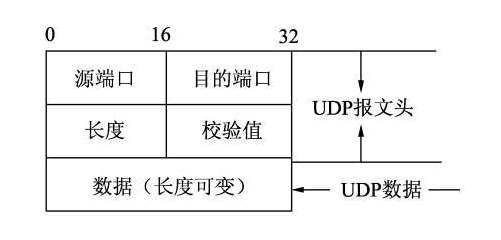

#  Java

## Java 基础

### Java 三大特性


### 抽象类和接口区别

**抽象类**：

1. 抽象方法，只有行为的概念，没有具体的行为实现。使用 `abstract` 关键字修饰，没有方法体。子类必须重写这些抽象方法；
2. 包含抽象方法的类，一定是抽象类；
3. 抽象方法只能被继承，一个类只能继承一个抽象类；

**接口**：

1. 所有的方法都是抽象方法，属性都是常量；
2. Java 8 开始支持默认方法，有具体实现，Java 9 开始支持私有方法；
3. 接口变量可以引用具体实现类的实例；
4. 一个具体的类实现接口，必须实现全部的抽象方法；
5. 接口之间可以多实现；
6. 一个具体类可以实现多个接口，实现多继承现象。


### 一个类实现了两个接口，这两个接口都有一个方法的默认实现，调用哪个方法？

该类必须要重写这个默认方法。


### ArrayList 扩容机制

1. 如果使用默认无参构造方法 `ArrayList()`，`ArrayList` 的初始容量为 `10`，但实际上用了参数 `DEFAULTCAPACITY_EMPTY_ELEMENTDATA` 返回了一个空的数组。因此第一次添加数据时，`minCapacity` 等于默认的容量 `10`，数据扩容至 `10`，而后续的数组扩容才是按照当前容量的 `1.5` 倍进行扩容；
2. 如果扩容后的总长度溢出，抛出异常，如果扩容后的总长度小于等于数组定义的最大值 `MAX_ARRAY_LENGTH = Integer.MAX_VALUE - 8;`  ，否则返回最大整数值。


### final，finally，finalize 区别和用法？

**性质不同**：

1. `final` 是 Java 关键字；
2. `finalize()` 是方法；
3. `finally` 是区块标识，用于 `try` 语句中；

**作用不同**：

1. `final` 为用于标识常量，不可变类和不可变方法的关键字，`final` 标志的变量存储在常量池中；
2. `finalize()` 方法在 `Object` 中进行了定义，用于在对象”消失“时，由 JVM 进行调用，对对象进行垃圾回收。类似于 C++ 中的析构函数，用户自定义时，用于释放对象占用的资源（比如进行 I/O 操作）；
3. `finally{}` 与 `try{}` 进行配合，无论 `try{}` 中的代码是否正确执行完成，都会进入到 `finally{}` 中；

### int 和 Integer，自动装箱和装箱底层是怎么实现的？使用包装类型会存在什么样的问题？

* 自动装箱：把基本类型的值转换为对应的包装类对象；
* 自动拆箱：把包装类对象的值转换为对应的基本类型的值；

```Java
Integer i1 = 100;	// 自动装箱，调用了包装类的 valueOf 方法
int i2 = i1;		// 自动拆箱，调用了包装类的 intValue 方法
```

对 Integer 对象，JVM会自动缓存 `-128~127` 范围内的值，所以所有在这个范围内的值相等的 `Integer` 对象都会共用一块内存，而不会开辟多个；超出这个范围内的值对应的 `Integer` 对象有多少个就开辟多少个内存。


### String 的字面量和 new 一个对象区别


### HashMap put 流程


1. `hash(key)`，取key的hashcode进行高位运算，返回hash值
2. 如果hash数组为空，直接`resize()`
3. 对`hash`进行取模运算计算，得到key-value在数组中的存储位置 `i`
   * 如果`table[i] == null`，直接插入`Node<key,value>`；
   * 如果`table[i] != null`，判断是否为红黑树`p instanceof TreeNode`；
   * 如果是红黑树，则判断 `TreeNode` 是否已存在，如果存在则直接返回 `oldnode` 并更新；不存在则直接插入红黑树，`++size`，超出 `threshold` 容量就扩容；
   * 如果是链表，则判断 `Node` 是否已存在，如果存在则直接返回 `oldnode` 并更新；不存在则直接插入链表尾部，判断链表长度，如果大于8则转为红黑树存储，`++size`，超出 `threshold` 容量就扩容；

 

### HashMap get  流程

1. `hash(key)`，取key的hashcode进行高位运算，返回hash值；
2. 对`hash`进行取模运算计算，得到key-value在数组中的存储位置 `i`；
   * 如果桶容量为 0，或者该桶内没有元素直接返回空，
   * 反之会判断该桶会检查桶中第一个元素是否和要查的 key 相等，相等的话直接返回；
   * 如果不等判断该节点是否为树节点，是的话以树节点方式遍历整棵红黑树来查找；
   * 如果不是的话以遍历链表的方式查找。

### HashMap 如何遍历输出


### HashMap 有什么不好

线程不安全。

JDK 1.7 中，并发扩容使用头插法，会造成环形链和数据丢失的情况；

JDK 1.8 中，并发执行 put 操作时会发生数据覆盖的现象。

### HashMap 中放 100 个元素，如果不希望发生扩容，那么一开始声明的 HashMap 容量应该为多少？

HashMap 触发扩容的阈值为当前容量 * 扩容因子。默认的扩容因子为 0.75。因此 HashMap 容量至少为 100/0.75 = 134。而为了减少哈希碰撞，一般我们会将容量设置为 2 的幂次方。因此 HashMap 的最佳容量应为 256。


### 序列化和反序列化

序列化：是一种用来处理对象流的机制，所谓对象流就是将对象的内容进行流化。可以对流化后的对象进行读写操作，也可将流化后的对象传输于网络之间。序列化是为了解决在对象流进行读写操作时所引发的问题。

序列化的实现：将需要被序列化的类实现 `Serializable` 接口，该接口没有需要实现的方法，实现此接口只是为了标注该对象是可被序列化的，然后使用一个输出流（如：FileOutputStream）来构造一个 ObjectOutputStream（对象流）对象，接着使用 ObjectOutputStream 对象的 writeObject(Object obj) 方法就可以将参数为 obj 的对象写出（保存它的状态）

反序列化：使用一个输入流（如：FileInputStream）来构造一个 ObjectInputStream（对象流）对象，接着使用 ObjectInputStream 对象的 readObject() 方法从输入流中构造出相应的对象。


### 序列化 ID

虚拟机是否允许序列化，不仅取决于类路径和功能代码是否一致，一个非常重要的一点是两个类的序列化 ID 是否一致。

```Java
private static final long serialVersionUID = 0L;
```


### transient 关键字

使用 transient 关键字阻止该变量被序列化到文件中：

1. 在变量声明前加上 transient 关键字，可以阻止该变量被序列化到文件中，在被反序列化后，transient 变量的值被设为初始值，如 int 值为 0，引用类型为 null；
2. 服务器端给客户端发送序列化对象数据，这个类的有些属性需要序列化，而其他属性不需要被序列化，打个比方，如果一个用户有一些敏感信息（如密码，银行卡号等），为了安全起见，不希望在网络操作（主要涉及到序列化操作，本地序列化缓存也适用）中被传输，这些信息对应的变量就可以加上transient关键字。

### 设计序列化一个简单对象（只有 int 和 String）多个对象序列化到一个文件，怎么识别分隔界限？


## JUC


### Java 线程有哪些状态？


### Java 是怎么进行线程通信的？


### Java 内存模型与 volatile 关键字，如何禁止重排序的


### Java 里面有什么锁


### ConcurrentHashMap 采用了红黑树，为什么一定要使用红黑树而不是 AVL、B数之类的？

在 CurrentHashMap 中是加锁了的，实际上是读写锁，如果写冲突就会等待，如果插入时间过长必然等待时间更长，而红黑树相对 AVL 树 B 树的插入更快，AVL 树查询确实更快一些，但是对于操作密集型，红黑树的旋转更少，效率更高。


### ConcurrentHashMap 扩容，为什么是线程安全的？


### 多线程构建的几个参数？会怎么样？


### 回退机制


### 线程池，七大参数，具体使用流程，底层怎么实现的？


### 介绍一下 AQS


### 获取不到锁时，AQS 阻塞的具体流程


## JVM

### JVM 垃圾回收算法和垃圾回收器介绍


### 介绍一下 CMS


### 类加载器过程


### 双亲委托机制原理，常用场景


### semaphore 原理和使用


## MyBatis

### mybatis 防止注入的方式？什么情况下用 `$`？


1、`#{}`：主要用户获取 `DAO` 中的参数数据,在映射文件的SQL语句中出现 `#{}` 表达式,底层会创建预编译的SQL；

2、``${}` :主要用于获取配置文件数据， `DAO` 接口中的参数信息,当 `$` 出现在映射文件的 SQL 语句中时创建的不是预编译的SQL,而是字符串的拼接,有可能会导致 SQL 注入问题.所以一般使用 `$` 接收 DAO 参数时,这些参数一般是字段名,表名等,例如 `order by {column}`。


## Spring

### Spring 的三级缓存


### Spring 的事务的实现原理


### Spring 设置事务隔离级别与数据库不一致，会怎么样？


## Spring Boot


---

# 设计模式

## 设计模式七大原则

* 开闭原则：对拓展开放，对修改关闭；
* 里氏替换原则：继承必须确保超类所拥有地性质在子类中仍然成立；
  * 子类不修改父类所拥有的功能；
* 依赖倒置原则：要面向接口编程，不要面向实现编程；
  * 抽象不依赖细节，细节依赖抽象；
* 单一职责原则：控制类地粒度大小，将对象解耦，提高其内聚性；
* 接口隔离原则：要为各个类建立它们需要的专用接口；
* 迪米特法则：只与你地直接朋友交谈，不跟”陌生人“说话；
* 合成复用原则：尽量先使用组合或者聚合等关联关系，其次才考虑使用继承关系来实现。

## 常用设计模式

单例模式

适配器模式

代理模式


---


# 计算机网络

## TCP/UDP

### TCP 三次握手 


RTT = 1.5

### TCP 四次挥手


RTT = 2

如果接收到第二次和第三次挥手在没有数据传输时也可以合并。


### LTS 建立安全链接

**LTS 1.2 版本：** RTT = 1.5

浏览器 **Client** 和 服务器 **Server** 之间建立安全链接的过程

1. 浏览器给服务器发送的 **Client Hello** 消息（一去）

2. 服务器给浏览器发送的 **Server Hello** 消息（二回）（包含 Key Exchange）
3. 浏览器给服务器发送的 **Key Exchange** 消息（三去）


**LTS 1.3 版本：** RTT = 1

浏览器 **Client** 第一次就把自己的密钥交换 （**Key Exchange**） 的素材发给服务器 **Server**。


### TCP 四次挥手的 time_wait 状态

上面有一个非常特殊的状态`time_wait`，它是主动关闭的一方在回复完对方的挥手后进入的一个长期状态，这个状态标准的持续时间是4分钟，4分钟后才会进入到closed状态，释放套接字资源。不过在具体实现上这个时间是可以调整的。

它的作用是重传最后一个ack报文，确保对方可以收到。因为如果对方没有收到ack的话，会重传fin报文，处于time_wait 状态的套接字会立即向对方重发ack报文。

同时在这段时间内，该链接在对话期间于网际路由上产生的残留报文(因为路径过于崎岖，数据报文走的时间太长，重传的报文都收到了，原始报文还在路上)传过来时，都会被立即丢弃掉。

4分钟的时间足以使得这些残留报文彻底消逝。不然当新的端口被重复利用时，这些残留报文可能会干扰新的链接。

4分钟就是2个MSL，每个MSL是2分钟。MSL就是`maximium segment lifetime`——最长报文寿命。这个时间是由官方RFC协议规定的。

四次挥手也并不总是四次挥手，中间的两个动作有时候是可以合并一起进行的，这个时候就成了三次挥手，主动关闭方就会从`fin_wait_1`状态直接进入到`time_wait`状态，跳过了`fin_wait_2`状态。


### 如何避免 `time_wait` ？


### 如果我们现在 TCP 链接太多了，怎么改进（把等待时间去了，改成只要 n 妙内没有收到消息，就断开）为什么这样做，理由？


把TCP 的四次挥手去掉，改成心跳机制，超过 n 秒就把这个链接断开：

1. 三次握手是保证链接可靠，不能去掉；
2. 没有了四次挥手，断开更开；
3. 能断开那些使用不频繁的链接；
4. 没有四次握手会造成一些数据的丢失，但总比整个服务崩了好。


Keep Alive指定连接最大空闲时间T，当客户端检测到连接空闲时间超过T时，必须向Broker发送心跳报文PINGREQ，Broker收到心跳请求后返回心跳响应PINGRESP。若Broker超过1.5T时间没收到心跳请求则断开连接，并且投递遗嘱消息到订阅方；同样，若客户端超过一定时间仍没收到心跳响应PINGRESP则断开连接。 连接空闲时发送心跳报文可以降低网络请求，弱化对带宽的依赖。


### TCP 拥塞机制

**什么是网络拥塞？**

我们发送到网络中的数据，到达网络中的一个节点时（通常是路由器），路由器会先将数据包存放在自己的内存中，解封装再根据数据包的目的 IP 查找本地路由表选择网络下一跳。

这样就会面临一个问题：**路由器的性能是有限的，如果某个时刻的路由器的数据超出了路由器的内存限制，这个路由器无法接受所有的数据，只能将部分数据丢弃；或者路由器处理期性能不够，导致接收到的数据要等待较长的时间才会被转发。这种情况就叫做网络拥塞**

**什么是拥塞机制？**

如果是使用 `TCP` 这种带有重传机制的可靠的端到端的协议，当发送者没有接收到 对方的 `ACK` 报文时（数据发生丢失或网络时延过高），会重传相关的报文，延长数据的到达时间。同时，高频率的重传，也将导致网络的拥塞加剧。

拥塞控制：**就是在网络中发生拥塞是，减少向网络中发送数据的速度，防止造成恶性循环；同时在网络空闲时，提高发送数据的速度，最大限度地合理利用网络资源。**


**TCP 的拥塞控制方法？**

因为网络层不会向上提供拥塞的反馈信息，所以 `TCP` 协议采用的是**端到端拥塞控制**。`TCP` 需要解决三个问题：

1. **TCP 如何检测网络中是否拥塞；**

   * 如果发送一个报文后，成功接收到了接收方的确认报文，则认为网络中没有拥塞；
   * 如果发送一个报文后，在规定时间内没有收到确认报文（丢失或时延太大），则可以认为网络出现了拥塞；
   * 若连续收到了接收方对同一条报文的三次冗余确认（总共四次确认），则可以推测那条报文丢失，即发生了拥塞。（这和 TCP 的**快速重传**机制有关）

2. **TCP 如何限制数据的发送速率；**

   **滑动窗口机制：**TCP 维护了一个发送窗口来发送数据，一个接收窗口来接收数据。发送窗口是一个区间，所有序号位于这个窗口内的数据段都会被一次性发送，而不需要等到之前发送的数据段被确认。每当最早发送出去的数据段倍确认，窗口就向前滑动，直到移动到最后一个没有被确认的序号。这时新的数据段又被包含在发送窗口中，所以根据当前网络状况动态地控制滑动窗口大小，可以有效地进行拥塞控制。实际上发送方维护了一个叫做**拥塞窗口（cwnd）**的变量来控制滑动窗口大小。

3. **TCP 采用什么算法来调整速率。**

   * **慢启动**：拥塞窗口`cwnd`的长度将在每个`RTT`后翻倍，也就是发送速率将以指数级别增长；
   * **拥塞避免**：拥塞避免是一个速率缓慢且线性增长的过程
   * **快速恢复**：快速恢复和上面两种模式不太一样，这种模式在TCP规范中并没有强制要求实现，只是一种推荐实现的模式。在快速恢复阶段，每接收到一个冗余的确认报文，`cwnd`就增加`1MSS`，其余不变，而当发生以下两种情况时，将退出快速恢复模式：
     - 第一种：在快速恢复过程中，计时器超时，这时候，`ssthresh`被修改为 `cwnd / 2`，然后`cwnd`被置为`1MSS`，并进入慢启动阶段；
     - 第二种：若发送方接收到一条新的确认报文（不是冗余确认），则`cwnd`被置为`ssthresh`，然后进入到拥塞避免模式；


### TCP 超时重传

1. **基于计时器的重传**：超过 RTO（重传超时） 还没有收到 ACK，就重发该数据包。每个数据包都有相应的计时器，简单但低效。
2. **快速重传**：服务器如果收到乱序的包，也给客户端回复 ACK，收到乱序的包 6,7,8,9 时，服务器全都发 ACK = 5。当收到三次冗余 ACK 时，就应当进行重传。
3. **带选择确认的重传（SACK）**：在快速重传的基础上，**返回最近收到的报文段的序列号范围**，这样客户端就知道，哪些数据包已经到达服务器了。
4. **DSACK 扩展**：即重复 SACK，这个机制是在 SACK 的基础上，额外携带信息，**告知发送方有哪些数据包自己重复接收了**。


### 如果服务器的机器挂了，而客户端去链接会发生什么？如是是服务器的进程挂了，客户端去链接会发生什么?

如果是服务器机器挂了，说明网络无法连接，服务器无法收到客户端的 SYN 报文，更没有办法回复 ACK 报文。那么客户端在建立链接时，只会发送 SYN 报文，重传几次后，就不会再尝试连接服务器；

如果是服务器进程挂了，一般认为客户端与服务器之间网络可达。这时服务器端的操作系统会代替该进程发送一个 RESET 的包，此时客户端就知道通信的那个进程已经被杀死，直接关闭链接。


### TCP 和 UDP 的区别

| TCP              | UDP             |
| ---------------- | --------------- |
| 面向连接         | 无连接          |
| 全双工可靠       | 不可靠          |
| 面向字节流       | 面向报文        |
| 端到端           |                 |
| 首部开销 20 字节 | 首部开销 8 字节 |

TCP 报文格式


UDP 报文格式




## DHCP

`DHCP` 协议采用 `UDP` 作为传输协议，主机发送请求消息到 `DHCP` 服务器的 `67` 号端口，`DHCP` 服务器回应应答消息给主机的 `68` 号端口。详细的交互过程如下图。


1. `DHCP Client` 以广播的方式发出 `DHCP Discover` 报文。

2. 所有的 `DHCP Server` 都能够接收到 `DHCP Client` 发送的 `DHCP Discover` 报文，所有的 `DHCP Server` 都会给出响应，向 `DHCP Client` 发送一个 `DHCP Offer` 报文。`DHCP Offer` 报文中 `Your(Client) IP Address` 字段就是 `DHCP Server` 能够提供给`DHCP Client` 使用的 `IP` 地址，且 `DHCP Server` 会将自己的 IP 地址放在 `option` 字段中以便 `DHCP Client` 区分不同的 `DHCP Server`。`DHCP Server` 在发出此报文后会存在一个已分配 `IP` 地址的纪录。

3. `DHCP Client` 只能处理其中的一个 `DHCP Offer` 报文，一般的原则是 `DHCP Client` 处理最先收到的 `DHCP Offer` 报文。`DHCP Client` 会发出一个广播的 `DHCP Request` 报文，在选项字段中会加入选中的 `DHCP Server` 的 `IP` 地址和需要的 `IP` 地址。
4. `DHCP Server` 收到 `DHCP Request` 报文后，判断选项字段中的IP地址是否与自己的地址相同。如果不相同，`DHCP Server` 不做任何处理只清除相应 `IP` 地址分配记录；如果相同，`DHCP Server` 就会向 `DHCP Client` 响应一个 `DHCP ACK` 报文，并在选项字段中增加 `IP` 地址的使用租期信息。 
5. `DHCP Client` 接收到 `DHCP ACK` 报文后，检查 `DHCP Server` 分配的 `IP` 地址是否能够使用。如果可以使用，则 `DHCP Client` 成功获得 `IP` 地址并根据 `IP` 地址使用租期自动启动续延过程；如果 `DHCP Client` 发现分配的 `IP` 地址已经被使用，则 `DHCP Client` 向 `DHCPServer` 发出 `DHCP Decline` 报文，通知 `DHCP Server` 禁用这个IP地址，然后 `DHCP Client` 开始新的地址申请过程。
6. `DHCP Client` 在成功获取IP地址后，随时可以通过发送 `DHCP Release` 报文释放自己的 `IP` 地址，`DHCP Server` 收到 `DHCP Release` 报文后，会回收相应的 `IP` 地址并重新分配。


在使用租期超过50%时刻处，DHCP Client会以单播形式向DHCP Server发送DHCPRequest报文来续租IP地址。如果DHCP Client成功收到DHCP Server发送的DHCP ACK报文，则按相应时间延长IP地址租期；如果没有收到DHCP Server发送的DHCP ACK报文，则DHCP Client继续使用这个IP地址。

在使用租期超过87.5%时刻处，DHCP Client会以广播形式向DHCP Server发送DHCPRequest报文来续租IP地址。如果DHCP Client成功收到DHCP Server发送的DHCP ACK报文，则按相应时间延长IP地址租期；如果没有收到DHCP Server发送的DHCP ACK报文，则DHCP Client继续使用这个IP地址，直到IP地址使用租期到期时，DHCP Client才会向DHCP Server发送DHCP Release报文来释放这个IP地址，并开始新的IP地址申请过程。

需要说明的是：DHCP客户端可以接收到多个DHCP服务器的DHCPOFFER数据包，然后可能接受任何一个DHCPOFFER数据包，但客户端通常只接受收到的第一个DHCPOFFER数据包。另外，DHCP服务器DHCPOFFER中指定的地址不一定为最终分配的地址，通常情况下，DHCP服务器会保留该地址直到客户端发出正式请求。

正式请求DHCP服务器分配地址DHCPREQUEST采用广播包，是为了让其它所有发送DHCPOFFER数据包的DHCP服务器也能够接收到该数据包，然后释放已经OFFER（预分配）给客户端的IP地址。

如果发送给DHCP客户端的地址已经被其他DHCP客户端使用，客户端会向服务器发送DHCPDECLINE信息包拒绝接受已经分配的地址信息。

在协商过程中，如果DHCP客户端发送的REQUEST消息中的地址信息不正确，如客户端已经迁移到新的子网或者租约已经过期，DHCP服务器会发送DHCPNAK消息给DHCP客户 端，让客户端重新发起地址请求过程。

 

## HTTP

### 状态码


### GET 和 POST 有什么区别


### 接口幂等性，设计订单接口，怎么保证幂等性

**接口幂等性**：用户对于同一操作发起的一次请求或者多次请求的结果是一致的，不会因为多次点击而产生了副作用。

什么情况下需要保证接口的幂等性？

1. **查询操作：**查询对于结果是不会有改变的，查询一次和查询多次，在数据不变的情况下，查询结果是一样的， SELECT 是天然的幂等操作；
2. **删除操作：**删除一次和多次删除都是把数据删除。（注意可能返回结果不同，删除的数据不存在，返回 0，删除的数据多条，返回结果多个，在不考虑返回结果的情况下，删除操作也是具有幂等性的）
3. **更新操作：**修改再大多数情况下结果一样，但是如果是增量修改是需要保证幂等性的：
   * 把表中 id 为 1 的记录的 age 字段设置为 1，这种操作不管执行多少次都是幂等的；
   * 把表中 id 为 1 的记录的 age 字段值增加 1，这种操作就不是幂等的；
4. **新增操作**：增加再重复提交的场景下会出现幂等性问题：
   * 支付问题，用户购买商品后支付，支付扣款成功，但是返回结果的时候网络异常，此时钱已经扣了。用户再次点击按钮，会进行第二次扣款，返回结果成功，扣款了两次。没有保证接口的幂等性。


怎么设计接口保证幂等性呢？

常见的两种实现方案：

1. **通过代码逻辑判断实现**。通过代码逻辑判断（如支付系统中添加订单号 orderId 来标定订单的唯一性），来实现接口幂等性，只能针对一些满足判断的逻辑实现，具有一定局限性；
2. **使用 token 机制实现**。token的特点是，需要申请，一次有效性，可以限流。**token 机制实现步骤**：
   1. 生成全局唯一的 token，token 放在 redis 或者 jvm 内存中， token 会在页面跳转时获取。存放在 pageScope 中，支付系统提交先获取 token；
   2. 提交后后台校验 token，执行提交逻辑，提交成功同时删除 token，生成新的 token 更新 redis，这样当第一次提交后 token 更新了，页面再次提交携带的 token 是已删除的 token 后台验证会失败不让提交。


### HTTP报文：响应/请求报文内容


### HTTP 1.1/2/3


### HTTP 长连接数据发送完毕后，如何判断发送结束？


### HTTP 内部设计


### HTTP 如果当前有一个长链接，但是我们想给用户一个短链接，如何实现


### HTTPS 从发送请求到结束的详细过程（加密，认证的详细过程）


## DDOS

### 什么是 DDOS


---


# 数据库原理

## MySQL 原理


MySQL 索引：

InnoDB

MYISAM


|              | MYISAM | InnoDB           |
| ------------ | ------ | ---------------- |
| 事务支持     | 不支持 | 支持             |
| 数据锁定     | 表锁定 | 行锁定           |
| 外键约束     | 不支持 | 支持             |
| 全文索引     | 支持   | 5.6.4 版本后支持 |
| 表空间的大小 | 较小   | 较大，约为 2 倍  |


常规使用操作：

* MYISAM：节约空间，速度较快
* InnoDB：安全性高，支持事务的处理，多表多用户操作。


物理空间存在的位置：

所有的数据库文件都存储在 data 目录下的，本质上还是文件存储。

MySQL 引擎在物理文件上的区别：

* InnoDB 在数据库表中只有一个 `*.ibd` 文件，在它的上级目录还有一个 ibdata；
* MYISAM 对应文件：
  * *.MYD 	数据文件
  * *.MYI       索引文件
  * *.sdi        可读的文件格式来描述表的元数据信息


### 外键


```mysql
CREATE TABLE IF NOT EXISTS `student` (
    `id` INT(4) NOT NULL AUTO_INCREMENT COMMENT '学号',
    `name` VARCHAR(30) not null default '匿名' comment '姓名',
	`pwd` VARCHAR(20) NOT NULL DEFAULT '123456' COMMENT '密码',
    `sex` VARCHAR(2) NOT NULL DEFAULT '女' COMMENT '性别',
    `birthday` DATETIME DEFAULT NULL COMMENT '出生日期',
    `gradeid` int(10) not null comment '学生的年级',
    `address` VARCHAR(100) DEFAULT NULL COMMENT '家庭住址',
    `email` VARCHAR(50) DEFAULT NULL COMMENT '邮箱',
    PRIMARY KEY(`id`),
    KEY `FK_gradeid` (`gradeid`),
	CONSTRAINT `FK_gradeid` FOREIGN KEY (`gradeid`) REFERENCES `grade` (`gradeid`)
)  ENGINE=MYISAM DEFAULT CHARSET=UTF8;
```


### MySQL 有哪些索引？底层数据结构是什么？


### 设计一张表，哪些属性用聚簇索引，哪些用非聚簇索引？


### MySQL 索引最左前缀匹配


### drop delete 还有 truncate 的区别

SQL 中的 drop、delete 和 truncate 都表示删除，但是三者有一些差别：

速度上说：drop > truncate > delete

delete 和 truncate 只删除表的数据不删除表的结构；

delete 语句是 dml，这个操作会放到 rollback segment 中，事务提交之后才生效，如果有相应的 trigger，执行的时候将被触发；

truncate 和 drop 是 ddl，操作立即生效，原数据不妨到 rollback segment 中，不能回滚，操作不触发 trigger；


### B+ 树为何和磁盘交互是友好的


### MySQL 事务特性？

事务特性：

* **原子性（Atomicity）**：事务是最小的执行单位，不允许分割。事务的原子性确保动作要么全部完成，要么完全不起作用；
* **一致性（Consistency）**：执行事务后，数据前后保持一致，多个事务对同一个数据读取的结果是相同地；
* **隔离性（Isolation）**：并发访问数据库时，一个用户的事务不被其它事务干扰，各并发事务之间数据库是独立的；
* **持久性（Durability）**：一个事务被提交后，它对数据库中数据的改变是持久的，即使数据库发生故障也不应该对其有任何影响。


隔离导致了一些问题：

* **脏读（Dirty read）**：当一个事务访问数据并对数据进行修改，但修改的结果并没有返回覆盖到该数据。此时有另一个事务访问并读取了这个数据的值，它读到的值是修改前的“脏数据”，依据”脏数据“所作的操作可能会有问题；
* **修改丢失（Lost to modify）**：指在一个事务A读取数据时，另一个事务 B 也访问了该数据。那么第一个事务修改了这个数据后，第二个数据再次修改这个数据，两次修改的值不一样。事务 B 修改的值会覆盖事务 A 修改的值，导致事务 A 的修改丢失；
* **不可重复读（Unrepeatable read）**：指在一个事务内多次读同一个数据。在事务 A 进行中，事务 B 对数据 D，进行了修改，那么修改前后事务 A 从读取的数据 D 的值是不同的，因此称为不可重复读；
* **幻读（Phantom read）**：和不可重复读类似。事务 A 读取几行数据，事务 B 添加了几行数据，导致事务 A 再添加前后读取的行数信息不同，因此称为幻读。


不可重复读和幻读的区别：

不可重复读的重点是**修改**，比如多次读取一条记录时发现其中的某些字段的值被修改了，变动的是**列**；

幻读的重点是**新增或删除**，比如多次读取一条记录时发现记录增加了或者减少了，变动的是**行**；


### 隔离级别？解决了哪些问题？

SQL 标准定义了四个隔离级别：

* **READ-UNCOMMITTED（读取未提交）**：最低的隔离级别，允许读取尚未提交的数据变更，可能会导致脏读、幻读或者不可重复读；
* **READ-COMMITTED（读取已提交）**：允许读取并发事务已经提交的数据，可以阻止脏读，但是幻读或不可重复度仍有可能发生；
* **REPEATABLE-READ（可重复读）**：对同一字段的多次读取结果都是一致的，除非数据是被事务本身修改的，可以组织脏读和不可重复读，但幻读仍有可能发生；
* **SERIALIZABLE（可串行化）**：最高的隔离级别，完全服从 ACID 的隔离级别。所有的事务依次逐个执行，这样事务之间就完全不可能产生干扰，也就是说，该级别可以防止脏读、不可重复读以及幻读。


### InnoDB 在 RR 级别就可以解决幻读的情况，具体是怎么实现的？

InnoDB 引擎在 REPEATABLE-READ（可重复读）事务隔离级别下使用的是 **Next-Key Lock** 锁算法，因此可以避免幻读的产生。


InnoDB 在分布式事务的情况下一般会用到 SERIALIZABLE（可串行化）隔离级别。

### 游标


### 范式


## Redis

### Redis 持久化


### Redis 有哪些结构，ZSET 底层如何实现，跳表是什么？


### hash 的底层实现，渐进式 hash 的流程


### redis hot key 问题的解决思路


### Redis 式分布式锁，主从的缺点，集群的缺点？


### Redis 启动时操作系统干了什么？

操作系统从 1 号进程 fork 一个 Redis 进程。// TODO

Redis 集群中新的节点开启是将之前的持久化数据进行一次全量同步，再增量同步。


## 题目

1. 给定 `student` 表，有两列，一列是 `school`，一列是 name，如清华大学张三，要求输出两列 `school num`，其中 `num` 是对应学校的人数。

   ```MySQL
   SELECT school, COUNT(*) AS num
   FROM student
   GROUP BY school;
   ```

2. `name` 相同的人怎么统计？如果经常查询 `school`，怎么建索引？ `school` 太长的话，要怎么建索引更优？

   


---


# 操作系统原理

## Linux

### ls 命令会发生哪些系统调用

`exec`，`fork` 和 `read`。

任何 shell 命令执行时都会执行 exec 和 fork， ls 会执行 read。


### write 写到文件中，有哪些过程？

应用层缓存，如何突破应用层缓存，如何突破内核层缓存直接写到磁盘上？


### I/O 多路复用是什么？

基本概念：

IO 多路复用是指内核一旦发现进程指定的一个或多个 I/O 条件准备读取，它就通知该进程。I/O 多路复用适用如下场合：

1. 当客户处理多个描述字时（一般是交互式输入和网络套接口），必须使用 I/O 复用；
2. 当一个客户同时处理多个套接口时；
3. 如果一个 TCP 服务器既要处理监听套接口，又要处理已连接套接口，一般也要用到 I/O 复用；
4. 如果一个服务器既要处理 TCP 又要处理 UDP，一般要使用 I/O 复用；
5. 如果一个服务器要处理多个服务或多个协议，一般要使用 I/O 复用。


### I/O 多路复用技术有哪些？区别是什么？

**select（Linux/Windows/BSD）**

**基本原理**：

* 客户端操作服务器时会产生三种文件描述符（fd），writefds，readfds 和 exceptfds。select 会阻塞住监视 3 类文件描述符，等有数据，可读，可写，出异常或超时后就会返回。返回后通过遍历 fdset 整个数组来找到就绪的描述符，进行对应的 IO 操作。

**优点**：几乎在所有的平台上都支持，跨平台支持好；

**缺点**：

* 由于采用轮询方式全盘扫描，会随着文件描述符 fd 数量增多而性能下降；
* 每次调用 select()，需要把 fd 集合从用户态拷贝到内核态，并进行遍历（消息传递都是从内核到用户空间）
* 默认单个进程打开的 fd 有限制是 1024 个，可修改宏定义，但是效率仍然慢。

**poll**

**基本原理**

* 与select一致，也是轮询+遍历；唯一的区别就是poll没有最大文件描述符限制（使用链表的方式存储fd）。

**epoll（Linux）**

**基本原理**：

* 没有 fd 个数限制，用户态拷贝到内核态只需要一次，使用事件通知机制来触发。通过 epoll_ctl 注册 fd，一旦 fd 就绪就会通过 callback 回调机制来来激活对应 fd，进行相关的 IO 操作。
* epoll 之所以高性能是得益于它的三个函数：
  * epoll_create() 系统启动时，在 Linux 内核中申请一个 红黑树数据文件系统，返回 epoll 对象，也是一个 fd；
  * epoll_ctl() 每新建一个连接，都通过该函数操作 epoll 对象，在这对象中修改添加删除对应的链接 fd，绑定一个 callback 函数；
  * epoll_wait() 轮询所有的 callback 集合，并完成对应的 IO 操作。

**优点**：

* 没有 fd 限制，所支持的 fd 上限是操作系统的最大文件 句柄数；
* 效率提高，使用回调通知而不是轮询的方式，不会随着 fd 数目的增加效率下降；
* 内核和用户空间 mmap 同一块内存实现。

**kqueue（BSD/Mac OS X）**


## 原理

### 什么是系统调用？

根据进程访问资源的特点，我们可以把进程在系统上的运行分为两个级别：

1. 用户态（user mode）：用户态运行的进程或可以直接读取用户程序的数据；
2. 内核态（kernel mode）：可以简单的理解为在内核态运行的进程几乎可以访问计算机的任何资源，不受限制。


用户运行的程序基本都运行在用户态，如果我们调用操作系统级别的资源相关的操作（如文件系统、进程控制、内存管理等），都必须通过**系统调用**的方式向操作系统提出服务请求，并由操作系统代为完成。


系统调用按功能大整治可以分为如下几类：

* **内存管理**：完成内存的分配、回收以及获取作业占用内存区大小及地址等功能；
* **设备管理**：完成设备的请求或释放，以及设备启动等功能；
* **文件管理**：完成文件的读、写、创建以及删除等功能；
* **进程控制**：完成进程的创建、撤销、阻塞及唤醒等功能；
* **进程通信**：完成进程之间的消息传递或信号传递等功能。


### 什么是死锁？死锁的四个必要条件？开发中，如何避免死锁？

**死锁**：指多个线程因资源竞争而造成的一种僵局，如果没有外力作用，这些进程将无法向前推进。

死锁的四个必要条件：

1. 互斥条件；
2. 请求并持有条件；
3. 不可剥夺条件；
4. 环路等待条件。

开发中避免死锁：

1. 破坏互斥条件：每个线程都有一份共享资源的备份；
2. 破坏请求并持有条件：请求新资源时，放弃持有现有资源；
3. 破坏不可剥夺条件：设置线程对某个资源的持有时间，超时后该线程取消对此资源的占有；
4. 破坏环路等待条件：多个线程获取不同的资源时按照相同的顺序获取。


### 进程间的通信方式，哪种通信最快（共享内存？）


由于每个进程的用户空间都是独立的，不能相互访问，这时就需要借助内核空间来实现进程间通信，原因很简单，每个进程都是共享一个内核空间。

Linux 内核提供了不少进程间通信的方式，其中最简单的方式就是管道，管道分为「匿名管道」和「命名管道」。

**匿名管道**顾名思义，它没有名字标识，匿名管道是特殊文件只存在于内存，没有存在于文件系统中，shell 命令中的「`|`」竖线就是匿名管道，通信的数据是**无格式的流并且大小受限**，通信的方式是**单向**的，数据只能在一个方向上流动，如果要双向通信，需要创建两个管道，再来**匿名管道是只能用于存在父子关系的进程间通信**，匿名管道的生命周期随着进程创建而建立，随着进程终止而消失。

**命名管道**突破了匿名管道只能在亲缘关系进程间的通信限制，因为使用命名管道的前提，需要在文件系统创建一个类型为 p 的设备文件，那么毫无关系的进程就可以通过这个设备文件进行通信。另外，不管是匿名管道还是命名管道，进程写入的数据都是**缓存在内核**中，另一个进程读取数据时候自然也是从内核中获取，同时通信数据都遵循**先进先出**原则，不支持 lseek 之类的文件定位操作。

**消息队列**克服了管道通信的数据是无格式的字节流的问题，消息队列实际上是保存在内核的「消息链表」，消息队列的消息体是可以用户自定义的数据类型，发送数据时，会被分成一个一个独立的消息体，当然接收数据时，也要与发送方发送的消息体的数据类型保持一致，这样才能保证读取的数据是正确的。消息队列通信的速度不是最及时的，毕竟**每次数据的写入和读取都需要经过用户态与内核态之间的拷贝过程。**

**共享内存**可以解决消息队列通信中用户态与内核态之间数据拷贝过程带来的开销，**它直接分配一个共享空间，每个进程都可以直接访问**，就像访问进程自己的空间一样快捷方便，不需要陷入内核态或者系统调用，大大提高了通信的速度，享有**最快**的进程间通信方式之名。但是便捷高效的共享内存通信，**带来新的问题，多进程竞争同个共享资源会造成数据的错乱。**

那么，就需要**信号量**来保护共享资源，以确保任何时刻只能有一个进程访问共享资源，这种方式就是互斥访问。**信号量不仅可以实现访问的互斥性，还可以实现进程间的同步**，信号量其实是一个计数器，表示的是资源个数，其值可以通过两个原子操作来控制，分别是 **P 操作和 V 操作**。

与信号量名字很相似的叫**信号**，它俩名字虽然相似，但功能一点儿都不一样。信号是进程间通信机制中**唯一的异步通信机制**，信号可以在应用进程和内核之间直接交互，内核也可以利用信号来通知用户空间的进程发生了哪些系统事件，信号事件的来源主要有硬件来源（如键盘 Cltr+C ）和软件来源（如 kill 命令），一旦有信号发生，**进程有三种方式响应信号 1. 执行默认操作、2. 捕捉信号、3. 忽略信号**。有两个信号是应用进程无法捕捉和忽略的，即 `SIGKILL` 和 `SEGSTOP`，这是为了方便我们能在任何时候结束或停止某个进程。

前面说到的通信机制，都是工作于同一台主机，如果**要与不同主机的进程间通信，那么就需要 Socket 通信了**。Socket 实际上不仅用于不同的主机进程间通信，还可以用于本地主机进程间通信，可根据创建 Socket 的类型不同，分为三种常见的通信方式，一个是基于 TCP 协议的通信方式，一个是基于 UDP 协议的通信方式，一个是本地进程间通信方式。

以上，就是进程间通信的主要机制了。你可能会问了，那线程通信间的方式呢？

同个进程下的线程之间都是共享进程的资源，只要是共享变量都可以做到线程间通信，比如全局变量，所以对于线程间关注的不是通信方式，而是关注多线程竞争共享资源的问题，信号量也同样可以在线程间实现互斥与同步：

- 互斥的方式，可保证任意时刻只有一个线程访问共享资源；
- 同步的方式，可保证线程 A 应在线程 B 之前执行；


### 进程调度

进程调度分为：高级调度，中级调度和低级调度。

* 高级调度：（High-Level Scheduling）又称为作业调度，它决定把后备作业调入内存运行；
* 中级调度：（Intermediate-Level Scheduling）又称为在虚拟存储器中引入，在内、外存对换区进行进程对换；
* 低级调度：（Low-Level Scheduling）又称为进程调度，它决定把就绪队列中的某个进程获得CPU 时间片。


非抢占式调度与抢占式调度：

* 非抢占式：分派程序一旦把 CPU 分配给某个进程后便让它一直运行下去，直到进程完成。或因发生某事件使该进程放弃处理机时，系统方可再将处理机重新分配给另一优先权最高的进程。这种调度算法主要用于批处理系统中；也可用于某些对实时性要求不严的实时系统中。
* 抢占式：操作系统将正在运行的进程强行停止，由调度程序将 CPU 分配给其它就绪进程的操作方式。


调度算法：

**First Come First Server（FIFO/FCFS） ：**先来先服务算法，调度的顺序就是任务到达就绪队列的顺序。公平、简单（FIFO 队列）、非抢占、不适合交互式。未考虑任务特性，平均等待时间可以缩短。

**Shortest Job First（SJF）**：最短的作业（CPU 区间长度最小）最先调度。可以保证最小的平均等待时间，但可能会导致长作业饿死。

**Highest Response Ratio Next（HRRN）**：最高响应比优先法。**FCFS方式只考虑每个作业的等待时间而未考虑执行时间的长短，而SJF方式只考虑执行时间而未考虑等待时间的长短**。因此，这两种调度算法在某些极端情况下会带来某些不便。HRN调度策略同时考虑每个作业的等待时间长短和估计需要的执行时间长短，从中选出响应比最高的作业投入执行。**算法原理**：**响应比R定义如下： R =(W+T)/T = 1+W/T**。

**Round-Robin（RR）**：时间片轮转算法。每个进程被分配一个时间段，称作它的时间片，即该进程允许运行的时间。让就绪进程以FCFS 的方式按时间片轮流使用CPU 的调度方式，即将系统中所有的就绪进程按照FCFS 原则，排成一个队列，每次调度时将CPU 分派给队首进程，让其执行一个时间片，时间片的长度从几个ms 到几百ms。在一个时间片结束时，发生时钟中断，调度程序据此暂停当前进程的执行，将其送到就绪队列的末尾，并通过上下文切换执行当前的队首进程，进程可以未使用完一个时间片，就出让CPU（如阻塞）。

**Multilevel Feedback Queue**：多级反馈队列。算法描述：

1. 进程在进入待调度的队列等待时，首先进入优先级最高的Q1等待。
2. 首先调度优先级高的队列中的进程。若高优先级中队列中已没有调度的进程，则调度次优先级队列中的进程。例如：Q1,Q2,Q3三个队列，只有在Q1中没有进程等待时才去调度Q2，同理，只有Q1,Q2都为空时才会去调度Q3。
3. 对于同一个队列中的各个进程，按照时间片轮转法调度。比如Q1队列的时间片为N，那么Q1中的作业在经历了N个时间片后若还没有完成，则进入Q2队列等待，若Q2的时间片用完后作业还不能完成，一直进入下一级队列，直至完成。
4. 在低优先级的队列中的进程在运行时，又有新到达的作业，那么在运行完这个时间片后，CPU马上分配给新到达的作业（抢占式）。


### 操作系统内存管理


内存管理分为：连续分配管理方式和非连续分配管理方式。

**连续分配管理方式**：是指为一个用户分配一个连续的内存空间。常见的有：

* **块式管理**：早期计算机操作系统的内存管理方式。块内存分为几个固定大小的块，每个块中只包含一个进程。如果程序运行需要内存的话，操作系统就分配给它一块。如果程序运行只需要很小的空间地话，分配的这块内存中有很大一部分未利用的空间，这部分空间我们称之为碎片。

**非连续分配管理方式**：允许一个程序使用的内存分布在离散或者说不相邻的内存中。常见的有：

* **页式管理**：把主存分为大小相等且固定的一页一页的形式，页较小，相对于块式管理的划分粒度更小，提高了内存利用率，减少了碎片。页式管理通过页表对应逻辑地址和物理地址。
* **段式管理**：页式管理虽然提高了内存利用率，但是页式管理中的页并没有任何实际关联。段式管理把主存分为一段一段的。每一段的空间又要比一页的空间小很多。最重要的是，每个段定义了一组逻辑信息，是有实际意义的。比如，有主程序段 MAIN，子程序段 X，数据段 D 及 栈段 S 等。段式管理通过段表对应逻辑地址和物理地址。
* **段页式管理**：段页式管理机制结合了段式管理和页式管理的优点。简单来说段页式管理机制就是把贮存先分为若干段，每个段又分为若干页，也就是说段页式管理机制中段与段之间以及段内部都是离散的。


### 逻辑地址和物理地址

**物理地址**：加载到内存地址寄存器中的地址，内存单元的真正地址。在前端总线上传输的内存地址都是物理内存地址，编号从 0 开始到可用物理内存的最高端。

**逻辑地址**：CPU 所生成的地址。逻辑地址是内部和编程使用的，并不唯一。比如说 C 语言指针编程中，可以读取指针变量本身的值，实际上这个值就是逻辑地址，它相当于你当前进程数据段的地址（偏移地址），和物理地址无关。


逻辑地址分配更加灵活，可以允许不唯一。比如数组中的元素逻辑地址是连续的，然而在物理地址上，这个数组所占用的页可能分散开来，物理地址上就是不连续的。


### 直接使用物理地址会存在什么问题？

换一个问法：CPU 为什么要使用逻辑地址，并进行逻辑地址与物理地址空间映射？

1. 方便编译器和操作系统安排程序的地址分布：程序可以使用一系列相邻的逻辑地址来访问物理内存中不相邻的大内存缓冲区；
2. 方便进程间隔离：不同进程使用的虚拟地址彼此隔离。一个进程中的代码无法更改正在由另一进程的物理内存；
3. 方便 OS 使用虚拟内存：物理内存大小不够时，内存管理器会将物理内存页（通常大小为 4KB）保存到磁盘文中。数据或代码页会根据需要在物理内存与磁盘之间移动。


### 守护进程，僵尸进程，孤儿进程？

**守护进程**：是指通常说的Daemon进程，是Linux中的后台服务进程。比如 `/usr/sbin/mysqld` 命令后缀为 d；


**僵尸进程**：是指完成执行（通过 exit 系统调用，或运行时发生致命错误或收到终止信号所致）但在操作系统的进程表中仍然有一个表项（PCB 进程控制块），处于终止状态的进程。

```shell
# 查找僵尸进程
➜  ~ ps -e -ostat,ppid,pid,cmd |grep -e '^[zZ]'
Zs      1132    1188 [ssh-agent] <defunct>

```

**孤儿进程**：是指**父进程**执行完成或被终止后仍继续运行的一类进程。


### 现代计算机多核 CPU 下，如何保证数据一致性，或者说如何工作的？

三级缓存，缓存行，缓存锁


### 在一个读多写少的情况下，如何设计让性能提升

使用双缓存，一份用来读，一份用来写，然后再交换数据指针。并拷贝一份新的（类似 copy on write）;


### 对某个数据的读写是否保证数据原子性

以 Java 为例，基本数据可以，引用类型会有问题，因为超过一个缓存行的长度，那可能分两次读写。


---


# 数据结构

## 树

### 红黑树


### AVL 树


### B+ 树


## 堆

### 大小为 K 的大顶堆


---


# 算法

## 排序

### 冒泡排序

```java
public class BubbleSort {
    public static <T extends Comparable<? super T>>
    void sort(T[] nums) {
        T temp;
        
        // 一共进行 nums.length 轮比较，每轮少比较一次
        for (int i = 1; i < nums.length; i++) {
            // 如果本轮没有进行交换，表示序列已经有序，退出循环
            boolean flag = true;
            // 每轮中，比较相邻的两个数字，如果将大数交换到后方
            for (int j = 0; j < nums.length - i; j++) {
                if (nums[j].compareTo(nums[j + 1]) > 0) {
                    temp = nums[j];
                    nums[j] = nums[j + 1];
                    nums[j + 1] = temp;
                    flag = false;
                }
            }
            if (flag) {
                break;
            }
        }
    }
}
```


### 选择排序

```Java
public class SelectionSort {
    public static <T extends Comparable<? super T>>

    void sort(T[] nums) {
        T temp;
        // 一共进行 nums.length 轮比较
        for (int i = 0; i < nums.length - 1; i++) {
            // 记录存放本轮最小值的索引
            int min = i;
            // 一轮比较后，找到此轮序列中的最小值索引
            for (int j = i + 1; j < nums.length; j++) {
                if (nums[min].compareTo(nums[j]) > 0) {
                    min = j;
                }
            }
            // 将最小值放在正确的位置
            if (min != i) {
                temp = nums[min];
                nums[min] = nums[i];
                nums[i] = temp;
            }
        }
    }
}
```


### 插入排序

```

```


### 归并排序


## 算法题

### 回文串


### 大数乘法 `"12345678987654321"` 字符串表示的数字如何做乘法？


### 1+2*3 怎么用二叉树表示