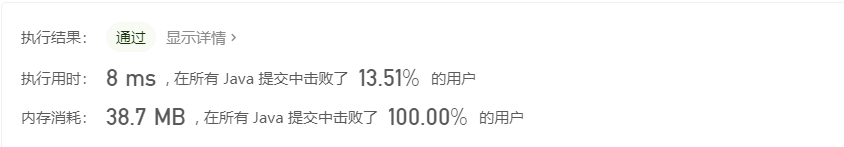

# 1.  前言

## 1.1 刷题方式

用中学里的系统学习方法来刷面试题，有教材，有课后习题，等做完之后再做综合题。刷题过程中要经常做笔记记录自己的学习过程。


1. 先将《剑指 offer》按照章节将例题做完；

2. 然后再到 LeetCode 网站上找对应的标签做十几天道题目。一个标签起码要做十题，对这个章节掌握吸收后再进行下一个章节；

3. 最后，面试前开始刷 LeetCode 上的热题（考前冲刺）。


掌握题目的标准是什么？

* 对一道题目，虽然已经忘记依然有思路，代码可以手打出来，这才叫做掌握。每道题目都要追求把题目吃透，不断地重复，理解解题思路。

刷了一段时间后怎么检测自身的掌握程度？

* 可以参加 LeetCode 的周赛和双周赛，如果能做出前三道，就没有太大问题了，可以去参加面试。


**教材例题（剑指 offer） + 课后习题 （LeetCode》+ 考前冲刺（LeetCode 热题）**


# 2. 算法基础

## 2.1 位运算

### 2.1.1 原码，反码，补码基础

原码和补码的相互计算方式：按位取反，末位加一。


### 2.1.2 位运算

位运算总共有5种运算：与、或、异或、左移或右移。

与、或、异或的运算规律

|          | 0 & 0 | 1 & 0 | 0 & 1 | 1 & 1 |
| :------: | :---: | :---: | :---: | :---: |
|  与 (&)  |   0   |   0   |   0   |   1   |
| 或 (\|)  |   0   |   1   |   1   |   1   |
| 异或 (^) |   0   |   1   |   1   |   0   |


* 左移分为算数左移和逻辑左移；

* 右移分为算数右移和逻辑右移。

|      | 算数 | 逻辑 |
| :--: | :--: | :--: |
| 左移 |  <<  | <<<  |
| 右移 | >>>  | >>>  |

逻辑左移和算数左移完全相同，移位后最高位添 0。

逻辑右移，移位后最高位添0 

算数右移，移位后最高位添加符号位（正数为 0，负数为 1）


## 2.2 算法


## 复杂度速查表

> [常用算法复杂度速查表][https://mp.weixin.qq.com/s?__biz=MzU4ODI1MjA3NQ==&mid=2247488143&idx=1&sn=deb6c615caf298ed998e5fbf6a741540&chksm=fddec44bcaa94d5d7118f20ead2b13575c909c70e823f63145e972941da270f5f52aae95411f&mpshare=1&scene=23&srcid=0707lCkUxpO9dVnjfMOfDuMy&sharer_sharetime=1594109671836&sharer_shareid=c7673b6ffac883d6f97d3c27bcb3fc32#rd]


**抽象数据结构复杂度**


**排序算法**


**图操作**


**堆操作**


**大O复杂度曲线**


## 2.3 排序

### 2.3.1 插入排序


## 2.4 常用类和方法


| 类或接口 | 方法 | 描述 |
| -------- | ---- | ---- |
| Queue<T> |      |      |
|          |      |      |
|          |      |      |


# 3. 剑指 Offer

## # 03 数组中重复的数字

### 问题描述

``` Java
找出数组中重复的数字。


在一个长度为 n 的数组 nums 里的所有数字都在 0～n-1 的范围内。数组中某些数字是重复的，但不知道有几个数字重复了，也不知道每个数字重复了几次。请找出数组中任意一个重复的数字。

示例 1：

输入：
[2, 3, 1, 0, 2, 5, 3]
输出：2 或 3 

限制：

2 <= n <= 100000
```


### 解题思路

#### 排序法

先将输入的数组排序，从头到尾搜秒排序后的数组定位重复的数字

时间复杂度 O(nlogn)，空间复杂度为 O(1)


#### 使用哈希表

从头到尾扫描数组，用哈希表存放当前数组元素，如果出现数组元素已经在哈希表中，则表明此元素是重复元素。哈希表具体的数据结构可以为 `HashSet` 或 `HashMap`，两者的时间复杂度均为 O(1)。

时间复杂度为 O(1)，空间复杂度为 O(n)

``` Java
class Solution {
    public int findRepeatNumber(int[] nums) {

        if(nums == null){
            return -1;
        }

        Set<Integer> set = new HashSet<>();
        for(var num : nums){
            if(set.contains(num)){
                return num;
            }
            set.add(num);
        }
        return -1;
    }
}
```

执行结果：


#### 对原数组进行修改

数组 `nums` 的元素的范围是 （0 ~ n-1），对数组从头到尾进行重排，如果没有重复元素，则重拍后的数字 i 的下标也一定是 i。具体算法流程如下：

1. 下标 `i` 从 0 到 n-1，判断 `i` 与 元素 `j` （`j` 为 `nums[i]`）是否相等；
   * `i == j`：当前元素无重复，跳过；
   * `i != j`：比较 `j` 和 元素 `k`（`k` 为 `nums[j]`）是否相等；
     * `j == k`：等价于 `nums[i] == nums[j]`，`j` 即为所求重复元素，方法返回，扫描结束；
     * `j != k`：交换 i 和 j 处的数字，将数字 j 放在正确的位置上，继续扫描；
2. 如果扫描到 n-1 处结束，则表明元素无重复，返回 `-1`。

时间复杂度为 O(n)，空间复杂度为 O(1)。

实现代码实例：

``` Java
class Solution {
    public int findRepeatNumber(int[] nums) {

        if(nums == null){
            return -1;
        }

        int j;
        int temp;
        for(int i=0;i<nums.length;i++){
            j=nums[i];
            if(i==j){
                continue;
            }else if(j == nums[j]){
                return j;
            }else{
                temp = nums[i];
                nums[i] = nums[j];
                nums[j] = temp; 
            }
        }
        return -1;
    }
}
```

提交记录


## # 04 二维数组中的查找

### 问题描述

```Java
在一个 n * m 的二维数组中，每一行都按照从左到右递增的顺序排序，每一列都按照从上到下递增的顺序排序。请完成一个函数，输入这样的一个二维数组和一个整数，判断数组中是否含有该整数。

示例:
现有矩阵 matrix 如下：
[
  [1,   4,  7, 11, 15],
  [2,   5,  8, 12, 19],
  [3,   6,  9, 16, 22],
  [10, 13, 14, 17, 24],
  [18, 21, 23, 26, 30]
]

给定 target = 5，返回 true。
给定 target = 20，返回 false。

限制：
0 <= n <= 1000
0 <= m <= 1000


```

### 解题思路

此题的难点在于如果我们将数组当作一个矩阵来处理，盲目地使用二重循环来查询目标元素的话，会导致每次比较之后的选择都大于一种。比如在找数字 `10` ，比当前比较的第 `2` 行，第 `2` 列的数组元素 `9` 大，我们需要决定是向下或向右寻找。这样的不确定性导致了程序的复杂度增大，并且有很大一部分的冗余计算。

由此我们需要确定基本思路为，减少每次比较后续的选择的不确定性。也就是说，得在目标数字 `target` 与数组元素之间找到一条偏序的比较路线。

由于给定的数组是有界的，且题中数组的排序性质为：

> 每一行都按照从左到右递增的顺序排序，每一列都按照从上到下递增的顺序排序。

因此我们可以很容易从给定任意行 `i` 行的第一个元素开始的一条偏序路线：

```
matrix[i][0]  ==>  matrix[i][n]  ==>  matrix[m][n]
```

不难找到其中的关键元素 `matrix[i][n]`，只要我们每次都与此元素比较，那么比较后的路线就是确定的：

* `target == matrix[i][n]`：找到元素，返回 `true`；
* `target < matrix[i][n]`：目标元素较小，向左继续查询；
* `target > matrix[i][n]`：目标元素较大，向下继续查询。


Java 代码示例：

```Java
class Solution {
     public boolean findNumberIn2DArray(int[][] matrix, int target) {
        if (matrix.length <= 0 || matrix[0].length <= 0) {
            return false;
        }

        int n = matrix.length;
        int m = matrix[0].length;
        int i = 0;
        int j = m - 1;
        boolean find = false;
        while (i < n && j >= 0) {
            if (target == matrix[i][j]) {
                find = true;
                break;
            } else if (target < matrix[i][j]) {
                j--;
            } else {
                i++;
            }
        }
        return find;
    }
}
```

提交结果：


## # 05 替换空格

### 问题描述

```Java
请实现一个函数，把字符串 s 中的每个空格替换成"%20"。

示例 1：

输入：s = "We are happy."
输出："We%20are%20happy."
 
限制：

0 <= s 的长度 <= 10000

```

### 解题思路

由于 Java 的 `String` 类型不可变，因此需要借助额外的 `char` 数组或 `StringBuffer` 变量。

#### 借助 `char` 数组

由于最坏的情况下，替换后的字符串的长度为原字符串长度的的 3 倍，因此新建一个长度为 `3*s.length()` 的 `chars` 数组用于存放替换后的字符序列。

借助游标 `size` 记录在每次遍历 `s` 后， `chars` 中有效字符串的长度，同时也是下次遍历写入的位置：

* 如果当前的字符为空格：则在 `chars` 中追加 `"%20"`，将 `size` 加 3；
* 如果当前的字符为非空格：则在 `chars` 中追加该字符，将 `size` 加 1；

示例代码：

```Java
class Solution {
    public String replaceSpace(String s) {
        int size = 0;
        char[] chars = new char[s.length() * 3];
        for (int i = 0; i < s.length(); i++) {
            if (s.charAt(i) == ' ') {
                chars[size++] = '%';
                chars[size++] = '2';
                chars[size++] = '0';

            } else {
                chars[size++] = s.charAt(i);
            }
        }
        return new String(chars, 0, size);
    }
}
```

提交结果：


#### 借助 `StringBuffer`

`StringBuffer` 对象是一个可变字符串对象，可以直接追加字符串。遍历 `s`，使用三元运算符来判断每次应该追加的字符。

```Java
class Solution {
    public String replaceSpace(String s) {
        StringBuffer sb = new StringBuffer();
        for (var ch : s.toCharArray()) {
            sb.append(
                    ch == ' ' ? "%20" : ch
            );
        }

        return sb.toString();
    }
}
```

提交结果：


## # 06 从尾到头打印链表

### 问题描述

```Java
输入一个链表的头结点，从尾到头反过来返回每个结点的值（用数组返回）。

示例 1：
输入：head = [1,3,2]
输出：[2,3,1]
 
限制：
0 <= 链表长度 <= 10000
```


### 解题思路

分析：

看到链表类型的题目，首先确定头结点是否携带具体值。本题中头结点携带具体值，因此遍历从头结点开始。

题目要求中有从头到尾的字眼，有两种解题思路：

* 使用栈这种先进后出的数据结构来辅助完成；
* 递归调用返回值；
* 直接将数据逆序存放在结果数组。


#### 借助栈

遍历链表，将结点中的值压栈。遍历结束后，依次出栈存放在 result 数组中，实现逆序输出。

示例代码：

```Java
/**
 * Definition for singly-linked list.
 * public class ListNode {
 *     int val;
 *     ListNode next;
 *     ListNode(int x) { val = x; }
 * }
 */
class Solution {
    public int[] reversePrint(ListNode head) {
        if(head == null){
            return new int[0];
        }
        Deque<Integer> stack = new ArrayDeque<>();
        
        // 遍历链表，将结点中的值压栈
        ListNode current = head;
        while(current != null){
            stack.push(current.val);            
            current = current.next;
        }

        int length = stack.size();
        int[] result = new int[length];
        int i = 0;
        // 将栈一次弹出，存放到 result 数组中
        while(!stack.isEmpty()){
            result[i++]=stack.pop();
        }
        return result;        
    }
}
```

执行结果：


#### 递归法

使用递归法，本质上还是使用栈。因为程序在执行时，进入方法（函数）和返回时存在一个隐式的栈：从当前方法 `methodA` 进入新方法 `methodB` 时会将 `methodA` 压栈，保留 `methodA` 中的变量信息；从 `methodB` 返回时到会将 `methodA` 弹出，继续执行 `methodA`。

需要注意一点，如果链表结点个数太多，可能导致程序的栈溢出。

示例代码

```Java
/**
 * Definition for singly-linked list.
 * public class ListNode {
 * int val;
 * ListNode next;
 * ListNode(int x) { val = x; }
 * }
 */
class Solution02 {
    public List<Integer> list = new ArrayList<>();

    public int[] reversePrint(ListNode head) {
        recursion(head);
        int length = list.size();
        int[] result = new int[length];
        for (int i = 0; i < length; i++) {
            result[i] = list.get(i);
        }
        return result;
    }

    public void recursion(ListNode node) {
        if (node == null) {
            return;
        }
        recursion(node.next);
        list.add(node.val);
    }
}
```

执行结果：


#### 直接法

除了栈和递归法，本题还可以直接将数据逆序存放在结果数组中。

```Java
/**
 * Definition for singly-linked list.
 * public class ListNode {
 *     int val;
 *     ListNode next;
 *     ListNode(int x) { val = x; }
 * }
 */
class Solution {
    public int[] reversePrint(ListNode head) {
        // 遍历链表，获取链表长度
        ListNode current = head;
        int length = 0;
        while(current != null){
            length++;
            current = current.next;
        }
        
        int[] result = new int[length];
        // 再次遍历链表，将链表的结点的值逆序存放在数组中
        current = head;
        while(current != null){
            result[--length] = current.val;
            current = current.next;
        }
        return result;
    }
}
```

执行结果：


## # 07 重建二叉树

### 问题描述

```Java
输入某二叉树的前序遍历和中序遍历的结果，请重建该二叉树。假设输入的前序遍历和中序遍历的结果中都不含重复的数字。

例如，给出
前序遍历 preorder = [3,9,20,15,7]
中序遍历 inorder = [9,3,15,20,7]
返回如下的二叉树：

    3
   / \
  9  20
    /  \
   15   7
 
限制：
0 <= 结点个数 <= 5000
```


### 解题思路

前序遍历

```
root
left
right
```

中序遍历

```
left
root
right
```

后序遍历

```
left
right
root
```

题目要求给出了前序遍历和中序遍历的结果：

> 前序遍历 preorder = [3,9,20,15,7]
> 中序遍历 inorder = [9,3,15,20,7]

根据二叉树遍历的原理可知，前序遍历的输出的值都是作为当前传入子树的 `root` 结点输出的。

从前序序列中获取首个结点 `node` ，易知，当前结点为二叉树的 `root` 结点可以将当前的中序序列划分为左右两个中序子序列：

*  `node` 结点的左侧结点均在 `node` 的左子树：
  * 如果左侧中序子序列为空，则 `node` 结点的左孩子为空；
  * 如果左侧中序子序列非空，则其中在前序序列中最先出现的结点 `leftNode` 即为这个子序列的 `root`，也就是 `node` 结点的左孩子；

*  `node` 结点的右侧结点均在 `node` 的右子树；
  * 如果右侧子序列为空，则 `node` 结点的右孩子为空；
  * 如果右侧中序子序列非空，则其中在前序序列中最先出现的结点 `rightNode` 即为这个子序列的 `root`，也就是 `node` 结点的右孩子；

#### 方法一

**算法流程：**

取前序序列第一个值，获取根结点的值，找到根结点在中序序列中的索引 `index`，通过 `index` 计算，根结点左右子树结点的个数：`leftNodeNum` 和 `rightNodeNum`。进而可以分别得到左右子树的前序和中序序列。分别递归求解左右子树即可。递归问题求解的关键在于确定 base case。此问题的 base case 为**当队列的前序或中序序列的长度为 0 时，表示当前子树为空，返回空结点 `null`。**

此题的易错点在于计算左右子树时的前序和中序的边界，因此此处先计算了左右子树的结点个数来辅助计算边界。


示例代码：

```Java
/**
 * Definition for a binary tree node.
 * public class TreeNode {
 *     int val;
 *     TreeNode left;
 *     TreeNode right;
 *     TreeNode(int x) { val = x; }
 * }
 */
class Solution {
    public TreeNode buildTree(int[] preorder, int[] inorder) {
        if(preorder==null || preorder.length == 0 
           || inorder == null || inorder.length == 0){
            return null;
        }
        return constructCore(0, preorder.length-1, preorder, 0, inorder.length-1, inorder);
    }

    public TreeNode constructCore(int preStart, int preEnd, int[] preorder,
                                  int inStart, int inEnd, int[] inorder)
    {
        // base case
        if(preStart > preEnd){
            return null;
        }

        // 当前树的根结点值
        int rootValue = preorder[preStart];
        TreeNode root = new TreeNode(rootValue);

        // 找到根结点在中序遍历中的索引
        int index = findIndex(rootValue, inorder);

        // 左子树的结点个数
        int leftNodeNum = index - inStart;
        // 右子树的结点个数
        int rightNodeNum = inEnd - index;

        // 构建左子树
        root.left = constructCore(preStart + 1, preStart + leftNodeNum, preorder, inStart, inStart + leftNodeNum - 1, inorder);
        // 构建右子树
        root.right = constructCore(preEnd - rightNodeNum + 1, preEnd, preorder, inEnd - rightNodeNum + 1, inEnd, inorder);    

        return root;
    }

    public int findIndex(int val, int[] order) {
        for (int i = 0; i < order.length; i++) {
            if (val == order[i]) {
                return i;
            }
        }
        return -1;
    }

}
```


执行结果：


| 时间复杂度 | O(n^2) |
| ---------- | ------ |
| 空间复杂度 | O(1)   |


#### 解法优化

上述解法虽然执行通过，但耗时较高。每次找 root 在中序序列中的索引时，都会调用 `findIndex` 方法，遍历中序序列，此方法查询索引平均时间复杂度为 `O(n)`。

可以引入一个 `HashMap` 在初始状况下保存中序序列中的索引与值的关系。这样之后每次查询 root 的索引的时间复杂度均为 `O(1)`。

示例代码

```Java
/**
 * Definition for a binary tree node.
 * public class TreeNode {
 *     int val;
 *     TreeNode left;
 *     TreeNode right;
 *     TreeNode(int x) { val = x; }
 * }
 */
class Solution {
    public Map<Integer, Integer> indexMap = new HashMap<>();

    public TreeNode buildTree(int[] preorder, int[] inorder) {
        if (preorder == null || preorder.length == 0
            || inorder == null || inorder.length == 0) {
            return null;
        }
        for (int i = 0; i < inorder.length; i++) {
            indexMap.put(inorder[i], i);
        }

        return constructCore(0, preorder.length - 1, preorder, 0, inorder.length - 1, inorder);
    }

    public TreeNode constructCore(int preStart, int preEnd, int[] preorder,
                                  int inStart, int inEnd, int[] inorder) {
        // base case
        if (preStart > preEnd) {
            return null;
        }

        // 当前树的根结点值
        int rootValue = preorder[preStart];
        TreeNode root = new TreeNode(rootValue);

        // 找到根结点在中序遍历中的索引
        int index = indexMap.get(rootValue);

        // 左子树的结点个数
        int leftNodeNum = index - inStart;
        // 右子树的结点个数
        int rightNodeNum = inEnd - index;

        // 构建左子树
        root.left = constructCore(preStart + 1, preStart + leftNodeNum, preorder, inStart, inStart + leftNodeNum - 1, inorder);
        // 构建右子树
        root.right = constructCore(preEnd - rightNodeNum + 1, preEnd, preorder, inEnd - rightNodeNum + 1, inEnd, inorder);

        return root;
    }

}
```

执行结果：


| 时间复杂度 | O(n) |
| ---------- | ---- |
| 空间复杂度 | O(n) |


## # 09 用两个栈实现队列

### 问题描述

```Java
用两个栈实现一个队列。队列的声明如下，请实现它的两个函数 appendTail 和 deleteHead ，分别完成在队列尾部插入整数和在队列头部删除整数的功能。(若队列中没有元素，deleteHead 操作返回 -1 )

示例 1：
输入：
["CQueue","appendTail","deleteHead","deleteHead"]
[[],[3],[],[]]
输出：[null,null,3,-1]

示例 2：
输入：
["CQueue","deleteHead","appendTail","appendTail","deleteHead","deleteHead"]
[[],[],[5],[2],[],[]]
输出：[null,-1,null,null,5,2]

提示：
1 <= values <= 10000
最多会对 appendTail、deleteHead 进行 10000 次调用

```


### 解题思路


**前置知识：**

| 数据结构 | 属性             |
| -------- | ---------------- |
| 队列     | 先进先出（FIFO） |
| 栈       | 先进后出（FILO） |

解此题前需要了解队列和栈的属性，用两个栈来模拟队列先进先出的特性。


**算法流程：**

使用一个栈 `inputStack` 来接收元素，另一个栈 `outputStack` 来提供元素。

* 初始化：  

* 接收元素：直接将元素压栈到 `inputStack` 中；
* 提供元素：先判断 `outputStack` 是否为空：
  * 若为空，将 `inputStack` 中所有的元素依次弹出，并压栈入 `outputStack` 中。清空 `inputStack` 后，弹出 `ouputStack` 栈顶元素。即为所求；
  * 若非空， 直接弹出 `outputStack` 栈顶元素；

**注意**：Java 中虽然有 `Stack` 类，但并不推荐使用。应当使用 `Deque` 来实现栈的功能。`LinkedList`  和 `ArrayDueue` 类均实现了 `Deque` 接口，但实验比较发现，使用 `LinkedList` 实现的效率更高，故实例中使用 `LinkedList` 实现栈功能。

示例代码

```Java
class CQueue {    
    Deque<Integer> inputStack;
    Deque<Integer> outputStack;

    public CQueue() {
        inputStack = new LinkedList<>();
        outputStack = new LinkedList<>();
    }

    public void appendTail(int value) {
        inputStack.push(value);
    }

    public int deleteHead() {
        if(outputStack.isEmpty()){                      
            if(inputStack.isEmpty()){
                return -1;
            }
            while(!inputStack.isEmpty()){
                outputStack.push(inputStack.pop());
            } 
        }
        return outputStack.pop();
    }
}

/**
 * Your CQueue object will be instantiated and called as such:
 * CQueue obj = new CQueue();
 * obj.appendTail(value);
 * int param_2 = obj.deleteHead();
 */
```

执行结果：


## # 10-I 斐波那契数列

### 问题描述

```Java
写一个函数，输入 n ，求斐波那契（Fibonacci）数列的第 n 项。斐波那契数列的定义如下：

F(0) = 0,   F(1) = 1
F(N) = F(N - 1) + F(N - 2), 其中 N > 1.
斐波那契数列由 0 和 1 开始，之后的斐波那契数就是由之前的两数相加而得出。

答案需要取模 1e9+7（1000000007），如计算初始结果为：1000000008，请返回 1。

示例 1：
输入：n = 2
输出：1

示例 2：
输入：n = 5
输出：5
 
提示：
0 <= n <= 100

```


### 解题思路

斐波那契数组是经典的算法题，可用递归法或者循环法求解。

使用递归法需先明确 base case，此题中的 base case 为 F(0) = 0，F(1) = 1。


#### 递归法

斐波那契数列本身就是递归定义的，所以可以使用递归法来求解。但时使用递归性能并不好，比如，当 N=3时，需要计算 fib(2) + fib(1)，而加号左边的 fib(2) 会再次计算 fib(1)，fib(1) 被计算了两次。当 N 较大时，会导致大量重复计算。

示例代码：

```Java
class Solution {
    public int fib(int n) {
        // base case
        if(n == 0){
            return 0;
        }
        if(n == 1){
            return 1;
        }
        int result = fib(n-1) + fib(n-2);
        return result % 1000000007;
    }
}
```

执行结果，超出时间限制。


#### 动态规划循环法 I

因为递归总可以用循环来转换，我们将上面的递归法的代码修改为使用循环，借助额外的长度为 n+1 的数组存放从第 0~n 个斐波那契数列的值。

循环法与递归法的最大区别在于，递归法求解顺序是从 fib(n) 计算到 fib(0)，其中有大量的重复计算；而递归法求解顺序是从 fib(0) 计算到 fib(n)，减少了重复计算的同时，也省去了程序大量调用方法的开销。

示例代码：

```Java
class Solution {

    public int fib(int n) {
        // base case
        if(n == 0){
            return 0;
        }
        if(n == 1){
            return 1;
        }
		
        int[] array = new int[n+1];
        array[0] = 0;
        array[1] = 1;

        for(int i = 2; i <= n; i++){
            array[i] = (array[i-1] + array[i-2]) % 1000000007;
        }

        return array[n];
    }
}
```

执行结果


#### 动态规划循环法 II

循环法 I 中借助了一个额外的数组用于存放从 0 到 n 的斐波那契数列的值。然而再实际求解第 fib(n) 的过程中，只使用了 fib(n-1) 和 fib(n-2) 的值，因此，对于此题，我们只需要存放并在每次循环中更新 fib(n-1) 和 fib(n-1) 的值即可。

示例代码

```
public class Solution03 {
    public int fib(int n) {
        if (n == 0) {
            return 0;
        }
        if (n == 1) {
            return 1;
        }

        int fibonaciMinusOne = 1;   // fib(n-1)
        int fibonaciMinusTwo = 0;   // fib(n-2)
        int result = 1;

        for (int i = 2; i <= n; i++) {
            result = (fibonaciMinusOne + fibonaciMinusTwo) % 1000000007;
            fibonaciMinusTwo = fibonaciMinusOne;    
            fibonaciMinusOne = result;
        }

        return result;
    }
}
```

执行结果：


## # 10-II 青蛙跳台阶问题

### 问题描述

```Java
一只青蛙一次可以跳上1级台阶，也可以跳上2级台阶。求该青蛙跳上一个 n 级的台阶总共有多少种跳法。
答案需要取模 1e9+7（1000000007），如计算初始结果为：1000000008，请返回 1。

示例 1：
输入：n = 2
输出：2

示例 2：
输入：n = 7
输出：21

提示：
0 <= n <= 100
```


### 解题思路

> 此类求 *多少种可能性* 的题目一般都有 **递推性质** ，即 f(n)*f*(*n*) 和 f(n-1)*f*(*n*−1)…f(1)*f*(1) 之间是有联系的。

将把 n 级台阶的跳法看成 n 的函数，记为 `f(n)`。

考虑特殊情况：

* `n = 1`，青蛙只有一种跳法，`f(n) = 1`；
* `n = 2`，青蛙可以跳1级台阶跳两次，也可以一次跳2级台阶，有两种跳法，f(n)  = 2；


再考虑一般情况，`n > 2` 时，先看第一次跳时，选择有两种：

* 跳 1 级，按照函数定义，按照函数 f 定义，剩余的 n - 1 级台阶的跳法为 `f(n-1)`；
* 跳 2 级，按照函数定义，按照函数 f 定义，剩余的 n - 2 级台阶的跳法为 `f(n-2)`；

综合两种跳法可知，n 级台阶的跳法 `f(n) = f(n-1) + f(n-2)`，问题就转化为斐波那契数列问题。

分析本题的 base case 为：f(0) = 1, f(1) = 1，f(2) = 2。

现以动态规划法求解此问题。


#### 动态规划法

示例代码：

```Java
class Solution {
    public int numWays(int n) {
        // base case
        int[] results = {1, 1, 2};
        if (n <= 2) {
            return results[n];
        }

        int dp1 = 2;
        int dp0 = 1;
        int result = 2;

        for (int i = 3; i <= n; i++) {
            result = (dp1 + dp0) % 1000000007;
            dp0 = dp1;
            dp1 = result;
        }

        return result;
    }
}
```

提交结果


## # 11 旋转数组的最小数字

### 问题描述

```Java
把一个数组最开始的若干个元素搬到数组的末尾，我们称之为数组的旋转。输入一个递增排序的数组的一个旋转，输出旋转数组的最小元素。例如，数组 [3,4,5,1,2] 为 [1,2,3,4,5] 的一个旋转，该数组的最小值为1。  

示例 1：
输入：[3,4,5,1,2]
输出：1

示例 2：
输入：[2,2,2,0,1]
输出：0

```


### 解题思路

> 如果面试题是在要求在排序的数组（或者部分排序的数组）中查找一个数字或者统计某个数字出现的次数，那么我们都可以尝试用二分查找算法。


#### 暴力求解法

记录数组首个元素的值 `temp`。因为原数组是底层数组，遍历旋转数组 `numbers[]` 时，如果出现某个元素小于 `temp`，表明此元素是原数组的首个元素，也就是最小值。

这种方法的时间复杂度为 O(n)，

代码示例：

```Java
class Solution {
    public int minArray(int[] numbers) {
        int min = numbers[0];
        for(int i = 1; i < numbers.length; i++){
            if(numbers[i] < min){
                return numbers[i];
            }
        }
        return min;
    }
}
```

执行结果：


#### 二分法

* 如下图所示，可将旋转数组分为两个有序子数组，其中**左排序数组**中任一元素的值大于或等于**右排序数组**中的任一元素；
* 左排序数组可为空，此时原数组是有序数组，旋转点值为首个元素的值。


算法流程：

1. 循环二分：设置两个索引 `start`， `end` 分别指向数组的头和尾。中间的元素索引为 `middle = (end - start) / 2` 向下取整。因此恒有：`start <= middle < end`；
   1. 如果 `numbers[middle] > numbers[end]`：则此时的 `middle` 一定位于左排序数组，而旋转点在 `middle` 和 `end` 之间，更新 `start = middle + 1`；
   2. 如果 `numbers[middle] < numbers[end]`：则此时的 `middle` 一定位于右排序数组，而旋转点在 `start` 和 `midlle` 之间，更新 `end = middle`；
   3. 如果 `numbers[middle] == numbers[end]`：此时无法判断此时旋转点的位置，后续单独分析：
      * 考虑数组 [1, 1, 1, 1, 1]，此时 `start = 0`，`end = 4`，`middle = 2`，有 `numbers[middle] == numbers[end]` ，此时的旋转点索引为 0，在 `start` 与 `middle` 之间；
      * 考虑数组[1, 1, 1, 0, 1]，此时 `start = 0`，`end = 4`，`middle = 2`，有 `numbers[middle] == numbers[end]` ，此时的旋转点索引为 3，在 `middle` 与 `end` 之间；
2. 当 `start == end` 时，当前子排序数组中只有一个元素，此元素即为所求值。


再次考虑 `numbers[middle] == numbers[end]` 时的处理，根据左排序数组的任一元素的值都会大于右排序数组的任一元素这一性质，更新 `end = end - 1`。考虑出现以下几种情况：

1. `middle` 索引位置不变，`end` 索引处的数组元素值不变，继续循环；
2. `middle` 索引位置不变，`end` 索引处的数组元素值减小，此时有 `numbers[middle] > numbers[end]`，进入到1.1 分支处理；
3. `middle` 索引位置减 1 且该处的数组元素值不变，`end` 索引处的数组元素值不变，继续循环；
4. `middle` 索引位置减 1 且该处的数组元素值减小，`end` 索引处的数组元素值不变，此时有 `numbers[middle] < numbers[end]`，进入 1.2 分支处理；
5. `middle` 索引位置减 1 且该处的数组元素值减小，`end` 索引处的数组元素值减小，虽然我们不确定此时的 `numbers[middle]` 和 `numbers[end]` 的大小，但无论是那种关系，都可以在下次循环中被处理。


代码示例：

```Java
class Solution {
    public int minArray(int[] numbers) {
        int start = 0;
        int end = numbers.length-1;
        int middle;
        
        while(start != end){
            middle = (start + end) / 2;
            if(numbers[middle] > numbers[end]){
                // middle 位于左排序数组
                start = middle + 1;
            }else if(numbers[middle] < numbers[end]){
                end = middle;
                // middle 位于右排序数组
            }else{
                // 后退 end
                end--;
            }
        }
        return numbers[start];
    }
}
```

执行结果：


二分法平均的时间复杂度为：**O(logn)**，极端情况下入 `numbers={1, 1, 1, 1, 1}` 时 end 索引持续自减 1，退化为遍历数组操作，时间复杂度为 **O(n)**。


## # 12 矩阵中的路径

### 问题描述

```Java
请设计一个函数，用来判断在一个矩阵中是否存在一条包含某字符串所有字符的路径。路径可以从矩阵中的任意一格开始，每一步可以在矩阵中向左、右、上、下移动一格。如果一条路径经过了矩阵的某一格，那么该路径不能再次进入该格子。例如，在下面的3×4的矩阵中包含一条字符串“bfce”的路径（路径中的字母用加粗标出）。

[["a","b","c","e"],
 ["s","f","c","s"],
 ["a","d","e","e"]]

但矩阵中不包含字符串“abfb”的路径，因为字符串的第一个字符b占据了矩阵中的第一行第二个格子之后，路径不能再次进入这个格子。

示例 1：
输入：board = [["A","B","C","E"],["S","F","C","S"],["A","D","E","E"]], word = "ABCCED"
输出：true

示例 2：
输入：board = [["a","b"],["c","d"]], word = "abcd"
输出：false

提示：
1 <= board.length <= 200
1 <= board[i].length <= 200

```

### 解题思路

> 回溯法：从解决问题每一步的所有可能选项里系统地选择处一个可行的解决方案。用回溯法解决的问题的所有选项都可以形象地用树结构表示。
>
> 在某一步有 n 个可能的选项，那么该步骤可以堪称时树状结构的一个结点，每个选项看成树中结点连接线，经过这些连接线到达该结点地 n 个子结点。树的叶结点对应着终结状态。
>
> 如果在叶结点的状态满足题目的约束条件，那么我们找到了一个可行的解决方案。
>
> 如果在叶结点的状态不满足约束条件，就回溯到它的父结点，如果父结点所有的选项都已经试过，并且无法满足约束条件，就继续回溯到它的父结点，重复以上操作，如果所有结点的所有选项都不满足约束条件，则该问题无解。


#### DFS 深度优先搜索

> 本问题是典型的矩阵搜索问题，可使用 **深度优先搜索（DFS）+ 剪枝** 解决。

**算法流程：**

* **深度优先搜索**：通过递归先朝着一个设定的方向一直搜索。再回溯到上一个结点，换一个方向继续搜索，直到访问完所有的元素，这是一种暴力的搜索方式，搜索过程中会遍历搜索的元素。
* **剪枝**：深度优先搜索的遍历方式会重复搜索同一元素，或者在某个路径不符合约束要求时仍会继续搜索。因此添加搜索约束，进行可行性剪枝，满足以下条件时，直接返回 false，不再从此路径继续搜索：
  * 访问的索引超出边界；
  * 当前搜索的元素值和目标字符不同；
  * 当前元素之前已访问；（题目要求：如果一条路径经过了矩阵的某一格，那么该路径不能再次进入该格子。）


**复杂度分析：**

令 N，M 为矩阵行列数，K 为目标字符串长度

* **时间复杂度 O(3*K* * NM)**：除了第一个被访问的元素外，对于其它被访问的元素，我们都会从上下左右 4 个方向继续深度优先搜索，可以确定的是至少有一个方向会被剪枝（来的方向的元素一定为已访问元素），因此每次遍历的时间复杂度为  **O(3*K*)**。遍历总次数为 NM，因此时间复杂度为： **O(3*K* * NM)**；

* **空间复杂度 O(NM)**：
   * 深度优先搜索，使用系统栈调用方法，每次遍历需要栈深度为 K，时间负遍历结束方法后，栈空间会释放。最差的情况下一次遍历会扫描矩阵所有元素 K = NM，总空间复杂度为 **O(NM)**。
   * 引入额外的数组空间复杂度为 **O(NM)**。


示例代码：

```java
class Solution {
    public boolean exist(char[][] board, String word) {
        
        if(board == null || board[0] == null || 
           board.length == 0 || board[0].length == 0 ||
           Objects.equals(word,"")){
            return false;
        }
        
        boolean[][] isVisited = new boolean[board.length][board[0].length];
                
        
        char[] words = word.toCharArray();
        
        for (int i = 0; i < board.length; i++) {
            for (int j = 0; j < board[0].length; j++) {
                if (dfs(isVisited, board, words, i, j, 0)) {
                    return true;
                }
            }
        }

        return false;
    }

    public boolean dfs(boolean[][] isVisited, char[][] board, char[] words, int i, int j, int k) {
        if (i < 0 || i >= board.length || j < 0 || j >= board[0].length || 
            isVisited[i][j] || board[i][j] != words[k]) {
            return false;
        }

        if (k == words.length - 1) {
            return true;
        }

        // 此位置已被访问
        isVisited[i][j] = true;

        boolean res = dfs(isVisited, board, words, i + 1, j, k + 1) ||
                dfs(isVisited, board, words, i - 1, j, k + 1) ||
                dfs(isVisited, board, words, i, j + 1, k + 1) ||
                dfs(isVisited, board, words, i, j - 1, k + 1);

        // 回溯后，取消访问标识
        isVisted[i][j] = false;
        return res;
    }
}
```

执行结果：


#### DFS 深度优先搜索剪枝优化

上述流程中的可行性剪枝中添加为了标志矩阵中元素是否被访问，借助了一个和矩阵大小相同的 `boolean` 数组，为了不引入额外的空间，可以将被访问过的元素，设置为一个与当前矩阵所有值都不同的特殊值 '#'。这样就将剪枝条件**当前元素之前已访问**，合并入**当前搜索的元素值和目标字符不同**中。


**复杂度分析：**

令 N，M 为矩阵行列数，K 为目标字符串长度

* **时间复杂度 O(3*K* * NM)**：除了第一个被访问的元素外，对于其它被访问的元素，我们都会从上下左右 4 个方向继续深度优先搜索，可以确定的是至少有一个方向会被剪枝（来的方向的元素一定为已访问元素），因此每次遍历的时间复杂度为  **O(3*K*)**。遍历总次数为 NM，因此时间复杂度为： **O(3*K* * NM)**；

* **空间复杂度 O(K)**：深度优先搜索，使用系统栈调用方法，每次遍历需要栈深度为 K，时间负遍历结束方法后，栈空间会释放。最差的情况下一次遍历会扫描矩阵所有元素 K = NM，总空间复杂度为 **O(NM)**。


示例代码：

```Java
class Solution {
    public boolean exist(char[][] board, String word) {
        // 边界判断
        if(board == null || board[0] == null || 
           board.length == 0 || board[0].length == 0 ||
           Objects.equals(word,"")){
            return false;
        }
        char[] words = word.toCharArray();

        // 遍历矩阵
        for (int i = 0; i < board.length; i++) {
            for (int j = 0; j < board[0].length; j++) {
                // 找到匹配的路径后，直接返回
                if (dfs(board, words, i, j, 0)) {
                    return true;
                }
            }
        }
        return false;
    }

    public boolean dfs(char[][] board, char[] words, int i, int j, int k) {
        // 剪枝操作，当 dfs 搜索时出现索引越界或当前索引处的矩阵值与目标字符不同
        // 说明此路径不通，没有必要继续搜索
        if (i < 0 || i >= board.length || j < 0 || j >= board[0].length || 
            board[i][j] != words[k]) {

            return false;
        }

        if (k == words.length - 1) {
            return true;
        }
        // 保存当前字符
        char temp = board[i][j];
        // 用 * 标记，此位置已被访问
        board[i][j] = '#';

        boolean res = dfs(board, words, i + 1, j, k + 1) ||
            dfs(board, words, i - 1, j, k + 1) ||
            dfs(board, words, i, j + 1, k + 1) ||
            dfs(board, words, i, j - 1, k + 1);

        // 获得下层 dfs 访问结果，回溯时恢复原矩阵值
        board[i][j] = temp;
        return res;
    }
}
```

执行结果：


## # 13 机器人的运动范围

### 问题描述

```Java
地上有一个m行n列的方格，从坐标 [0,0] 到坐标 [m-1,n-1] 。一个机器人从坐标 [0, 0] 的格子开始移动，它每次可以向左、右、上、下移动一格（不能移动到方格外），也不能进入行坐标和列坐标的数位之和大于k的格子。例如，当k为18时，机器人能够进入方格 [35, 37] ，因为3+5+3+7=18。但它不能进入方格 [35, 38]，因为3+5+3+8=19。请问该机器人能够到达多少个格子？

示例 1：
输入：m = 2, n = 3, k = 1
输出：3

示例 2：
输入：m = 3, n = 1, k = 0
输出：1

提示：
1 <= n,m <= 100
0 <= k <= 20

```


### 解题思路

和 #12 矩阵中的路径 一题相似，也是矩阵搜索类型的题目，可以用 DFS 和 回溯法来求解。

题干中的约束条件为：

> 不能进入行坐标和列坐标的数位之和大于k的格子。

可先定义方法 `sum` 用于计算行列坐标的数位之和，约束条件的表达式为 `sum(i) + sum(j) <= k`。

```Java
public int sum(int n){
    int sum = 0;
    if(n != 0){
        sum += n % 10;
        n /= 10;
    }
    return sum;
}
```


#### DFS 深度优先搜索

**算法分析：**

* **深度优先搜索**：通过递归先朝着一个设定的方向一直搜索。再回溯到上一个结点，换一个方向继续搜索，直到访问完所有的元素，这是一种暴力的搜索方式，搜索过程中会遍历搜索的元素。
* **剪枝**：深度优先搜索的遍历方式会重复搜索同一元素，或者在某个路径不符合约束要求时仍会继续搜索。因此添加搜索约束，进行可行性剪枝，满足以下条件时，直接返回 cout 为 0，不再从此路径继续搜索：
   * 访问的索引超出边界；
   * 行坐标和列坐标的数位之和大于k；
   * 当前元素之前已访问；（题目要求：计算机器人能够到达的格子数量，不可重复计算同一格子）。


**算法流程**：

* **递归参数：**当前访问的行列索引；
* **终止条件**：达到剪枝条件，1. 访问的索引超出边界，2. 行列坐标的数位之和大于 k 的，3. 当前元素已访问；
* **递推过程**：
   1. 将当前元素设置为已访问；
   2. 因为机器人从 `(0, 0)` 出开始搜索，可以只向下和向右递归，深度优先搜索；
* **回溯返回值**：1 + 向下递归返回值 + 向右递归返回值。


**复杂度分析：**

* **时间复杂度O(MN)**：最差情况下，机器人遍历矩阵所有单元格，调用 `M * N` 次 `dfs` 方法，栈深度为 `M * N`，此时时间复杂度为**O(MN)**；
* **空间复杂度O(MN)**：最差情况下，大小为 `M*N` 的  `isVisited` 数组全部被置为 true，空间复杂度为**O(MN)**。


示例代码：

```Java
class Solution {
    int m;
    int n;
    int k;
    boolean[][] isVisited;

    public int movingCount(int m, int n, int k) {
        this.m = m;
        this.n = n;
        this.k = k;
        this.isVisited = new boolean[m][n];

        return dfs(0, 0);
    }


    public int dfs(int i, int j) {
        /* 剪枝
        1. 当索引超出边界
        2. 索引位数值之和大于 k
        3. 当前位置已经被访问
        */
        if (i < 0 || i >= m || j < 0 || j >= n 
            || sum(i) + sum(j) > k || isVisited[i][j]) {
            return 0;
        }
                
        // 标记当前位置已访问
        isVisited[i][j] = true;
        // 深度优先搜索，因为机器人从(0, 0) 处开始搜索，可以只计算向下和向右搜索的值
        int count = 1 + dfs(i + 1, j) + dfs(i, j + 1);

        return count;
    }

    // 求位数之和
    public int sum(int n) {
        int sum = 0;
        while (n != 0) {
            sum += n % 10;
            n /= 10;
        }
        return sum;
    }
}
```

执行结果：


#### BFS 广度优先搜索


BFS 和 DFS 一样，都是用与遍历搜索所给数据结构的，不同的是：

* **DFS**：朝一个方向搜索，达到终止条件后再回溯到上一元素，换一个方向继续搜索；
* **BFS**：按照层级（level）来搜索，按照与初始元素的远近距离分层访问，很适合使用队列来辅助搜索。


**队列（Queue）：**

* **先进先出（FIFO）**：配合 BFS使用。如果当前队列存放第 `N` 层的元素，那么只有等这些元素都被搜索了，才会访问第 `N + 1` 层元素。


**迭代算法流程**：

* **初始条件**：起始位置 `(0, 0)` 加入队列中；
* **终止条件**：队列为空；
* **迭代过程**：
   1. 取队首元素为当前访问元素；
   2. 将当前元素置为已访问；
   3. 考察当前元素的下元素和右元素，如果满足元素未被访问，行列坐标的数位之和不大于 k，索引未超界，则将元素入队；
* **返回值**：已访问数组的元素个数。


**复杂度分析：**

* **时间复杂度O(MN)**：最差情况下，机器人遍历矩阵所有单元格，循环次数为 `M * N`，此时时间复杂度为**O(MN)**；
* **空间复杂度O(MN)**：最差情况下，大小为 `M*N` 的  `isVisited` 数组全部被置为 true，空间复杂度为**O(MN)**。


示例代码：

```Java
class Solution {

    public Queue<int[]> queue;
    boolean[][] isVisited;

    public int movingCount(int m, int n, int k) {
        this.queue = new LinkedList<>();
        this.isVisited = new boolean[m][n];

        queue.offer(new int[]{0, 0});
        int count = 0;
        while (!queue.isEmpty()) {
            // 1. 取队首元素为当前访问元素 
            int[] head = queue.poll();

            
            int i = head[0];
            int j = head[1];
            
            // 剪枝
            if (i >= m || j >= n || sum(i) + sum(j) > k || isVisited[i][j]) {
                continue;
            }
            // 2. 将当前元素置为已访问
            isVisited[i][j] = true;
            // 记录元素为 true 的数量
            count++;

            // 3 将下方和右方元素入队
            queue.offer(new int[]{i + 1, j});
            queue.offer(new int[]{i, j + 1});
        }

        return count;
    }

    // 求位数之和
    public int sum(int n) {
        int sum = 0;
        while (n != 0) {
            sum += n % 10;
            n /= 10;
        }
        return sum;
    }
}
```

执行结果：




## # 14-I 剪绳子

### 问题描述

```Java
给你一根长度为 n 的绳子，请把绳子剪成整数长度的 m 段（m、n都是整数，n>1并且m>1），每段绳子的长度记为 k[0],k[1]...k[m-1] 。请问 k[0]*k[1]*...*k[m-1] 可能的最大乘积是多少？例如，当绳子的长度是8时，我们把它剪成长度分别为2、3、3的三段，此时得到的最大乘积是18。

示例 1：
输入: 2
输出: 1
解释: 2 = 1 + 1, 1 × 1 = 1
    
示例 2:
输入: 10
输出: 36
解释: 10 = 3 + 3 + 4, 3 × 3 × 4 = 36
    
提示：
2 <= n <= 58

```


**动态规划法**

> 动态规划现在是编程面试中的热门话题。如果面试题是求一个问题的最优解（通常是求最大值或者最小值），而且该问题能够被分解成若干个子问题，并且子问题之间还有重叠的更小的子问题，就可以考虑用动态规划来解决这个问题。
>
> 我们在应用动态规划之前要分析，
>
> 1. 能否把大问题分解成小问题；
> 2. 分解后的每个小问题是否也存在最优解；
> 3. 小问题的最优解组合起来能否到整个问题的最优解；
>
> 那么我们可以应用动态规划解决这个问题。


动态规划的四个特点：

1. 求一个问题的最优解；
2. 整体问题的最优解是依赖各个子问题的最优解；
3. 把大问题分解成小问题，这些小问题之间还有相互重叠的更小子问题；
4. 从上往下分析问题，从下往上求解问题。


### 解题思路

为了使绳子的乘积最大，要先确定怎么剪绳子，每段绳子长度多少。将绳子剪成 m 段，记绳子长度为：$a_m, \ m \in \{0,1,2,3,4  ... n-1\} $，总乘积为：$\prod_{0}^{m-1} a_m$。


根据均值不等式：$\left (\frac{a_1 + a_2 + ... + a_m}{m}\right )^{m} >= a_1a_2 ... a_m$ ，当且仅当 $a_1 = a_2 = ... = a_m$ 时取等号

因此当每段绳子的长度相等，记作 a ，总乘积取最大值。本问题中绳子长度必须为整数 ，因此最后一段绳子允许小于 a。 

接下来我们要确定 a 的最优值，设将绳子按照 a 长度等分为 `m` 段，有 `n = am`，乘积为 $a^m$ 。观察以下公式：

${\large a^{m} = a^{\frac{n}{a} } = (a^{\frac{1}{a}})^{n} } $

问题转化为  $y = x^{\frac{1}{x}} $ 求极值的问题，两边求导后易知当 `x = e` 时， `y` 取得极大值。因为 `x` 必须为整数，所以考察 *e* 两侧的整数 2 和 3：

* $x=2,\ y^{6} = (2^{\frac{1}{2} })^{6} = 2^{3} = 8$
* $x=3,\ y^{6} = (3^{\frac{1}{3} })^{6} = 3^{2} = 9$

因此当 **x=3** 时，可得值最大。


综上分析，得到已下两个结论：

1. 每段绳子的长度必须相等，才能获取乘积最大值；
2. 尽可能将绳子以长度 `3` 等分为多段，才能获取乘积最大值。


#### 递推法

**算法流程：**

1. 总绳长 n <= 3 时，其实本应该不分段，但题目要求  m > 1，必须进行一次以上的分段，`f(n) = n-1`：

2. 总绳长 n > 3 时，按每段长度为 3 等分绳子，记录商为 `r`，余数即最后一段绳长为 `a` ：

   * a = 0，不需要再分段，总乘积为 $f(n) = 3^{r}$。

   * a = 1，这一段绳长和倒数第二段绳长乘积为 `1 * 3`，可以将上一段和这一段总长为 4 的绳子分为两段长为 2 的绳子，乘积为 2 * 2，总乘积为 $f(n) = 3^{r-1} \cdot  4$；
   * a = 2，不需要再分段，总乘积为 $f(n) = 3^{r} \cdot  2$；


**复杂度分析：**

* **时间复杂度 O(1)：**没有递归，没有循环，所有操作都是常数时间内完成；
* **空间复杂度 O(1)：**仅使用常数大小额外空间。


示例代码：

```Java
class Solution {
    public int cuttingRope(int n) {
        if (n == 2) {
            return 1;
        }
        if (n == 3) {
            return 2;
        }

        int result = 0;
        int last = 3;
        int quotient = n / 3;
        int remainder = n % 3;
        switch (remainder) {
            case 0:
                result = (int) Math.pow(3, quotient);
                break;
            case 1:
                result = (int) Math.pow(3, quotient - 1) * 4;
                break;
            case 2:
                result = (int) Math.pow(3, quotient) * 2;
                break;
            default:
                break;
        }
        return result;
    }
}

```

执行结果：


#### 动态规划法

（书中思路）

**算法流程：**

定义函数 $f(n)$ 为把长度为 n 的绳子简称若干段后各段长度乘积的最大值。

1. 总绳长 n <= 3 时，其实本应该不分段，但题目要求  m > 1，必须进行一次以上的分段，$f(n) = n-1$：

2. 总绳长 n > 3 时，剪第一刀时，有 $n - 1$ 中选择，即第一段绳子的长度为 $1,2 ... n-1$，因此 $f(n) = max(f(i) \cdot f(n-i))$；

3. 从下而上的顺序计算，将子问题的最优解存放在数组 `products` 里。$f(i)$ 表示把长度为 i 的绳子剪成若干段之后各段长度乘积的最大值。对于每一个 j（0<j<i）来说， $f(j)$ 都已经求解出来，存放在 `products[j]` 中。

   

**复杂度分析：**

* **时间复杂度 O(n^2)：**两次循环，时间复杂度为 O(n^2)；
* **空间复杂度 O(n)：**借助长度为 n + 1 的数组用于存放每个长度下的最大乘积。


代码实例：

```Java
class Solution02 {
    public int cuttingRope(int n) {
        if (n <= 3) {
            return n - 1;
        }

        int[] products = new int[n + 1];
        products[0] = 0;
        products[1] = 1;
        products[2] = 2;
        products[3] = 3;

        int max = 0;
        for (int i = 4; i <= n; i++) {

            max = 0;
            for (int j = 1; j <= i / 2; j++) {
                int product = products[j] * products[i - j];
                if (max < product) {
                    max = product;
                }

                products[i] = max;
            }
        }
        max = products[n];

        return max;
    }
}
```

执行结果：


## # 15 二进制中的 1 的个数

### 问题描述

```Java
请实现一个函数，输入一个整数，输出该数二进制表示中 1 的个数。例如，把 9 表示成二进制是 1001，有 2 位是 1。因此，如果输入 9，则该函数输出 2。

示例 1：
输入：00000000000000000000000000001011
输出：3
解释：输入的二进制串 00000000000000000000000000001011 中，共有三位为 '1'。

示例 2：
输入：00000000000000000000000010000000
输出：1
解释：输入的二进制串 00000000000000000000000010000000 中，共有一位为 '1'。

示例 3：
输入：11111111111111111111111111111101
输出：31
解释：输入的二进制串 11111111111111111111111111111101 中，共有 31 位为 '1'。
```


### 解题思路

#### 左移法

算术左移和算数左移，都是将目标数字按位左移，最右端添0。Java 中两种操作符均为：`<<`。

**算法流程：**

1. 如果数字 `n` 不为 0，则同最高位为 `1` 的数字 `0x80000000` 按位与后，观察所得结果是否仍为 `0x80000000`（也可以判断是否为0）：
   * 是，则表示当前数字最高位为 1，计数+1；
   * 否，则表示当前数字最高位为0；

2. 将 n 左移一位；

```Java
public class Solution {
    public int hammingWeight(int n) {
        int count = 0;

        while (n != 0) {
            if ((n & 0x80000000) != 0) {
                count++;
            }
            n = n << 1;		// 算数左移，逻辑左移
            // n = n <<< 1;	// Java 语句中不支持
        }

        return count;
    }
}
```


#### 右移法

逻辑右移将目标数字按位右移，最左端添0。所以逻辑右移和左移的方法没有区别，只是改为最低位比较。

**算法流程：**

1. 如果数字 `n` 不为 0，则同最低位为 `1` 的数字 `1` 按位与后，观察所得结果是否仍为 `1`（也可以判断是否为0）：
   * 是，则表示当前数字最低位为 1，计数+1；
   * 否，则表示当前数字最低位为0；

2. 将 n 左移一位；


示例代码：

```Java
public class Solution {
    // you need to treat n as an unsigned value
    public int hammingWeight(int n) {
        int count = 0;

        while (n != 0) {
            if ((n & 1) != 0) {
                count++;
            }
            n = n >>> 1;
        }

        return count;
    }
}
```

执行结果：


**考虑算术右移：**

算数右移将目标数字按位右移，最左端添符号位。因此按照上述的方法算数右移的话，处理负数时会发生死循环现象，因为每算术右移一次，就会在最高位添加一个 1。

为了避免算数右移时出现的死循环，我们可以设置一个游标，改为移动游标和原数字比较。

**算法流程：**

1. 设置初始值为 1 的整数 `flag` 作为游标，与数字 n 按位与，考察结果是否为0：
   * 不为 0：数字中 `flag` 表示的位为 1；
   * 为0：数字中 `flag` 表示的位为0；
2. 将 flag 算数左移一位。

示例代码：

```Java
public class Solution03 {
    public int hammingWeight(int n) {
        int count = 0;
        int flag = 1;
        
        while (flag != 0) {
            if ((flag & n) != 0) {
                count++;
            }

            flag = flag << 1;
        }
        
        return count;
    }
}
```

执行结果：


#### 特殊法

**算法流程：**

考虑表达式 ` n = n & (n-1)`，它的功能是将 n 最右边的 `1` 变为 `0`。

1. 先考虑 `n - 1` 表达式，定义 `n` 得最右边的 `1` 的位置为 `m`，且高位处的 `m` 值大于低位处的 `m` 值。
   * 当 `n` 最后一位为 `1` 时，此时 `m = 0`，只有最后一位变为 `0`，其余位（大于 `m` 的位）不变；
   * 当 `n` 最后一位位 `0` 时，此时 `m != 0` ， `m` 位变为 `0`，大于 m 的位不变；
2. 综上，`n - 1` 和 `n` 对比，无论 m 为何值，`n - 1` 均有 `m` 位变为 `0`，大于 `m` 的位不变。因此 `n & (n-1)` 出了 `m` 处的位为 `0`，其余位都相同。
3. 返回执行 ` n = n & (n-1)` 的次数，它可以表示  `n` 中 `1` 的个数。


示例代码：

```Java
public class Solution {
    public int hammingWeight(int n) {
        int count = 0;
        while (n != 0) {
            count++;
            
           n= (n-1) & n;
        }
                
        return count;
    }
}

```

执行结果：


## # 16 数值的整数次方

### 问题描述

```Java
实现函数double Power(double base, int exponent)，求base的exponent次方。不得使用库函数，同时不需要考虑大数问题。

示例 1:
输入: 2.00000, 10
输出: 1024.00000

示例 2:
输入: 2.10000, 3
输出: 9.26100

示例 3:
输入: 2.00000, -2
输出: 0.25000
解释: 2-2 = 1/22 = 1/4 = 0.25
 
说明:

-100.0 < x < 100.0
n 是 32 位有符号整数，其数值范围是 [−231, 231 − 1] 。

```


### 解题思路


根据整数次方的定义，我们不难想到以下最朴素的求整数次方的方法：

```Java
public double myPower(double base, int exponent) {
    double result = 1.0;
    for (int i = 1; i <= exponent; i++) {
        result *= base;
    }
    return result;
}
```

这种方法当在一般场景看似有效，但当 exponent 指数的值很大时，循环次数过多，程序效率很底。当 exponent 为 0或负数时甚至会出现死循环。需要将其改进。


先考虑求数值 x 的整数 e 次方：$x^{e}$ 时，变量 x 和 e 取值的不同组合：

| x\e  |          正数           |     0      |                 负数                 |
| :--: | :---------------------: | :--------: | :----------------------------------: |
| 正数 |         $x^{e}$         |     1      |         $\frac{1}{ x^{|e|}}$         |
|  0   |            0            | Error 或 1 |                  0                   |
| 负数 |  $x^{e}$ (e 能整除 2)   |     1      |  $\frac{1}{ x^{|e|}}$ (e 能整除 2)   |
| 负数 | $-x^{e}$ (e 不能整除 2) |     1      | $-\frac{1}{ x^{|e|}}$ (e 不能整除 2) |


根据上表可以将 x 和 e 不大于 0 时的取值用大于 0 的取值转换。 

使用快速幂的方式求解，使用移位法减少循环次数：

```Java
public double powerWithUnsignedExponent(double base, int absExponent) {
    if (absExponent == 0) {
        return 1;
    }
    if (absExponent == 1) {
        return base;
    }
    double result = powerWithUnsignedExponent(base, absExponent >>> 1);
    result *= result;

    if ((absExponent & 0x1) != 0) {
        result *= base;
    }
    return result;
}
```


double 类型的数字大小相比较不能直接用 ==，而应该使用 `BigDecimal` 封装类。

示例代码：

```Java
class Solution {
    public double myPow(double x, int n) {
        if (n == 0) {
            return 1;
        }
        if (x == 0) {
            return 0;
        }
        BigDecimal data = new BigDecimal(x);
        int res = data.compareTo(BigDecimal.ZERO);
        double unsignedPower = powerWithUnsignedExponent(Math.abs(x), Math.abs(n));
        double result = 0.0;
        // 先比较指数
        if (n > 0) {

            if (res > 0 || n % 2 == 0) {
                result = unsignedPower;
            } else {
                result = -unsignedPower;
            }
        } else {
            if (res > 0 || n % 2 == 0) {
                result = 1 / unsignedPower;
            } else {
                result = -1 / unsignedPower;
            }
        }

        return result;
    }

    public double powerWithUnsignedExponent(double base, int absExponent) {
        if (absExponent == 0) {
            return 1;
        }
        if (absExponent == 1) {
            return base;
        }
        double result = powerWithUnsignedExponent(base, absExponent >>> 1);
        result *= result;

        if ((absExponent & 0x1) != 0) {
            result *= base;
        }
        return result;
    }
}
```


如果上述代码 LeetCode 不能运行，可以将 `BigDecimal` 相关代码临时修改为直接比较 `double` 类型。

示例代码：

```Java
class Solution {
    public double myPow(double x, int n) {
        if (n == 0) {
            return 1;
        }
        if (x == 0) {
            return 0;
        }
        
        double unsignedPower = powerWithUnsignedExponent(Math.abs(x), Math.abs(n));
        double result = 0.0;
        
        if (n > 0) {
            if (x > 0 || n % 2 == 0) {
                result = unsignedPower;
            } else {
                result = -unsignedPower;
            }
        } else {
            if (x > 0 || n % 2 == 0) {
                result = 1 / unsignedPower;
            } else {
                result = -1 / unsignedPower;
            }
        }

        return result;
    }

    public double powerWithUnsignedExponent(double base, int absExponent) {
        if (absExponent == 0) {
            return 1;
        }
        if (absExponent == 1) {
            return base;
        }
        double result = powerWithUnsignedExponent(base, absExponent >>> 1);
        result *= result;

        if ((absExponent & 0x1) != 0) {
            result *= base;
        }
        return result;
    }
}
```

执行结果：


## # 17 打印从 1 到最大的 n 位数

### 问题描述

```Java
输入数字 n，按顺序打印出从 1 到最大的 n 位十进制数。比如输入 3，则打印出 1、2、3 一直到最大的 3 位数 999。

示例 1:
输入: n = 1
输出: [1,2,3,4,5,6,7,8,9]
 
说明：
用返回一个整数列表来代替打印
n 为正整数
```


### 解题思路

#### 直接法

示例代码：

```Java
class Solution {
    public int[] printNumbers(int n) {
        int length = (int) Math.pow(10, n) - 1;
        int[] results = new int[length];
        int i = 0;
        while (i < length) {
            results[i] = i + 1;
            i++;
        }
        return results;
    }
}
```

执行结果：


#### 大数表示法 //TODO

本题在原书中考察的是大数表示法，直接法计算时，当 n 大于等于 10 时，int32 类型会产生溢出现象。  


待续。。。


## # 18 删除链表的结点

### 问题描述

```Java
给定单向链表的头指针和一个要删除的结点的值，定义一个函数删除该结点。
返回删除后的链表的头结点。

注意：此题对比原题有改动

示例 1:
输入: head = [4,5,1,9], val = 5
输出: [4,1,9]
解释: 给定你链表中值为 5 的第二个结点，那么在调用了你的函数之后，该链表应变为 4 -> 1 -> 9.

示例 2:
输入: head = [4,5,1,9], val = 1
输出: [4,5,9]
解释: 给定你链表中值为 1 的第三个结点，那么在调用了你的函数之后，该链表应变为 4 -> 5 -> 9.
 
说明：
题目保证链表中结点的值互不相同
若使用 C 或 C++ 语言，你不需要 free 或 delete 被删除的结点

```


### 解题思路

#### 遍历 I 双指针遍历

从头结点遍历链表，找到包含目标值的结点 `nodeT` 和它的前序结点 `nodeP`，将 `nodeP` 的后继指向 `nodeT` 的后继结点（可为空），即将 `nodeP` 的 `next` 属性设置为 `nodeT` 的 `next` 属性值。


**算法流程：**

1. 如果头结点即为包含目标值得结点，直接返回头结点的后继结点；
2. 遍历链表，设置两个游标结点，`current` 和 `previous` 结点，分别指向当前结点和它的前序结点，遍历条件为 `current != null` ：
   * 如果 `current` 包含目标值，则 `current` 指向了目标删除结点，将 `previous.next` 指向 `current.next`，再直接返回 `head` 结点即可；
   * 将 `current` 和 `previous` 依次后移一位；
3. `current = null`，表明已经遍历所有结点仍未找到目标结点，返回 `null`。


**复杂度分析：**

记链表长度为 `N`

1. **时间复杂度O(N)**：删除目标结点的平均访问次数为 `N/2`，最差需要遍历所有结点，访问 `N` 次。时间复杂度为 `O(N)`；
2. **空间复杂度O(1)：**借助了常数个辅助变量 `current` 和 `previous`。

示例代码：

```Java
/**
 * Definition for singly-linked list.
 * public class ListNode {
 * int val;
 * ListNode next;
 * ListNode(int x) { val = x; }
 * }
 */
class Solution {
    public ListNode deleteNode(ListNode head, int val) {
        // 如果头结点包含val，直接返回头结点的后继结点
        if (head.val == val) {
            return head.next;
        }
        ListNode previous = head;
        ListNode current = head.next;
        while (current != null) {
            if (current.val == val) {
                previous.next = current.next;
                return head;
            }
            previous = current;
            current = current.next;
        }
        return null;
    }
}
```

执行结果：


#### 遍历 II 单指针遍历

遍历 I 在遍历链表时使用了两个游标结点，再介绍一种只使用一个游标结点的方法。两种方法原理一致，不再赘述。

示例代码

```Java
class Solution {
    public ListNode deleteNode(ListNode head, int val) {
        // 如果头结点包含val，直接返回头结点的后继结点
        if (head.val == val) {
            return head.next;
        }
        ListNode current = head;
        while (current.next != null) {
            if (current.next.val == val) {
                current.next = current.next.next;
                return head;
            }
            current = current.next;
        }
        return null;
    }
}
```

执行结果：


## # 19 正则表达式匹配 // TODO

### 问题描述

```Java
请实现一个函数用来匹配包含'. '和'*'的正则表达式。模式中的字符'.'表示任意一个字符，而'*'表示它前面的字符可以出现任意次（含0次）。在本题中，匹配是指字符串的所有字符匹配整个模式。例如，字符串"aaa"与模式"a.a"和"ab*ac*a"匹配，但与"aa.a"和"ab*a"均不匹配。

示例 1:
输入:
s = "aa"
p = "a"
输出: false
解释: "a" 无法匹配 "aa" 整个字符串。

示例 2:
输入:
s = "aa"
p = "a*"
输出: true
解释: 因为 '*' 代表可以匹配零个或多个前面的那一个元素, 在这里前面的元素就是 'a'。因此，字符串 "aa" 可被视为 'a' 重复了一次。

示例 3:
输入:
s = "ab"
p = ".*"
输出: true
解释: ".*" 表示可匹配零个或多个（'*'）任意字符（'.'）。

示例 4:
输入:
s = "aab"
p = "c*a*b"
输出: true
解释: 因为 '*' 表示零个或多个，这里 'c' 为 0 个, 'a' 被重复一次。因此可以匹配字符串 "aab"。

示例 5:
输入:
s = "mississippi"
p = "mis*is*p*."
输出: false
s 可能为空，且只包含从 a-z 的小写字母。
p 可能为空，且只包含从 a-z 的小写字母以及字符 . 和 *，无连续的 '*'。

```


### 解题思路


## # 20 表示数值的字符串 // TODO

### 问题描述

```Java
请实现一个函数用来判断字符串是否表示数值（包括整数和小数）。
例如，字符串"+100"、"5e2"、"-123"、"3.1416"、"0123"都表示数值，但"12e"、"1a3.14"、"1.2.3"、"+-5"、"-1E-16"及"12e+5.4"都不是。

```


### 解题思路


## # 21 调整数组顺序使奇数位于偶数前面

### 问题描述

```Java
输入一个整数数组，实现一个函数来调整该数组中数字的顺序，使得所有奇数位于数组的前半部分，所有偶数位于数组的后半部分。

示例：
输入：nums = [1,2,3,4]
输出：[1,3,2,4] 
注：[3,1,2,4] 也是正确的答案之一。
 
提示：
1 <= nums.length <= 50000
1 <= nums[i] <= 10000

```


### 解题思路


#### 直接法

**算法流程：**

对长度为 `N` 的数组 `nums[]` 使用双层循环：

1. 第一层循环找到数组中的偶数，保存到临时值 `temp` 中；
2. 第二层将偶数后的所有数字全部向前移 1 位，再将 `temp` 赋值给 `nums[N-1]`。


**复杂度分析：**

* **时间复杂度O(N^2)：**使用了两层循环，平均时间复杂度为 O(N^2)；
* **空间复杂度O(1)：**使用常数个辅助变量。


示例代码：

```Java
class Solution {
    public int[] exchange(int[] nums) {
        if (nums == null) {
            return null;
        }

        int temp;
        int n = nums.length;
        int i = 0;
        while (n > 0) {
            if (nums[i] % 2 == 0) {
                temp = nums[i];
                for (int j = i + 1; j < nums.length; j++) {
                    nums[j - 1] = nums[j];
                }
                nums[nums.length - 1] = temp;
            } else {
                i++;
            }
            n--;
        }
        return nums;
    }

}
```

执行结果：


#### 辅助数组法

借助长度为 N 的辅助数组 results，数组中奇数在前，偶数在后。


**算法流程：**

1. 创建一个长度为 `N` 的辅助数组 `results`，设置头部指针 `i` 指向下一个奇数索引，尾部指针 `j` 指向下一个偶数索引，`i` 初值为 `0`，`j` 初值为 `N - 1`
2. 循环遍历 `nums` 数组，当前值为 `nums[k]`，判断 `nums[k]` 的奇偶：
   1. 奇数：`results[i] = nums[k]`，`i` 右移 `1` 位；
   2. 偶数：`results[j] = nums[k]`，`j` 左移 `1` 位；
3. 返回 `results` 数组。


**复杂度分析：**

* **时间复杂度O(N)：**使用了一层循环，平均时间复杂度为 O(N)；
* **空间复杂度O(N)：**使用长度为 N 的辅助数组 results。


示例代码：

```Java
class Solution {
    public int[] exchange(int[] nums) {
        int[] results = new int[nums.length];
        int i = 0;
        int j = nums.length - 1;

        for (int k = 0; k < nums.length; k++) {
            if (nums[k] % 2 != 0) {
                results[i++] = nums[k];

            } else {
                results[j--] = nums[k];
            }
        }
        return results;
    }
}
```

执行结果：


#### 双指针法

上面的辅助数组法使用了头尾双指针来定位存放在新数组中的位置。我们也可以使用双指针直接操作原数组。


**算法分析：**

1. 设置头部指针 `i` 指向下一个奇数索引，尾部指针 `j` 指向下一个偶数索引，`i` 初值为 `0`，`j` 初值为 `N - 1`；
2. 遍历数组，循环条件为 `i < j` ：
   1. 搜索从左到右第一个偶数，用 `i` 指向这个偶数；
   2. 搜索从右到左第一个奇数，用 `j` 指向这个奇数； 
3. 交换 `nums[i]` 和 `nums[j]`；
4. 返回原数组 `nums`；


**复杂度分析：**

* **时间复杂度O(N)：**需要调换几次位置，循环就执行几次。最差情况下要调换 `N/2` 次位置。时间复杂度为 `O(N)`；
* **空间复杂度O(1)：**使用常数个辅助变量。


示例代码：

```Java
class Solution {
    public int[] exchange(int[] nums) {
        int i = 0;
        int j = nums.length - 1;
        int temp;
        while (i < j) {
            while (nums[i] % 2 != 0 && i < j) {  // 找到从左到右第一个为偶数的元素的索引
                i++;
            }
            while (nums[j] % 2 == 0 && i < j) {  // 找到从右到左第一个为奇数的元素的索引
                j--;
            }
            if (i < j) {    // 如果找到的偶数在奇数前面，交换它们的位置
                temp = nums[i];
                nums[i] = nums[j];
                nums[j] = temp;
            }
        }

        return nums;
    }
}
```

执行结果：


## # 22 链表中倒数第k个节点

### 问题描述

```Java
输入一个链表，输出该链表中倒数第k个节点。为了符合大多数人的习惯，本题从1开始计数，即链表的尾节点是倒数第1个节点。例如，一个链表有6个节点，从头节点开始，它们的值依次是1、2、3、4、5、6。这个链表的倒数第3个节点是值为4的节点。

 
示例：
给定一个链表: 1->2->3->4->5, 和 k = 2.

返回链表 4->5.

```


### 解题思路


#### 前置 k 指针


**算法流程：**

1. 借助两个辅助结点游标 `kPrevious` 和 `current`；
2. 初始情况下两个游标都指向头结点；
3. 如果链表长度小于 `k`，则返回 `null`，否则将 current 后移 `k - 1` 位，此时从 `kPrevious` 到 `current` 间共有 k 个结点（包括 `kPrevious` 和 `current` 自身）；
4. 遍历链表，如果此时 `current` 是不是尾结点，`current` 和 `kPrevious` 都后移 `1` 位。
5. 遍历结束后返回 `kPrevious`。


**算法复杂度：**

* **时间复杂度O(N)：**遍历长度为 `N` 的链表，平均访问结点数为 `N / 2`，最差情况下访问结点数为 `N`；
* **空间复杂度O(1)：**仅使用常数个参数，`kPrevious`，`current`。


示例代码：

```Java
class Solution {
    public ListNode getKthFromEnd(ListNode head, int k) {
        if (head == null) {
            return null;
        }
        // 初始两个游标都指向头结点
        ListNode kPrevious = head;
        ListNode current = head;

        // kPrevious 和 current 索引之间还有 k-2 个结点
        // 将 current 后移 k-1 位
        while (k > 1) {
            // 如果原链表的长度小于k，则会返回 null
            if (current.next == null) {
                return null;
            }
            current = current.next;
            k--;
        }

        // 如果 current 是不是尾结点，current 和 kPrevious 都后移 1 位
        while (current.next != null) {
            current = current.next;
            kPrevious = kPrevious.next;
        }

        return kPrevious;
    }
}
```

执行结果：


## # 24 反转链表

### 问题描述

```Java
定义一个函数，输入一个链表的头节点，反转该链表并输出反转后链表的头节点。

示例:
输入: 1->2->3->4->5->NULL
输出: 5->4->3->2->1->NULL
 

限制：
0 <= 节点个数 <= 5000

```


### 解题思路


#### 递归法	// TODO


#### 双指针法


**算法流程：**

1. 设置三个游标指针，`previous` 指向头结点，`current` 指向头结点的后继结点；
2. 头结点逆转后变为尾结点，设置其后继为 `null`；
3. 遍历链表：
   * 保存原链表中当前结点的后继结点到临时的 `next`；
   * 逆转 `current` 和 `previous` 的指向；
   * `current` 指向原链表中的后继结点；
4. 遍历结束后，`current` 为 `null`，`previous` 指向尾结点。由于遍历中将所有结点的指向都逆转了，因此 `previous`  指向的是目标链表的头结点，返回 `previous` 即可。


**算法复杂度：**

* 时间复杂度O(N)：遍历长度为 N 的链表；
* 空间复杂度O(1)：借助常数大小的变量：`previous`，和 `current`。

示例代码：

```Java
class Solution {
    public ListNode reverseList(ListNode head) {
        if (head == null) {
            return null;
        }

        ListNode previous = head;
        ListNode current = head.next;

        ListNode next = null;
        // 头结点逆转后为尾结点，后继应当为 null
        head.next = null;
        while (current != null) {
            // 保存原链表中当前结点的后继结点到 next
            next = current.next;
            // 逆转 current 和 previous 的指向
            current.next = previous;
            previous = current;
            // current 指向原链表中的后继结点
            current = next;
        }
        return previous;
    }
}
```

执行结果：


## # 25 合并两个排序的链表

### 问题描述

```Java
输入两个递增排序的链表，合并这两个链表并使新链表中的节点仍然是递增排序的。

示例1：
输入：1->2->4, 1->3->4
输出：1->1->2->3->4->4
    
限制：
0 <= 链表长度 <= 1000

```


### 解题思路


#### 伪头结点法


**算法流程：**

1. 添加一个伪头结点 head ，使得两个链表的头结点失去特殊性，算法处理它们的过程和其它结点一样；
2. 设置三个游标结点，当前指向 `list1` 的 `current1` ，初始值指向 `list1` 的头结点，当前指向 `list2` 的`current2` 初始值指向 `list2` 的头结点和当前指向新链表的`newCurrent` ，初始值指向伪头结点；
3. 遍历两个链表，遍历到某个链表的尾结点退出循环，循环中比较 `current1.val <= current2.val`：
   * `true`：新链表的下一个结点为 `current1` 指向的结点，`newCurrent` 指向 `current1` ，`current1` 指向 `list1` 中下一个元素；
   * `false`：新链表的下一个结点为 `current2` 指向的结点，`newCurrent` 指向 `current2` ，`current2` 指向 `list2` 中下一个元素；
4. 遍历结束后，如果 list1 为空，则将 list2 的所有剩余结点添加到新链表中；如果 list2 为空，则将 list1 的所有剩余结点添加到新链表中；
5. 返回伪头结点的后继结点，即为新链表的头结点。


**算法复杂度：**

* **时间复杂度O(N)：**遍历循环次数为两个链表中较长的一个的长度；
* **空间复杂度O(1)：**借助了常数个辅助变量：`head`，`current1`，`current2` 和 `newCurrent`。


示例代码：

```Java
class Solution {
    public ListNode mergeTwoLists(ListNode l1, ListNode l2) {

        if (l1 == null && l2 == null) {
            return null;
        }
        if (l1 == null) {
            return l2;
        }
        if (l2 == null) {
            return l1;
        }

        ListNode head = new ListNode(0);
        ListNode current1 = l1;
        ListNode current2 = l2;
        ListNode newCurrent = head;

        while (current1 != null && current2 != null) {
            if (current1.val <= current2.val) {
                newCurrent.next = current1;
                newCurrent = current1;
                current1 = current1.next;
            } else {
                newCurrent.next = current2;
                newCurrent = current2;
                current2 = current2.next;
            }
        }

        if (current1 == null) {
            newCurrent.next = current2;
        }
        if (current2 == null) {
            newCurrent.next = current1;
        }

        return head.next;
    }
}
```

执行结果：


## # 26 树的子结构

### 问题描述

```Java
输入两棵二叉树A和B，判断B是不是A的子结构。(约定空树不是任意一个树的子结构)
B是A的子结构， 即 A中有出现和B相同的结构和节点值。

例如:
给定的树 A:

     3
    / \
   4   5
  / \
 1   2
给定的树 B：

   4 
  /
 1
返回 true，因为 B 与 A 的一个子树拥有相同的结构和节点值。

示例 1：
输入：A = [1,2,3], B = [3,1]
输出：false
         
示例 2：
输入：A = [3,4,5,1,2], B = [4,1]
输出：true
         
限制：
0 <= 节点个数 <= 10000

```


### 解题思路

要判断 `B` 是否为  `A` 的子结构，本质上还是对 `A` 进行遍历的问题。

考虑极端的情况，`B` 只有一个根结点 `rootB`，那么问题就会退化为判断 `A` 中是否包含  `rootB` 结点。

推广到一般情况下，`B` 除了 `rootB` 还有其它结点。可递归判断 `B` 的左右子树结构和是否在 `A` 的左右子树中。


#### 递归 + 前序遍历法


先分析判断 `B` 的结构在 `A` 中是否从根结点开始的方法 `doesTreeAHasTreeB`：

1. 如果 `B` 为 `null`，说明 `A` 中包含 `B`，返回 `true`；

2. 如果 `A` 为 `null`，说明 `A` 中不包含 `B`，返回 `false`；

3. 判断 `A` 的根结点值和 `B` 的根结点值是否相同：

   * 相同，如果 `A` 的左子树中包含 `B` 的右子树，且 `A` 的右子树中包含 `B` 的右子树，则返回 `true`，否则返回 `false`；
   * 不同，返回 `false`。

   

**算法流程：**

1. 判断 `A` 的根结点 `rootA` 和 `B` 的根结点 `rootB` 是否相等：
   * 相等，调用方法 `doesTreeAHasTreeB` 查询 B 的结构在 A 中是否从根结点开始；
   * 不相等，递归查询 B 是否在 A 的左子树中，如果不在，则递归查询 B 是否在 A 的右子树中；
2. 如果递归结束后没有 `A` 中找到子结构和 `B` 相同，则返回 `false`。


**算法复杂度：**

1. **时间复杂度O(NN)：**树 `A` 的结点数为 `N`， 树 `B` 的结点数为 `M`，要遍历树 `A` 找到和 `B` 值相等的结点，然后再遍历树 `B`，时间复杂度为 `O(MN)`；
2. **空间复杂度O(1)：**没有借助辅助结点。 


示例代码：

```Java
class Solution {
    public boolean isSubStructure(TreeNode A, TreeNode B) {
        boolean result = false;

        if (A != null && B != null) {
            if (A.val == B.val) {
                result = doesTreeAHasTreeB(A, B);
            }
            if (!result) {
                result = isSubStructure(A.left, B);
            }
            if (!result) {
                result = isSubStructure(A.right, B);
            }
        }
        return result;
    }

    public boolean doesTreeAHasTreeB(TreeNode A, TreeNode B) {
        if (B == null) {
            return true;
        }
        if (A == null) {
            return false;
        }

        if (A.val != B.val) {
            return false;
        }

        return doesTreeAHasTreeB(A.left, B.left) && doesTreeAHasTreeB(A.right, B.right);
    }
}
```

执行结果：


## # 27 二叉树的镜像

### 问题描述

```Java
请完成一个函数，输入一个二叉树，该函数输出它的镜像。

例如输入：
     4
   /   \
  2     7
 / \   / \
1   3 6   9

镜像输出：
     4
   /   \
  7     2
 / \   / \
9   6 3   1
 
示例 1：
输入：root = [4,2,7,1,3,6,9]
输出：[4,7,2,9,6,3,1]
 
限制：
0 <= 节点个数 <= 1000

```


### 解题思路


#### 递归法

**算法流程：**

1. 定义树的叶子结点的高度为 `1`；
2. 从高度为 2 的结点开始，如果它有子结点，则交换它的左右孩子；
3. 当高度为 2 的结点所有的孩子结点的交换完毕，开始处理高度为 3 的结点；
4. 依次处理直到根结点，返回根结点即可。


**算法复杂度：**

1. **时间复杂度O(N)：**遍历树的所有的非叶子结点，时间复杂度为 `O(N)`；
2. **空间复杂度O(1)：**没有借助辅助结点。 


示例代码：

```Java
class Solution {
    public TreeNode mirrorTree(TreeNode root) {
        if (root == null) {
            return null;
        }
        // 叶子结点，不需要交换
        if (root.left == null && root.right == null) {
            return root;
        }
        // 交换左右子树的镜像
        TreeNode temp = mirrorTree(root.left);
        root.left = mirrorTree(root.right);
        root.right = temp;

        return root;
    }
}
```

执行结果：


#### 广度优先搜索法

上述方法是利用递归从下向上一层层的交换左右子树。

广度优先遍历法是利用队列从上向下一层层地遍历树的结点，我们可以利用它的层次性质，从上往下一层层的交换左右子树。


**算法流程：**

1. 使用广度优先算法，将 root 结点入队到 queue 中；
2. 开始遍历：
   * 如果队列非空，从队首取结点到 current 中，交换 current 的左右子树；
   * 如果 current 的左右子树非空，则将current的左右孩子结点先后入队；
3. 返回 root 即可。


**算法复杂度：**

1. **时间复杂度O(N)：**遍历树的所有的非叶子结点，时间复杂度为 `O(N)`；
2. **空间复杂度O(N)：**借助了一个辅助队列，按层存放树的结点。 


示例代码：

```Java
class Solution {
    public TreeNode mirrorTree(TreeNode root) {
        if (root == null) {
            return null;
        }
        // 根结点没有孩子结点，不需要交换
        if (root.left == null && root.right == null) {
            return root;
        }

        Queue<TreeNode> queue = new LinkedList<>();
        queue.offer(root);
        TreeNode current = null;
        TreeNode temp = null;
        while (!queue.isEmpty()) {
            // 如果队列非空，从队首取结点到 current 中
            current = queue.poll();
            // 交换 current 的左右子树
            temp = current.left;
            current.left = current.right;
            current.right = temp;
            // 如果 current 的左右子树非空，则将current的左右孩子结点先后入队
            if (current.left != null) {
                queue.offer(current.left);
            }
            if (current.right != null) {
                queue.offer(current.right);
            }
        }
        return root;
    }
}
```

执行结果：


## # 28 对称的二叉树

### 问题描述

```Java
请实现一个函数，用来判断一棵二叉树是不是对称的。如果一棵二叉树和它的镜像一样，那么它是对称的。

例如，二叉树 [1,2,2,3,4,4,3] 是对称的。
    1
   / \
  2   2
 / \ / \
3  4 4  3
    
但是下面这个 [1,2,2,null,3,null,3] 则不是镜像对称的:
    1
   / \
  2   2
   \   \
   3    3
 
示例 1：
输入：root = [1,2,2,3,4,4,3]
输出：true
        
示例 2：
输入：root = [1,2,2,null,3,null,3]
输出：false
 
限制：
0 <= 节点个数 <= 1000
        
```


### 解题思路


#### 递归法

我们通常使用的遍历二叉树的算法有三种，相应的镜像遍历二叉树的算法也有三种：

| 遍历     | 流程                                               | 镜像遍历 | 流程                                               |
| -------- | -------------------------------------------------- | -------- | -------------------------------------------------- |
| 前序遍历 | 访问根结点<br />递归访问左子树<br />递归访问右子树 | 前序遍历 | 访问根结点<br />递归访问右子树<br />递归访问左子树 |
| 中序遍历 | 递归访问左子树<br />访问根结点<br />递归访问右子树 | 中序遍历 | 递归访问右子树<br />访问根结点<br />递归访问左子树 |
| 后序遍历 | 递归访问左子树<br />递归访问右子树<br />访问根结点 | 后序遍历 | 递归访问右子树<br />递归访问左子树<br />访问根结点 |


**算法流程：**

1. 对二叉树同时进行前序遍历和镜像前序遍历。我们可以通过递归来判断处于镜像位置的两个结点是否满足对称性；
2. 开始遍历：
   * 互为镜像位置的两个结点均为 `null`，满足对称性，返回 `true`；
   * 互为镜像位置的两个结点一个为 `null`，一个非 `null`，不满足对称性，返回 `false`；
   * 互为镜像位置的两个结点都非 `null`，但结点值不同，不满足对称性，返回 `false`；
   * 如果一个结点的左子树和它的镜像结点的右子树满足对称性，并且它的右子树和它的镜像结点的左子树满足对称性，，则这两个结点满足对称性，返回 `true`；
3. 递归结束，返回最终结果。


**算法复杂度**：

* **时间复杂度O(N)**：遍历二叉树，时间复杂度为 `O(N)`；
* **空间复杂度O(1)**：没有辅助变量；


示例代码：

```Java
class Solution {
    public boolean isSymmetric(TreeNode root) {
        return mySymmetric(root, root);
    }

    public boolean mySymmetric(TreeNode leftRoot, TreeNode rightRoot) {
        // 镜像位置的结点为空的情况也考虑进去
        if (leftRoot == null && rightRoot == null) {
            return true;
        }
        // 镜像位置的结点一个为 null，一个非空，树不对称，返回 false
        if (leftRoot == null || rightRoot == null) {
            return false;
        }
        // 镜像位置的结点值不同，返回 false
        if (leftRoot.val != rightRoot.val) {
            return false;
        }
		
        // 结点的左子树要和它的镜像结点的右子树成镜像
        // 结点的右子树要和它的镜像结点的左子树成镜像
        return mySymmetric(leftRoot.left, rightRoot.right) &&
                mySymmetric(leftRoot.right, rightRoot.left);
    }
}
```


执行结果：


## # 29 顺时针打印矩阵

### 问题描述

```Java
输入一个矩阵，按照从外向里以顺时针的顺序依次打印出每一个数字。

示例 1：
输入：matrix = [[1,2,3],[4,5,6],[7,8,9]]
输出：[1,2,3,6,9,8,7,4,5]
    
示例 2：
输入：matrix = [[1,2,3,4],[5,6,7,8],[9,10,11,12]]
输出：[1,2,3,4,8,12,11,10,9,5,6,7]
 

限制：
0 <= matrix.length <= 100
0 <= matrix[i].length <= 100

```


### 解题思路


####  边界移动法

边界移动指的是打印过程中，当前打印的矩阵边界会变化。但需要注意的是，这里并不是说，边界移动了结点就不移动了。而是我们每次打印过一条边之后，就将那条边对应的边界收缩。这样已结点为参照物，它始终是在沿着边界在移动。


用一下例子说明打印流程：

比如如下的从左到右，从 `matrix[left][top]` 沿着上边界打印到 `matrx[right][top]`，打印结束后，上边界 `top--`，如果此时，`top < bottom` 说明，已经没有结点需要打印了。返回结果即可。


下一次遍历，边界向内收缩了一圈，而结点依旧是按着边界依次打印的。因此执行流程第一圈执行逻辑一样。


**算法流程**：

1. 获取矩阵边界：`top(0)`，`bottom(matrix.length-1)`，`left(0)` 和 `right(matrix[0].length-1)`。
2. 创建用于返回结果的长度为 `(bottom+1) * (right+1)` 的一维数组 `results`，并设置索引记录每次打印存放的位置；
3. 开始打印矩阵：
   * 从左向右打印；
   * 从上向下打印；
   * 从右向左打印；
   * 从下向上打印
4. 返回 `results`。


具体的边界打印的流程为：

1. 根据边界确定打印边界点；
2. 打印后边界移动；
3. 判断打印是否结束。


**复杂度分析**：

1. **时间复杂度O(MN)**：矩阵行数为 `M`，列数为 `N`，打印流程遍历了所有元素，时间复杂度为 `O(MN)`；
2. **空间复杂度O(1)**：只引入了常数级别的辅助变量，`top`，`bottom`，`left`，`right`，`length`和`index`。结果数组为方法指定返回类型，并不计入额外空间复杂度中。


示例代码：

```Java
class Solution {
    public int[] spiralOrder(int[][] matrix) {
        if (matrix == null) {
            return null;
        }
        if (matrix.length == 0) {
            return new int[0];
        }

		// 边界初始值
        int top = 0;
        int bottom = matrix.length - 1;
        int left = 0;
        int right = matrix[0].length - 1;
		
        // 结果打印数组
        int length = (bottom + 1) * (right + 1);
        int[] results = new int[length];
        int index = 0;

        while (true) {
            // 从左向右打印
            for (int i = left; i <= right; i++) {
                results[index++] = matrix[top][i];
            }
            top++;
            if (bottom < top) {
                break;
            }
            // 从上向下打印
            for (int i = top; i <= bottom; i++) {
                results[index++] = matrix[i][right];
            }
            right--;
            if (right < left) {
                break;
            }
            // 从右向左打印
            for (int i = right; i >= left; i--) {
                results[index++] = matrix[bottom][i];
            }
            bottom--;
            if (bottom < top) {
                break;
            }
            // 从下向上打印
            for (int i = bottom; i >= top; i--) {
                results[index++] = matrix[i][left];
            }
            left++;
            if (right < left) {
                break;
            }
        }
        return results;
    }
}
```


执行结果：


## # 30 包含min函数的栈

### 问题描述

```Java
定义栈的数据结构，请在该类型中实现一个能够得到栈的最小元素的 min 函数在该栈中，调用 min、push 及 pop 的时间复杂度都是 O(1)。
 
示例:
MinStack minStack = new MinStack();
minStack.push(-2);
minStack.push(0);
minStack.push(-3);
minStack.min();   --> 返回 -3.
minStack.pop();
minStack.top();      --> 返回 0.
minStack.min();   --> 返回 -2.
 
提示：
各函数的调用总次数不超过 20000 次

```


### 解题思路


#### 有序链表

每入栈一个元素，就把这个元素插入到一个按升序排列的一个链表中，出栈时，在链表中删除一个栈顶元素的结点。


**算法流程**：

1. 初始化：创建一个栈 `stack` 和 升序排序的链表 `minList`；
2. 元素 `x` 入栈：stack 栈顶插入 `x`，在 `minList` 找到合适的位置插入 `x`，保持 `minList` 的有序性；
3. 出栈：先获取 `stack` 栈顶元素 `x`，在 `minList` 中删除一个值为 `x` 的结点，`stack` 弹出栈顶元素； 
4. 取栈顶元素：返回 `stack` 栈顶元素 x；
5. 取栈最小值：返回 `minList` 的首个元素。


**算法复杂度**：

* **时间复杂度O(N)**：当前的栈和链表元素个数为 N，插入时要遍历链表，时间复杂度为 O(N)；
* **空间复杂度O(N)**：额外借助了长度为 `N` 的链表来实现 `min` 函数栈，空间复杂度为O(N)。


此解法插入时的时间复杂度大于要求的 O(1)，虽然可以等到结果，但不可使用。


示例代码：

```Java
class MinStack {

    Deque<Integer> stack;
    LinkedList<Integer> minList;

    public MinStack() {
        stack = new LinkedList<>();
        minList = new LinkedList<>();
    }

    public void push(int x) {
        stack.push(x);
        int index = 0;
        for (Integer i : minList) {
            if (x < i) {
                index = minList.indexOf(i);
                break;
            } else {
                index++;
            }
        }
        minList.add(index, x);
    }

    public void pop() {
        int x = stack.peek();
        minList.remove(Integer.valueOf(x));
        stack.pop();
    }

    public int top() {
        return stack.peek();
    }

    public int min() {
        return minList.get(0);
    }
}
```

执行结果：


#### 额外 min 元素

入栈的值 `x` 如果小于等于当前记录的最小值 `min`，先将当前的 `min` 入栈，再将 `x` 入栈。


**算法流程**：

1. 初始化：创建一个栈 `stack` 和一个用于记录当前最小值的 `min`；
2. 元素 `x` 入栈：如果小于等于当前记录的最小值 `min`，先将当前的 `min` 入栈，再将 `x` 入栈；
3. 出栈：先弹出一个值 x，如果 x 等于 最小值，说明代表当前的最小值的元素已经不在栈中了（但不排除有多个相等的最小值），需要再弹出一个值赋值给 min；
4. 取栈顶元素：返回 `stack` 栈顶元素 x；
5. 取栈最小值：返回 min。


**算法复杂度**：

* **时间复杂度O(1)**：当前的栈个数为 `N`，`min`，`push` 及 pop 的时间复杂度均为 `O(1)`；
* **空间复杂度O(1)**：额外借助了常数变量 `min`，空间复杂度为 `O(1)`。


示例代码：

```Java
class MinStack {

    Deque<Integer> stack;
    int min = Integer.MAX_VALUE;

    /**
     * initialize your data structure here.
     */
    public MinStack() {
        stack = new LinkedList<>();
    }

    public void push(int x) {
        if (x <= min) {
            stack.push(min);
            min = x;
        }
        stack.push(x);
    }

    public void pop() {
        if (stack.pop() == min) {
            min = stack.pop();
        }

    }

    public int top() {
        return stack.peek();
    }

    public int min() {
        return min;
    }
}

```

执行结果：


## # 31 栈的压入、弹出序列

### 问题描述

```Java
输入两个整数序列，第一个序列表示栈的压入顺序，请判断第二个序列是否为该栈的弹出顺序。假设压入栈的所有数字均不相等。例如，序列 {1,2,3,4,5} 是某栈的压栈序列，序列 {4,5,3,2,1} 是该压栈序列对应的一个弹出序列，但 {4,3,5,1,2} 就不可能是该压栈序列的弹出序列。
 
示例 1：
输入：pushed = [1,2,3,4,5], popped = [4,5,3,2,1]
输出：true
解释：我们可以按以下顺序执行：
push(1), push(2), push(3), push(4), pop() -> 4,
push(5), pop() -> 5, pop() -> 3, pop() -> 2, pop() -> 1
    
示例 2：
输入：pushed = [1,2,3,4,5], popped = [4,3,5,1,2]
输出：false
解释：1 不能在 2 之前弹出。
 
提示：
0 <= pushed.length == popped.length <= 1000
0 <= pushed[i], popped[i] < 1000
pushed 是 popped 的排列
    
```


### 解题思路


#### 辅助栈模拟

借用一个辅助栈，模拟入栈和出栈操作的排列。

* **入栈操作**：按照 `pushed` 序列依次入栈；
* **出栈操作**：每次入栈后，循环判断当前栈顶元素和 `popped` 序列的当前元素是否相同，如果相同则弹出栈顶元素。


**算法流程**：

1. 初始化：辅助栈 `stack`，`popped` 序列当前索引 `i = 0`；
2. 遍历 `pushed` 序列：
   * 元素 `num` 入栈；
   * 如果 `stack` 非空，并且 `stack` 的栈顶元素和 `popped` 序列的当前元素相同，弹出栈顶元素并且，`popped` 索引 `i` 加一；
3. 返回值：如果 `stack` 为空，说明 `popped` 序列合法。


**复杂度分析**：

* **时间复杂度 O(N)**：对于长度为 `N` 的pushed 和 `popped` 序列，每个元素都要经历一次入栈和出栈，时间复杂度为 `O(N)`；
* **空间复杂度 O(N)**：辅助栈最多同时存储 `N` 个元素。


示例代码：

```Java
class Solution {
    public boolean validateStackSequences(int[] pushed, int[] popped) {
        if(pushed.length != popped.length){
            return false;
        }
        Deque<Integer> stack = new LinkedList<>();
        int i = 0;
        for (int num : pushed){
            stack.push(num);
            while(!stack.isEmpty() && stack.peek() == popped[i]){
                stack.pop();
                i++;
            }
        }
        return stack.isEmpty();
    }
}
```

执行结果：


## # 32-I 从上到下打印二叉树

### 问题描述

```Java
从上到下打印出二叉树的每个节点，同一层的节点按照从左到右的顺序打印。

例如:
给定二叉树: [3,9,20,null,null,15,7],

    3
   / \
  9  20
    /  \
   15   7

返回：
[3,9,20,15,7]
 
提示：
节点总数 <= 1000

```


### 解题思路


#### 广度优先遍历（BFS）

题目要求中有分层的字眼，自然就会联想到分层遍历的广度优先算法。

借助一个辅助队列 `queue`，分层存放树的结点，使得下层的结点在上层结点的后面。

接著一个辅助链表 `list` ，存放结点的值。

**算法流程**：

1. 初始化：初始化 `queue` 和 `list` ，将树的 `root` 结点入队，结点游标 `current`；
2. 循环遍历，循环判断 `queue` 是否为空：
   * `queue` 非空，队首结点出队并赋值给 `current`，将 `current` 的值加入 `list` 中。如果 `current` 的左孩子结点非空，则左孩子入队，如果 `current` 的右孩子非空，则右孩子入队；
   * `queue` 为空，结束循环；
3. 将 `list` 转化为 `int[]` 数组，返回此数组。


**算法复杂度**：

* **时间复杂度O(N)**：对于有 `N` 个结点的树来说，遍历需要循环 `N` 次，`queue` 入队 `N` 次，出队 `N` 次，`list` 加入元素 `N` 次，转化为数组访问 `N` 次，时间复杂度为 `O(N)`；
* **空间复杂度O(N)**：辅助 `queue` 和 `list` 最多存储 `N` 个元素。


示例代码：

```Java
class Solution {
    public int[] levelOrder(TreeNode root) {
        if (root == null) {
            return new int[0];
        }
        List<Integer> list = new ArrayList<>();
        Deque<TreeNode> queue = new LinkedList<>();
        
        TreeNode current = root;
        queue.offer(current);
        while (!queue.isEmpty()) {
            current = queue.poll();
            list.add(current.val);
            if (current.left != null) {
                queue.offer(current.left);
            }
            if (current.right != null) {
                queue.offer(current.right);
            }
        }

        int[] results = new int[list.size()];
        for (int i = 0; i < list.size(); i++) {
            results[i] = list.get(i);
        }

        return results;
    }
}
```

执行结果：


## # 32-II 从上到下打印二叉树 II

### 问题描述

```Java
从上到下按层打印二叉树，同一层的节点按从左到右的顺序打印，每一层打印到一行。

例如:
给定二叉树: [3,9,20,null,null,15,7],

    3
   / \
  9  20
    /  \
   15   7
        
返回其层次遍历结果：
        
[
  [3],
  [9,20],
  [15,7]
] 

提示：
节点总数 <= 1000
        
```


### 解题思路


#### 广度优先遍历（BFS）


与题 32-I 相比，本题中多添加了一个按层换行的要求。使用的方法依旧是广度优先遍历，我们需要额外记录每一层的结点个数。

当新进入一层开始遍历最左侧的结点时时，记录此时的队列大小 `S` 即可得本层的结点个数。遍历 `S` 个结点后，下一个结点就是下层的最左侧的结点。


**算法流程**：

1. 初始化：初始化队列 `queue` 和结果链表 `result` ，将树的 `root` 结点入队，结点游标 `current`；
2. 循环遍历，每次循环开始时创建一个临时的 `list` 用于存放当前层的结点值。循环判断 `queue` 是否为空：
   * `queue` 非空，记录此时队列的大小，即本层结点个数为 `S`。遍历 `S` 个结点，将它们的值加入到 `list` 中，如果这些结点的左结点非空，则将左结点加入到 `queue` 中，如果右结点非空，则将右结点加入到 `queue` 中；
   * `queue` 为空，结束循环；
3. 返回 `result`。


**算法复杂度**：

* **时间复杂度O(N)**：广度优先遍历 `N` 个结点，时间复杂度为 `O(N)`；
* **空间复杂度O(N)**：辅助 `queue` 最多存储 `N` 个元素。


示例代码：

```Java
class Solution {
    public List<List<Integer>> levelOrder(TreeNode root) {
        if (root == null) {
            return new LinkedList<List<Integer>>();
        }

        List<List<Integer>> result = new LinkedList<>();
        Deque<TreeNode> queue = new LinkedList<>();
        TreeNode current;

        queue.offer(root);

        while (!queue.isEmpty()) {
            List<Integer> temp = new LinkedList<>();
            for (int i = queue.size(); i > 0; i--) {
                current = queue.poll();
                temp.add(current.val);
                if (current.left != null) {
                    queue.offer(current.left);
                }
                if (current.right != null) {
                    queue.offer(current.right);
                }
            }
            result.add(temp);
        }
        return result;
    }
}
```

执行结果：


## # 32-III 从上到下打印二叉树 III

### 问题描述

```Java
请实现一个函数按照之字形顺序打印二叉树，即第一行按照从左到右的顺序打印，第二层按照从右到左的顺序打印，第三行再按照从左到右的顺序打印，其他行以此类推。

例如:
给定二叉树: [3,9,20,null,null,15,7],

    3
   / \
  9  20
    /  \
   15   7
        
返回其层次遍历结果：
[
  [3],
  [20,9],
  [15,7]
]
 
提示：
节点总数 <= 1000

```


### 解题思路


#### 广度优先遍历（BFS）+ 双端链表


与题 32-II 相比，本题中多添加了一个按层修改打印方向的要求。使用的方法依旧是广度优先遍历，我们需要额外记录每层的层数，用于判断当前层的打印方向。


**算法流程**：

1. 初始化：初始化队列 `queue` 和结果链表 `result` ，将树的 `root` 结点入队，结点游标 `current`，记录当前的层数的 `level`，`level` 初值为 0；
2. 循环遍历，每次循环开始时创建一个临时的 `list` 用于存放当前层的结点值。循环判断 `queue` 是否为空：
   * `queue` 非空，记录此时队列的大小和，即本层结点个数为 `S`。遍历 `S` 个结点，如果 level 为偶数，则将它们的值从 `list` 尾部插入，如果 level 为奇数，将它们的值从 list 头部插入。如果这些结点的左结点非空，则将左结点加入到 `queue` 中，如果右结点非空，则将右结点加入到 `queue` 中；
   * `queue` 为空，结束循环；
3. 返回 `result`。


**算法复杂度**：

* **时间复杂度O(N)**：广度优先遍历 N 个结点，时间复杂度为 `O(N)`；
* **空间复杂度O(N)**：辅助 `queue` 最多存储 `N` 个元素。


示例代码：

```Java
class Solution {
    public List<List<Integer>> levelOrder(TreeNode root) {
        if (root == null){
            return new LinkedList<List<Integer>>();
        }
        
        List<List<Integer>> result = new LinkedList<>();
        Deque<TreeNode> queue = new LinkedList<>();
        TreeNode current;
        
        queue.offer(root);
        // 根结点为第 0 层
        int level = 0;
        while(!queue.isEmpty()){
            LinkedList<Integer> temp = new LinkedList<>();
            
            for(int i = queue.size(); i > 0; i--){
                current = queue.poll();
                
                if (level % 2 == 0){
                    // 从左向右打印
                    temp.addLast(current.val);
                }else{
                	// 从右向左打印
                    temp.addFirst(current.val);
                }
                if(current.left != null){
                    queue.offer(current.left);
                }
                if(current.right != null){
                    queue.offer(current.right);   
                }
            }
            result.add(temp);
            // 层数加 1
            level++;
        }
        return result;
    }
}
```

执行结果：


#### 优化

上述算法中我们使用 `level` 来记录层数：每次遍历完一层结点后，将这一层结点打印：temp 链表加入 `result` 链表中，`level` 加一。这里我们注意到，`result` 链表中的子链表个数和 `level` 是同步递增的。因此可以直接使用 `result` 链表的大小来代替当前层数。

示例代码：

```Java
class Solution {
    public List<List<Integer>> levelOrder(TreeNode root) {
        if (root == null) {
            return new LinkedList<List<Integer>>();
        }

        List<List<Integer>> result = new LinkedList<>();
        Deque<TreeNode> queue = new LinkedList<>();
        TreeNode current;

        queue.offer(root);
        while (!queue.isEmpty()) {
            LinkedList<Integer> temp = new LinkedList<>();

            for (int i = queue.size(); i > 0; i--) {
                current = queue.poll();
                if (result.size() % 2 == 0) {
                    // 从左向右打印
                    temp.addLast(current.val);
                } else {
                    // 从右向左打印
                    temp.addFirst(current.val);
                }
                if (current.left != null) {
                    queue.offer(current.left);
                }
                if (current.right != null) {
                    queue.offer(current.right);
                }
            }
            result.add(temp);
        }
        return result;
    }
}
```

执行结果：


## # 33 二叉搜索树的后序遍历序列

### 问题描述

```Java
输入一个整数数组，判断该数组是不是某二叉搜索树的后序遍历结果。如果是则返回 true，否则返回 false。假设输入的数组的任意两个数字都互不相同。 

参考以下这颗二叉搜索树：

     5
    / \
   2   6
  / \
 1   3
    
示例 1：
输入: [1,6,3,2,5]
输出: false
    
示例 2：
输入: [1,3,2,6,5]
输出: true 

提示：
数组长度 <= 1000
    
```


### 解题思路


#### 递归法


**背景知识**：

* 二叉搜索树的性质：二叉查找树（Binary Search Tree），又称为二叉搜索树，二叉排序树。

   它或者是一棵空树，或者是具有下列性质的二叉树： 

   1. 若它的左子树不空，则左子树上所有结点的值均小于它的根结点的值； 
   2. 若它的右子树不空，则右子树上所有结点的值均大于它的根结点的值； 
   3. 它的左、右子树也分别为二叉排序树。

   因此，若对它进行中序遍历，则是一颗递增的排好序的序列！ 

* 二叉树的后序遍历序列 `postorder[]` 的性质，`postorder` 的长度为 N：
   1. 序列最后一个元素 `postorder[N - 1]` 一定是二叉树的根结点；
   2. 序列倒数第二个元素 `postorder[N - 2]` 是根结点的右孩子，而且值一定会大于根结点；
   3. 从 `postorder[N - 2]` 开始从后往前数，所有的大于 `postorder[N -1]` 的元素，共同组成了根结点的右子树；
   4. 记 `postorder[M]` 为第一个小于 `postorder[N - 1]` 的元素，它是根结点的左孩子，并且它和剩余的结点都一定会比 `postorder[N - 1]` 小，它们共同组成了根节点的右子树；


根据上述性质，我们可以从一个后序遍历序列中获取：

1. 当前二叉树的根结点；
2. 当前二叉树的右子树后序遍历序列；
3.  当前二叉树的左子树后序遍历序列；


**算法流程**：

1. 开始递归：从所给的后序遍历中获取根结点 `root`，右子树的后序遍历序列 `rightPostorder` 和左子树的后序遍历序列 `leftPostorder`。
2. 递推过程：
   * 递归处理 `rightPostorder`；
   * 递归处理 `leftPostorder`；
3. 递归终止条件：
   * 后续遍历序列为空，所给的序列是后序遍历数列，返回 `true`；
   * 获取 `rightPostorder` 或 `leftPostorder` 失败，返回 `false`。


获取 `rightPostorder` 或 `leftPostorder` 是否成功的判断方法：如果 `leftPostorder` 中有比 `root` 大的值，则说明这个序列不是后序遍历序列，获取失败。


**算法复杂度**：

* **时间复杂度O(N^2)**：每次递归都会找出 `root` 结点，递归次数为 `N`。每轮遍历都会遍历树的的结点，时间复杂度为 `O(N)`；
* **空间复杂度O(N)**：最差情况下，成为一颗单链表，递归栈深度为 `N`。


示例代码：

```Java
class Solution {
    public boolean verifyPostorder(int[] postorder) {
        if (postorder == null) {
            return false;
        }
        if (postorder.length == 0) {
            return true;
        }

        return myVerify(postorder, 0, postorder.length - 1);

    }

    public boolean myVerify(int[] postorder, int start, int end) {
        if (start >= end) {
            return true;
        }
		
        // 获取根结点
        int root = postorder[end];
		
        // 找到左子树的后序遍历序列头尾索引
        int leftStart = start;
        int leftEnd = start;
        while (leftEnd < end) {
            if (postorder[leftEnd] > root) {
                break;
            }
            leftEnd++;
        }

        // 找到右子树的后序遍历序列头尾索引
        int rightStart = leftEnd;
        int rightEnd = leftEnd;
        while (rightEnd < end) {
            if (postorder[rightEnd] < root) {
                return false;
            }
            rightEnd++;
        }
        // 右子树后面一定会紧跟着 root 结点
        // rightEnd == end 为可行性剪枝，如果不剪枝可能会超出运行时间限制
        return rightEnd == end &&
                myVerify(postorder, leftStart, leftEnd - 1) &&
                myVerify(postorder, rightStart, rightEnd - 1);
    }
}

```

执行结果：


#### 单调递增栈辅助，逆向遍历数组

[单调递增栈辅助，逆向遍历数组][https://leetcode-cn.com/problems/er-cha-sou-suo-shu-de-hou-xu-bian-li-xu-lie-lcof/solution/dan-diao-di-zeng-zhan-by-shi-huo-de-xia-tian/]

参考此解法


## # 34 二叉树中和为某一值的路径

### 问题描述

```Java
输入一棵二叉树和一个整数，打印出二叉树中节点值的和为输入整数的所有路径。从树的根节点开始往下一直到叶节点所经过的节点形成一条路径。
 
示例:
给定如下二叉树，以及目标和 sum = 22，

              5
             / \
            4   8
           /   / \
          11  13  4
         /  \    / \
        7    2  5   1

返回:
[
   [5,4,11,2],
   [5,8,4,5]
]
 

提示：
节点总数 <= 10000
    
```


### 解题思路


#### 回溯法


在二叉树中寻找和为某一值的路径，要求我们从根结点记录到叶子结点。二叉树的遍历有三种，前序，中序和后序遍历。其中只有前序遍历是先访问根结点的，符合我们这次从根结点开始记录路径的要求。


利用前序遍历的回溯法求解，首先需要确定约束条件：当前结点是否为叶结点，当前保存路径中的结点总和是否为所求值。


**算法流程**：

* 递归参数：当前结点 `current`，当前目标值 `target`；

* 递归终止条件：`current` 为空；

* 递推流程：
  1. 将 `current` 结点值加入到 `path` 链表中；
  2. 如果 `current` 为叶子节点，且 `target` 值 为 `0`（`path` 队列中的结点值之和等于目标总值 `sum`）；
  3. 递归处理 `current` 的左子树和右子树；
  4. 回溯到上一结点时，在 path 链表中的删除最后一个元素（当前结点）；
* 返回值：记录所有可行路径的 `result`。


**算法复杂度**：

* **时间复杂度O(N)**：需要前序遍历二叉树的所有的 N 个结点；
* **空间复杂度O(N)**：最差情况下，二叉树变为一个链表，`path` 中要存放所有的 `N` 个结点。


示例代码：

```Java
class Solution {

    LinkedList<List<Integer>> result = new LinkedList<>();
    LinkedList<Integer> path = new LinkedList<>();

    public List<List<Integer>> pathSum(TreeNode root, int sum) {
        recursion(root, sum);
        return result;
    }

    public void recursion(TreeNode current, int target) {
        // 当前结点为 null
        if (current == null) {
            return;
        }
        // 将当前结点值加入到 path 中
        path.add(current.val);
        // 更新剩余目标值
        target -= current.val;
        // 如果 current 为叶子节点，且 target 值 为 0，说明找到一条符合要求的路径
        if (target == 0 && current.left == null && current.right == null) {
            result.add(new LinkedList<>(path));
        }
        /// 递归处理左右子树
        recursion(current.left, target);
        recursion(current.right, target);

        // 回溯到上一结点时，在 path 链表中的删除最后一个元素（当前结点）
        path.removeLast();
    }
}
```

执行结果：


## # 35 复杂链表的复制

### 问题描述


> 请实现 copyRandomList 函数，复制一个复杂链表。在复杂链表中，每个节点除了有一个 next 指针指向下一个节点，还有一个 random 指针指向链表中的任意节点或者 null。
>
>  
>
> 示例 1：
>
> 
>
> 输入：head = [[7,null],[13,0],[11,4],[10,2],[1,0]]
> 输出：[[7,null],[13,0],[11,4],[10,2],[1,0]]
>
> 示例 2：
>
> 
>
> 输入：head = [[1,1],[2,1]]
> 输出：[[1,1],[2,1]]
>
> 示例 3：
>
> 
>
> 输入：head = [[3,null],[3,0],[3,null]]
> 输出：[[3,null],[3,0],[3,null]]
>
> 示例 4：
>
> 输入：head = []
> 输出：[]
> 解释：给定的链表为空（空指针），因此返回 null。
>
>
> 提示：
>
> -10000 <= Node.val <= 10000
> Node.random 为空（null）或指向链表中的节点。
> 节点数目不超过 1000 。


### 解题思路


#### 哈希表法


使用哈希表映射原链表的所有结点和它们的复制结点。再将复制结点构建为新的链表。


**算法流程**：

1. 创建一个 `HashMap`，`<key, value>` 为 `<原结点，复制结点>`；
2. 遍历原链表，创建所有原结点到复制结点的映射；
3. 按照原链表的结点链接方式，在复制结点间构建新的链表；
4. 返回新链表的头部。


**算法复杂度**：

* **时间复杂度O(N)**：遍历了两次原链表，第一次是复制所有结点，第二次是将复制结点构建为新的链表，时间复杂度为 `O(N)`；
* **空间复杂度O(N)**：借助了一个 `HashMap`，存放了长度为 `N` 的原链表和它的复制链表的所有的 `2N` 个结点，空间复杂度为 `O(N)`。


示例代码：

```Java
class Solution {
    public Node copyRandomList(Node head) {
        if (head == null) {
            return head;
        }

        // Map <原结点，复制结点>
        Map<Node, Node> copyMap = new HashMap<>();

        // 创建所有原结点到复制结点的映射
        Node current = head;
        while (current != null) {
            copyMap.put(current, new Node(current.val));
            current = current.next;
        }

        // 将复制结点按照原结点的链接方式构建出新的链表
        current = head;
        while (current != null) {
            Node copyNode = copyMap.get(current);
            copyNode.next = copyMap.get(current.next);
            copyNode.random = copyMap.get(current.random);
            current = current.next;
        }
        // 返回新链表头
        return copyMap.get(head);
    }
}
```

执行结果：


#### 原地复制法

哈希表法借助了额外的辅助空间，下面介绍一种不借助额外空间，在原链表中构建新链表的方式。


**算法流程**：

1. 创建所有复制节点并插入到原链表中；
   * `1->2->3->null ==> 1->1'->2->2'->3->3'->null`
2. 处理复制结点的 random 属性；
3. 将复制后的链表分离成两个链表
   * `1->1'->2->2'->3->3'->null  ==> 1->2->3->null || 1'->2'->3'->null`
4. 返回新的链表头


**算法复杂度**：

* **时间复杂度O(N)**：遍历了三次链表，每次遍历 `N` 个结点，时间复杂度为 `O(N)`；
* **空间复杂度O(1)**：借助了常数个辅助游标 `current`。


示例代码：

```Java
class Solution {
    public Node copyRandomList(Node head) {
        if (head == null) {
            return null;
        }

        // 创建所有复制节点并插入到原链表中 
        // 1->2->3->null ==> 1->1'->2->2'->3->3'->null
        Node current = head;
        while (current != null) {
            Node copyNode = new Node(current.val);

            // 将复制结点插入到原结点后
            copyNode.next = current.next;
            current.next = copyNode;

            // 指向下一个原结点
            current = copyNode.next;
        }

        // 处理复制结点的 random 属性
        current = head;
        while (current != null) {
            if (current.random != null) {
                current.next.random = current.random.next;
            }
            // 指向下一个原结点
            current = current.next.next;
        }

        // 将复制后的链表分离成两个链表
        // 1->1'->2->2'->3->3'->null  ==> 1->2->3->null || 1'->2'->3'->null
        Node newHead = head.next;
        current = head;
        while (current != null) {
            // 提前保存下一个原结点的位置
            Node temp = current.next.next;
            if (current.next.next != null) {
                current.next.next = current.next.next.next;
            }

            current.next = temp;
            current = current.next;
        }

        return newHead;
    }
}

```

执行结果：


## # 36 二叉搜索树与双向链表

### 问题描述

> 输入一棵二叉搜索树，将该二叉搜索树转换成一个排序的循环双向链表。要求不能创建任何新的节点，只能调整树中节点指针的指向。
>
>  为了让您更好地理解问题，以下面的二叉搜索树为例： 
>
> 
>
> 
>
>  
>
> 我们希望将这个二叉搜索树转化为双向循环链表。链表中的每个节点都有一个前驱和后继指针。对于双向循环链表，第一个节点的前驱是最后一个节点，最后一个节点的后继是第一个节点。
>
> 下图展示了上面的二叉搜索树转化成的链表。“head” 表示指向链表中有最小元素的节点。
>
>  
>
> 
>
>  
>
> 特别地，我们希望可以就地完成转换操作。当转化完成以后，树中节点的左指针需要指向前驱，树中节点的右指针需要指向后继。还需要返回链表中的第一个节点的指针。
>
> 


### 解题思路


#### 中序遍历法

二叉搜索树的重要性质：对二叉搜索数的中序遍历可得到一个递增的序列。

题目要求返回包含最小元素结点，我们可以用中序遍历构建一个递增的双向链表，再返回头结点即可。


**算法流程**：

1. 设置两个游标，`head` 指向双向链表的头结点，`previous` 指向当前遍历访问结点在链表中的前驱结点；
2. 中序遍历二叉树：
   * 中序遍历当前结点的左子树；
   * 构建双向链表；
   * 中序遍历当前结点的右子树；
3. 将构建后的双向链表头尾相连；
4. 返回 `head` 结点；


**构建双向链表流程**：

1. 判断 `previous` 是否为 `null`：
   * 为 `null`：表明此时为初始情况，正在访问的 `current` 为根结点，将 `head` 指向 `current`；
   * 不为 `null`：将前驱结点 `previous` 指向当前结点 `current`；
2. 将 `current` 的 `left` 指向 `previous`；
3. 上述两步将当前结点 `current` 和它的前驱结点 `previous` 相互链接，将 previous 向后移一个元素；


**算法复杂度**：

* **时间复杂度O(N)**：中序遍历二叉树，时间复杂度为 `O(N)`；
* **空间复杂度O(N)**：借助了常数个游标 `head`，`previous`，深度优先遍历的栈深度为二叉树的高度，最差情况下，二叉树退化为链表，空间复杂度为 `O(N)`。


示例代码：

```Java
class Solution {
    Node head;
    Node previous;

    public Node treeToDoublyList(Node root) {
        if (root == null) {
            return null;
        }
        inorder(root);
        // 链表头尾相连
        head.left = previous;
        previous.right = head;

        return head;
    }

    public void inorder(Node current) {
        if (current == null) {
            return;
        }
        // 遍历左子树
        inorder(current.left);

        // 构建双向链表
        if (previous == null) {
            // 初始情况，previous 为 null，current 结点为链表头结点
            head = current;
        } else {
            // 前面结点指向后面结点
            previous.right = current;
        }
        // 后面结点指向前面结点
        current.left = previous;
        // previous 指向链表中下一个结点
        previous = current;

        // 遍历右子树
        inorder(current.right);
    }
}

```

执行结果：


## # 37 序列化二叉树

### 问题描述

```Java
请实现两个函数，分别用来序列化和反序列化二叉树。

示例: 
你可以将以下二叉树：

    1
   / \
  2   3
     / \
    4   5

序列化为 "[1,2,3,null,null,4,5]"
```


### 解题思路

#### 广度优先遍历法（BFS）


本题和《剑指 Offer》原题略有不同，这里指定了序列化后的序列。

* **序列化**：观察二叉树和它的序列后发现，这个序列是按照二叉树层序来排列的。因此可以使用广度优先遍历算法来序列化二叉树；
* **反序列化**：根据序列创建对应的结点数组，借助队列来重建二叉树。


**序列化算法流程**：

1. 借助 `stringbuffer` 来生成字符串序列，以字符 `,` 作为分隔符；借助 `queue` 队列来层序遍历二叉树，要求 `queue` 的实现允许添加 `null` 元素；
2. 广度优先遍历二叉树，判断当前访问的结点 `current ==  null` 是否成立：
   * `current == null`，`stringbuffer` 追加 `null,` 字符串，并跳过此轮循环，停止访问当前结点；
   * `current != null`，`stringbuffer` 追加 `current.val,`，将 `current` 的左右孩子结点入队 `queue`；
3. 遍历结束后返回 `stringbuffer` 中的字符串；


**反序列化算法流程**：

1. 将所给的字符串序列按照分隔符 `,` 分成代表结点值的字符串数组 `values`；

2. 根据 `values` 数组创建对应的二叉树结点值的数组 `nodes`，判断当前索引 `i` 处的 `values[i] == null` 是否成立：

   * `values[i] == null`，则当前结点为 `null`；
   * `values[i] != null`，创建包含 `values[i]` 值的结点 `nodes[i]`；

3. 将根结点入队 `queue`，从 `nodes[1]` 处开始，按照层序构建二叉树：

   * 取队首结点到 `current`；

   * 如果索引 `i < nodes.length`，则将 `current.left` 指向 `nodes[i]`，并且 `i` 加 一，否则，指向 `null`；
   * 如果索引 `i < nodes.length`，则将 `current.right` 指向 `nodes[i]`，并且 `i` 加 一，否则，指向 `null`；
   * 如果 `current.left` 非空，则将 `current.left` 入队；
   * 如果 `current.right` 非空，则将 `current.right` 入队；

4. 返回构建出的二叉树的根结点；


**序列化算法复杂度**：

* **时间复杂度O(N)**：`N` 为二叉结点数。此二叉树遍历会访问结点为空的值。再最差情况下，二叉树退化为链表，有 `N+1` 个 `null` 结点，遍历访问总次数为 `O(2N + 1)`，时间复杂度为 `O(N)`；
* **空间复杂度O(N)**：最差情况下，二叉树为满二叉树，队列 `queue` 中存放叶子结点总数 `(N+1) / 2`，空间复杂度为 `O(N)`。


**反序列化算法复杂度**：

* **时间复杂度O(N)**：`N` 为二叉结点数。此二叉树遍历会访问结点为空的值。再最差情况下，二叉树退化为链表，有 `N+1` 个 `null` 结点，遍历访问总次数为 `O(2N + 1)`，时间复杂度为 `O(N)`；
* **空间复杂度O(N)**：最差情况下，二叉树为满二叉树，队列 `queue` 中存放叶子结点总数 `(N+1) / 2`，空间复杂度为 `O(N)`。


示例代码：

```Java
public class Codec {

    // Encodes a tree to a single string.
    public String serialize(TreeNode root) {
        if (root == null) {
            return null;
        }
        StringBuffer sb = new StringBuffer();
        sb.append("[");

        Queue<TreeNode> queue = new LinkedList<>();
        // 层序遍历二叉树，构建中序序列
        queue.offer(root);
        TreeNode current;
        while (!queue.isEmpty()) {
            current = queue.poll();
            if (current == null) {
                sb.append("null,");
                // 当前结点为空，访问结束，跳过此轮循环
                continue;
            } else {
                sb.append(current.val).append(",");
            }
            // 左右子结点依次入队
            queue.offer(current.left);
            queue.offer(current.right);
        }
       	// 删除最后一个分割符
        sb.setCharAt(sb.length() - 1, ']');

        return sb.toString();
    }

    // Decodes your encoded data to tree.
    public TreeNode deserialize(String data) {
        if (data == null || data.length() <= 2) {
            return null;
        }
        Queue<TreeNode> queue = new LinkedList<>();
        // 从所给的字符串序列中按照分隔符获取结点值数组
        String[] values = data.substring(1, data.length() - 1).split(",");
        
        // 根据结点值数组构建二叉树结点数组 nodes
        TreeNode[] nodes = new TreeNode[values.length];
        for (int i = 0; i < values.length; i++) {
            nodes[i] = "null".equals(values[i]) ?
                    null :
                    new TreeNode(Integer.parseInt(values[i]));
        }

        TreeNode root = nodes[0];
        // 层序获取构建二叉树
        queue.offer(root);
        TreeNode current;
        int i = 1;
        while (!queue.isEmpty()) {
            current = queue.poll();
            
            // nodes 结点数组中是否还有结点
            current.left = i < nodes.length ?
                    nodes[i++] :
                    null;
            current.right = i < nodes.length ?
                    nodes[i++] :
                    null;
            
            // 左右子结点非空就将左右子结点依次入队
            if (current.left != null) {
                queue.offer(current.left);
            }
            if (current.right != null) {
                queue.offer(current.right);
            }
        }
        // 返回二叉树根结点
        return root;
    }
}
```

执行结果：


## # 38 字符串的排列 //TODO

### 问题描述

```Java
输入一个字符串，打印出该字符串中字符的所有排列。

你可以以任意顺序返回这个字符串数组，但里面不能有重复元素。

示例:
输入：s = "abc"
输出：["abc","acb","bac","bca","cab","cba"]


限制：
1 <= s 的长度 <= 8

```


### 解题思路

#### 


**算法流程**：

1. 


**算法复杂度**：

* **时间复杂度O()**：
* **空间复杂度O()**：


示例代码：

```Java

```

执行结果：


## # 39 数组中出现次数超过一半的数字

### 问题描述

```Java
数组中有一个数字出现的次数超过数组长度的一半，请找出这个数字。

你可以假设数组是非空的，并且给定的数组总是存在多数元素。

示例 1:
输入: [1, 2, 3, 2, 2, 2, 5, 4, 2]
输出: 2
 

限制：
1 <= 数组长度 <= 50000

```


### 解题思路


#### 哈希表法


借助额外的哈希表记录数组中每个元素出现的次数。之后再遍历哈希表找到出现次数超过数组长度一半的数字。


**算法流程**：

1. 遍历 `nums` 数组：判断 `map` 中是否包含当前元素`num`  ：
   * 包含，则在 `map` 中添加键值对 `<num, count>`，其中 `count` 为 `1`；
   * 不包含，在 `map` 中更新键值对 `<num, count>` 为 `<num, count + 1>`；
2. 遍历 `map` 所有的键值对 `entry`，如果当前 `entry` 中的 `value` 大于数组长度的一半，返回 `entry` 的 `key`；
3. 遍历结束后没有大于数组长度一半的值，返回错误码 `-1`。


**算法复杂度**：

* **时间复杂度O(N)**：遍历长度为 `N` 的数组，遍历大小不大于 `N` 的 `map`；
* **空间复杂度O(N)**：借助了额外的 `map`，`map` 大小不会大于 `N`；


示例代码：

```Java
class Solution {

    Map<Integer, Integer> map = new HashMap<>();

    public int majorityElement(int[] nums) {
        // 遍历数组，记录每个元素出现的次数
        for (int num : nums) {
            if (!map.containsKey(num)) {
                map.put(num, 1);
            } else {
                map.put(num, map.get(num) + 1);
            }
        }
        // 找出出现次数超过一半的数字
        for (Map.Entry<Integer, Integer> entry : map.entrySet()) {
            if (entry.getValue() > nums.length / 2) {
                return entry.getKey();
            }
        }
        return -1;
    }
}

```

执行结果：


#### 投票法

书中方法

题目要求，找到大小为 `n` 数组 `nums` 中出现次数超过一半的数字 `t`，也就是说，`t` 出现的次数大于剩余所有数字出现之和。在遍历数组时我们可以保存两个值，当前访问的数字 `x` 和出现的次数 `count`。

当我们遍历到下一个数字 `nums[i]` 时，如果 `x` 和 `nums[i]` 相同，则 `count` 加 `1`，如果不同，则`count` 减 `1`。如果 `count` 为 `0`，表示已访问过 `nums[0] ~ nums[i]` 中的没有众数，众数 `t` 在 `nums[i + 1] ~ nums[n - 1]`之间。所以将数字  `x` 设为 `nums[i + 1]`，`count` 设为 `1` 继续搜索。因为众数 `t` 出现的次数大于剩余所有数字出现之和，所以 `t` 一定为最后一个把 `count` 设为 1 的值。


**算法流程**：

1. 遍历时数组，将 `x` 设置为 `nums[0]`，`count` 为 `1`：
   * 遇到和 `x` 相等值时，`count` 加 `1`；
   * 遇到和 `x` 不同的值时，`count` 减 `1`；
   * 如果 `count` 值为 `0`，将 `x` 设置为下次遍历的数字。
2. 返回 `x`；


**算法复杂度**：

* **时间复杂度O(N)**：遍历长度为 `N` 的数组；
* **空间复杂度O(1)**：借助了常数变量 `x` 和 `count`；


示例代码：

```Java
class Solution02 {
    public int majorityElement(int[] nums) {
        if (nums.length == 1) {
            return nums[0];
        }
		
        // 初始情况，设置数组第一个值为 x
        int x = nums[0];
        int count = 1;
		
        // 遍历数组
        for (int i = 1; i < nums.length; i++) {
            // 根据当前访问数字和记录的 x 是否相等来更新 count
            count += (nums[i] == x) ? 1 : -1;
            // 如果 count 为 0，说明众数在当前元素的后面
            if (count == 0) {
                x = nums[++i];
                count++;
            }
        }
        return x;
    }
}
```

执行结果：

