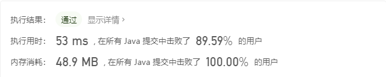

# 1.  前言

## 1.1 刷题方式

用中学里的系统学习方法来刷面试题，有教材，有课后习题，等做完之后再做综合题。刷题过程中要经常做笔记记录自己的学习过程。


1. 先将《剑指 offer》按照章节将例题做完；

2. 然后再到 LeetCode 网站上找对应的标签做十几天道题目。一个标签起码要做十题，对这个章节掌握吸收后再进行下一个章节；

3. 最后，面试前开始刷 LeetCode 上的热题（考前冲刺）。


掌握题目的标准是什么？

* 对一道题目，虽然已经忘记依然有思路，代码可以手打出来，这才叫做掌握。每道题目都要追求把题目吃透，不断地重复，理解解题思路。

刷了一段时间后怎么检测自身的掌握程度？

* 可以参加 LeetCode 的周赛和双周赛，如果能做出前三道，就没有太大问题了，可以去参加面试。


**教材例题（剑指 offer） + 课后习题 （LeetCode》+ 考前冲刺（LeetCode 热题）**


# 2. 剑指 Offer

## # 03 数组中重复的数字

### 题目描述

``` log
找出数组中重复的数字。


在一个长度为 n 的数组 nums 里的所有数字都在 0～n-1 的范围内。数组中某些数字是重复的，但不知道有几个数字重复了，也不知道每个数字重复了几次。请找出数组中任意一个重复的数字。

示例 1：

输入：
[2, 3, 1, 0, 2, 5, 3]
输出：2 或 3 

限制：

2 <= n <= 100000
```


### 解题思路

#### 排序法

先将输入的数组排序，从头到尾搜秒排序后的数组定位重复的数字

时间复杂度 O(nlogn)，空间复杂度为 O(1)


#### 使用哈希表

从头到尾扫描数组，用哈希表存放当前数组元素，如果出现数组元素已经在哈希表中，则表明此元素是重复元素。哈希表具体的数据结构可以为 `HashSet` 或 `HashMap`，两者的时间复杂度均为 O(1)。

时间复杂度为 O(1)，空间复杂度为 O(n)

``` Java
class Solution {
    public int findRepeatNumber(int[] nums) {

        if(nums == null){
            return -1;
        }

        Set<Integer> set = new HashSet<>();
        for(var num : nums){
            if(set.contains(num)){
                return num;
            }
            set.add(num);
        }
        return -1;
    }
}
```


#### 对原数组进行修改

数组 `nums` 的元素的范围是 （0 ~ n-1），对数组从头到尾进行重排，如果没有重复元素，则重拍后的数字 i 的下标也一定是 i。具体算法流程如下：

1. 下标 `i` 从 0 到 n-1，判断 `i` 与 元素 `j` （`j` 为 `nums[i]`）是否相等；
   * `i == j`：当前元素无重复，跳过；
   * `i != j`：比较 `j` 和 元素 `k`（`k` 为 `nums[j]`）是否相等；
     * `j == k`：等价于 `nums[i] == nums[j]`，`j` 即为所求重复元素，方法返回，扫描结束；
     * `j != k`：交换 i 和 j 处的数字，将数字 j 放在正确的位置上，继续扫描；
2. 如果扫描到 n-1 处结束，则表明元素无重复，返回 `-1`。

时间复杂度为 O(n)，空间复杂度为 O(1)。

实现代码实例：

``` Java
class Solution {
    public int findRepeatNumber(int[] nums) {

        if(nums == null){
            return -1;
        }

        int j;
        int temp;
        for(int i=0;i<nums.length;i++){
            j=nums[i];
            if(i==j){
                continue;
            }else if(j == nums[j]){
                return j;
            }else{
                temp = nums[i];
                nums[i] = nums[j];
                nums[j] = temp; 
            }
        }
        return -1;
    }
}
```

提交记录


## # 04 二维数组中的查找

### 题目描述

```
在一个 n * m 的二维数组中，每一行都按照从左到右递增的顺序排序，每一列都按照从上到下递增的顺序排序。请完成一个函数，输入这样的一个二维数组和一个整数，判断数组中是否含有该整数。

示例:
现有矩阵 matrix 如下：
[
  [1,   4,  7, 11, 15],
  [2,   5,  8, 12, 19],
  [3,   6,  9, 16, 22],
  [10, 13, 14, 17, 24],
  [18, 21, 23, 26, 30]
]

给定 target = 5，返回 true。
给定 target = 20，返回 false。

限制：
0 <= n <= 1000
0 <= m <= 1000


```

### 解题思路

此题的难点在于如果我们将数组当作一个矩阵来处理，盲目地使用二重循环来查询目标元素的话，会导致每次比较之后的选择都大于一种。比如在找数字 `10` ，比当前比较的第 `2` 行，第 `2` 列的数组元素 `9` 大，我们需要决定是向下或向右寻找。这样的不确定性导致了程序的复杂度增大，并且有很大一部分的冗余计算。

由此我们需要确定基本思路为，减少每次比较后续的选择的不确定性。也就是说，得在目标数字 `target` 与数组元素之间找到一条偏序的比较路线。

由于给定的数组是有界的，且题中数组的排序性质为：

> 每一行都按照从左到右递增的顺序排序，每一列都按照从上到下递增的顺序排序。

因此我们可以很容易从给任意行行 i 行的第一个元素开始的一条偏序路线：

```
matrix[i][0]  ==>  matrix[i][n]  ==>  matrix[m][n]
```

不难找到其中的关键元素 `matrix[i][n]`，只要我们每次都与此元素比较，那么比较后的路线就是确定的：

* `target == matrix[i][n]`：找到元素，返回 `true`；
* `target < matrix[i][n]`：目标元素较小，向左继续查询；
* `target > matrix[i][n]`：目标元素较大，向下继续查询。


Java 代码示例：

```Java
class Solution {
     public boolean findNumberIn2DArray(int[][] matrix, int target) {
        if (matrix.length <= 0 || matrix[0].length <= 0) {
            return false;
        }

        int n = matrix.length;
        int m = matrix[0].length;
        int i = 0;
        int j = m - 1;
        boolean find = false;
        while (i < n && j >= 0) {
            if (target == matrix[i][j]) {
                find = true;
                break;
            } else if (target < matrix[i][j]) {
                j--;
            } else {
                i++;
            }
        }
        return find;
    }
}
```

提交结果：


## # 05 替换空格

### 题目描述

```
请实现一个函数，把字符串 s 中的每个空格替换成"%20"。

示例 1：

输入：s = "We are happy."
输出："We%20are%20happy."
 
限制：

0 <= s 的长度 <= 10000

```

### 解题思路

由于 Java 的 `String` 类型不可变，因此需要借助额外的 `char` 数组或 `StringBuffer` 变量。

#### 借助 `char` 数组

由于最坏的情况下，替换后的字符串的长度为原字符串长度的的 3 倍，因此新建一个长度为 `3*s.length()` 的 `chars` 数组用于存放替换后的字符序列。

借助游标 `size` 记录在每次遍历 `s` 后， `chars` 中有效字符串的长度，同时也是下次遍历写入的位置：

* 如果当前的字符为空格：则在 `chars` 中追加 `"%20"`，将 `size` 加 3；
* 如果当前的字符为非空格：则在 `chars` 中追加该字符，将 `size` 加 1；

示例代码：

```Java
class Solution {
    public String replaceSpace(String s) {
        int size = 0;
        char[] chars = new char[s.length() * 3];
        for (int i = 0; i < s.length(); i++) {
            if (s.charAt(i) == ' ') {
                chars[size++] = '%';
                chars[size++] = '2';
                chars[size++] = '0';

            } else {
                chars[size++] = s.charAt(i);
            }
        }
        return new String(chars, 0, size);
    }
}
```

提交结果：


#### 借助 `StringBuffer`

`StringBuffer` 对象是一个可变字符串对象，可以直接追加字符串。遍历 `s`，使用三元运算符来判断每次应该追加的字符。

```Java
class Solution {
    public String replaceSpace(String s) {
        StringBuffer sb = new StringBuffer();
        for (var ch : s.toCharArray()) {
            sb.append(
                    ch == ' ' ? "%20" : ch
            );
        }

        return sb.toString();
    }
}
```

提交结果：


## # 06 从尾到头打印链表

### 题目描述

```
输入一个链表的头节点，从尾到头反过来返回每个节点的值（用数组返回）。

示例 1：
输入：head = [1,3,2]
输出：[2,3,1]
 
限制：
0 <= 链表长度 <= 10000
```


### 解题思路

分析：

看到链表类型的题目，首先确定头结点是否携带具体值。本题中头结点携带具体值，因此遍历从头结点开始。

题目要求中有从头到尾的字眼，有两种解题思路：

* 使用栈这种先进后出的数据结构来辅助完成；
* 递归调用返回值；
* 直接将数据逆序存放在结果数组。


#### 借助栈

遍历链表，将结点中的值压栈。遍历结束后，依次出栈存放在 result 数组中，实现逆序输出。

示例代码：

```Java
/**
 * Definition for singly-linked list.
 * public class ListNode {
 *     int val;
 *     ListNode next;
 *     ListNode(int x) { val = x; }
 * }
 */
class Solution {
    public int[] reversePrint(ListNode head) {
        if(head == null){
            return new int[0];
        }
        Deque<Integer> stack = new ArrayDeque<>();
        
        // 遍历链表，将结点中的值压栈
        ListNode current = head;
        while(current != null){
            stack.push(current.val);            
            current = current.next;
        }

        int length = stack.size();
        int[] result = new int[length];
        int i = 0;
        // 将栈一次弹出，存放到 result 数组中
        while(!stack.isEmpty()){
            result[i++]=stack.pop();
        }
        return result;        
    }
}
```

执行结果：


#### 递归法

使用递归法，本质上还是使用栈。因为程序在执行时，进入方法（函数）和返回时存在一个隐式的栈：从当前方法 `methodA` 进入新方法 `methodB` 时会将 `methodA` 压栈，保留 `methodA` 中的变量信息；从 `methodB` 返回时到会将 `methodA` 弹出，继续执行 `methodA`。

需要注意一点，如果链表结点个数太多，可能导致程序的栈溢出。

示例代码

```Java
/**
 * Definition for singly-linked list.
 * public class ListNode {
 * int val;
 * ListNode next;
 * ListNode(int x) { val = x; }
 * }
 */
class Solution02 {
    public List<Integer> list = new ArrayList<>();

    public int[] reversePrint(ListNode head) {
        recursion(head);
        int length = list.size();
        int[] result = new int[length];
        for (int i = 0; i < length; i++) {
            result[i] = list.get(i);
        }
        return result;
    }

    public void recursion(ListNode node) {
        if (node == null) {
            return;
        }
        recursion(node.next);
        list.add(node.val);
    }
}
```

执行结果：


#### 直接法

除了栈和递归法，本题还可以直接将数据逆序存放在结果数组中。

```Java
/**
 * Definition for singly-linked list.
 * public class ListNode {
 *     int val;
 *     ListNode next;
 *     ListNode(int x) { val = x; }
 * }
 */
class Solution {
    public int[] reversePrint(ListNode head) {
        // 遍历链表，获取链表长度
        ListNode current = head;
        int length = 0;
        while(current != null){
            length++;
            current = current.next;
        }
        
        int[] result = new int[length];
        // 再次遍历链表，将链表的结点的值逆序存放在数组中
        current = head;
        while(current != null){
            result[--length] = current.val;
            current = current.next;
        }
        return result;
    }
}
```

执行结果：


## # 07 重建二叉树

### 题目描述

```
输入某二叉树的前序遍历和中序遍历的结果，请重建该二叉树。假设输入的前序遍历和中序遍历的结果中都不含重复的数字。

例如，给出
前序遍历 preorder = [3,9,20,15,7]
中序遍历 inorder = [9,3,15,20,7]
返回如下的二叉树：

    3
   / \
  9  20
    /  \
   15   7
 
限制：
0 <= 节点个数 <= 5000
```


### 解题思路

前序遍历

```
root
left
right
```

中序遍历

```
left
root
right
```

后序遍历

```
left
right
root
```

题目要求给出了前序遍历和中序遍历的结果：

> 前序遍历 preorder = [3,9,20,15,7]
> 中序遍历 inorder = [9,3,15,20,7]

根据二叉树遍历的原理可知，前序遍历的输出的值都是作为当前传入子树的 `root` 节点输出的。

从前序序列中获取首个结点 `node` ，易知，当前结点为二叉树的 `root` 结点可以将当前的中序序列划分为左右两个中序子序列：

*  `node` 结点的左侧结点均在 `node` 的左子树：
  * 如果左侧中序子序列为空，则 `node` 结点的左孩子为空；
  * 如果左侧中序子序列非空，则其中在前序序列中最先出现的结点 `leftNode` 即为这个子序列的 `root`，也就是 `node` 结点的左孩子；

*  `node` 结点的右侧结点均在 `node` 的右子树；
  * 如果右侧子序列为空，则 `node` 结点的右孩子为空；
  * 如果右侧中序子序列非空，则其中在前序序列中最先出现的结点 `rightNode` 即为这个子序列的 `root`，也就是 `node` 结点的右孩子；

#### 方法一

**算法流程：**

取前序序列第一个值，获取根结点的值，找到根结点在中序序列中的索引 `index`，通过 `index` 计算，根结点左右子树结点的个数：`leftNodeNum` 和 `rightNodeNum`。进而可以分别得到左右子树的前序和中序序列。分别递归求解左右子树即可。递归问题求解的关键在于确定 base case。此问题的 base case 为**当队列的前序或中序序列的长度为 0 时，表示当前子树为空，返回空结点 `null`。**

此题的易错点在于计算左右子树时的前序和中序的边界，因此此处先计算了左右子树的结点个数来辅助计算边界。


示例代码：

```Java
/**
 * Definition for a binary tree node.
 * public class TreeNode {
 *     int val;
 *     TreeNode left;
 *     TreeNode right;
 *     TreeNode(int x) { val = x; }
 * }
 */
class Solution {
    public TreeNode buildTree(int[] preorder, int[] inorder) {
        if(preorder==null || preorder.length == 0 
           || inorder == null || inorder.length == 0){
            return null;
        }
        return constructCore(0, preorder.length-1, preorder, 0, inorder.length-1, inorder);
    }

    public TreeNode constructCore(int preStart, int preEnd, int[] preorder,
                                  int inStart, int inEnd, int[] inorder)
    {
        // base case
        if(preStart > preEnd){
            return null;
        }

        // 当前树的根结点值
        int rootValue = preorder[preStart];
        TreeNode root = new TreeNode(rootValue);

        // 找到根结点在中序遍历中的索引
        int index = findIndex(rootValue, inorder);

        // 左子树的结点个数
        int leftNodeNum = index - inStart;
        // 右子树的结点个数
        int rightNodeNum = inEnd - index;

        // 构建左子树
        root.left = constructCore(preStart + 1, preStart + leftNodeNum, preorder, inStart, inStart + leftNodeNum - 1, inorder);
        // 构建右子树
        root.right = constructCore(preEnd - rightNodeNum + 1, preEnd, preorder, inEnd - rightNodeNum + 1, inEnd, inorder);    

        return root;
    }

    public int findIndex(int val, int[] order) {
        for (int i = 0; i < order.length; i++) {
            if (val == order[i]) {
                return i;
            }
        }
        return -1;
    }

}
```


执行结果：


| 时间复杂度 | O(n^2) |
| ---------- | ------ |
| 空间复杂度 | O(1)   |


#### 解法优化

上述解法虽然执行通过，但耗时较高。每次找 root 在中序序列中的索引时，都会调用 `findIndex` 方法，遍历中序序列，此方法查询索引平均时间复杂度为 `O(0)`。

可以引入一个 `HashMap` 在初始状况下保存中序序列中的索引与值的关系。这样之后每次查询 root 的索引的时间复杂度均为 `O(1)`。

示例代码

```Java
/**
 * Definition for a binary tree node.
 * public class TreeNode {
 *     int val;
 *     TreeNode left;
 *     TreeNode right;
 *     TreeNode(int x) { val = x; }
 * }
 */
class Solution {
    public Map<Integer, Integer> indexMap = new HashMap<>();

    public TreeNode buildTree(int[] preorder, int[] inorder) {
        if (preorder == null || preorder.length == 0
            || inorder == null || inorder.length == 0) {
            return null;
        }
        for (int i = 0; i < inorder.length; i++) {
            indexMap.put(inorder[i], i);
        }

        return constructCore(0, preorder.length - 1, preorder, 0, inorder.length - 1, inorder);
    }

    public TreeNode constructCore(int preStart, int preEnd, int[] preorder,
                                  int inStart, int inEnd, int[] inorder) {
        // base case
        if (preStart > preEnd) {
            return null;
        }

        // 当前树的根结点值
        int rootValue = preorder[preStart];
        TreeNode root = new TreeNode(rootValue);

        // 找到根结点在中序遍历中的索引
        int index = indexMap.get(rootValue);

        // 左子树的结点个数
        int leftNodeNum = index - inStart;
        // 右子树的结点个数
        int rightNodeNum = inEnd - index;

        // 构建左子树
        root.left = constructCore(preStart + 1, preStart + leftNodeNum, preorder, inStart, inStart + leftNodeNum - 1, inorder);
        // 构建右子树
        root.right = constructCore(preEnd - rightNodeNum + 1, preEnd, preorder, inEnd - rightNodeNum + 1, inEnd, inorder);

        return root;
    }

}
```

执行结果：


| 时间复杂度 | O(n) |
| ---------- | ---- |
| 空间复杂度 | O(n) |


## # 09 用两个栈实现队列

### 题目描述

```
用两个栈实现一个队列。队列的声明如下，请实现它的两个函数 appendTail 和 deleteHead ，分别完成在队列尾部插入整数和在队列头部删除整数的功能。(若队列中没有元素，deleteHead 操作返回 -1 )

示例 1：
输入：
["CQueue","appendTail","deleteHead","deleteHead"]
[[],[3],[],[]]
输出：[null,null,3,-1]

示例 2：
输入：
["CQueue","deleteHead","appendTail","appendTail","deleteHead","deleteHead"]
[[],[],[5],[2],[],[]]
输出：[null,-1,null,null,5,2]

提示：
1 <= values <= 10000
最多会对 appendTail、deleteHead 进行 10000 次调用

```


### 解题思路

前置知识：

| 数据结构 | 属性             |
| -------- | ---------------- |
| 队列     | 先进先出（FIFO） |
| 栈       | 先进后出（FILO） |

解此题前需要了解队列和栈的属性，用两个栈来模拟队列先进先出的特性。


算法流程：

使用一个栈 `inputStack` 来接收元素，另一个栈 `outputStack` 来提供元素。

* 初始化：  

* 接收元素：直接将元素压栈到 `inputStack` 中；
* 提供元素：先判断 `outputStack` 是否为空：
  * 若为空，将 `inputStack` 中所有的元素依次弹出，并压栈入 `outputStack` 中。清空 `inputStack` 后，弹出 `ouputStack` 栈顶元素。即为所求；
  * 若非空， 直接弹出 `outputStack` 栈顶元素；

**注意**：Java 中虽然有 `Stack` 类，但并不推荐使用。应当使用 `Deque` 来实现栈的功能。`LinkedList`  和 `ArrayDueue` 类均实现了 `Deque` 接口，但实验比较发现，使用 `LinkedList` 实现的效率更高，故实例中使用 `LinkedList` 实现栈功能。

示例代码

```Java
class CQueue {    
    Deque<Integer> inputStack;
    Deque<Integer> outputStack;

    public CQueue() {
        inputStack = new LinkedList<>();
        outputStack = new LinkedList<>();
    }

    public void appendTail(int value) {
        inputStack.push(value);
    }

    public int deleteHead() {
        if(outputStack.isEmpty()){                      
            if(inputStack.isEmpty()){
                return -1;
            }
            while(!inputStack.isEmpty()){
                outputStack.push(inputStack.pop());
            } 
        }
        return outputStack.pop();
    }
}

/**
 * Your CQueue object will be instantiated and called as such:
 * CQueue obj = new CQueue();
 * obj.appendTail(value);
 * int param_2 = obj.deleteHead();
 */
```

执行结果：




## # 10 斐波那契数列